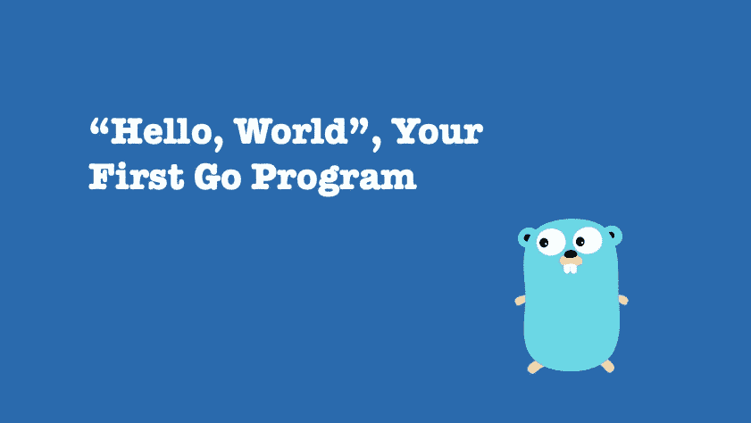

# 跟我走:围棋程序是如何构建的

> 原文：<https://medium.com/nerd-for-tech/go-with-me-how-go-program-is-structured-ace94ca08435?source=collection_archive---------3----------------------->

## 学习围棋系列文章的第 3 部分！



像学习任何编程语言一样，你总是从一个名为“Hello World”的简单程序开始，Go 也不例外。下面是 Go 版的《Hello World》:

```
package mainimport "fmt"func main() {
    fmt.Println("Hello, World")
}
```