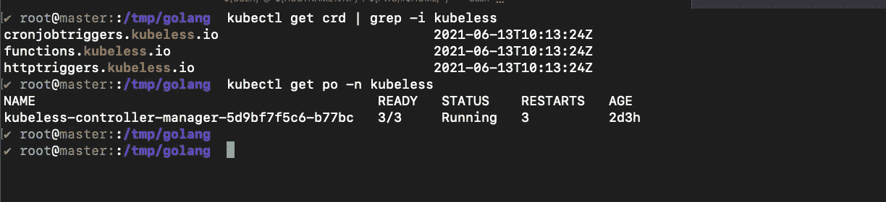
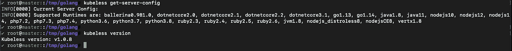
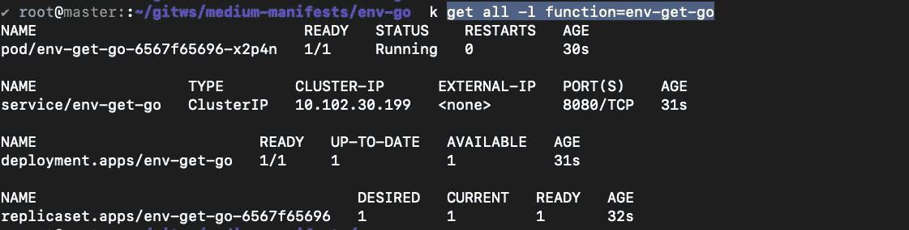
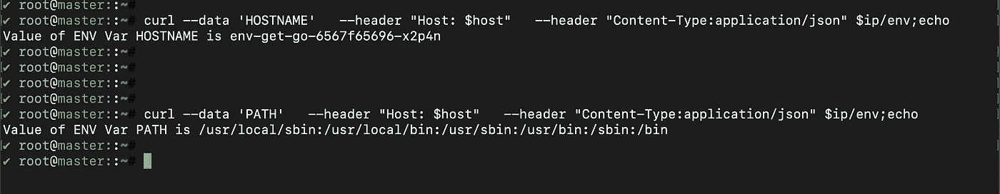
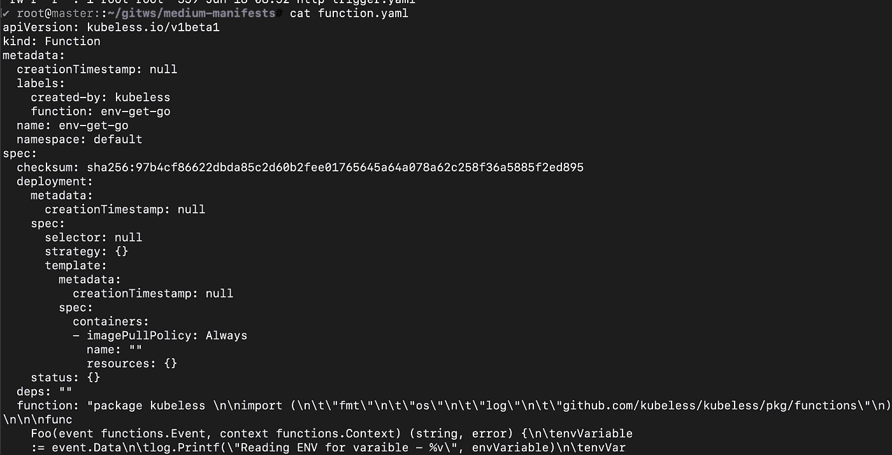

# 使用 Kubeless 在 Kubernetes 中实现无服务器

> 原文：<https://medium.com/nerd-for-tech/going-serverless-in-kubernetes-using-kubeless-8ef83b3f2f89?source=collection_archive---------4----------------------->

使用 Kubeless 的 Kubernetes 中的无服务器

那么，你们中有多少人在 IT 之旅中至少遇到过一次“无服务器”这个术语呢？Boom，我猜你们中的很多人可能听说过这个术语，他们中的大多数人也在使用这些概念来运行他们的生产环境。您的应用程序也在 Kubernetes 上运行吗？如果是的话，无服务器和 Kubernetes 是一个致命的组合。我从我的一些同行那里听说，将 Kubernetes 与任何与云无关的无服务器组件集成真的很难，因为这可能会使他们更难迁移到不同的云。因此，他们专注于 Kubernetes 的本地使用的解决方案，并且可以在 Kubernetes 集群上运行。市场上有许多在 Kubernetes 上运行无服务器工作负载的选择。Ex Openfaas、knative、kubeless 等。在这篇文章中，我将带你了解比特纳米的《无知识的世界》。是一个 Kubernetes-native 无服务器框架，允许您部署少量代码，而不必担心底层基础设施管道。


图片来源:[无袖](https://github.com/kubeless/kubeless)

# 整个故事是关于什么的？(TLDR)

1.  理解 kubeless 的概念。
2.  使用 Golang 编写一个无库函数。
3.  使用 HTTP 触发器来触发无库 Golang 函数。

# 先决条件

1.  Kubernetes 集群(可以是本地、AKS、EKS、GKE、Kind)。
2.  头盔，已安装 kubectl。

# 故事资源

1.  GitHub 链接:【https://github.com/pavan-kumar-99/medium-manifests 
2.  GitHub 分支:[kubless](https://github.com/pavan-kumar-99/medium-manifests/tree/kubeless)。

## 安装无库设备

Kubeless 附带了多个 yaml 文件来支持 RBAC 和非 RBAC 集群。你可以在这里找到 yaml 文件。默认情况下，Kubeless 安装在 **kubeless** 名称空间中。

```
$ kubectl create ns kubeless$ kubectl create -f https://github.com/kubeless/kubeless/releases/download/v1.0.8/kubeless-v1.0.8.yaml
```

一旦安装了 yaml 文件，您应该可以找到在 kubless 名称空间中创建的 kubless 控制器管理器。你还应该找到 CRD 的类似功能，HTTP 触发器，cronjob 触发器创建。



现在让我们在这里安装无库二进制文件。



一旦安装了无库二进制文件，您就可以通过以下方式找到服务器配置和运行时配置

```
**$ kubeless get-server-config**INFO[0000] Current Server Config:INFO[0000] Supported Runtimes are: ballerina0.981.0, dotnetcore2.0, dotnetcore2.1, dotnetcore2.2, dotnetcore3.1, go1.13, go1.14, java1.8, java11, nodejs10, nodejs12, nodejs14, php7.2, php7.3, php7.4, python3.6, python3.7, python3.8, ruby2.3, ruby2.4, ruby2.5, ruby2.6, jvm1.8, nodejs_distroless8, nodejsCE8, vertx1.8
```

好了，我们现在已经准备好了所有的安装工作。让我们现在行动起来。在我们开始触发第一个无库函数之前，让我们先了解一下无库函数的基本术语和贯穿本文的 Go 代码。

**无功能**

函数是无库的主要单位。Kubeless 中的函数可以用 java、python、ruby、go 等多种语言编写。每当一个函数通过 HTTP 调用、cron 触发器等被触发时，它接收两个参数。事件和背景。事件可以被认为是常规功能的输入。而上下文可以被认为是包含元数据的属性。

**触发**

触发器是一段代码，它将自动响应(或调用一个函数)事件，如 HTTP 调用、生命周期事件或某个时间表。kubeless 目前可用的触发器有
a) HTTP 触发器
b) CronJob 触发器
c) Kafka 触发器
d) NATS 触发器

在本文的范围内，我们将使用带有 HTTP 触发器的 Go 函数。下面是样例 Go 代码，它将一个环境变量键作为输入，并打印其相应的值。在实时场景中，您可能有许多更复杂的用例。我们将这篇文章限制为初学者理解概念，然后在我后面的文章中涵盖许多其他复杂的用例。

样本 Go 代码

**创建第一个无库函数**

无库函数可以用两种方法创建。使用 Kubeless 二进制文件，另一个是通过 Yaml 文件。让我们在本文中涵盖这两种方法。

```
$git clone [https://github.com/pavan-kumar-99/medium-manifests.git](https://github.com/pavan-kumar-99/medium-manifests.git) \
-b kubeless $ cd medium-manifests/env-go $ kubeless function deploy env-get-go --runtime go1.13 --handler env-check.Foo --from-file env-check.go**INFO[0000] Deploying function...
INFO[0000] Function env-get-go submitted for deployment
INFO[0000] Check the deployment status executing 'kubeless function ls env-get-go'**
```

Yaas，你的第一个函数现在已经部署好了。您可以使用命令检查创建的函数

```
$kubeless function ls $ kubectl get all -l function=env-get-go
```



由 kubeless 创建的组件

好了，你的函数正在运行。下一步做什么？让我们使用 HTTP 触发器来调用这个函数。你需要一个入口控制器来让公众使用你的功能。您可以使用任何入口控制器。我们将在本文中使用 Nginx 入口控制器。现在让我们使用 Helm 安装入口控制器。

```
$helm repo add ingress-nginx https://kubernetes.github.io/ingress-nginx$ helm repo update

$ helm install ingress-nginx ingress-nginx/ingress-nginx$ kubectl get pods -l app.kubernetes.io/name=ingress-nginx 
```

现在，Kubernetes 集群中应该运行了一个入口控制器。

现在让我们使用 kubes 命令创建一个 HTTP 触发器。如果您仔细观察我的命令，我会创建一个名为**env-get-go-HTTP-trigger**的 HTTP 触发事件，路径为 env。这意味着我们将能够通过向端点**HTTP://<ingress-IP>/env 发送 HTTP 请求来调用该函数。**

无库命令

```
**##Create a HTTP trigger**$kubeless trigger http create env-get-go-http-trigger --function-name env-get-go --path env **##Get the IP of the Ingress resource**$ ip=$(kubectl get ing env-get-go-http-trigger -o jsonpath='{.status.loadBalancer.ingress[0].ip}')**##Get the hostname of the Ingress resource**$ host=$(kubectl get ing env-get-go-http-trigger -o jsonpath='{.spec.rules[0].host}')**##Invoke the function by triggering a HTTP request**$ curl --data 'HOSTNAME'   --header "Host: $host"   --header "Content-Type:application/json" $ip/env;echo
```



无库 HTTP 触发器

厉害！！觉得有趣吗？欢迎在评论区发表评论。我们已经看到了如何使用无库命令。拥有清单并将它们存储在任何版本控制系统(可能是 Git)中怎么样？).是的，kubeless 提供了生成 YAML 清单的选项。


你是对的！！！

生成无库清单的命令

我还把清单上传到了我的 GitHub Repo。

```
$ git clone [https://github.com/pavan-kumar-99/medium-manifests.git](https://github.com/pavan-kumar-99/medium-manifests.git) \
-b kubeless$ cd medium-manifests/ 
```



样本无库布函数

**清理**

```
$ kubeless function delete env-get-go $ kubeless trigger http delete env-get-go-http-trigger 
```

我希望这涵盖了在 Kubernetes 中使用 kubeless 开始使用无服务器所需的概念和术语。请随时在 Kubernetes 上评论您的无服务器想法和您的无服务器最佳体验。

不久之后……..

# 被推荐的

[](/nerd-for-tech/free-and-automatic-ssl-certificates-in-kubernetes-using-cert-manager-6fb65ac63d5) [## 使用证书管理器在 Kubernetes 中免费提供自动 SSL 证书

### 使用证书管理器获得免费的自动 SSL 证书，让我们加密

medium.com](/nerd-for-tech/free-and-automatic-ssl-certificates-in-kubernetes-using-cert-manager-6fb65ac63d5) [](/nerd-for-tech/chaos-engineering-in-kubernetes-using-chaos-mesh-431c1587ef0a) [## 基于混沌网格的 Kubernetes 混沌工程

### 基于混沌网格的 Kubernetes 混沌工程

用混沌 Meshmedium.com 研究库伯内特的混沌工程](/nerd-for-tech/chaos-engineering-in-kubernetes-using-chaos-mesh-431c1587ef0a) [](/nerd-for-tech/deep-dive-into-thanos-part-i-f72ecba39f76) [## 深入灭霸——第一部分

### 使用灭霸和普罗米修斯操作员监控 Kubernetes 的工作负载

medium.com](/nerd-for-tech/deep-dive-into-thanos-part-i-f72ecba39f76) [](/nerd-for-tech/network-policies-demystified-in-kubernetes-d57fc2548043) [## Kubernetes 揭秘网络政策

### 使用 Cilium 编辑器在 Kubernetes 中可视化网络策略

medium.com](/nerd-for-tech/network-policies-demystified-in-kubernetes-d57fc2548043)