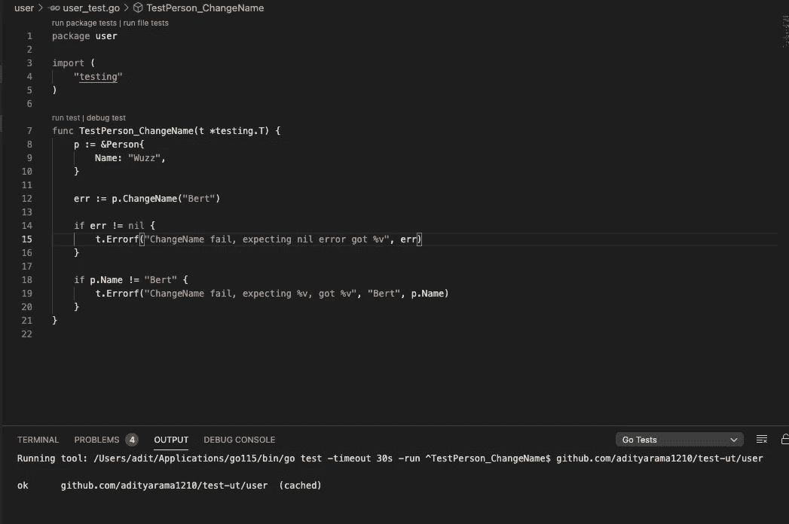
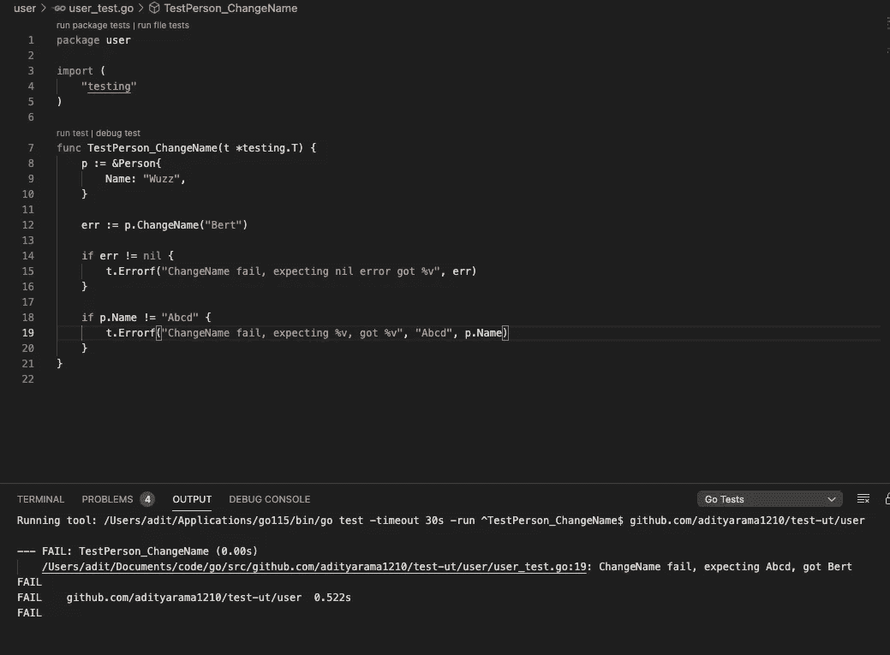
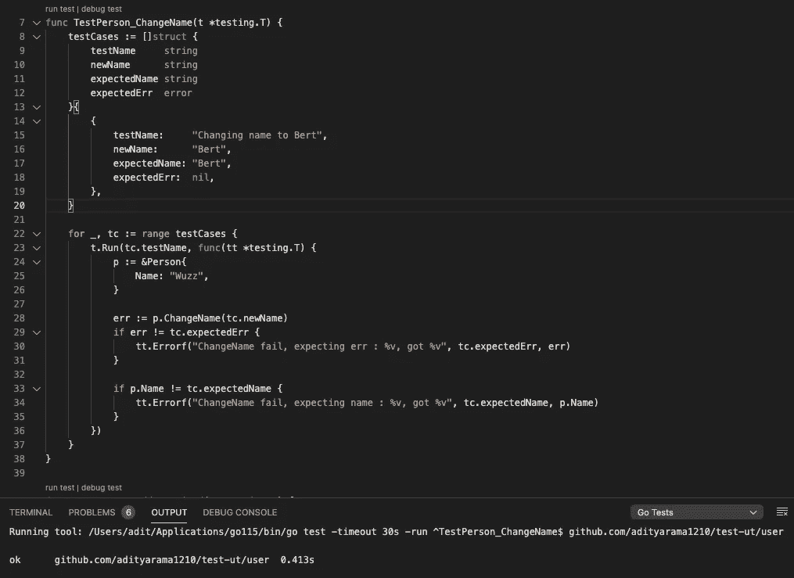
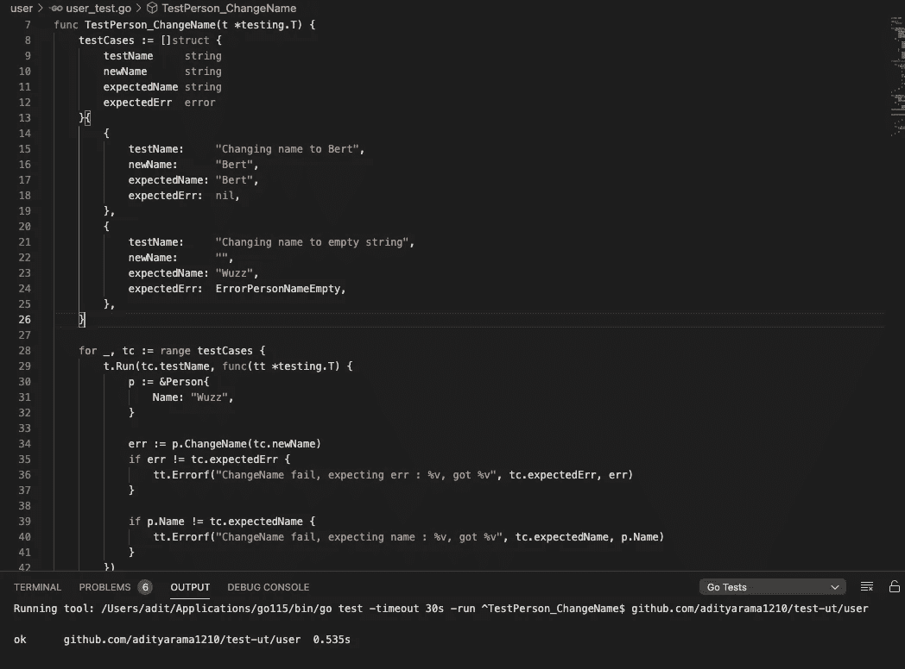
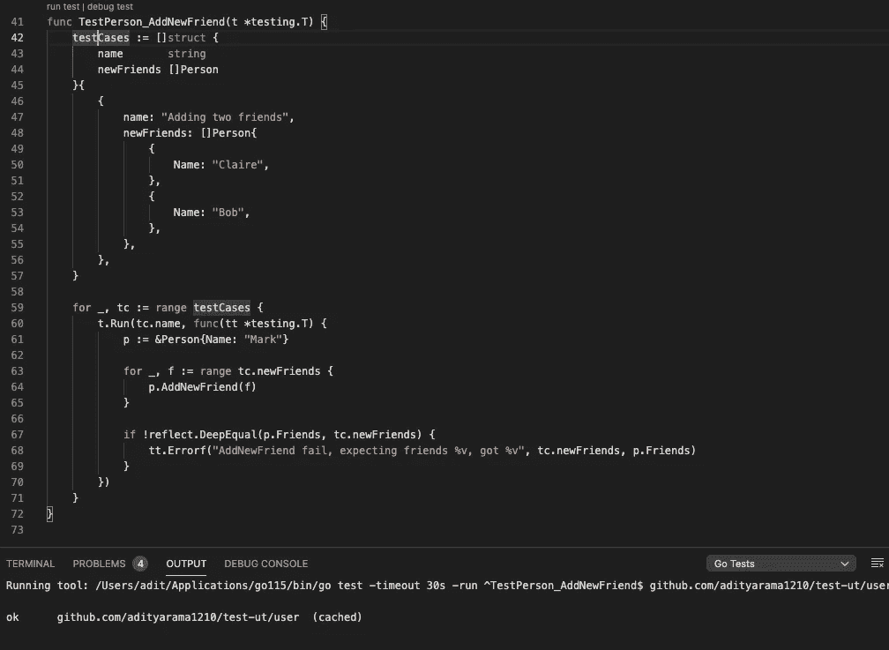
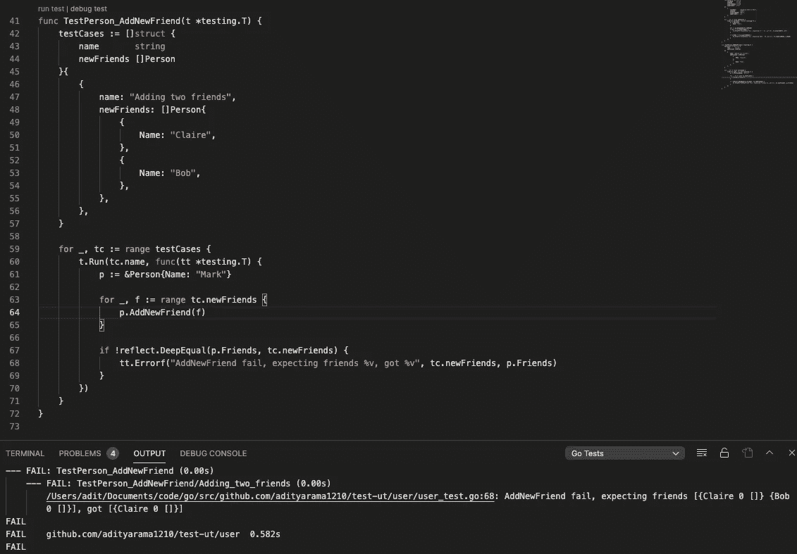

# Golang 基本单元测试

> 原文：<https://medium.com/nerd-for-tech/golang-basic-unit-testing-7398a65aeb98?source=collection_archive---------9----------------------->


neon brand(【https://unsplash.com/photos/60krlMMeWxU】T2)的积分

简而言之，基本上你需要测试你写的代码，以确保你做得正确。如果你有一个将两个数相加的函数，你将**期望**结果**是这两个数的**和**，通过编写单元测试，你确保当函数用给定的参数运行时，它将返回正确的/期望的结果或行为。**

这篇文章将仅仅用一些例子和解释来覆盖 golang 单元测试的基础，更高级和复杂的单元测试/甚至模拟一个函数将在另一篇文章中讨论。

# 功能和单元测试

声明:我不会讨论 TDD，这将集中在如何创建单元测试，如果你有一个函数，你想测试它。

假设我们有一个只有一个文件(user.go)的包“user ”,该文件包含几个内容:

1.  “人”的结构
2.  “人”的方法
3.  与此用户包和人员结构相关的一些错误

此类人员可以具有以下属性:

*   名称(字符串)
*   朋友(一部分人)

我们还将在 person 结构中附加一些方法:

*   ChangeName(名称字符串)
*   AddNewFriend(好友)

从简单的开始，假设我们实现了如下的 ChangeName 函数:

```
package userimport "errors"var ( ErrorPersonNameEmpty = errors.New("Person name must exist"))type Person struct { Name    string Friends []Person}func (p *Person) ChangeName(name string) error {
   if name == "" { return ErrorPersonNameEmpty } p.Name = name

   return nil}
```

在“user”包中另存为“user.go”，然后新建一个文件“user_test.go”。因为我们想测试 ChangeName 函数，所以我们创建了 TestPerson_ChangeName 函数，如下所示:

```
package userimport ( “testing”)func TestPerson_ChangeName(t *testing.T) { p := &Person{ Name: “Wuzz”, } p.ChangeName(“Bert”) if err != nil { t.Errorf("ChangeName fail, expecting nil error got %v", err) } if p.Name != “Bert” { t.Errorf(“ChangeName fail, expecting %v, got %v”, “Bert”, p.Name) }}
```

我们创建一个名为“Wuzz”的 person 指针对象，然后调用 ChangeName 方法，将“Bert”作为 person 的新名称，然后将该函数返回的错误与 nil 进行比较，因为我们预计在将名称更改为“Bert”时不会出现错误。之后，我们比较人名，最后我们期望 person 对象的名称更改为“Bert ”,如果没有达到期望值，就会引发一个测试错误，并显示一条附加消息，显示我们的期望值和我们得到的值之间的差异。



我使用的是可视化代码，测试我们创建的单元测试非常简单，只需点击函数上方的 run test 即可。或者你可以通过终端手动运行它，点击“运行^YourTestName".测试”您还可以通过使用根项目文件夹中的这个基本命令`go test ./...`来运行当前项目中的所有单元测试。如果它打印出“ok ”,那么它意味着单元测试通过了，假设我们通过`if p.Name != “Abcd"`将第 13 行中的期望值和错误消息的第 19 行一起更改为其他值。



因此，由于错误的预期，单元测试将失败，并显示我们在第 14 行中描述的错误消息。现在，当我们将名称改为空字符串时，我们需要覆盖测试用例，因为我们的逻辑包括检查当名称为空字符串时，它将返回一个错误。我们有两个选择，用不同的逻辑和期望创建一个新的测试函数(即:“TestPerson_ChangeNameToEmpty”，**或**，更好的是我们可以创建更多的动态测试函数，允许我们修改参数和期望。尝试修改单元测试，如下所示:



我们通过创建一个匿名结构片来改变它，这个匿名结构片将我们的测试用例一个接一个地分组，每个测试用例都有自己的参数、测试名和输出期望。然后我们将循环测试用例，通过`tt.Run`运行测试用例，创建 person 对象，然后用当前测试用例的新名称更改名称，并相应地断言期望。

再次运行测试，它将通过。这种结构比前一种更好，因为现在我们可以在 struct 对象的数组中添加新的测试用例。继续在测试用例切片上为 ChangeName with empty string 参数添加新的测试用例。我们希望此人的姓名不要更改，并且返回的错误类型为 ErrorPersonNampeEmpty。



现在让我们转到第二个 person 方法，创建 AddNewFriend 方法，该方法将在 person Friends 属性的参数中追加一个 person。

```
func (p *Person) AddNewFriend(friend Person) { p.Friends = append(p.Friends, friend)}
```

正如您所看到的，测试将是一个简单的测试，就像您创建一个人，添加新朋友，传入另一个人对象(作为其朋友)，然后我们需要断言此人的朋友数量正在增加，并且其新朋友存在于属性中。

我们可以这样写



我们有多个朋友的参数，然后在测试用例中我们将他们添加为它的朋友，然后最终我们期望人(Mark)的朋友将与我们的新朋友参数相同。我们使用 DeepEqual 来确保 friends 数组及其对应的值相等。再次运行测试用例，我们将看到它通过。假设现在由于某种原因，我们修改了函数 AddNewFriend 并插入了一个这样的逻辑。

```
func (p *Person) AddNewFriend(friend Person) { if friend.Name != “Bob” { p.Friends = append(p.Friends, friend) }}
```

如果朋友的名字是鲍勃，我们不会添加为新朋友(鲍勃是有毒的，我们不想要有毒的朋友，例如，爱你鲍勃)。再次运行测试，我们将看到它失败。



由于 Bob 未被添加为朋友，所以失败，但我们希望朋友是 Claire 和 Bob

这很好，因为如果有人修改我们的函数，他们可能不知道函数结果所预期的效果或任何边缘情况，所以有一个**强大的单元测试和测试用例**在其中**可以防止**某人甚至你自己**修改某些东西和破坏**任何现有的特性/流程。你可以从你相关函数的失败测试案例中知道。

希望这对你有用，我们将在另一篇文章上对更复杂的断言和嘲讽进行阐述。祝你今天愉快 **:)**