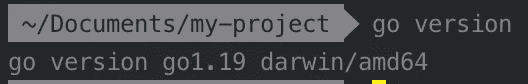
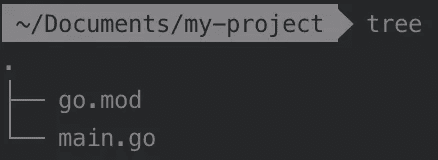
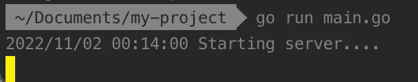
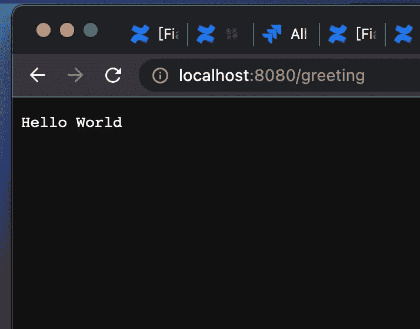
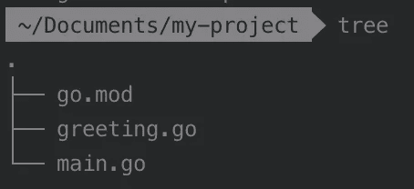
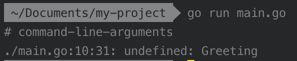
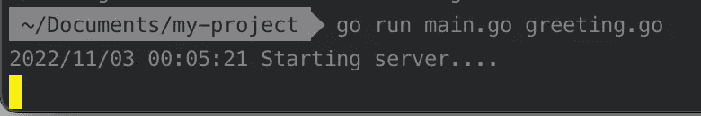
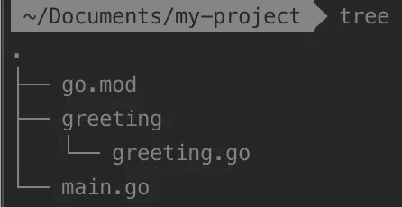
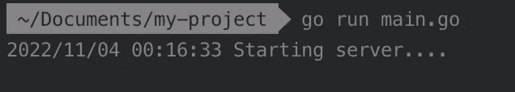

# Golang:构建一个简单的 web 服务器并与之交互

> 原文：<https://medium.com/nerd-for-tech/golang-build-a-simple-web-server-and-interact-with-it-689ee0f4d1de?source=collection_archive---------0----------------------->


[Golang](https://github.com/golang/go) 是 Google 支持的开源编程语言。它以强大的性能而闻名，也为我们构建各种应用提供了许多有用的包。在这篇文章中，我想分享如何使用一些 Golang 包来构建一个简单的 web 服务器。

## **1。环境准备**

首先，我们需要安装 Go。下载和安装的方法可以在 Golang 官网的这里看到[。安装后，可以运行`go version`来检查安装的版本。](https://go.dev/doc/install)



接下来，需要准备 Golang 项目环境。在这里可以按照步骤[进行](https://quii.gitbook.io/learn-go-with-tests/go-fundamentals/install-go)。基本上，你应该创建一个文件夹，然后运行`go mod init <modulepath>`命令来生成一个`go.mod`文件。

```
mkdir my-project
cd my-project
go mod init <modulepath>
```

Golang 使用`go.mod`来管理这个项目中需要导入的所有模块(类似于 Rails 项目中的`Gemfile`)。项目本身也是一个模块，`<modulepath>`是模块内包路径(项目中文件夹的路径)的路径前缀。关于`<modulepath>`命名的更多细节可以在 [Go 模块参考](https://go.dev/ref/mod)中找到。以下是部分描述。通常，它会包含项目的根路径。

> 模块路径应该描述模块做什么以及在哪里可以找到它。通常，模块路径由存储库根路径、存储库中的目录(通常为空)和主版本后缀(仅适用于主版本 2 或更高版本)组成。
> 
> [围棋模块参考](https://go.dev/ref/mod)

如果运行`go mod init my-project`，将在项目中生成一个`go.mod`文件，该`go.mod`文件内容如下。

```
// go.mod

module my-project 

go 1.19
```

Golang 使用`go.mod`管理项目的方式与使用`GOPATH`不同。Golang 会通过`go.mod`的位置检测我们要执行的文件，而不是检入`GOPATH`。`go.mod`是 Go 1.16 以后的默认构建模式，因此不推荐使用`GOPATH`。

在 Golang 项目中，它们通常是一个`main.go`文件和一个`main`函数，我们将执行`go run main.go`来运行我们的项目，所以我们需要创建`main.go`并在其中添加`main`函数，然后我们可以开始在`main`函数中编写一些代码来构建 web 服务器。

```
package main

func main() {

}
```

项目结构如下。



## 2.U **seful 包介绍**

对于构建 web 服务器，Golang 提供了几个包，如`net`、`net/http`、`log`、`fmt`，包中有几个函数对于构建一个简单的 web 服务器很有用。以下是这些软件包和功能的介绍:

*   [网](https://pkg.go.dev/net)

包`net`为网络 I/O 提供了一个接口，它提供了简单的功能，如`Dial`用于连接服务器，`Listen`用于创建服务器。在`Listen`函数中，我们可以传递`network`和`address`，它将在本地网络`address`上启动一个服务器，并使用`network`的类型。网络必须是`tcp`、`tcp4`、`tcp6`、`unix`或`unixpacket`。

> 对于 TCP 网络，如果 address 参数中的 host 为空或未指定的 IP 地址，Listen 将侦听本地系统的所有可用单播和任播 IP 地址。要仅使用 IPv4，请使用网络“tcp4”。该地址可以使用主机名，但不建议这样做，因为它最多会为主机的一个 IP 地址创建一个侦听器。如果地址参数中的端口为空或“0”，如“127.0.0.1:”或“[::1]:0”，则自动选择一个端口号。Listener 的 Addr 方法可用于发现所选的端口。
> 
> 从`[net package func Listen online document](https://pkg.go.dev/net#Listen)`

```
func Listen(network, address string) (Listener, error)
```

`Listen`的示例代码如下。它将在`localhost:8080`上启动一个服务器并使用 TCP 网络。

```
listener, error := net.Listen("tcp", ":8080")
if error != nil {
 // handle error
}
```

*   [net/http](https://pkg.go.dev/net/http)

包`net/http`提供了 HTTP 客户端和服务器实现。它可以用于 HTTP(或 HTTPS)请求，并提供类似于`HandleFunc`的功能，用于在`DefaultServeMux`中注册 URL 路径的给定模式的处理函数，这是一个默认的`[ServeMux](https://pkg.go.dev/net/http#ServeMux)`，Golang 中用于路由收集的结构，这样我们就可以实现当向特定 URL 发送 HTTP(或 HTTPS)请求时的响应。

> ServeMux 是一个 HTTP 请求复用器。它将每个传入请求的 URL 与注册模式列表进行匹配，并调用与 URL 最匹配的模式的处理程序。
> 
> 来自`[net/http ServeMux *online document*](https://pkg.go.dev/net/http#ServeMux)`

在`HandleFunc`中，我们只需要传递一个引用 URL 路径的模式和一个处理程序，在向这个 URL 路径发送 HTTP(或 HTTPS)请求时处理响应。

```
func HandleFunc(pattern string, handler func(ResponseWriter, *Request))
```

示例代码如下所示，将在向`/bar`发送 HTTP(或 HTTPS)请求时工作，响应将在网页上打印`Hello /bar`。

```
http.HandleFunc("/bar", func(w http.ResponseWriter, r *http.Request) {
 fmt.Fprintf(w, "Hello, %q", html.EscapeString(r.URL.Path))
})
```

包`net/http`提供`Serve`功能，接受到服务器的传入的 HTTP 连接。它应该给这个函数传递两个参数。第一个是从`listener, error :=net.Listen(“tcp”, “localhost:8080”)`得到的`Listener`，第二个是当 HTTP 连接到`Listener`时处理响应的`Handler`。`Handler`通常为零，它将使用`DefaultServeMux`，这意味着当接收到 HTTP(或 HTTPS)请求时，它将检查路径并找到已经在`DefaultServeMux`中注册的处理函数(通过`HandleFunc`注册)。

```
func Serve(l net.Listener, handler Handler) error
```

这是`Serve`功能的示例代码。我们首先注册`/bar`到`HandleFunc`的处理程序，在`localhost:8080`上启动一个侦听器，并使用`Serve`为该侦听器接受一个 HTTP 连接。当向`localhost:8080/bar`发送 HTTP(或 HTTPS)请求时，我们会看到`Hello /bar`打印在网页上。

```
http.HandleFunc("/bar", func(w http.ResponseWriter, r *http.Request) {
 fmt.Fprintf(w, "Hello, %q", html.EscapeString(r.URL.Path))
})
listener, error := net.Listen("tcp", ":8080")
http.Serve(listener, nil)
```

在运行`http.Serve`之前运行`http.HandleFunc`很重要，因为如果在`DefaultServeMux`中没有注册 URL 路径和处理函数(响应处理函数)，当运行`http.Serve`时，当接收到针对特定 URL 路径的 HTTP(或 HTTPS)请求时，服务器在`DefaultServeMux`中找不到相关的处理函数来进行响应。

包中还有另一个功能`http`，结合了`net.Listen`和`http.Serve`功能。是`ListenAndServe`。我们可以将本地网络`address`和`handler`传递给`ListenAndServe`，它将使用 TCP 网络并监听本地网络地址，然后用处理程序调用`Serve`来处理传入连接上的请求。像`http.Serve`一样，处理器通常为零，它将使用`DefaultServeMux`。

```
func (srv *Server) ListenAndServe() error
```

示例代码如下，函数的工作方式与上面的示例代码相同。

```
http.HandleFunc("/bar", func(w http.ResponseWriter, r *http.Request) {
 fmt.Fprintf(w, "Hello, %q", html.EscapeString(r.URL.Path))
})
http.ListenAndServe(":8080", nil)
```

*   [日志](https://pkg.go.dev/log)

包`log`提供了一个日志功能。它打印每个日志消息的日期和时间，并且每个日志消息在单独的行上输出。基本功能和`Println`一样

```
func Println(v ...any)
```

示例代码如下所示。它会打印出`2022/11/12 15:53:05 haha`。

```
log.Println("haha")
```

`log`包还提供了`Fatal`功能，可以打印错误等内容并退出程序。

```
log.Fatal(error)
```

*   [fmt](https://pkg.go.dev/fmt)

包`fmt`提供了`Sprintf`打印特定格式内容的功能。如何使用该格式可以在`fmt`上查看在线[文档](https://pkg.go.dev/fmt@go1.19.3#section-documentation)。

```
func Sprintf(format string, a ...any) string
```

例如，下面的代码将打印`12.00`。

```
fmt.Sprintf("%6.2f", 12.0)
```

## 3.**编写我们的代码并运行它**

在阅读了上面的介绍之后，我们知道我们可以用什么包和函数来构建 web 服务器。我们现在的目标是在`localhost:8080`构建一个服务器主机，如果向`localhost:8080/greeting`发送一个 HTTP 请求，它将在网页上返回问候词`Hello World`，因此`main.go`中的代码可能如下所示。

```
// main.go

package main

// import the package we need to use
import (
  "fmt"
  "log"
  "net"
  "net/http"
)

func main() {

  // set a HTTP request handle function for path /greeting and registrate it
    http.HandleFunc("/greeting", func (w http.ResponseWriter, 
        r *http.Request) {

        // when receive the request, print the greeting meassage
        fmt.Fprint(w, "Hello World")

      })

  // print out the server is going to start and show the time
  log.Println("Starting server....")

  // create server at localhost:8080 and using tcp as the network
  listener, err := net.Listen("tcp", ":8080")

  // if recieve error, record it and exit the program
  if err != nil {
    log.Fatal(err)
  }

  // setup HTTP connection for the listener of the server
  http.Serve(listener, nil)

}
```

现在在项目根目录的终端运行`go run main.go`，会显示`Starting server`的日志。



然后在网络浏览器中打开`localhost:8080/greeting`。问候语`Hello word`将显示在网页上。



## 4.重构代码

我们现在构建一个简单的 web 服务器，但是所有的代码都放在`main`函数中。乍一看很难知道每一行代码的目的，所以我们可以通过将它们分成不同的函数来使它变得清晰。我们可以通过将 handler 函数移动到一个`Greeting`函数并在`http.HandleFunc`中调用这个函数来重构`http.HandleFunc`。

```
http.HandleFunc("/greeting", func (w http.ResponseWriter, 
    r *http.Request) {
    fmt.Fprint(w, "Hello World")
})
```

这样做之后，`http.HandleFunc`部分将变得更加干净。

```
http.HandleFunc("/greeting", Greeting)
```

`Greeting`函数的内容与 handler 函数相同，但我们将其命名为`Greeting`。

```
func Greeting(w http.ResponseWriter, r *http.Request) {
    fmt.Fprint(w, "Hello World")
})
```

而 `Greeting`函数将在项目根路径中放置一个新创建的名为`greeting.go`的文件。

```
// greeting.go

package main

import (
  "fmt"
  "net/http"
)

func Greeting(w http.ResponseWriter, r *http.Request) {
  fmt.Fprint(w, "Hello world")
}
```

项目中的文件树如下所示



现在再次运行`go run main.go`，但是我们会得到一个错误消息`undefined: Greeting`



这是因为它只会在运行`go run main.go`时加载`main.go`，所以找不到`Greeting`功能。为了解决这个错误，我们应该改为运行`go run main.go greeting.go`，因此再次运行`go run main.go greeting.go`，然后它将在 web 浏览器中显示启动服务器和打开`localhost:8080/greeting`的日志，`Hello word`将显示在网页上。



现在我们重构我们的代码，让它更干净，但是启动服务器时需要调用两个文件，这有点烦人。应该有更好的重构方法，我们仍然可以运行`go run main.go`来启动 web 服务器。我们可以使用 Golang 项目的一个好处，即不同文件夹中的每个文件就像一个单独的包，我们可以将它们导入到其他文件中来使用它们。我们可以创建一个`greeting`文件夹并将`greeting.go`移动到其中，然后将`greeting.go`定义为一个包`greeting`。我们项目的结构将会如下图所示。



`greeting.go`中的代码如下。它需要将这个包命名为`greeting`，这样我们就可以用这个名字来调用`Greeting`函数。它也可以用另一个词来命名，但是需要用包名来调用包中的函数。例如，如果我们想调用`Greeting`函数，当包名为`greeting`时，调用的方式是`greeting.Greeting`，但是如果我们将包命名为`words`，那么它就会像`words.Greeting`一样。

```
// greeting.go

package greeting

import (
"fmt"
"net/http"
)

func Greeting(w http.ResponseWriter, r *http.Request) {
  fmt.Fprint(w, "Hello World")
}
```

我们需要在`main.go`中导入包`greeting`。导入的方式是在导入列表中添加包`greeting`的路径，路径是我们在`go.mod`中定义的`prefix`即`my-project`和文件夹名`greeting`的组合，所以路径是`my-project/greeting`。之后，在`main`函数中，我们可以通过`greeting.Greeting`使用`Greeting`函数。

```
// main.go

package main

import (
  "log"
  "net"
  "net/http"
  "my-project/greeting" // import greeting the path is like module/package name
)

func main() {
  http.HandleFunc("/greeting", greeting.Greeting)

  log.Println("Starting server....")

  listener, err := net.Listen("tcp", "localhost:8080")
  if err != nil {
    log.Fatal(err)
  }

  http.Serve(listener, nil)
}
```

如果我们不想通过`greeting.Greeting`调用`Greeting`，我们可以用别名导入`greeting`，例如`controller`，然后我们可以通过`controller.Greeting`调用`Greeting`。

```
import (
  controller "my-project/greeting" // import greeting the path is like module/package name
)

func main() {
  http.HandleFunc("/greeting", controller.Greeting)
.......
```

现在运行`go run main.go`并且 web 服务器可以成功启动，在 web 浏览器中打开`localhost:8080/greeting`，`Hello word`也显示在网页上。我们再也不需要叫`greeting.go`了。



## 参考

[Go 模块参考](https://go.dev/ref/mod)

[边学边考](https://quii.gitbook.io/learn-go-with-tests/build-an-application/app-intro)

[Go 官方在线文档](https://go.dev/doc/install)

*   [网](https://pkg.go.dev/net)
*   [net/http](https://pkg.go.dev/net/http)
*   [日志](https://pkg.go.dev/log)
*   [fmt](https://pkg.go.dev/fmt)

[使用 Golang 打造 web 應用程式](https://willh.gitbook.io/build-web-application-with-golang-zhtw/)

[用 Golang 构建 Web 应用](https://github.com/astaxie/build-web-application-with-golang)

[关于 go.mod](/微峯飛翔/golang-go-mod-起手勢-39a0be969ffc)