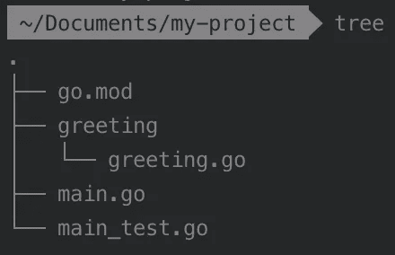
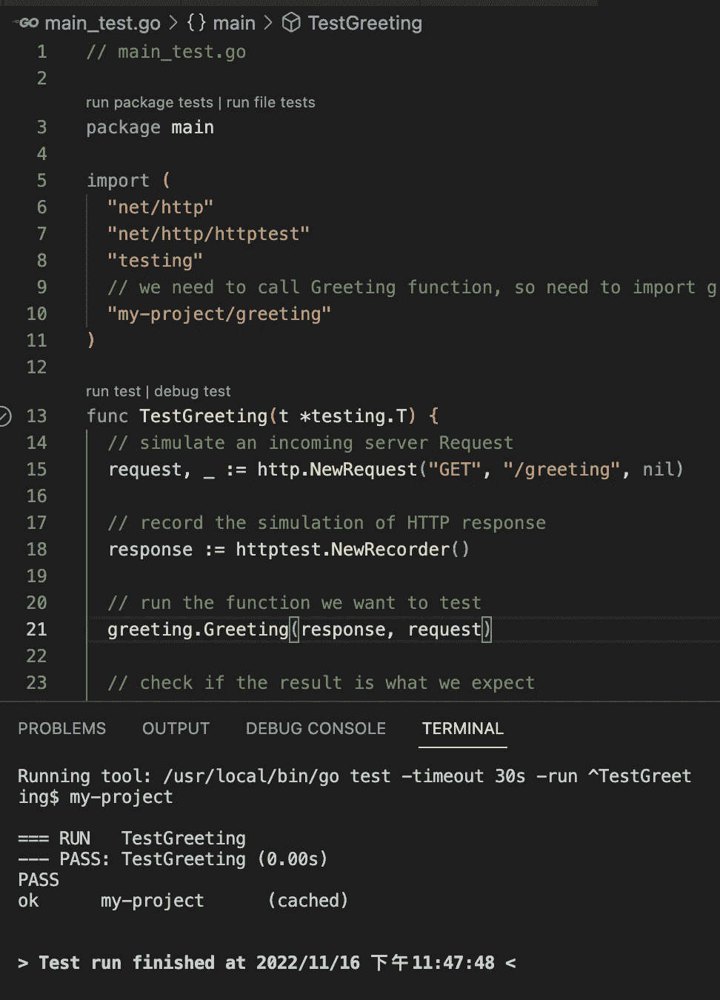
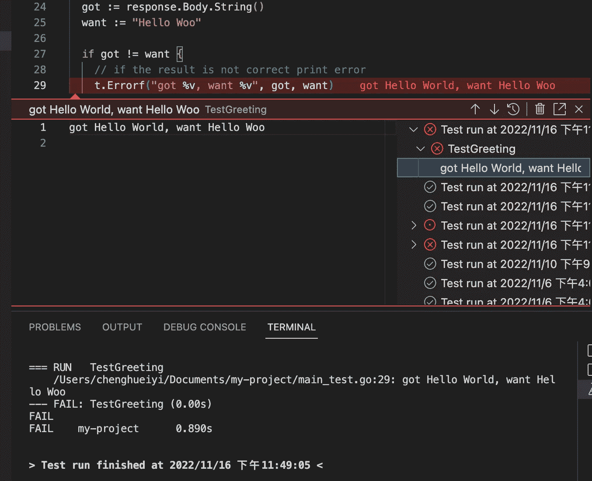
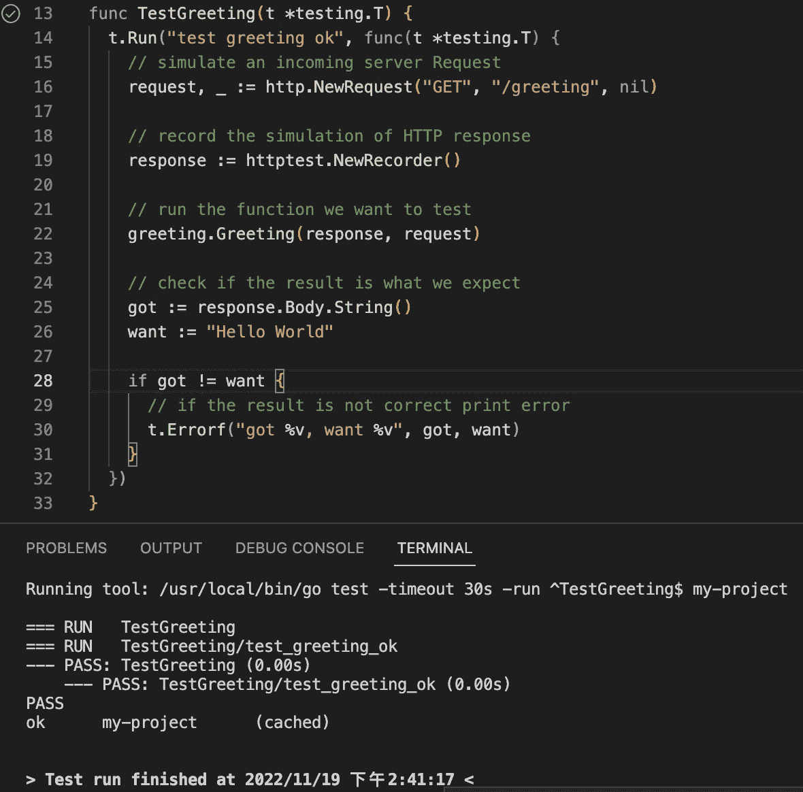
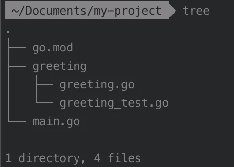
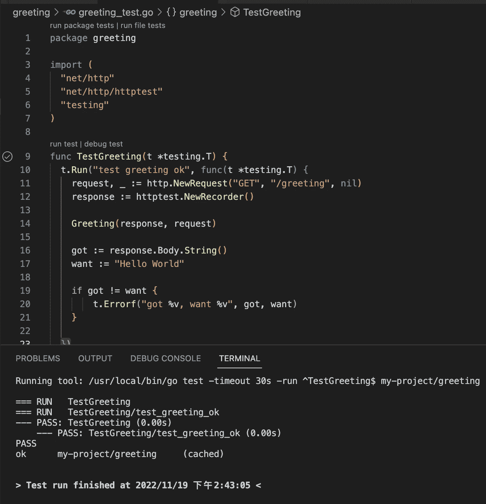
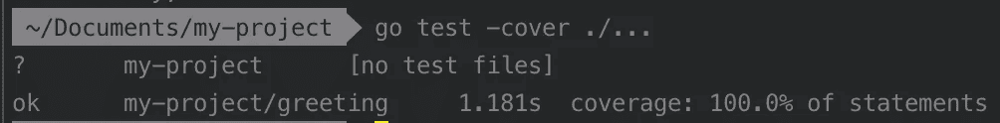

# Golang:在简单的 web 服务器项目中测试函数

> 原文：<https://medium.com/nerd-for-tech/golang-testing-function-in-a-simple-web-server-project-e72190bf9dd7?source=collection_archive---------1----------------------->


构建软件项目时，测试很重要。在 Golang 中，有一些包在对我们项目中的函数进行单元测试时非常有用。在本文中，我将展示如何使用这些包来测试 web 服务器项目中的功能。项目结构如下。我们将以测试`Greeting`函数为例。如何使用 Golang 构建 web 服务器可以在我之前的[文章](/nerd-for-tech/golang-build-a-simple-web-server-and-interact-with-it-689ee0f4d1de)中看到。


`main.go`中的代码如下。

```
// main.go

package main

import (
  "log"
  "net"
  "net/http"
  "my-project/greeting"
)

func main() {
  http.HandleFunc("/greeting", greeting.Greeting)

  log.Println("Starting server....")

  listener, err := net.Listen("tcp", "localhost:8080")
  if err != nil {
    log.Fatal(err)
  }

  http.Serve(listener, nil)
}
```

而`greeting.go`就像下图。

```
// greeting.go

package greeting

import (
"fmt"
"net/http"
)

func Greeting(w http.ResponseWriter, r *http.Request) {
  fmt.Fprint(w, "Hello World")
}
```

## 1.介绍

Golang 为我们提供了包`testing`来进行单元测试，还提供了包`net/http/httptest`，它可以用来在进行单元测试时记录 HTTP(或 HTTPS)响应。下面是对这两个包以及对进行单元测试有用的函数的介绍:

*   [测试](https://pkg.go.dev/testing)

包`testing`为 Go 包的自动化测试提供支持。

> 要编写一个新的测试套件，创建一个名为 ends _test.go 的文件，其中包含 TestXxx 函数，如下所述。将文件放在与被测试文件相同的包中。该文件将从常规包构建中排除，但在运行“go test”命令时将包括在内。有关更多详细信息，请运行“运行帮助测试”和“运行帮助测试标志”。
> 
> 从`[*testing online document*](https://pkg.go.dev/testing)`

下面是一个测试函数的例子。

```
func TestAbs(t *testing.T) {
    got := Abs(-1)
    want := 1
    if got != want {
        t.Errorf("Abs(-1) = %d; want %d", got, want)
    }
}
```

*   [net/http/httptest](https://pkg.go.dev/net/http/httptest@go1.19.3)

包`httptest`提供了用于 HTTP 测试的工具。它提供了`NewRequest`函数来模拟一个传入的服务器请求，适合传递给一个 http。测试处理程序。`method`、`target`和`body`应传递给`NewRequest`功能。`method`是像`GET`一样的 HTTP 方法。`target`可以是路径或绝对`URL`，而`body`可以是零。

> 提供的主体可能为零。如果主体的类型为*bytes。读者，*字符串。读取器，或*字节。缓冲区，请求。ContentLength 已设置。
> 
> 从`[*net/http/httptest online document*](https://pkg.go.dev/net/http/httptest@go1.19.3)`

```
func NewRequest(method, target string, body io.Reader) *http.Request
```

`NewRequest`函数的示例代码。

```
request := httptest.NewRequest("GET", "http://example.com/greeting", nil)
```

包`httptest`提供了一个调用`ResponseRecorder`的类型。它是`http.ResponseWriter`的一个实现，记录了它的变化，以便以后在测试中检查，这意味着它可以用来记录测试中对 HTTP(或 HTTPS)请求的响应的内容。

```
type ResponseRecorder struct {
 // Code is the HTTP response code set by WriteHeader.
 Code int
// HeaderMap contains the headers explicitly set by the Handler.
 // It is an internal detail.
 HeaderMap http.Header
 // Body is the buffer to which the Handler's Write calls are sent.
 // If nil, the Writes are silently discarded.
 Body *bytes.Buffer
 // Flushed is whether the Handler called Flush.
 Flushed bool
 // contains filtered or unexported fields
}
```

包`httptest`还提供了一个函数调用`NewRecorder`，它可以返回一个初始化的`ResponseRecorder`，用于记录 HTTP(或 HTTPS)响应的模拟。

```
func NewRecorder() *ResponseRecorder
```

在测试中，包`httptest`中还有另一个有用的功能。就是`Result`功能。

```
func (rw *ResponseRecorder) Header() http.Header
```

在下面的示例代码中。我们可以看到，在运行`handler`函数后，`w`可以调用`Result`函数，该函数将返回由处理程序生成的响应。返回的响应至少有其`StatusCode`、`Header`、`Body`。`Result`只能在处理程序完成运行后调用。

```
handler := func(w http.ResponseWriter, r *http.Request) {
  fmt.Fprint(w, "Hello World")
  }
req := httptest.NewRequest("GET", "http://example.com/foo", nil)
w := httptest.NewRecorder()
handler(w, req)
resp := w.Result()
body := w.Body
fmt.Println(resp.StatusCode)
fmt.Println(resp.Header)
fmt.Println(body)
------------------------------------------------------------------------------
Output:
200
map[Content-Type:[text/plain; charset=utf-8]]
Hello World
```

## 2.开始测试

为了测试，首先，我们需要添加一个文件名以`_test.go`结尾的文件，该文件包含 TestXxx 函数，因为我们将使用包`testing`并且这是它工作的规则，所以在与`main.go`相同的文件夹中会有一个`main_test.go`文件。我们项目的结构如下图所示。



我们要先测试`Greeting`函数，所以`main_test.go`中的函数名是`TestGreeting`。`main_test.go`的内容如下。

```
// main_test.go

package main
import (
  "net/http"
  "net/http/httptest"
  "testing"
  // we need to call Greeting function, so need to import greeting 
  "my-project/greeting" 
)
func TestGreeting(t *testing.T) {
  // simulate an incoming server Request
  request, _ := http.NewRequest("GET", "/greeting", nil)

  // record the simulation of HTTP response
  response := httptest.NewRecorder()

  // run the function we want to test
  greeting.Greeting(response, request)

  // check if the result is what we expect
  got := response.Body.String()
  want := "Hello World"
  if got != want {

    // if the result is not correct print error
    t.Errorf("got %v, want %v", got, want)
  }
}
```

为了运行测试，我们需要在终端中运行我们项目的根路径中的`go test`命令。如果你使用`VScode`作为编辑器，安装 Golang 扩展后，我们可以通过点击测试函数行旁边的按钮来运行测试。


点击运行按钮后，我们可以在`VScode`终端看到结果。如果测试通过，它会在测试功能旁边显示一个绿色的对勾，并且它会打印日志并在终端显示`PASS`。



如果测试失败，它将显示我们得到的错误。



如果我们想在测试日志中添加一些描述，比如关于我们测试的更多细节，我们可以使用`t.Run`来包装我们的测试函数，如下所示。

```
// main_test.go

package main
import (
  "net/http"
  "net/http/httptest"
  "testing"
  "my-project/greeting" 
)
func TestGreeting(t *testing.T) {

  // use t.Run to wrap your test
  t.Run("test greeting ok", func(t *testing.T) {
    request, _ := http.NewRequest("GET", "/greeting", nil)

    response := httptest.NewRecorder()

    greeting.Greeting(response, request)

    got := response.Body.String()
    want := "Hello World"

    if got != want {
      t.Errorf("got %v, want %v", got, want)
    }
  })
}
```

运行测试后，我们可以在日志中看到我们放入`t.Run`中的描述。



## 3.重构代码

我们现在在`main_test.go`编写我们的测试，但是它不是一个运行测试的好地方。当人们看到文件时，很难知道它要测试什么，所以我们应该创建一个测试文件，其名称包括我们要测试的函数，并将其放在函数文件所在的文件夹中。其他人会更容易联想到我们正在测试的那些功能。

就像我们在`greeting`文件夹中的`greeting.go`中有`Greeting`函数一样，我们应该将测试文件放在同一个文件夹中，并将其命名为`greeting_test.go`，这样当每个人看到该文件时就可以知道它正在测试`greeting.go`中的函数。项目的结构将变成如下所示。



而`greeting_test.go`如下图。我们应该将测试功能移到`greeting_test.go`中。

```
// greeting_test.go

package greeting
import (
  "net/http"
  "net/http/httptest"
  "testing"
)
func TestGreeting(t *testing.T) {
  t.Run("test greeting ok", func(t *testing.T) {
    request, _ := http.NewRequest("GET", "/greeting", nil)
    response := httptest.NewRecorder()
    Greeting(response, request)
    got := response.Body.String()
    want := "Hello World"
    if got != want {
      t.Errorf("got %v, want %v", got, want)
    }
  })
}
```

单击 run test 按钮，测试功能应该仍然可以成功运行。



现在我们知道了如何进行单元测试，知道代码的测试覆盖率也很重要。我们可以在终端中运行项目根目录下的`go test -cover ./…`来查看结果。



在测试结果中，我们可以在`greeting`文件夹中看到，测试覆盖率为 100%，因为`greeting`文件夹中只有`Greeting`函数需要测试，而`greeting_test.go`中已经有了它的测试用例。

## 参考

[边学边考](https://quii.gitbook.io/learn-go-with-tests/build-an-application/app-intro)

[Go 官方在线文档](https://go.dev/doc/install)

*   [测试](https://pkg.go.dev/testing)
*   [net/http/httptest](https://pkg.go.dev/net/http/httptest@go1.19.3)

[使用 Golang 打造 web 應用程式](https://willh.gitbook.io/build-web-application-with-golang-zhtw/)

[用 Golang 构建 Web 应用](https://github.com/astaxie/build-web-application-with-golang)