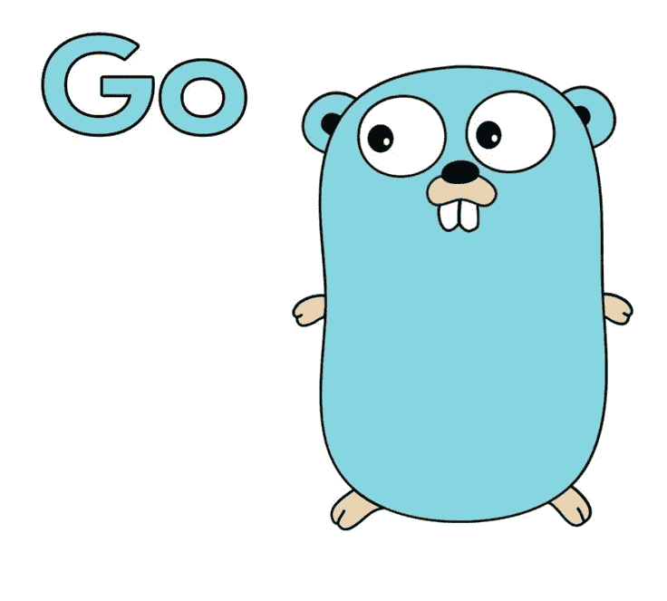
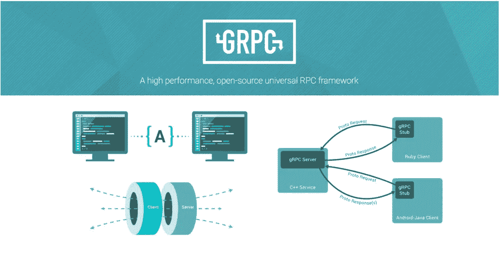

# 使用 protobuf 和 GRPC 的 golang/http 2

> 原文：<https://medium.com/nerd-for-tech/golang-with-protobuf-grpc-http2-d11e1d32a02c?source=collection_archive---------3----------------------->

作为我在以前的雇主那里工作的一个项目的一部分，我正在开发一个新的栈来替代 ReST over HTTP with JSON。我使用 protobuf 作为传输消息，通过 HTTP2 对 GRPC 进行了试验。与基于 ReST API 的设计相比，这是一种全新的构建后端的方式。

我正在做一个新的兼职项目，从零开始构建一个基于**分布式哈希表(DHT)** 概念的简单点对点应用程序。如果您不了解一致性散列，我建议在继续之前先阅读它。我试图模拟一个简单的对等节点，它在 2 个 docker 实例中的一台机器上工作。但这是一个非常幼稚的版本，需要努力才能有一个像样的版本。我必须在应用程序实例中对节点的 ip 进行硬编码，以便一个实例连接到另一个实例并在彼此之间进行同步。参考[回购](https://github.com/prateekgupta3991/contraption/tree/p2p/src)。

> 这篇文章是关于 grpc/protobuf/HTTP2 的工作知识，而不是使用这些技术背后的设计决策。我假设你对 grpc/protobuf/HTTP2 有一些了解，并正在寻找一个理解的工作示例。这些决定将会在我以后的文章中单独发表。

我列出了这个项目试图解决的用例:
1。创建一个基本服务器。这将是应用程序运行的第一台服务器。
2。在环中添加新的服务器。这是通过在不同的 docker 节点上启动第二台服务器来处理的。从我们的客户端使用**RPC**insert node()方法将这个新节点的 IP 更新到原始服务器。
3。如果具有**特定 id(散列关键字)**的节点存在或不存在，则请求节点做出响应。该请求可以到达对等环中的任何服务器，如果该节点出现在该环中，它应该使用**RPC****findDestNode()**进行响应。

**未来扩展**
1。在这个环中存储一个值。尚不支持。
2。附近节点自动同步新节点加入环的信息。

# 原蟾蜍

首先要讨论的是消息格式本身。因为它有自己的语义、类型和用例。
proto buf 是一种消息格式，在传输消息时使用的是二进制格式。

protobuf 消息需要存储为一个**。原型**文件。我的项目的原型文件如下:

基于上面讨论的用例，proto 由**RPC**和以**消息**关键字形式的相应契约组成。

由于 proto 文件可以用于生成服务器和客户机，所以我将它存储为一个名为 vault 的独立 repo。参考[回购](https://github.com/prateekgupta3991/vault)。

然后运行 grpc 命令来生成 **pb.go** 文件。请参考原型[文档](https://developers.google.com/protocol-buffers/docs/reference/go-generated)了解这一点。附上文件，但它太大了。

# 核心

具有逻辑的核心文件如下。
1。node . go——当新的对等体想要加入 DHT 环时，该文件具有创建 NewNode()实例的逻辑，Insert()通知现有节点关于新节点的添加，FindSuccessor()查找环中的节点。FindSuccessor 仍未实现。

2.fingertable.go —该文件的逻辑是为每个节点创建一个新的 fingertable，以存储附近的对等元信息，在 FT 中添加新对等元信息，并从 FT 中读取数据。

# 主要的

该文件使用核心文件来操作 DHT 环操作

# 计算机网络服务器

现在，应用程序将使用上面的原型生成文件来编写服务器。

# 客户

这是我制作的非常简单的 DHT 版本。对我来说，这是获得有价值知识的垫脚石。我为什么选择对等作为 grpc 实验的辅助项目，主要是因为对等是 rpc 调用的一个很好的用例。

在另一篇关于 WIP 的半生不熟的文章中，我已经将这个项目移植到一个简单的区块链项目中，就像点对点项目一样。我刚刚移除了 grpc，转而在 HTTP 和 API 上使用 JSON。它仍然是 WIP，但已经能够在 2 个 docker 节点上进行测试，在那里它们添加到环中，并同步它们的分类帐。当它变得更好的时候我会分享它。

如果你发现任何不一致的地方，请通过评论让我知道，或者联系我就此进行讨论。谢谢！！！