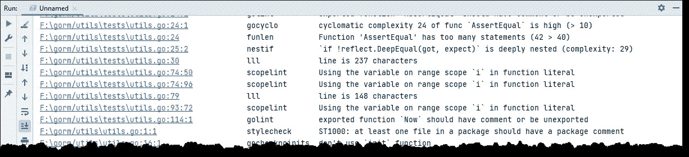
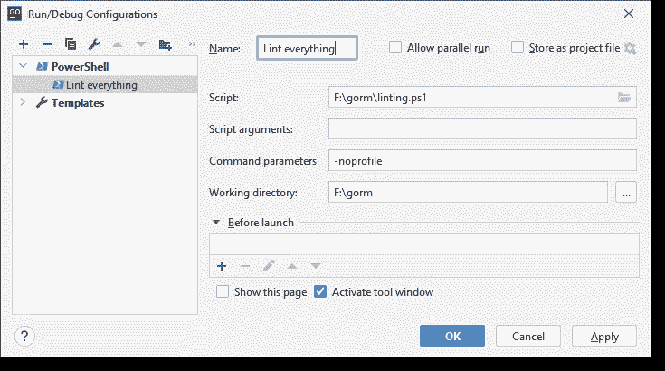

# 戈兰奇-林特和戈兰德

> 原文：<https://medium.com/nerd-for-tech/golangci-lint-and-the-goland-ide-42aabc14f7d5?source=collection_archive---------4----------------------->

即使这篇文章是用 GoLand IDE 作为最终游戏编写的，我想这里的思想也适用于任何现代 IDE。


基于雷尼·弗伦奇的原创作品

在你的 golang 程序上运行静态代码分析(又名*林挺*)是对抗糟糕编码的第一道防线，也是开始你的 golang 代码审查实践的一种廉价方式。这也是持续集成管道中的第一道质量关。本文讲的是前者。

那里有一个 golang linters 的完整列表，单独运行每个列表并不是很有趣。于是 [golangci-lint](https://golangci-lint.run/) 诞生了。与单独运行每个 linter 相比，这个软件将以一种非常高效的方式运行您喜欢的 linter(可能借助于 shell 脚本)。此外，习惯上只在 CI 管道中运行 linters，而不在开发环境中运行。通常，最终会配置对“有问题的”lint 错误的抑制，甚至更糟:一起禁用 liting。

# 当林挺成为敌人时

从命令行运行 golangci-lint(或任何 linter)可能会导致一系列问题，然后您需要在一个窗口中列出这些问题，并在编辑器中手动修复这些问题。

雪上加霜的是，如果您使用的是 Unix 衍生的操作系统，那么关于如何在 JetBrains GoLand IDE 下运行 linter 的文档可能就足够了。事实上，golangci-lint 文档中提出的设置一切都很好。**然而**，当受限于企业环境开发设置时，安全歇斯底里使您的 CPU 花费太多的周期来实时扫描所有和每个文件系统操作…嗯…事情变慢了，您的 IDE 感觉就像 PTFE 覆盖的垂直杆上的鼻涕虫。

此外，让 linter 在编码时抛出 lint 错误会分散对实际编码的关注。我想这可能是人们喜欢编辑器(vim、Emacs、Sublime Text 等)和更简单的 IDE(比如 VS Code)而不是成熟的 IDE 产品的一个原因。

这种干扰类似于违背你的意愿或超出你的控制的强制[上下文切换](https://www.linkedin.com/pulse/context-switching-developers-paul-graham)。

很有可能你会说*去他妈的*然后一起禁用林挺。

# 按需运行棉绒机

任何 IDE 最酷的地方就是它的构建配置(也称为。*运行/调试配置*。大多数情况下，这些只是用于这个目的:设置运行&调试配置。但是，您瞧，通常您可以设置一个运行/调试配置来运行 shell 脚本(Powershell 脚本确实属于这一类)。

**NB** :在下面的示例设置中，我将使用 *Gorm* 包。这篇文章并不反映软件包的质量，它在这里只是作为一个例子。我喜欢这个套餐并且用过，不止一次推荐。

我喜欢使用 GoLand IDE，它有足够的智能来检测我的程序正在产生什么样的输出。其中，它将检测给定文件的路径以及相应的行号和列号。当点击链接时，编辑者的光标将被放置在文件的相应位置。



在 GoLand IDE 中使用 tab 格式运行 golangci-lint 的输出示例。

您可能更喜欢 golangci-lint 产生的其他输出之一。我喜欢这种输出格式(名为*标签*，因为它清晰明了，减少了信息过载。我发现这个输出中缺少的是 lint 问题的严重性(默认情况下，golangci-lint 将所有内容都视为严重错误)。

另一方面，默认输出过于冗长，我不喜欢。

```
F:\gorm/callbacks\callbacks.go:28:24: Error return value of `queryCallback.Register` is not checked (errcheck)
 queryCallback.Register(“gorm:preload”, Preload)
 ^
F:\gorm/callbacks\callbacks.go:29:24: Error return value of `queryCallback.Register` is not checked (errcheck)
 queryCallback.Register(“gorm:after_query”, AfterQuery)
 ^
F:\gorm/callbacks\callbacks.go:32:50: Error return value of `(*gorm.io/gorm.callback).Register` is not checked (errcheck)
 deleteCallback.Match(enableTransaction).Register(“gorm:begin_transaction”, BeginTransaction)
```

您首先需要的是一个包装器 shell 脚本。写这篇文章时，考虑到了 Windows 的烦恼。这就是 Powershell。我们把这个文件叫做 linting.ps1:

```
$location = "$(Get-Location)"
golangci-lint.exe run --out-format tab --path-prefix $location $args[0]
```

$args[0]允许您向脚本传递一个目录名，这样就可以一次只 lint 一个子程序包。

您需要的第二件事是在 Powershell 脚本上调用运行/调试配置(或者您可以在 shell 脚本上调用，并将 Powershell 作为解释器使用)。当然，Jetbrains IDEs 提供了 Powershell 配置。



Powershell 运行/调试配置示例。

您现在可以按需运行林挺了。

使用运行/调试配置中的*脚本参数*字段，通过传递相应的目录名来分析子包。

# 关于下一步去哪里的建议

我发现的一些更好的做法*你可以考虑使用:*

*   定义要使用的棉绒。有几个可用的棉绒，启用一切和厨房水槽可能会适得其反，所以从默认开始。使用什么样的 linters 可以作为命令行选项传递给 golangci-lint 程序。看看[https://golangci-lint.run/usage/linters/](https://golangci-lint.run/usage/linters/)的可用棉绒概览。
*   命令行选项太多，生活一团糟。请改用配置文件。一个很好的起点是 https://golangci-lint.run/usage/configuration/#config-file。
*   通过修改配置文件来调整 linters 的行为。您的团队可能会发现，如果函数超过 60 行或 40 条语句，并且行长度超过 120 个字符，那么函数仍然是可读的。
*   林挺整个存储库可能很吸引人，但由于可能返回大量 lint 错误，很快就会变得令人不知所措。Lint 一次一个包是更好的方法。

# 关于配置文件选项的几点注意事项

我不会详细说明使用哪种 linters 等等，因为本文的范围是 IDE 中的*林挺。我将触及的唯一配置与此主题相关。*

```
output:
path-prefix: ""sort-results: true
 format: tabprint-issued-lines: false
print-linter-name: trueuniq-by-line: false
```

前三个选项对我们的*按需上市最重要。*

*   **path-prefix: ""** 这个值无关紧要，因为它被(Power)shell 文件中相应的命令行选项所覆盖。但是为了清楚起见，空白和任何东西一样好。
*   sort-results: true 你想让每个文件都分组在一起，而不是到处都是。
*   **格式:标签**如上所述，我发现*标签*-格式比其他格式更容易阅读。

请自行决定使用以下选项:

*   **print-issued-lines:false**如果设置为 *true* 并使用任何其他格式化程序，将产生非常冗长的输出。
*   **print-linter-name: true** 知道哪些棉绒对什么有反应是有帮助的。
*   **uniq-by-line: false** 进一步减少了可能的信息过载。