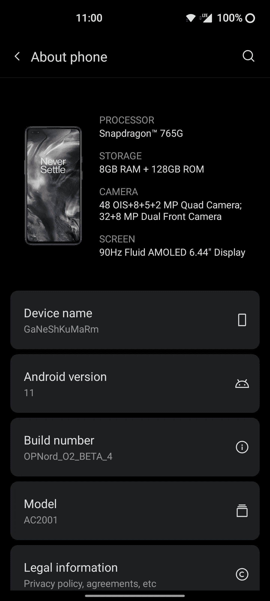
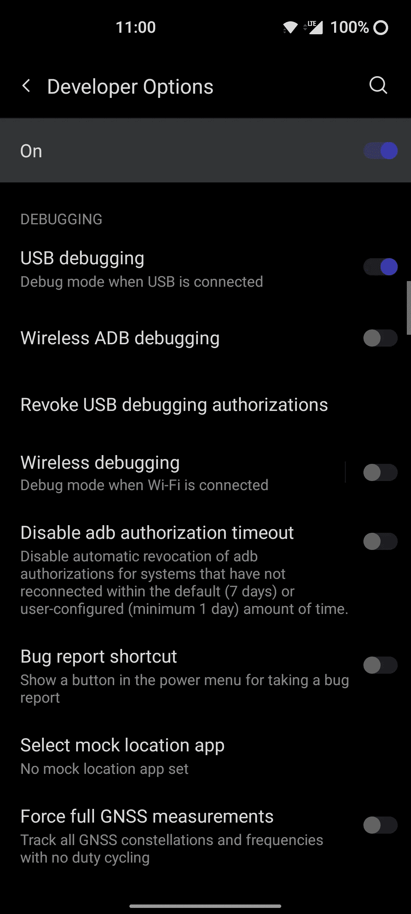
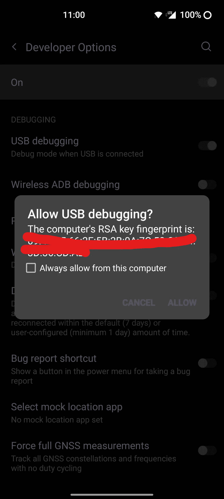
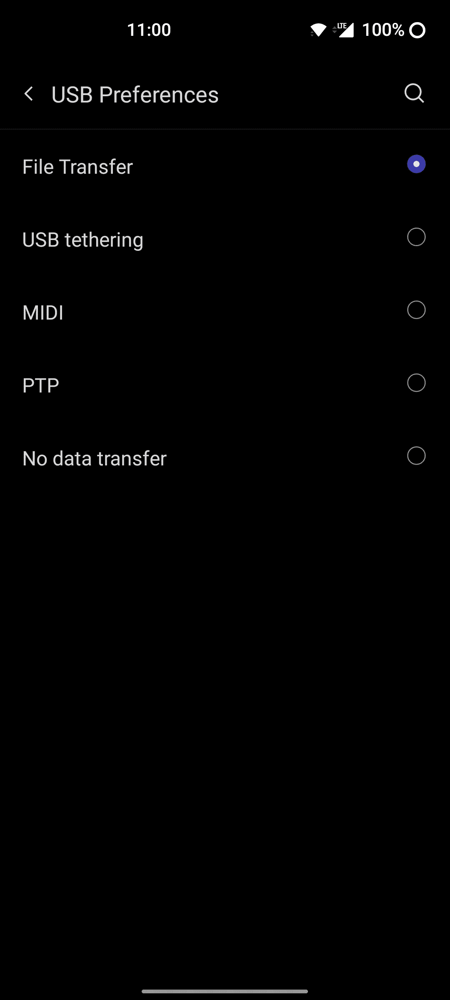
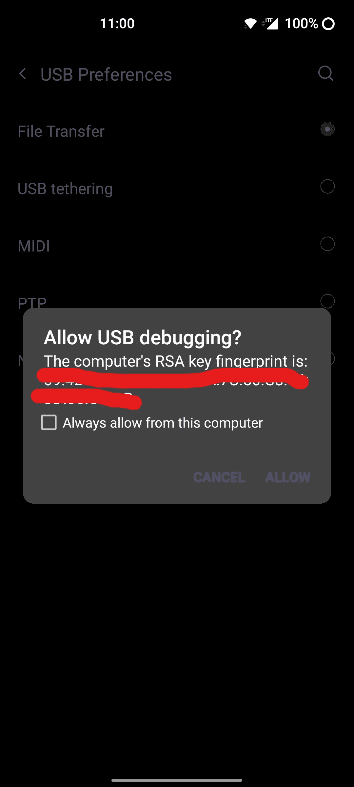
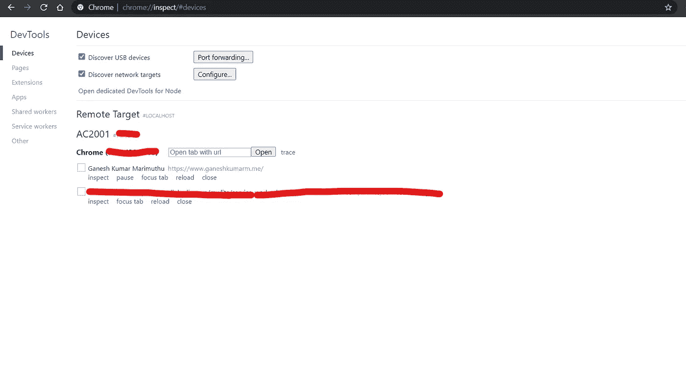
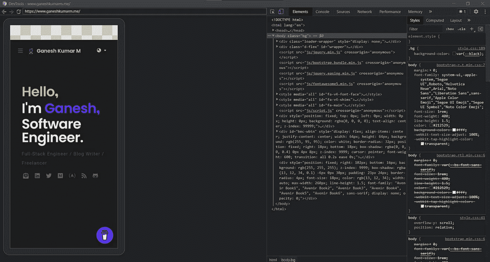
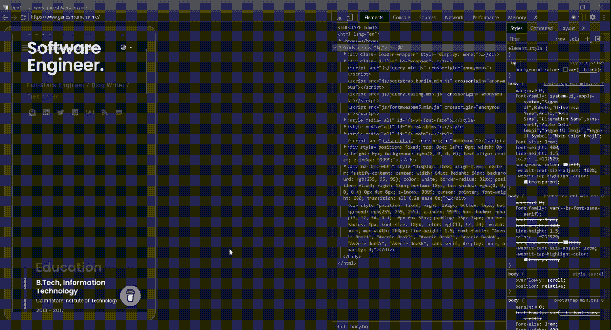

# 谷歌浏览器——如何在移动设备上检查网站

> 原文：<https://medium.com/nerd-for-tech/google-chrome-how-to-inspect-websites-on-mobile-devices-804677f863ce?source=collection_archive---------1----------------------->

## 在移动设备上检查网站的简单方法

布雷特·乔丹在 [Unsplash](https://unsplash.com?utm_source=medium&utm_medium=referral) 上的照片

我最近创建了我的响应式[投资组合网站](https://www.ganeshkumarm.me/)，并在我的手机上进行测试。我想检查一些元素。我认为没有办法做到这一点。但是我知道有一种方法。在本文中，我们将了解如何在移动设备上调试网站。

# 1.启用 USB 调试

1.  首先，我们需要在手机上启用 **USB 调试**。
2.  要做到这一点，应该启用开发人员选项。要启用**开发者选项，**转到**关于手机**并点击**内部版本号 5 次**。

关于电话>点击内部版本号 5 次

3.启用开发者选项后，您可以进入**系统>开发者选项**并向下滚动到 **USB 调试**。

启用开发人员选项

4.**启用**选项，点击弹出的**允许**。

允许 USB 调试

# 2.将移动设备连接到计算机

1.  现在你可以通过 USB 线将手机连接到笔记本电脑或电脑上。
2.  打开**导航抽屉**，将选项从**充电装置**切换到**文件传输**。

将选项从充电设备更改为文件传输

3.按下**允许**中的**允许 USB 调试？**弹出。

允许 USB 调试

# 3.从笔记本电脑检查网站

1.  打开 Chrome 浏览器并导航至 **chrome://inspect** 。

从 Chrome 打开 Inspect

2.在**远程目标**下，将列出您在手机浏览器中打开的站点。可以点击**检查**调试现场。

检查移动设备

# 试映

移动预览

笔记本电脑预览

# 谢谢你🤘

想了解我更多，请访问[**ganeshkumarm . me**](https://www.ganeshkumarm.me/)

