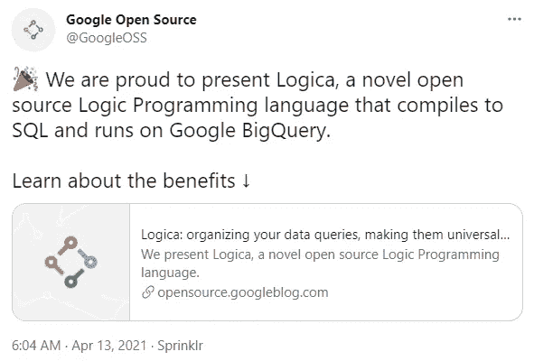

# Google 正在推动新语言 Logica 来解决 SQL 中的主要缺陷！

> 原文：<https://medium.com/nerd-for-tech/google-is-pushing-the-new-language-logica-to-solve-the-major-flaws-in-sql-3cb62b6fab06?source=collection_archive---------1----------------------->

2021 年 4 月 12 日，**谷歌在其开源博客**上推出了一种新的开源逻辑编程语言——Logica。

(来源:Logica 官方网站)

Logica，以逻辑与聚合命名，意为逻辑+聚合。因此，顾名思义，Logica 的创建进一步扩展了经典的逻辑编程语法，尤其是在聚合方面(指对相关数据进行内容选择、分析、分类，最后分析得到想要的结果，主要指从一个数组数据转换过程中可以生成的任何标量值)。

谷歌不仅在博文中打包了一张票:“你会爱上它的！”，它还在推特上表达了对 Logica 的自豪，称其“**可以编译成 SQL 并在 Google BigQuery 上运行”**:

为了解决 SQL 的缺点，Logica 应运而生

在详细介绍 Logica 之前，首先要明确“逻辑编程”的含义。

自 20 世纪 60 年代末以来，逻辑程序设计在学术界得到了发展。与常规通过设置步骤解题不同，逻辑编程的过程是“**事实+规则=结果**”，即设置答案必须符合解题的规则。因此，逻辑编程实际上是将形式逻辑风格引入计算机编程，其中程序被写成一组逻辑语句。

在逻辑编程语言中，最具代表性的例子就是 Prolog 和 Datalog，而 Google 这次推出的 Logica 就是属于 Datalog 家族的语言。

Datalog 是一种数据查询语言。因为它和关系数据库的出发点是一样的:它把数据当作关系，把数据处理当作对这些关系的一系列处理。因此，Datalog 用于设计与大规模关系数据库的交互。但在数据处理的方式上，Datalog 不同于处理数据的通用语言 SQL:**Datalog 的灵感来源于一阶逻辑的数学语法，而 SQL 遵循自然语言的语法。**

70 年代发明的 SQL，半个世纪过去了，发展了这么多。小到智能手表，大到企业 IT 解决方案系统，你都可以看到 SQL 在读写数据，甚至你在阅读本文时正在使用的浏览器都可能包含内置的 SQL 数据库。

造成这种现象的根本原因是**SQL 是基于自然语言开发的，这让无数没有经过正规计算机编程和数学训练的人都可以顺利访问数据库**，而这也是 SQL 无法弥补的缺陷。

在 SQL 中，往往很清楚逻辑程序很简单，但对应的 SQL 查询示例却很难理解。**经常会发生一个查询需要写几百行句子的情况，更不用说为了保持 70 年代的老式 COBOL 精神，通篇经常使用大写字母。**

这是次要的。**SQL 的主要缺点是它对抽象的支持非常有限。**

好的编程应该是创建小的、可理解的、可重用的逻辑片段，并且这些逻辑片段必须被测试、命名和组织成包，然后这些包可以用于构造更有用的逻辑片段。这样的工作流合理方便，但是 SQL 不支持。

因此，为了解决 SQL 的缺点，Logica 应运而生。

> 开发者可以“尝一尝”。

Logica 作为一种逻辑编程语言，使用了数学家专门设计的数学命题逻辑，简化了复杂语句的表达，可以将逻辑程序编译成 SQL 表达式，并且由于逻辑编程语法的便利性，在 Google BigQuery 上。运行(实验性支持 PostgreSQL 和 SQLite)。

此外，与从 Datalog 转换到 SQL 时可能遇到的析取和否定的处理相比，Logica 将尝试为此做出各种选择，以尽可能提高生成的 SQL 结构的可读性，以便用户能够编写有效执行的程序。

因此，与 SQL 相比，Logica 更加简洁，支持 SQL 所缺乏的可重用抽象机制。它还支持模块和导入。它还可以在交互式 Python 笔记本中使用，甚至使测试查询变得自然和容易。

目前 Logica 已经在 Apache 2.0 许可下开源，在 [GitHub](https://github.com/EvgSkv/logica) 上展示了 Logica 的部分代码示例。

谷歌工程师也建议广大开发者可以尝试 Logica，他们认为**“你会喜欢的”**。因为即使在项目中没有真正使用，学习一门强大的新语言也会帮助开发人员在数据处理和计算领域产生新的灵感。

而且，Logica 可能还特别适合以下三种类型的开发者:

*   已经使用逻辑编程，需要更强大的计算能力；
*   使用 SQL，但对其可读性不满意；
*   我想学逻辑编程，应用于大数据处理。

Logica 官员还表示，它计划在未来支持更多的 SQL 语句和引擎，因此对此感兴趣的程序员或许可以“尝试新事物”。

**参考链接**

 [## Logica:组织你的数据查询，使它们普遍可重用和有趣

### 我们介绍了 Logica，一种新颖的开源逻辑编程语言。Yedalog(一种发展于…

opensource.googleblog.com](https://opensource.googleblog.com/2021/04/logica-organizing-your-data-queries.html)  [## 罗吉卡

### Logica 是一种用于数据操作的开源声明式逻辑编程语言。Logica 是…的继承者

logica.dev](https://logica.dev/)