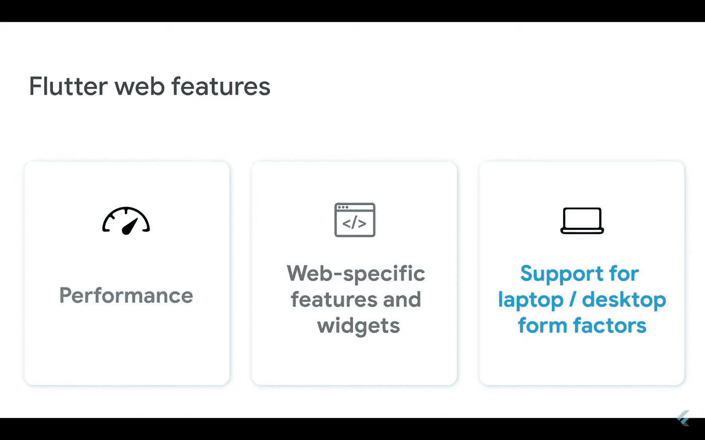
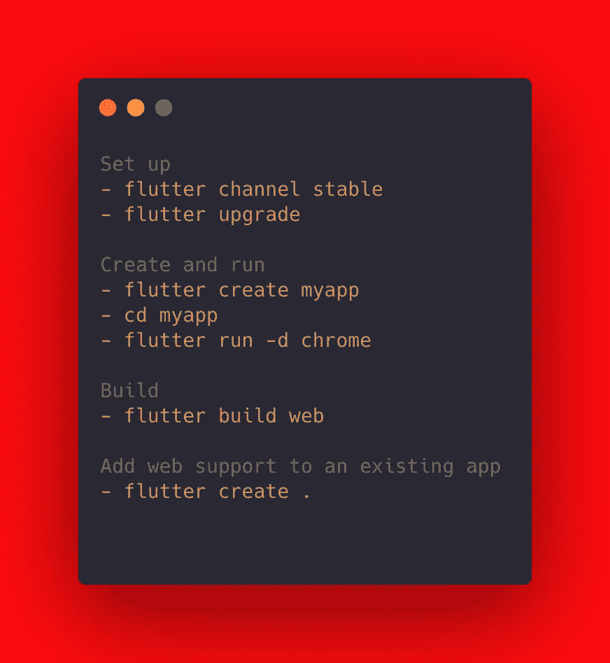
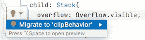
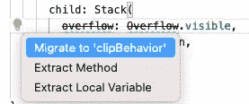
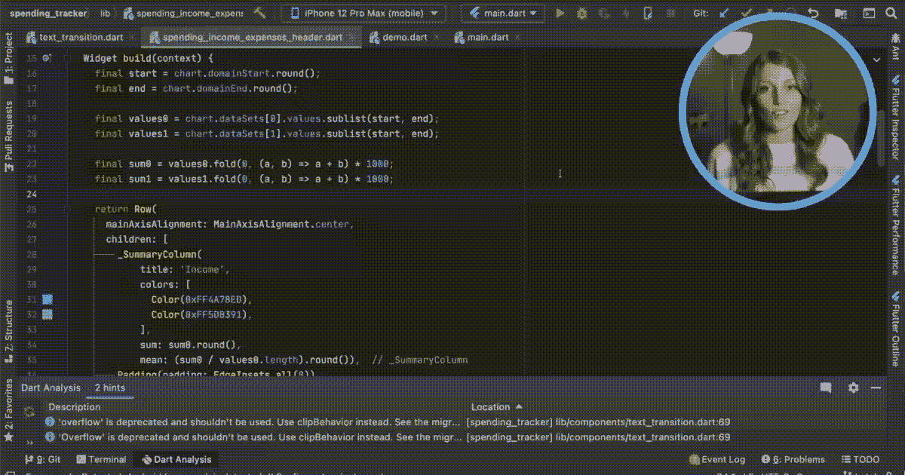
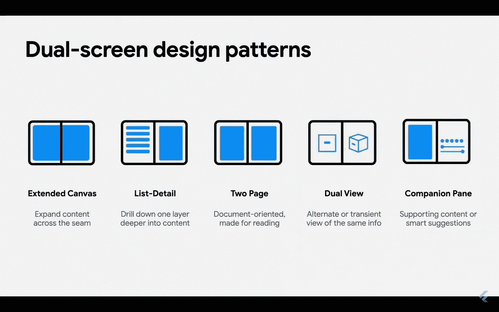
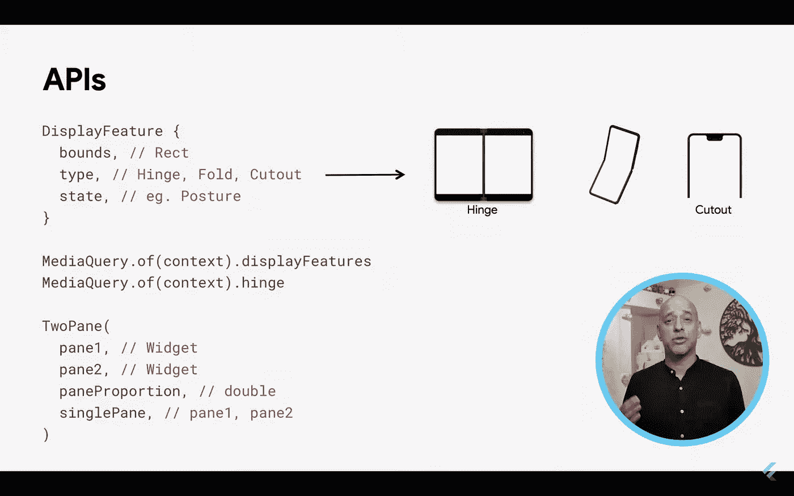
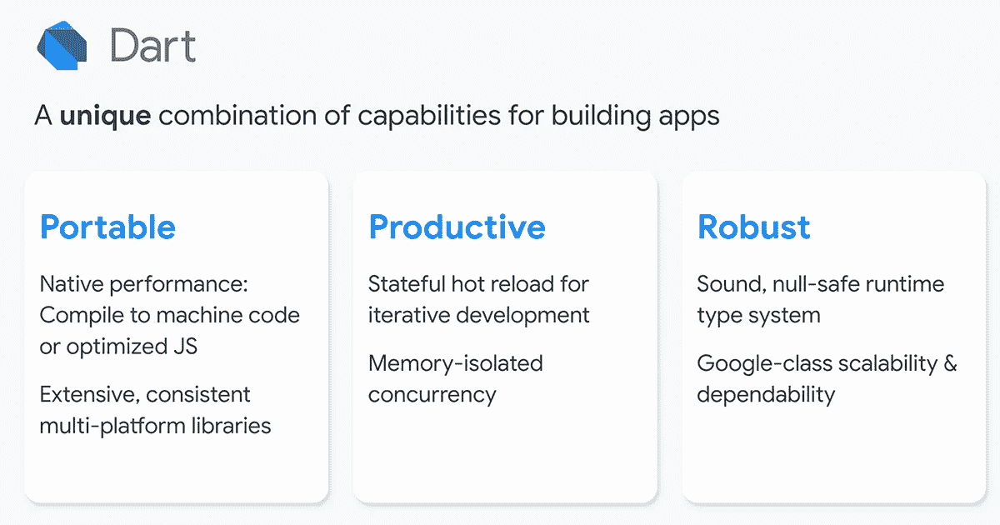
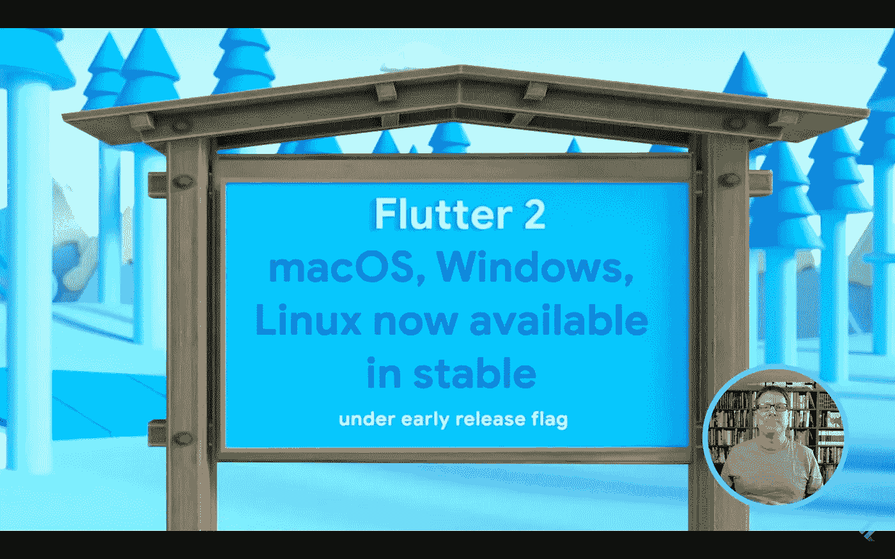
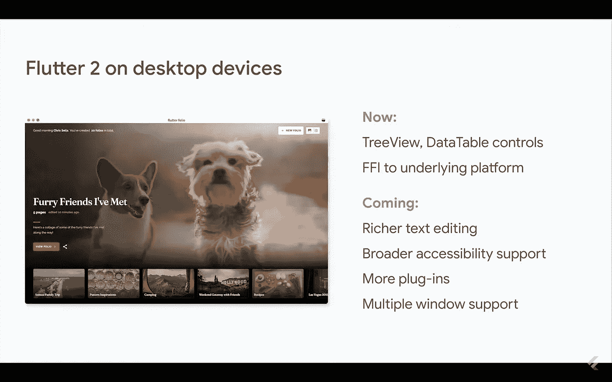

# 谷歌推出 Flutter 2.0🔥

> 原文：<https://medium.com/nerd-for-tech/google-launches-flutter-2-0-6b41fb01b870?source=collection_archive---------8----------------------->

> 谷歌发布了 2.0 版本的 [Flutter](https://flutter.dev/) ，这是其[开源 UI 开发套件](https://venturebeat.com/2019/12/11/google-paints-its-ambient-computing-vision-for-flutter/)，帮助应用程序开发者从相同的代码库构建跨平台软件。虽然升级带来了一系列新功能，但今天的发布会可能主要是为了突出 Flutter 在移动领域以外的持续过渡，以支持任何地方的应用程序——网络、桌面，甚至可折叠等新兴形式。

现在介绍，在 [#FlutterEngage](https://twitter.com/hashtag/FlutterEngage?src=hashtag_click) 的 Flutter 2！了解有关 Flutter 可移植性的重大升级的更多信息，该升级从单一代码基础上开辟了广泛的新目标平台，如 web 和桌面。


# 颤振的稳定腹板支撑


Fluter 的 web 支持在 web 上提供了与在移动设备上相同的体验。基于 Dart 的可移植性、web 平台的强大功能和 Flutter 框架的灵活性，您现在可以从同一个代码库为 iOS、Android 和浏览器构建应用程序。你可以将现有的用 Dart 编写的 Flutter 代码编译成 web 体验，因为它是完全相同的 Flutter 框架，而 **web** 只是你的应用程序的另一个设备目标，最后，flutter web 是一个稳定的版本。



> 设置颤动网



# 对 Flutter 的广告支持


> 💰构建应用很棒，但通过构建应用赚钱更棒！对许多移动开发者来说，利用 GoogleAdMob 的应用赚钱是一条受欢迎的途径。我们今天发布的另一个主要包更新。

对许多 Flutter 开发者来说，通过广告将应用程序货币化是最受欢迎的要求之一。

最重要的是，谷歌已经将其移动广告 SDK 插件转移到测试版，Flutter 广告支持可以通过[谷歌移动广告 SDK for Flutter (Beta)](https://pub.dev/packages/google_mobile_ads) 获得，它可以与 AdMob 和 AdManager 一起工作。该插件支持多种广告格式，包括横幅广告(内嵌和叠加)、插播广告、奖励视频和原生广告。

以下资源可以帮助您开始:

*   要获得 Flutter 的谷歌移动广告 SDK，请从 pub.dev 下载[谷歌移动广告插件](https://pub.dev/packages/google_mobile_ads)。
*   有关使用 AdMob 或 AdManager 创建和加载广告的说明，请参见[详细实施指南](https://developers.google.com/admob/flutter)。
*   要了解如何实现覆盖横幅广告、插播广告和奖励广告，请参见[将 AdMob 广告添加到 Flutter app](https://codelabs.developers.google.com/codelabs/admob-ads-in-flutter#0) codelab。
*   要了解如何实现内嵌横幅和原生广告，请参见[将 AdMob 横幅和原生内嵌广告添加到 Flutter 应用](https://codelabs.developers.google.com/codelabs/admob-inline-ads-in-flutter) codelab。


# 颤振 2 工装亮点！

增加了一个解释[颤动修正](https://flutter.dev/docs/development/tools/flutter-fix)特性以及如何使用的新页面。

> 什么是 DevTools？
> 
> DevTools 是一套用于 Dart 和 Flutter 的性能和调试工具。它目前处于测试版，但正在积极开发中。

# 颤动定位

在 Flutter 2 中引入的 *Flutter Fix* 特性将 Dart 命令行工具与 Dart analyzer 建议的更改相结合，以自动清理代码库中不推荐使用的 API。

这个特性也被添加到了 Flutter (2.0)和 Dart (2.12)的 IDE 插件中。根据 IDE 的不同，这些自动更新被称为*快速修复* (IntelliJ、Android Studio、Eclipse)或*代码动作* (VS 代码)。

> 应用单独的修复
> 
> 您可以使用任何支持的 IDE 一次应用一个补丁。

# IntelliJ 和 Android Studio

当分析器检测到不推荐使用的 API 时，代码行上会出现一个灯泡。单击灯泡显示建议的修复，将代码更新到新的 API。单击建议的修复将执行更新。



# VS 代码

当分析器检测到不推荐使用的 API 时，它会显示一个错误。您可以执行以下任一操作:

*   将鼠标悬停在错误上，然后单击**快速修复**链接。这将呈现一个过滤列表，仅显示*个*修复。
*   将插入符号放在有错误的代码中，然后单击出现的灯泡图标。这显示了所有操作的列表，包括重构。
*   将插入符号放在有错误的代码中，然后按快捷键( **Command+)。**在 Mac 上， **Control+。**这显示了所有操作的列表，包括重构。



# 应用项目范围的修复

要查看或应用对整个项目的更改，您可以使用命令行工具`[dart fix](https://dart.dev/tools/dart-fix)`。

该工具有两个选项:

*   要查看可用更改的完整列表，请运行以下命令:
*   `dart fix --dry-run`
*   要批量应用所有更改，请运行以下命令:

```
dart fix --apply
```



# 在 web 上配置 URL 策略

Flutter web 应用程序支持在 web 上配置基于 URL 的导航的两种方式:

**Hash(默认)**:路径被读写到 [hash 片段](https://en.wikipedia.org/wiki/Uniform_Resource_Locator#Syntax)。比如`flutterexample.dev/#/path/to/screen`。

**路径**:路径的读写没有哈希。比如`flutterexample.dev/path/to/screen`。

这些是使用带有 [HashUrlStrategy](https://master-api.flutter.dev/flutter/flutter_web_plugins/HashUrlStrategy-class.html) 或 [PathUrlStrategy](https://master-api.flutter.dev/flutter/flutter_web_plugins/PathUrlStrategy-class.html) 的 [setUrlStrategy](https://master-api.flutter.dev/flutter/flutter_web_plugins/setUrlStrategy.html) API 设置的。

## 配置 URL 策略

> **注意:**默认情况下颤振使用哈希(`/#/`)定位策略。只有当您想使用 URL 路径策略时，才需要这些说明。

`setUrlStrategy` API 只能在 web 上调用。下面的说明展示了如何使用条件导入在 web 上调用此函数，而不是在其他平台上。

1.  在您的应用程序运行之前，包含`flutter_web_plugins`包并调用 [setUrlStrategy](https://master-api.flutter.dev/flutter/flutter_web_plugins/setUrlStrategy.html) 函数:

```
dependencies:
  flutter_web_plugins:
    sdk: flutter
```

a)用以下内容创建一个`lib/configure_nonweb.dart`文件:

```
void configureApp() { 
  // No-op.
 }
```

b)用以下内容创建一个`lib/configure_web.dart`文件:

```
import 'package:flutter_web_plugins/flutter_web_plugins.dart';

void configureApp() {
  setUrlStrategy(PathUrlStrategy());
}
```

1.  当`html`包可用时，使用条件导入来导入`configure_web.dart`，当`configure_nonweb.dart`包不可用时，使用条件导入:

```
import 'package:flutter/material.dart';
import 'configure_nonweb.dart' if (dart.library.html) 'configure_web.dart';

void main() {
  configureApp();
  runApp(MyApp());
}
```

> 在非根位置托管 Flutter 应用程序
> 
> 将`web/index.html`中的`<base href="/">`标签更新为应用托管的路径。例如，要在`myapp.dev/flutter_app`托管您的 Flutter 应用程序，请将此标签更改为`<base href="/flutter_app">`。


# 可折叠的双屏设备已经为您的 Flutter 应用程序做好了准备！

> 由于 Flutter 最初是一个跨平台的移动框架，所以这里没有太多要说的。在很大程度上，Flutter 已经成为移动设备的完整功能有一段时间了，除了一点:可折叠。由于微软的贡献，Flutter 2.0 现在支持可折叠显示器。Flutter 现在知道如何处理这种外形因素，并让开发人员按照自己的意愿设计应用程序。

现在 Flutter 2.0 中有了一个新的 TwoPane 小部件，顾名思义，它可以让你显示两个窗格。第一个窗格将显示在任何设备上，而第二个窗格将显示在可折叠显示器的右半部分。对话框还可以让你选择它们应该显示在可折叠显示屏的哪一边。

可折叠显示器上的折痕或铰链是作为一个显示功能(像一个凹口)暴露给开发人员的，因此如果他们愿意，应用程序仍然可以扩展到整个可折叠显示器，或者考虑铰链的位置并相应地显示。



# 丰田信息娱乐系统的未来将由 Flutter 驱动。


# dart:Flutter 背后的秘制酱。



# Flutter 是未来 ubuntu 应用的默认选择。


# [桌面支持颤振](https://flutter.dev/desktop)

桌面支持允许您将 Flutter 源代码编译到本机 Windows、macOS 或 Linux 桌面应用程序中。Flutter 的桌面支持还扩展到插件——你可以安装现有的支持 Windows、macOS 或 Linux 平台的插件，或者你可以创建自己的插件。



> 稳定频道中的 Beta 快照

为了更容易地尝试对 Flutter 的桌面支持，我们在 Flutter 2 stable 中发布了 Flutter beta 通道的桌面支持快照。这意味着您可以轻松地尝试它，而无需切换到 Flutter beta 通道。但是，在下一个 Flutter 稳定版本发布之前，稳定通道中包含的快照不会更新为桌面的最新 Flutter 支持。



> 一旦你有了`*snapd*`，你就可以使用 [Snap Store](https://snapcraft.io/store) 来安装 Flutter，或者在命令行:

```
sudo snap install flutter --classic
```

如果`snapd`在您使用的 Linux 发行版上不可用，您可以使用下面的命令:

```
sudo apt-get install clang cmake ninja-build pkg-config libgtk-3-dev libblkid-dev liblzma-dev
```

> 创建新项目

您可以使用以下步骤创建一个具有桌面支持的新项目。

## 建立

在命令行中，执行以下命令以确保您拥有最新的桌面支持并已启用。如果您看到“flutter: command not found”，那么请确保您已经安装了 [Flutter SDK](https://flutter.dev/docs/get-started/install) ，并且它位于您的路径中。

```
flutter config --enable-<platform>-desktop
```

其中 *<平台>* 为`windows`、`macos`或`linux`:

```
flutter config — enable-windows-desktop
flutter config — enable-macos-desktop
flutter config — enable-linux-desktop
```

# **添加了一个关于如何实现移动和 web 深度链接的页面。**

> **版本注:** [Navigator 2.0](/flutter/learning-flutters-new-navigation-and-routing-system-7c9068155ade) 现在叫做`[Router](https://api.flutter.dev/flutter/widgets/Router-class.html)`，可以让你根据 app 的当前状态，以声明方式设置显示的路线。这个 API 是可选的。

Flutter 在 dev 频道中支持 iOS、Android 和 web 浏览器上的深度链接。打开 URL 会在应用程序中显示该屏幕。通过下面的步骤，您可以使用命名的路线(使用`[routes](https://api.flutter.dev/flutter/material/MaterialApp/routes.html)`参数或`[onGenerateRoute](https://api.flutter.dev/flutter/material/MaterialApp/onGenerateRoute.html)`)或使用`[Router](https://api.flutter.dev/flutter/widgets/Router-class.html)`小部件来启动和显示路线。

如果您在网络浏览器中运行该应用程序，则无需额外设置。路由路径的处理方式与 iOS 或 Android 深度链接相同。默认情况下，web 应用程序使用模式:`/#/path/to/app/screen`从 url 片段读取深层链接路径，但这可以通过[为您的应用程序配置 URL 策略](https://flutter.dev/docs/development/ui/navigation/url-strategies)来改变。

# 其他的

*   更新了[创建响应性和适应性应用](https://flutter.dev/docs/development/ui/layout/adaptive-responsive)页面。
*   许多页面(包括 flutter.dev 上的所有 codelabs)和示例都更新为空安全。
*   添加了两个新的添加到应用程序页面:
*   [使用多个颤振实例](https://flutter.dev/docs/development/add-to-app/multiple-flutters)
*   [给 Android 应用添加一个颤动视图](https://flutter.dev/docs/development/add-to-app/android/add-flutter-view)
*   添加了关于如何使用 integration_test 包编写集成测试的页面。
*   对[国际化](https://flutter.dev/docs/development/accessibility-and-localization/internationalization)页面的重大更新。
*   新的和更新的[性能](https://flutter.dev/docs/perf)页面，包括:
*   [绩效指标](https://flutter.dev/docs/perf/metrics)
*   [演出常见问题解答](https://flutter.dev/docs/perf/faq)
*   [关于性能的更多想法](https://flutter.dev/docs/perf/appendix)

**Codelabs**

我们的许多代码实验室已经更新到零安全。

*   [向 Flutter 应用添加 AdMob 横幅和原生内嵌广告](https://codelabs.developers.google.com/codelabs/admob-inline-ads-in-flutter)


这些是 Flutter 2.0 中关于桌面和移动平台的重大变化。你如何看待 Flutter 作为桌面和移动开发的框架？让我们知道！


[皮特·佩德罗萨](https://unsplash.com/@peet818?utm_source=medium&utm_medium=referral)在 [Unsplash](https://unsplash.com?utm_source=medium&utm_medium=referral) 上的照片

领英:[https://www.linkedin.com/in/tushar-nikam-a29a97131/](https://www.linkedin.com/in/tushar-nikam-a29a97131/)

github:[https://github.com/champ96k](https://github.com/champ96k)

推特:[https://twitter.com/champ_96k](https://twitter.com/champ_96k)