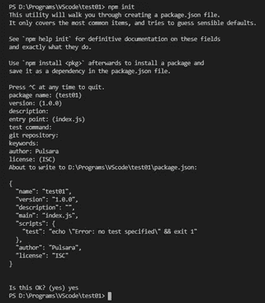
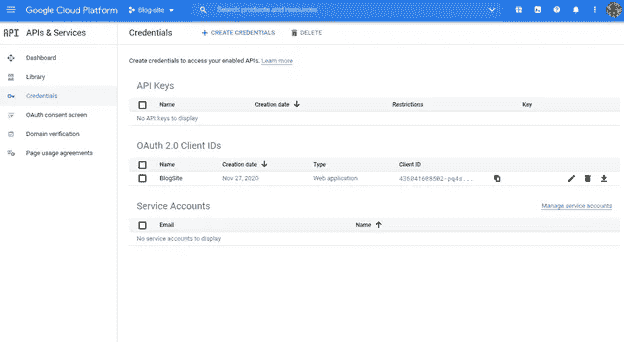
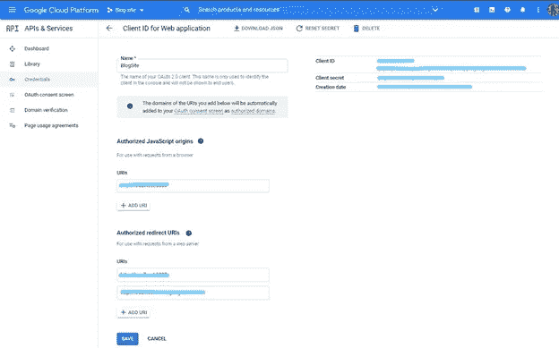

# Google OAuth2.0 身份验证—使用 Node JS 和 PassportJS

> 原文：<https://medium.com/nerd-for-tech/google-oauth2-0-authentication-using-node-js-and-passportjs-1a77f42b1111?source=collection_archive---------0----------------------->


[凯文泽尔](https://unsplash.com/@kai_wenzel?utm_source=medium&utm_medium=referral)在 [Unsplash](https://unsplash.com?utm_source=medium&utm_medium=referral) 上拍照

> Google 登录，简化您与 Google APIs 的集成。用户可以选择在任何时候撤销对应用程序的访问。OAuth 是作为一种身份验证协议开发的，因此任何 OAuth 流的结果都是应用程序获得一个访问令牌。可以获取或修改用户帐户的某些信息。就其本身而言，权限令牌除了说明用户是谁之外，什么都不说。

在本文中，我将讨论如何用 Node JS 和 Passport JS 完成与 Google Sign-In 的基本集成。

# 初始化 NodeJS 项目

首先，让我们创建一个 Express 应用程序。创建一个名为的新文件夹，并初始化 Node.js。

您可以在项目目录或您喜欢的 ide 终端中的命令提示符下给出下面的命令。然后它将创建一个`package.json`文件，并填写必要的字段。

```
npm init
```



图 01 —您可以填写项目的必要细节

如下编辑`package.json`文件的**【脚本】**，然后在创建的文件夹中创建一个 server.js 文件。

```
"scripts": {
 "test": "node server.js",
 "start": "nodemon server.js"
 }
```

初始化节点项目后，安装所有必需的包。为此，我正在下载以下软件包。

**express** —面向服务器和 API 系统的轻量级应用。

**nodemon** —这个包使运行服务器变得容易(在我们对我们的应用程序进行更改后，我们不必手动重新运行服务器)

**cookie 会话** —存储会话。

**passport** —节点和 Express JS 的认证中间件

**passport google oauth 20**—passport 认证策略，帮助您使用 Google 帐户登录。

```
npm install express nodemon cookie-session passport passport-google-oauth20 — save
```

上面的命令安装所有的包。安装后，将下面的代码复制到您的`server.js` 文件中，以测试我们创建的应用程序。

```
const express = require(‘express’)
 const app = express()app.get(‘/’,(req,res)=>{
 res.send(‘Hello world’)
 })app.listen(5000,()=>{
 console.log(‘Serve is up and running at the port 5000’)
 })
```

使用以下命令启动服务器:

```
npm start
```

然后导航到 [http://localhost:5000/](http://localhost:5000/) 。你可以看到**【你好世界】**显示在你的浏览器中。

现在我们可以开始我们的身份验证应用程序了。我们开始吧😎

# 什么是 Passport JS？

[Passport JS](http://www.passportjs.org/) 是 express.js 的一个**中间件**(下面我会解释一下中间件)。Passport JS 支持各种登录类型，Token，Local(用户名，密码)，OAuth，OAuth2 等。我们可以将这些结合起来，通过登录 Google、FB 或其他任何服务，用最少的代码进行认证。

我们还可以使用它来连接外部身份验证服务，以选择使用选定的策略之一登录，例如 Google、Twitter。使用 Passport JS 进行身份验证比自己从头构建要快得多。所以，这就是我们用 Passport JS 的原因。为此你不需要 Passport JS，它只是让开发更快。

**一个中间件可以执行以下任务**
它可以执行任何代码。
它将对请求和响应的对象进行调整。
它将终止请求-响应的循环。
在堆栈中，它将调用下一个中间件函数。

# 什么是中间件？

在初始请求和最终期望的路由之间，中间件出现在中间。中间件特性通常按照它们被添加的顺序在栈中被调用。
中间件广泛用于执行 URL 编码的任务或 JSON 请求体解析，cookie 解析便于 cookie 处理。

# 创建 OAuth 客户端 ID

首先，你需要[创建一个谷歌云项目](https://console.cloud.google.com/)。

您需要配置您的 **OAuth 同意屏幕**。选择**外部**。然后，谷歌会询问应用程序的名称和标识，以及一些开发者的联系方式。

然后，它将询问我们想要请求什么**范围**——读取数据和代表我们的用户采取行动的特殊权限。对于我们的例子，我们不需要这些。

最后，我们将添加我们自己的 Google 帐户作为测试用户。



图 02—GCP 的证书页面

现在我们可以转到**凭证**屏幕，为 web 应用程序创建一个新的 **OAuth 客户端 ID** (单击凭证屏幕顶部的+Create Credentials)**。给它起一个你喜欢的名字。**

**谷歌将要求我们授权的来源和重定向 URI。目前，我们关心本地测试，所以我们可以对两者都使用下面的值:**

**[http://localhost:5000/Google/回调](http://localhost:5000/google/callback)**

**创建后，您可以看到显示**客户端 ID** 和客户端密码的屏幕，如下所示。**

****

**图 03 —我们可以在这个屏幕中看到客户端 ID**

**然后谷歌会给我们一个客户端 ID 和客户端密码。在这种情况下，我们需要客户 ID。**

# **配置 Passport JS**

**现在，让我们开始整合我们的项目与谷歌认证。为此，我正在创建一个名为 passport.js 的新文件，它存储我们拥有的凭证。**

**这里我们使用`**GoogleStrategy**`,因为我们希望通过 google 进行身份验证。您可以从[passport-Google-oauth 2(passportjs.org)](http://www.passportjs.org/packages/passport-google-oauth2/)了解更多关于`**GoogleStrategy**`的信息**

```
**clientID:"**use the client ID given by Google", 
**clientSecret:"**use the client secret given by Google", **callbackURL:"**URL that the user gets redirected after login into google."
```

**`passport.js`文件应该包括以下代码:**

**身份验证成功后，用户详细信息将保存在 cookie 中。**

# **路线测试**

**路由`/google`将客户端重定向到 Google 登录页面。**

**如果 Google 认证成功，路由`/google/callback`将作为一个回调 URL 被调用。**

**Google 认证成功后会调用路线`/success`。**

**如果在 Google 认证期间出现任何故障，将调用路径`/failed`。**

**现在导航到[http://localhost:5000/Google/](http://localhost:5000/google/)。您将被重定向到谷歌的登录页面。登录您的 Google 帐户后，您将被重定向回您的网页，您将看到您的电子邮件地址显示在您的网页上。**

# **保护路由并添加注销视图**

**在没有登录的情况下打开路由 [http://localhost:5000/](http://localhost:5000/) 可以看到一个错误，就是没有定位到邮件地址。我正在创建一个中间件来消除检查用户是否在 server.js 中登录的错误。**

```
const isLoggedIn = (req, res, next) => {
 if (req.user) {
 next();
 } else {
 res.sendStatus(401);
 }
 }
```

**一旦完成，将中间件传递给路由 `/success`。所以登录的用户只能访问 `/success`路线。**

**现在让我们创建一个注销特性。您只需调用`req.logout()`功能即可注销您的 Google 帐户。**

**`server.js`文件应该包括以下代码:**

```
app.get(“/logout”, (req, res) => {
 req.session = null;
 req.logout();
 res.redirect(‘/’);
 })
```

**只需导航到[http://localhost:5000/logout](http://localhost:5000/logout)。您将被注销。**

**最后`server.js`看起来是这样的:**

# **结论**

**在本文中，我们学习了如何用 NodeJS 和 PassportJS 设置 google OAuth2.0。如上所述，我们还可以使用 PassportJS 中的其他各种策略来设置脸书、Twitter GitHub 认证。我想这篇文章会对你有很好的帮助，让我们在不久的将来遇到另一篇有趣的文章。😊**

# **参考**

**[Passport.js](http://www.passportjs.org/)**

**[谷歌云平台](https://console.cloud.google.com/)**