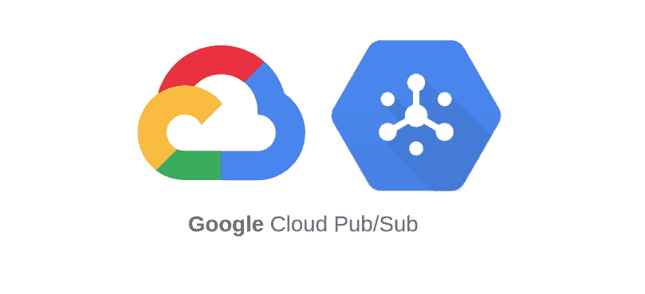

# 6 分钟后谷歌发布

> 原文：<https://medium.com/nerd-for-tech/google-pubsub-in-5-minutes-45f9cad08e78?source=collection_archive---------2----------------------->

这里有一个快速学习 Google Pubsub 并部署和配置您的微服务以在其上运行的指南。

## 什么是 PubSub？

PubSub 是 Publish-Subscribe 的缩写，是一种在微服务之间创建异步通信的方法。

使用 Pubsub，我们有一个发布者应用程序和一个订阅者应用程序。发布者应用程序创建一条消息，并将其发送到 Cloud PubSub。然后，PubSub 存储该消息，直到它到达所有订户。

服务之间的通信可以是一对多(扇出)、多对一(扇入)或多对多。它非常适合物联网系统、系统监控、数据库备份和日志管理以及编程。

**为什么是 PubSub？**

PubSub 提供的优势包括:

*   分离的通信和应用逻辑；从而为模块化和安全的项目提供更高质量的代码。
*   即时向所有用户发送消息，无论用户身在何处。没有轮询，没有检查消息！
*   因为它不依赖于任何编程语言，所以可以很容易地集成到任何地方，使开发过程更简单。
*   您可以添加任意数量的发布者或订阅者。它是高度可扩展的。
*   因为通信和逻辑是两个独立的层，所以更容易排除故障。

## 入门指南

要开始集成 PubSub，首先，您必须确保登录或创建一个 Google Cloud 帐户。然后，只需导航到[这个链接](https://console.cloud.google.com/)。现在，让我们完成以下步骤，完成我们的第一次整合:

*   在页面的导航栏上，选择一个已经存在的项目进行集成，或者创建一个新项目。为了这个教程，我将通过点击项目名称/ **新建项目**来创建一个新的。然后给我的项目起个名字，点击**创建**。然后，在导航栏中选择新创建的项目。
*   点击 M **菜单**图标，然后**查看所有产品**。点击**发布订阅**。您可以通过单击它左侧的大头针图标将其固定到您的菜单上。
*   点击**创建主题**按钮。给它起个名字，然后点击**创建**。然后向下滚动到**创建订阅**按钮并点击它。为订阅命名。保持一切默认，点击**创建**。要创建一对多系统，只需按照相同的步骤创建另一个订阅。
*   现在，为了控制和限制访问，我们必须为我们的服务设置一个服务帐户，并授予 IAM 权限。只需点击主菜单左侧的 **IAM & Admin** ，然后点击**服务账户**。然后，点击**创建服务账户**按钮。给它起个名字，然后点击**创建**。选择**发布/订阅发布者**和**发布/订阅订阅者**获取权限，点击继续，点击创建。
*   点击新创建的服务右侧的三个垂直点，然后点击**管理密钥**。然后导航到**添加密钥**，**创建**新密钥并选择 **JSON** 。下载该文件并将其命名为 key.json，将其移动到 project-name/下的项目文件夹中。
*   现在，在搜索栏中键入**云构建 API** 和**云运行 API** ，并启用两者。(如果您尚未启用计费，系统可能会要求您启用，所以请启用。它不会对你的试用期收费。别担心！)

尽管 PubSub 可以用于任何项目，不管是什么语言，但是我将向您展示一个关于 NodeJs 的示例。无论您的项目是什么，您都可以调整以下步骤。让我们首先启动 publisher 服务:

*   确保你已经先拿到了**谷歌云 SDK** 。你可以通过点击[这里](https://cloud.google.com/sdk)来安装它，为了确保你已经在你的系统上安装了它，只需打开终端并运行命令“gcloud”。
*   根据项目使用的框架/语言安装 PubSub 客户端库。对于 NodeJs，试试这个[库](https://www.npmjs.com/package/@google-cloud/pubsub)。
*   然后，我们需要将我们的项目归档。对于 NodeJs 和相关框架，你可以通过点击[这里](/@gamzeyilan1/how-to-dockerize-a-nestjs-project-e80774d2459b)了解如何 dockerize 你的应用。
*   回到云平台搜索**计费项目**，然后找到刚才创建的那个，复制 Id。然后打开终端，导航到您的项目文件夹。对于每个微服务，只需进入微服务目录并运行命令(将项目 id 更改为您复制的内容):

> gcloud 构建提交—标记 gcr.io/PROJECT-ID/publisher-microservice-name

*   该命令完成其工作后，返回 Google Cloud，在搜索栏中键入**container Registry**，以确保 docker 容器被成功推送。
*   点击容器右边的三个垂直点图标，然后选择 **Deploy to Cloud Run** 。那里的一切都会自动填充，所以除非你想做一些自定义配置，简单地点击**下一个**。你唯一需要注意的是，你必须让非 GCP 用户通过点击**允许未认证调用**来访问 API，因为我们想要设置认证 inside out 应用程序，而不是通过 GCP。然后，您可以点击**创建**。现在，您的容器已经部署好了，在自动打开的页面上，您将获得要访问的 URL。您可以通过 postman 向该 url 发送一个请求来确保它正常工作。
*   如果您对项目做了任何更改，请在 Google Cloud 上访问 **Cloud Run** ，然后点击**Edit&Deploy New Revision**。然后，不需要做任何更改，只需点击**部署**。

现在我们可以前进到订户服务。只需按照以下步骤创建另一个应用程序来使用来自发布者的数据:

*   复制文件。dockerignore、Dockerfile 和。gcloudignore 将您的服务提升到项目级别。订阅者不需要 key.json。
*   通过终端导航到订户项目目录，并调整命令:

> gcloud 构建提交—标记 gcr.io/PROJECT-ID/subscriber-microservice-name

*   该命令完成其工作后，返回 Google Cloud，在搜索栏中键入**container Registry**以确保 docker 容器被成功推送。
*   点击容器右边的三个垂直点图标，然后选择**部署到云运行**。那里的所有内容都会自动填充，所以除非您想进行一些自定义配置，否则只需点击**下一步**。与之前不同的是，在这一点上你必须检查**要求认证**与用户服务的安全性。然后，您可以点击**创建**。现在，您的容器已经部署好了，在自动打开的页面上，您将获得要访问的 URL。您可以通过 Postman 向该 url 发送一个请求来确保它正常工作。
*   如果您对项目做了任何更改，请在 Google Cloud 上访问 **Cloud Run** ，并点击**Edit&Deploy New Revision**。然后，无需做任何更改，只需点击**部署**。
*   现在我们需要创建另一个服务帐户来调用云运行。为此，如前所述，点击主菜单左侧的 **IAM & Admin** ，然后点击**服务账户**。然后，点击**创建服务账户**按钮。给它起个名字，然后点击**创建**。
*   通过终端登录到您的云帐户，选择您的项目并运行以下命令为您的订户授予权限:

> GOOGLE _ CLOUD _ PROJECT =项目 id
> 
> 项目编号=项目编号
> 
> g CLOUD run add-iam-policy-binding micro service name-member = service account name:pubsub-run-invoker @ $ GOOGLE _ CLOUD _ project . iam . gserviceaccount . com-role = roles/run . invoker-region us-central-platform m

**注意:**在最后一个命令中，确保将 microServiceName 和 serviceAccountName 更改为您自己的名称。

*   再次进入**云运行**，找到你的订阅服务账户，点击**添加触发器**按钮。为其命名，并选择云发布/订阅主题作为**事件**。选择您的 publisher 主题作为其正下方的**主题**。选择**发布/订阅云运行调用者**作为服务账户。点击**保存**。

仅此而已！你现在可以通过 Postman 测试它是否工作，并开始使用微服务。重复上述步骤，您可以添加任意数量的发布者和订阅者。