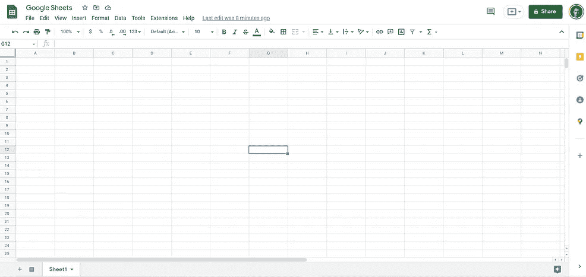
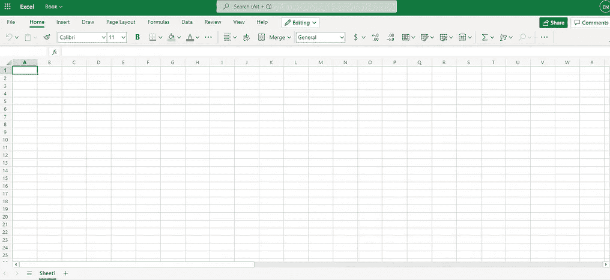
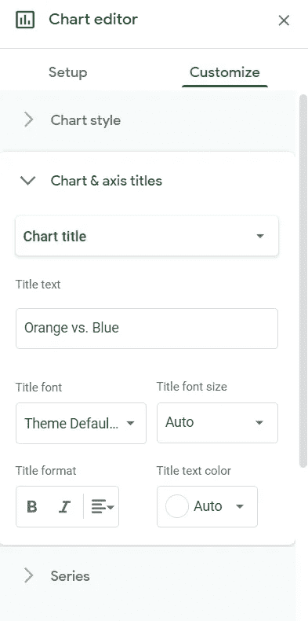
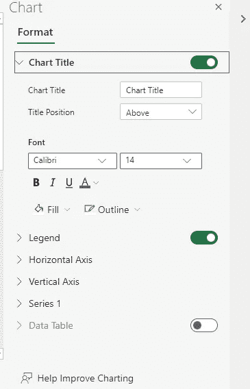

# 谷歌工作表与 Excel

> 原文：<https://medium.com/nerd-for-tech/google-sheets-vs-excel-a78353566f85?source=collection_archive---------4----------------------->

在我的职业生涯中广泛使用这两个工具之后，我将给出我对这两个工具的真实评价以及不同特性的输入。

[斯科特·格雷厄姆](https://unsplash.com/@homajob?utm_source=unsplash&utm_medium=referral&utm_content=creditCopyText)在 [Unsplash](https://unsplash.com/s/photos/spreadsheet?utm_source=unsplash&utm_medium=referral&utm_content=creditCopyText) 上拍照

(你也可以在 [**我的网站**](https://www.eliasnordlinder.com/blog/google-sheet-vs-excel) 上找到这篇文章以及其他文章和更多有趣的东西)

# 介绍

Google Sheets 和 Excel 是当今市场上最流行的两种电子表格软件，由微软和谷歌制造。

他们在一方面非常相似，但在另一方面又非常不同。

在这篇博文中，我将逐一介绍这些软件，然后根据不同工具的不同优点给出我的最终结论。

# 不同工具的具体优点是什么？

# Excel 的优点

*   **处理权力—权力中枢和权力查询**

区分这两个工具的一个重要因素是 Power Pivot 和 Power Query，我认为这是 Excel 的重要部分。

如果您以前使用过 Power BI，您可能非常了解 Power Query。

这是一种处理非常大的数据集的好方法。

超级查询是在 Excel 中执行自动 ETL(浏览、转换、加载)过程的一种方式。

您可以对数据集执行操作，例如清理数据和连接不同的源，然后将操作自动保存为宏，以备新数据进入时使用。

*   **可用信息**

Excel 已经存在了很长时间，因此从遇到不同问题的人那里获得的信息当然是广泛的。

学习 Excel 有很多确实不错的在线课程和 youtube 渠道，比如[**MyOnlineTraningHub**](https://www.youtube.com/c/MyOnlineTrainingHub)**，**[**Microsoft Excel—Excel 从初级到高级**](https://www.udemy.com/course/microsoft-excel-2013-from-beginner-to-advanced-and-beyond/) 和**[**Excel 从初级到专业:财务建模与估值。**](https://www.udemy.com/course/beginner-to-pro-in-excel-financial-modeling-and-valuation/)**

**如果你想在 Excel 中得到更高级的东西，或者想得到特定问题的答案，有很多信息可以帮助你。**

*   ****可用功能****

**由于 Excel 已经存在了这么长时间，并且在电子表格软件中处于市场领先地位，因此自然会有更多可用的功能。**

*   ****离线访问****

**Microsoft Excel 来自本地环境，因此如果您想脱机工作，它非常强大。**

**在 Google Sheets 中也有离线工作的可能性，但 Excel 的概览体验更好，因为他们有在线和本地版本。**

# **谷歌工作表的优点**

*   ****用户界面****

**作为从事商业智能工作的人，我非常重视我所使用的工具的用户界面。**

**我认为谷歌是市场上制作看起来很容易的产品的最好的公司之一，他们在制作产品时真的考虑过如何利用颜色和其他设计选择。**

********

**比较上面的两张图片，对我来说，Google Sheets，上面的那张，顺眼多了。**

**它跳过了微软 Excel 中所有额外的颜色，顶部的绿色和灰色，以及更加清晰的网格线。**

*   ****用户体验(UX)****

**除了用户界面，从我的角度来看，Google Sheets 也比 Microsoft Excel 有更好的用户体验。**

**回到上面的两张图片，作为最终用户，Google Sheets 使用起来更加直观。**

**我使用 Excel 大约有 15 年了，使用 Google Sheets 也有 1 年了，但是我更喜欢 Google Sheets，因为他们在用户体验方面做得非常好。**

**一些例子:**

****创建新的电子表格****

*   ****Google Sheets:** 在浏览器中编写 sheets.new(如果登录 Gmail) - > 1 次点击+几乎瞬间**
*   ****Excel Online:** 转到[office.com](https://www.office.com/launch/excel?auth=1)选择新工作表- > 2 点击+等待时间**

****使用图表****

********

**Google Sheets 使用了与商业智能工具(Data Studio)和 Google Analytics 非常相似的设计。**

**对我来说，UI 和 UX 之间的比较甚至不是一场比赛，这是一场轻而易举的比赛，微软决定甚至不出现在游戏中。**

*   ****协作****

**在 Google Sheets 中进行协作非常容易。**

**很自然，它与 Google Drive 和 Gmail 高度集成，感觉整个工具都是用于协作的。Excel Online 与 One Drive 和 Outlook 集成在一起，并在其在线版本中取得了很大进展，以尽可能地反映 Google Sheets 协作。**

**但是 Excel 源于 on prem，今天仍然可以在网上和 On Prem 版本中广泛地看到它。**

*   ****(不再有)—可以在线工作和定价****

****如果这篇文章是在 2013 年**之前写的，在线工作的可能性和定价将是谷歌表单的主要卖点。**

**随着 Excel Online 上市，这些可能性在 Excel 中与在 Google Sheets 中非常相似。**

# **裁决**

**哪个工具胜出，将是未来唯一的宝座争夺者？？**

****

**[廷杰律师事务所](https://unsplash.com/@tingeyinjurylawfirm?utm_source=unsplash&utm_medium=referral&utm_content=creditCopyText)在 [Unsplash](https://unsplash.com/s/photos/judge?utm_source=unsplash&utm_medium=referral&utm_content=creditCopyText) 上拍摄的照片**

# **视情况而定…但谷歌床单对我来说**

**这两种工具都有优点和缺点，这取决于个人偏好和你在组织内部工作的业务领域。**

*   ****作为一名数据分析师/前商业智能顾问，我更喜欢 Google Sheets****

**作为一名数据分析师和前商业智能顾问，我必须说我更喜欢 Google Sheets。**

**谷歌表单的优点:**

*   ****直观易用(UI)****
*   ****谷歌(UX)和**做出的设计选择**
*   ****协作****

**使工作变得更容易，更快地获得洞察力，这是一些最重要的偏好。**

**你可能会感到惊讶，因为 Excel 比 Google Sheets 更有可能进行预处理，可以处理更多的数据，这在我的职业中应该是有价值的？**

**这不一定是真的，因为有许多其他工具也可以在数据进入工具之前进行这种预处理。**

**如果你懂一些 SQL，你可以做很多你已经可以在 Power Query 中做的事情**

**Google Sheets 中的公式仍然足以完成我日常工作中需要的所有事情。**

# **为什么 Excel 的其他优点不足以让我更喜欢 Excel 而不是 Google Sheets**

**我为 Excel 列出的其他优点:**

*   ****可用信息****
*   ****可用功能****
*   ****离线可用****

**对我来说没有 Google Sheet 的好处重要。**

**对我来说，有更多可用的功能对我来说一点也不专业。**

**Google Sheet 带来的用户体验部分是因为他们的可用功能更少，这使得找到重要的东西更容易。**

**能够离线工作有时可能是好的，但由于目前“一切都在向云移动”，协作是关键，我认为这没有必要。**

**正如我前面提到的，如果您想做所有的预处理，这是本地版本的 Excel 擅长的，您可以在另一个工具中完成所有这些。**

**如果您愿意，您可以脱机使用该工具。**

**在 Google Sheets 中，我真正怀念的是你能找到的关于 Excel 的所有令人惊叹的在线课程和可用信息。**

**这不会超过 Excel，但会使比较更接近。**

**但另一方面，对在线课程和 Google Sheets 信息的需求减少了，因为公式更少，使用起来更直观。**

# **结论**

**本文讨论了 Excel 和 Google 工作表的优点，以及作为数据分析师或商业智能顾问，我更喜欢哪一个。**

**对我来说，我为谷歌工作表列出的三个优点**

*   ****直观易用(UI)****
*   ****谷歌(UX)和**做出的设计选择**
*   ****协作****

**重量超过我为 Excel 列出的优点**

*   ****更强的预处理和转化****
*   ****可用信息****
*   ****可用功能****
*   ****离线可用****

**因此，我会选择谷歌工作表作为谷歌工作表和 Excel 之间的第一选择。**

# ****感谢您阅读****

**非常感谢你阅读我的博客！**

**如果你喜欢这个内容或者对 Google Sheets 和 Excel 有其他想法，请在下面留言。**

**我很想听听其他人是如何看待这些事情的。**

**如果你喜欢阅读我的故事，并愿意支持我成为一名作家，可以考虑使用[**这个链接**](https://elias-nordlinder.medium.com/subscribe)**注册成为一名媒体会员，我可以赚取一小笔佣金，不需要你额外付费。****

# ****问题或询问****

****如果您有任何问题或建议，请联系我****

******领英:**[www.linkedin.com/in/elias-nordlinder](http://www.linkedin.com/in/elias-nordlinder)
**邮箱:**Elias.Nordlinder@gmail.com
[**网页:**](https://www.eliasnordlinder.com/blog/google-sheet-vs-excel)eliasnordlinder.com****

****祝大家本周愉快
//伊利亚****