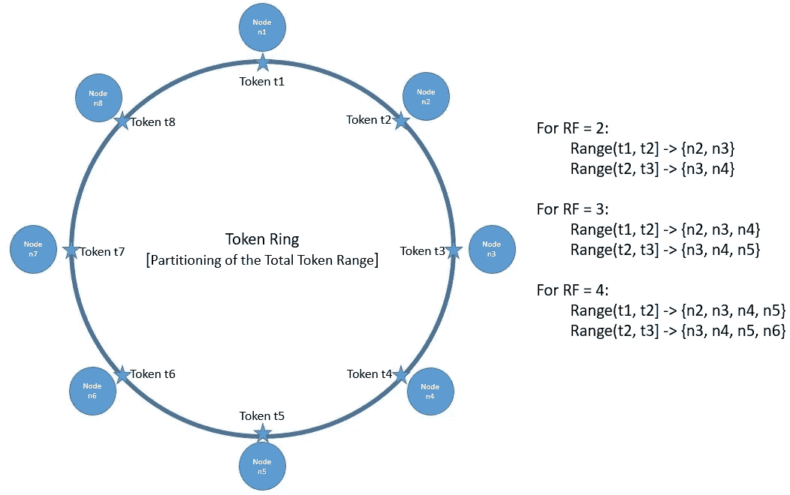

# 分布式系统中的流言协议

> 原文：<https://medium.com/nerd-for-tech/gossip-protocol-in-distributed-systems-e2b0665c7135?source=collection_archive---------1----------------------->

# 问题

在一个分布式系统场景中，人们能想到的最基本的问题有:
1。系统状态:系统节点如何知道其他系统节点的状态，无论它们是死的还是活的。
2。通信:系统节点如何与其他节点交互。

对于一个希望使用分布式系统的系统来说，上述问题并不重要，它所关心的只是最终结果。但是对于一个分布式系统，这是评估最终结果的一个核心问题，不管是数据库、搜索引擎、对象存储、负载平衡器还是其他什么。

针对上述问题，可以有两种可能的解决方案:
1 .管理系统状态的**集中式系统，例如卡夫卡中的动物园管理员。这样的问题是**单点故障**。但更好的一面是，这种设置倾向于 CAP 定理的 CP 侧，提供了更高的一致性保证。
2。用于跟踪系统状态的**点对点**解决方案。这个解决方案倾向于提供最终一致性的 CAP 定理的 AP 侧。但是解决方案是**高度可扩展和更有弹性的**。基于 Gossip 协议的算法属于这一类，并且在 **cassandra** 中被广泛使用。**

在分布式系统中，至少需要两个独立的信息源来标记一个节点。仅仅说因为你的节点联系不上另一个节点就说明另一个节点宕机了是不够的。很有可能你的节点坏了，另一个节点没事。但是，如果系统中的其他节点也发现另一个节点已经死亡，那么您可以有把握地断定该节点已经死亡。这里隐藏着许多复杂的难以调试的 bug。你怎么知道其他节点在看什么？通过八卦协议交换这种可达性数据。

# 八卦协议

Gossip 是一种点对点的通信协议，在这种协议中，节点定期交换关于它们自己以及它们所知道的其他节点的状态信息。

基于 Gossip 协议的算法是最健壮和可扩展的算法之一，用于强有力的最终一致的成员列表、故障检测，并且可以在 gossip 消息之上携带任何信息。

流言是让每个节点将它碰巧拥有的最新信息发送给一些其他节点，最终将这些信息传播到整个网络。这是节点从有限的局部交互中构建全局地图的一种方式。

流言协议最终充其量是一致的，但也不一定是一致的。如果有一个分区，子分区中的节点仍然会愉快地互相八卦。因此，一个请求击中一个分区的一边可能会得到与击中另一边完全不同的答案。

## 关于协议的高级细节

*   在集群中，每个成员都有一个已知成员及其地址和一些元数据的子集列表。
*   每个成员根据不同节点发出的数据定期更新其邻居心跳计数器列表，并将更新后的信息发送给其他邻居。
*   在接收到这样的八卦消息时，节点将消息中的列表与它自己的列表合并，并为每个成员采用最大心跳计数器。
*   只要节点的心跳计数器持续增加，就可以保证它是健康的，如果心跳没有增加超过某个阈值时间段，则认为它是死的。
*   显然，您应该将节点属性传输给其他节点。像平均负载、空闲内存等统计数据。例如，允许本地节点决定将工作发送到哪里。如果一个节点空闲，就给它发送工作(只要每个人不同时给它发送工作)。这个局部决策角度是规模化的关键。没有中央控制器。本地节点基于本地数据做出本地决策。这可以扩展到 gossip 协议所能扩展的程度。

## 了解一些八卦算法的相关链接

[Gossip 协议 wiki](https://en.wikipedia.org/wiki/Gossip_protocol) [Gossip in Cassandra](https://cwiki.apache.org/confluence/display/cassandra/ArchitectureGossip)
[Gossip 协议的局限性](https://dl.acm.org/doi/10.1145/1317379.1317382)
[协议底层细节的有趣阅读](https://managementfromscratch.wordpress.com/2016/04/01/introduction-to-gossip/#strength)
[分布式系统基础](https://www.baeldung.com/cs/distributed-systems-guide)

# 结尾注释

这篇文章试图提供对流言协议的高度理解。由于协议有多种实现方式，因此不可能解释每一种变体。深入探讨这个主题的方法是选择一个特定的算法并深入研究。已经提供了一些相关的链接，但是列表是巨大的，并且依赖于使用它们的协议实现的特定软件。

希望这有所帮助。如果你在帖子中发现任何不一致的地方，请在评论中告诉我。感谢阅读！！！