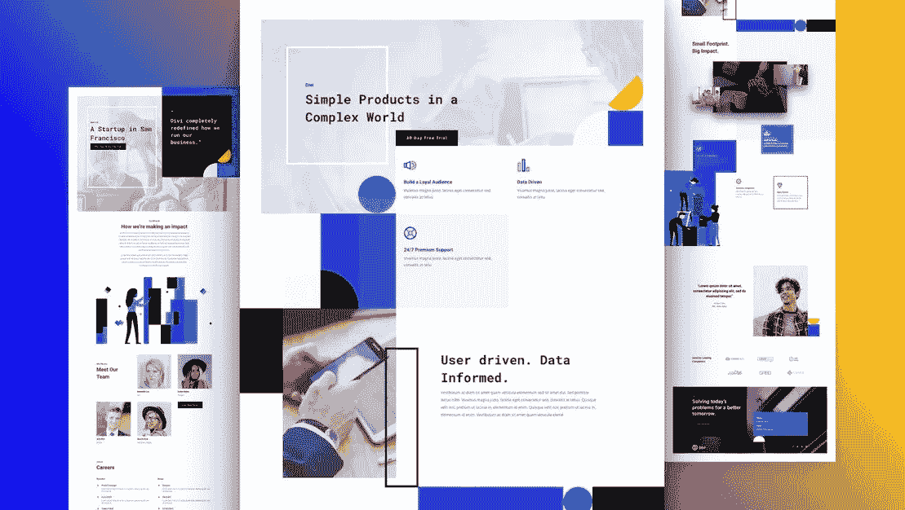
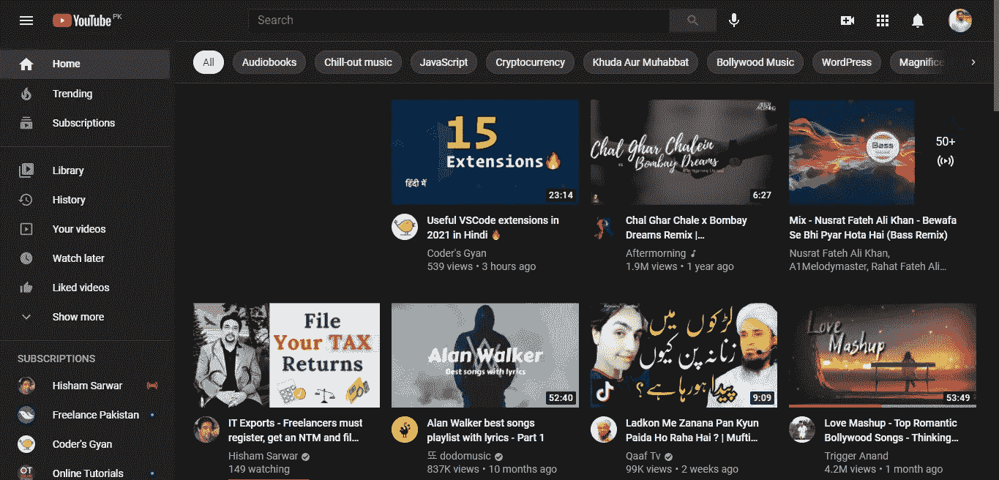
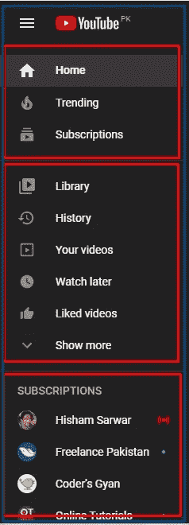

# 在开发复杂的 web 界面时陷入混乱？这里有一个简单的方法来构建没有框架的复杂界面。

> 原文：<https://medium.com/nerd-for-tech/got-messed-up-while-developing-complex-web-interfaces-84e6c2e0acab?source=collection_archive---------19----------------------->

对于开发者来说，开发网站是一项非常艰难的工作，尤其是开发具有复杂界面的网站。在这篇博客中，我将向你展示一种真正简单易行的方法来开发复杂的界面，这样你就不会再陷入混乱了。

# **首先要做的事**

要开始开发你的网站，你需要了解你将如何开发你的网站。如果你是一名 UI/UX 设计师，那么你必须在接触编码之前准备好你的设计。如果你不是，那么你必须从用户界面/UX 设计师的网页设计。如果他不可用，那么你必须分析与你将要开发的内容相关的不同网站。

# 了解界面

一旦你完成了设计部分，那么你需要理解你将要开发的界面。让我举一个世界上最著名的网站 YouTube 的例子。

YouTube 主页

# 分而治之| YouTube 界面分解

你听说过“分而治之”这个术语吗？如果没有，让我解释一下这意味着什么。假设你有一个大披萨可以吃。现在你一口都不会吃了。当然，你必须把你的比萨饼切成片。在开发高度复杂的接口时也是如此。

所以要理解 YouTube 的界面，你需要分解它的界面。是的，你必须制作 YouTube xD 的切片。

YouTube 的顶栏

# 最后一件事|用编码弄脏你的手

现在开发 YouTube 的复杂界面看起来更容易了。现在你必须开发你界面的每一个部分，并在最后将它们合并。
你可以使用这种技术开发任何类型的界面，无论是桌面网站还是移动应用程序。这会让你的生活变得更容易，你也不会再陷入困境。

# 跟我来

**领英:**[www.linkedin.com/in/saifswl86](http://www.linkedin.com/in/saifswl86)
**GitHub:**[www.github.com/saifswl86](http://www.github.com/saifswl86)
**脸书:**[www.facebook.com/saifswl86](http://www.facebook.com/saifswl86)
**推特:**www.twitter.com/saifswl86