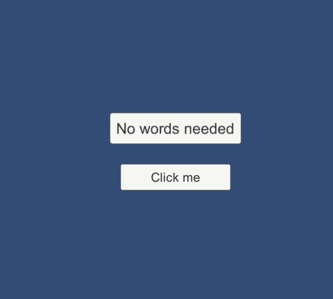
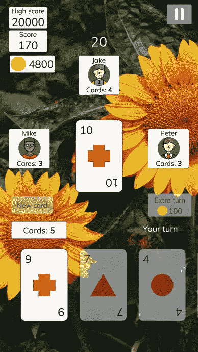

# 利用这种脉冲效果吸引玩家的注意力

> 原文：<https://medium.com/nerd-for-tech/grab-your-users-attention-with-this-pulse-effect-3ce1aae5f9df?source=collection_archive---------4----------------------->

将用户的注意力放在游戏中某个视觉元素上的一个有用的方法(可能是教程的一部分)是让对象急切地跳动，就像这样:

你想点击这些按钮中的哪一个？

你如何使用 Unity 做到这一点？

嗯，我们可以用 DOTween！

 [## 之间(热之间 v2)

### DOTween 是一个快速、高效、完全类型安全的面向对象的 Unity 动画引擎，为 C#用户优化，免费…

dotween.demigiant.com](http://dotween.demigiant.com/) 

DOTween 从根本上简化了 Unity 中的动画制作过程。我们只用一行代码就可以实现上述效果:

将`PulseEffect.cs`附加到场景中你想要的任何游戏物体上，它会立刻吸引你的用户。

你可以在我的游戏 [Whot Cards](https://play.google.com/store/apps/details?id=com.tariibaba.whotcards&utm_source=medium.com) 中看到这种效果的真实用例。一旦用户有额外的转弯，按钮立即开始跳动。

因此，有一种方法可以在 Unity 中创建脉冲效果。