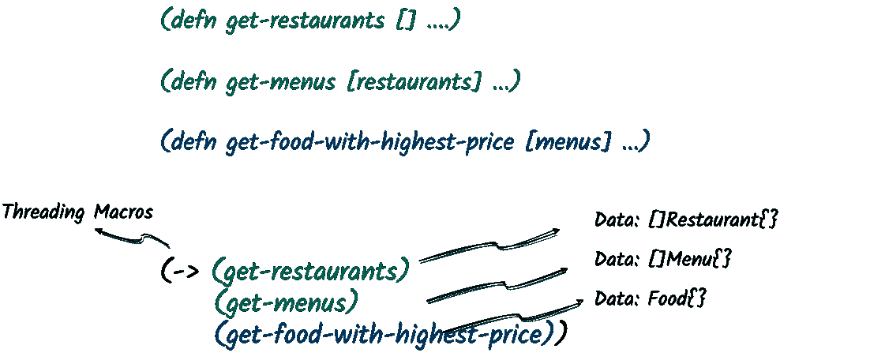
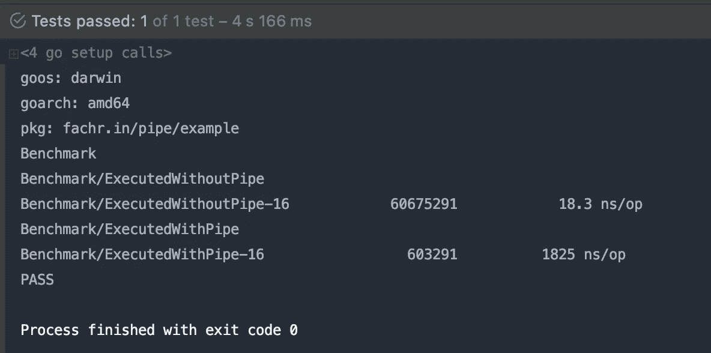

# 优雅地模仿 Clojure 在 Golang 中的线程宏

> 原文：<https://medium.com/nerd-for-tech/gracefully-mimicking-clojures-threading-macros-in-golang-656827a12421?source=collection_archive---------6----------------------->

# 介绍

智者说，如果你在生活中找不到幸福，那不仅仅是别人的错，因为你是唯一一个对此负责的人。他们说，为了获得幸福，你必须想出一种方法，自己去创造，而不是在哪里都找不到。

奇妙的事情之一是看 Clojure 如何以一种可爱的方式顺序执行一组函数，这感觉非常奇怪地令人满意，Golang 没有提供同样的东西。

实际上我喜欢这两种编程语言，但是自从我加入 Gojek 后，我用 Clojure 编写代码的次数比用 Golang 多。Clojure 中有一个特性是我最喜欢的。叫做**线程宏**。到底是什么？

## Clojure 的线程宏

简单地说，它是一种模式，可以帮助您设置一组函数，并让每个函数在执行时进行数据转换，然后将转换后的数据作为参数传递给该组中的下一个函数，以生成新信息。



图 Clojure 中的线程化宏

如图 1 所示， *Clojure 的线程宏*有一组函数，包括:

*   **(get-restaurants)** 返回餐厅列表
*   **(get-menus)** 从 *(get-restaurants)* 返回餐馆列表中返回一个菜单列表
*   **(获取价格最高食物)**从*(获取菜单)*返回的菜单列表中返回价格最高的食物

我们可以看到数据以一种新的形式从一个函数流向另一个函数，非常整洁！

顺便说一下，如果你想了解更多关于 *Clojure 的线程宏*，去 [Clojure 的文档官方页面](https://clojure.org/guides/threading_macros)上找吧。

## 在 Golang 中模仿 Clojure 的线程宏

是啊，我知道。我们都会喜欢这个功能的。谁没有呢？它为我们的代码库引入了一种语法上的甜蜜，这使得事情更容易阅读或表达。哎呀…当心糖尿病！🤗


所有人都必须承认，静态类型的编程语言在性能方面通常比动态类型的更好，但事实并非如此，因为我们有时也渴望编写代码的简单性！

我试图通过引入一个名为 [**Pipe**](https://github.com/parinpan/pipe) **，**的小库，将这种简单性从 Clojure 带到 Golang。它基本上做了和 *Clojure 的线程宏*一样的事情，复制了它的概念。

让我们变脏，给我看看代码！

开始了。我们只是在文件的顶部导入了`github.com/parinpan/pipe`库。这个库有两个核心函数来使 *Clojure 的线程宏*在 Golang 中运行的功能相同，它们是: ***pipe。Do()*** 和 ***管。*应用()**

*   **管子*管子。Do()*** 函数接受一组 ***管道。Apply()*** 函数注册所有的函数，以便顺序执行。
*   **管道。Apply()** function 接受任何带有参数的函数，否则我们可以将它们留空，因为默认情况下，传递的函数的参数将是集合中上一次执行的函数的最新返回值。

好吧，如果所有的函数只有一个参数也没关系，这样这个库就可以把之前执行的函数的最新返回值传递给它。现在，问题是:**有多个参数的函数怎么办？👀🧐**

放松点。让我再给你看一遍代码。我们有答案了！🙈

让我们看看这里有什么变化。现在一些函数接受不止一个参数。

*   **getMenusWithFilter(…)** 函数第一个参数接受餐馆位置，第二个参数接受餐馆列表，第三个参数接受餐馆成立年份
*   **getFoodByName(…)** 函数第一个参数接受菜单列表，第二个参数接受食物名称

那么，现在，**库如何知道应该在什么索引处传递带有上一次执行函数返回值的参数呢？**应该在函数自变量的*第一个索引*、*第二个索引*，还是*第 n 个索引*？

如果你注意到了，从上面的代码中有一些**管道。Pass()** 函数在**管道中传递。Apply()** 我们已经知道它接受一个函数及其参数。因此，在**管道所在的参数索引处，库将用载体返回值替换参数值。Pass()** 正在被传递。

特别的是**管。Pass()** 也可以接受一个函数，在执行之前将载体返回值更改为新的形式，如下所示。

你可以想**管。Pass()** 是一个等价于 Clojure 的匿名函数“*%”*的符号。

```
**# this is clojure!***(-> (get-restaurant)
    (#(get-menus-with-filter "Bay Area"* ***%*** *1940))
    (#(get-food-name* ***%*** *"BigMac"))
    (#(say (format "I love %s so much!"* ***%****)))*
```

很酷吧？😎

## 在后台


在经历了这些很酷的东西之后，我们必须感谢 Golang 的反射功能，这使得这一切成为可能！是的，库实际上只是它上面的一个抽象，隐藏了所有的复杂性。

让我们通过下面的代码片段先睹为快:

```
**returnValue** := reflect.ValueOf(**function**).Call([]reflect.Value{***arg1, arg2, arg3***})[0]
```

基本上，这个库使用 Golang 的`reflect.ValueOf()`函数来调用我们使用**管道组合逐个注册的所有函数。Do()** 和**管道。Apply()** 函数连同它们的参数。

在我们从`reflect.ValueOf()`执行中获得了`returnValue`之后，我们将再次使用该值作为下一个执行的函数的参数。👻

## 标杆管理

在 MacBook Pro 16 英寸 2019 上测试。处理器:2,3 GHz 八核英特尔酷睿 i9。内存:16 GB 2667 MHz DDR4。



从上图来看，结果是:

*   `ExecutedWithoutPipe`在 166ms 内计算 60.675.291 次，每次操作持续时间为 18.3ns。
*   `ExecutedWithPipe`在 166ms 内计算了 603.291 次，每次操作持续时间为 1825ns。

没有比赛。难怪。首先我们已经知道谁是赢家。不使用**管道**执行操作比使用**管道**执行性能好 100 倍。Golang 的倒影肯定贵。

又回到你身上了。我们仍然可以考虑每个操作 1825ns，因为根据上下文和情况，相当快。

## 结论

*Clojure 的线程宏*提供了一种简洁的方式来构建一系列函数的执行，这是一种语法上的糖，鼓励我们再次热爱编码。😍

在 Golang 中模仿这一特性并不困难，问题只是我们如何在 Golang 的反射特性之上构建一个抽象，这在性能方面的成本确实非常昂贵。

但只要这样能让你开心，多编码。为什么不呢？*好的，这是一个 opinion✌️*

## 进一步讨论

如果您有任何疑问，请通过 [Twitter](https://twitter.com/fachrinFAN) 或 [LinkedIn](https://www.linkedin.com/in/fachrinfan/) 联系我。哦，是的，如果你对这个图书馆感兴趣的话。你可以在 https://github.com/parinpan/pipe 的[找到它](https://github.com/parinpan/pipe)

谢谢！