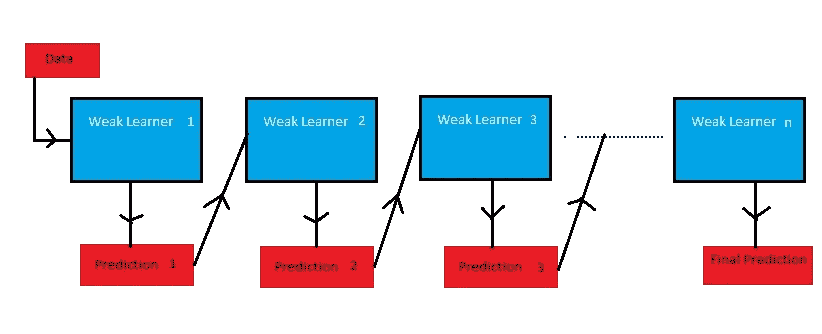
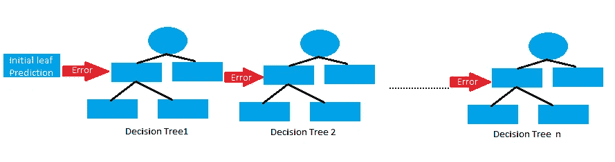
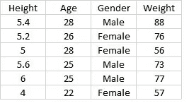
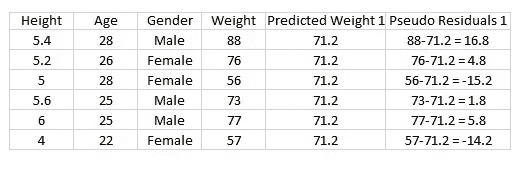
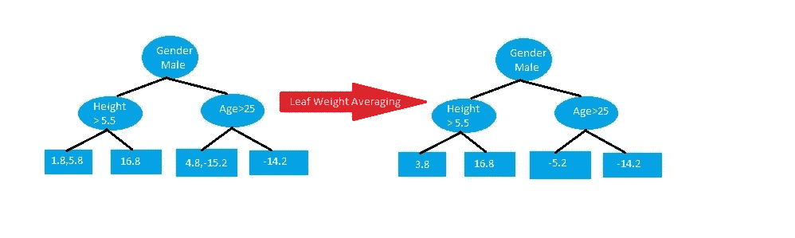
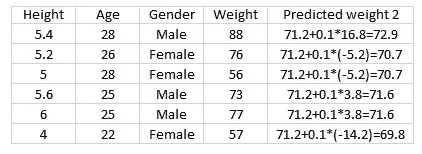
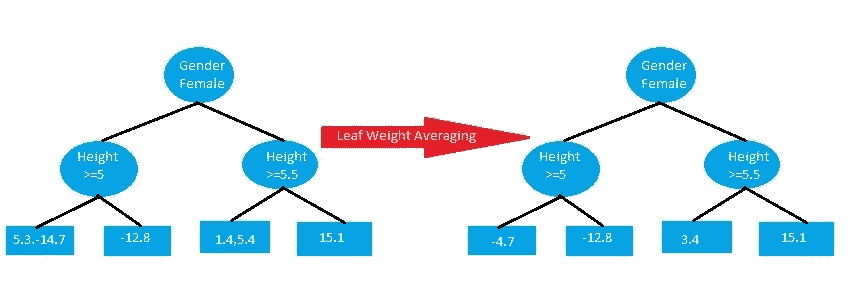
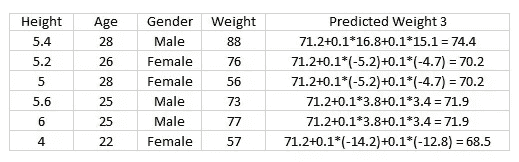
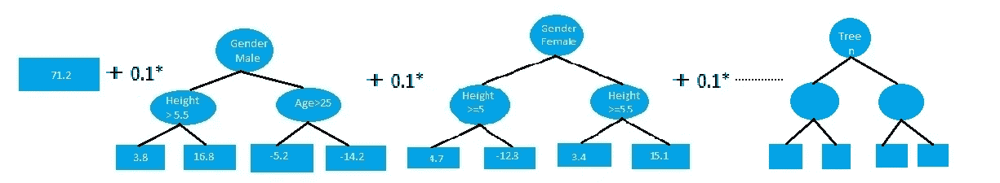

# 解释了回归的梯度增强

> 原文：<https://medium.com/nerd-for-tech/gradient-boost-for-regression-explained-6561eec192cb?source=collection_archive---------22----------------------->

梯度增强是一种机器学习算法，它基于称为“增强”的集成技术工作。与其他 boosting 模型一样，梯度 boost 将许多弱学习器顺序组合起来，形成一个强学习器。通常梯度增强使用决策树作为弱学习器。

梯度增强是为分类和回归问题建立预测模型的最强大的技术之一。在这篇博客中，我们将看到梯度推进如何与回归一起工作。

形象谈思维

**助推？**

Boosting 思想是按顺序训练弱学习者，每个人都试图纠正其前任。这意味着，算法总是会学习一些不完全准确的东西，但是朝着正确的方向迈出了一小步。随着算法通过顺序纠正先前的错误而向前推进，它提高了预测能力。

作者图片

**梯度推进**

为了理解梯度增强，下面是所涉及的步骤。在梯度推进中，弱学习器是决策树。

**第一步**:构建单根节点的基树。这是所有样本的初始猜测。

第二步:根据前一棵树的错误建立一棵树。

**Step3** :按学习率(0 到 1 之间的值)缩放树。这个学习率决定了树在预测中的作用

**步骤 4** :将新的树与之前所有的树结合起来预测结果，重复步骤 2，直到达到最大数量的树，或者直到新的树不能提高拟合度。

最终的预测模型是所有树的组合。

作者图片

**回归示例**

为了理解梯度增强的工作原理，让我们看一个简单的例子。

假设我们有下面的样本数据表，其中身高、年龄和性别作为输入变量，体重作为输出变量。

作者图片

为了预测权重，第一步是创建一个带有根节点的树。对于最初的猜测，我们可以使用平均值、均方误差、平均绝对误差等。,

如果我们假设所有样本的平均权重作为我们的初始猜测，那么 71.2 (88+76+56+73+77+57/6=71.2)将是我们的初始根节点。

作者图片

第二步是根据前一个树的错误建立一个树。前一棵树产生的误差是实际重量和预测重量之间的差异。这种差异称为伪残差。

作者图片

现在，我们使用身高、年龄和性别来预测残差(误差)，构建一个最大叶节点为 4 的树。如果多于 1 个权重落在同一叶上，则我们取权重的平均值作为叶节点。

作者图片

第三步是用学习率来衡量树。假设学习率为 0.1。

第四步是合并这些树来进行新的预测。因此，我们从初始预测 71.2 开始，沿着新树运行样本数据，并对它们求和。

作者图片

如果我们观察新的预测权重，我们可以看到与初始假设的平均权重相比，结果有一点改进。为了进一步改善结果，我们重复步骤 2 和 3，并根据新的伪残差构建另一棵树来预测权重。

作者图片

再次用新的伪残差构建新的树。

作者图片

现在我们把新的树和所有以前的树结合起来预测新的权重。因此，我们从初始预测开始，将其与第一棵树的缩放结果相加，然后与新树的缩放结果相加。

作者图片

根据新的预测权重，我们可以观察到结果有进一步的改进。我们再次计算伪权重，并以类似的方式构建新的树。这些步骤重复几次，直到新的树不会减少伪残值，或者直到建立了最大数量的树。

所以最终的预测模型会是

作者图片

现在，如果我们得到新的数据进行测试，我们通过上面的模型来计算这个人的体重。

**结论**

梯度增强是一种强大的增强技术。它通过依次组合弱树形成强树来提高模型的准确性。这样，它实现了低偏差和低方差。

*原载于 2021 年 3 月 9 日*[*【https://www.numpyninja.com】*](https://www.numpyninja.com/post/gradient-boost-for-regression-explained)*。*