# 机器学习的概念|使用梯度下降法寻找系数的最佳值的优化😉

> 原文：<https://medium.com/nerd-for-tech/gradient-descend-method-d6e2a9d906be?source=collection_archive---------11----------------------->

## 在这篇文章中，你将学习最大值，最小值的概念，凹凸函数，使用爬山法寻找最大值最小值，梯度下降算法。

机器学习的概念|使用梯度下降法寻找系数的最佳值的优化😉

# 梯度下降法

梯度下降是机器/深度学习算法中使用的优化算法，使用迭代来最小化目标凸函数 f(x)。它寻找目标函数的全局最小值。

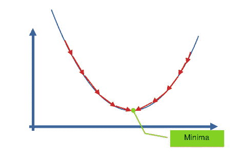

用梯度下降法寻找最优解

在开始之前，你必须知道下面的数学概念。

## 凹凸函数

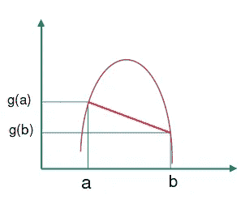

**凹面功能**

在凹函数中，连接曲线任意两点的直线总是位于曲线下方。

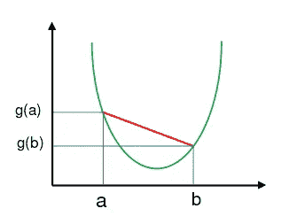

**凸函数**

在凸函数中，连接曲线任意两点的直线总是位于曲线的上方。

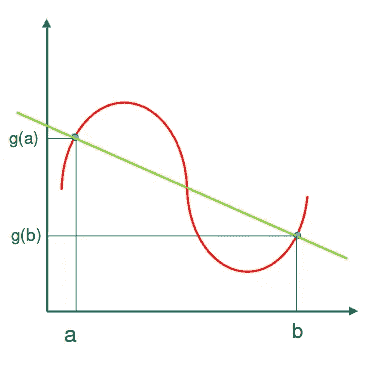

**不凹不凸**

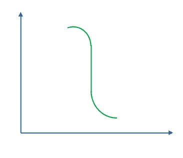

**既不凹也不凸**

有一些曲线，其中连接曲线上任意两点的直线可能位于上方，可能位于下方，可能位于两者都有，也可能没有。

## 最大值和最小值

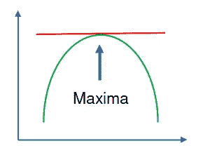

**千里马**

如果最大值存在于 a 点，那么对于 a>a+e 和 a>a-e，其中 e 极小。

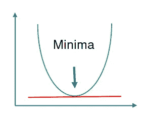

**最小值**

如果最小值存在于 a 点，那么对于 a 点

## Finding Max/Min by hill climbing :

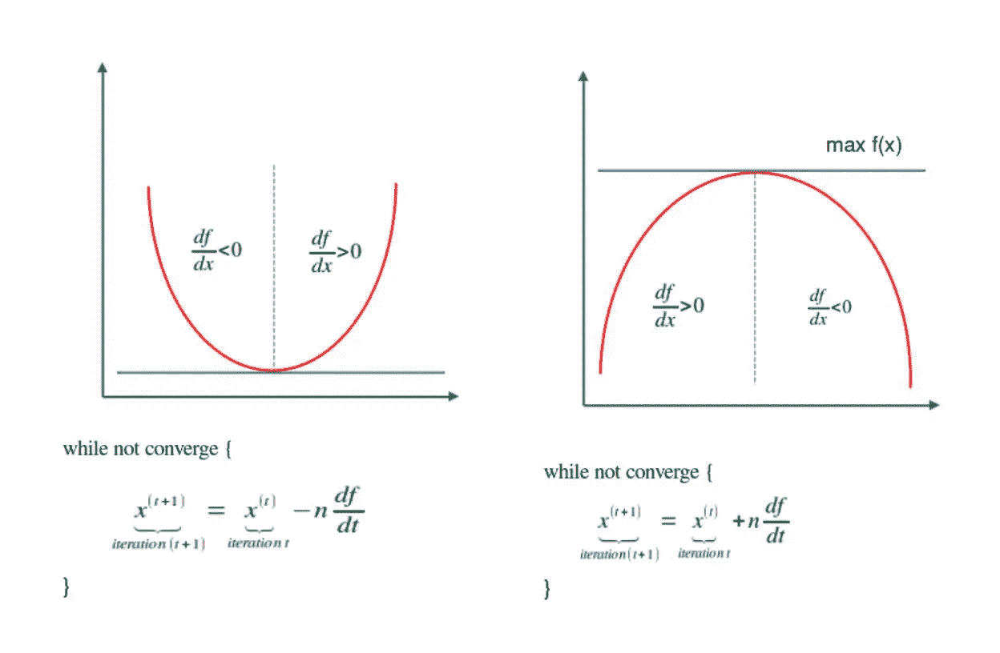

**通过爬山**找到最大值/最小值

## n 的选择:

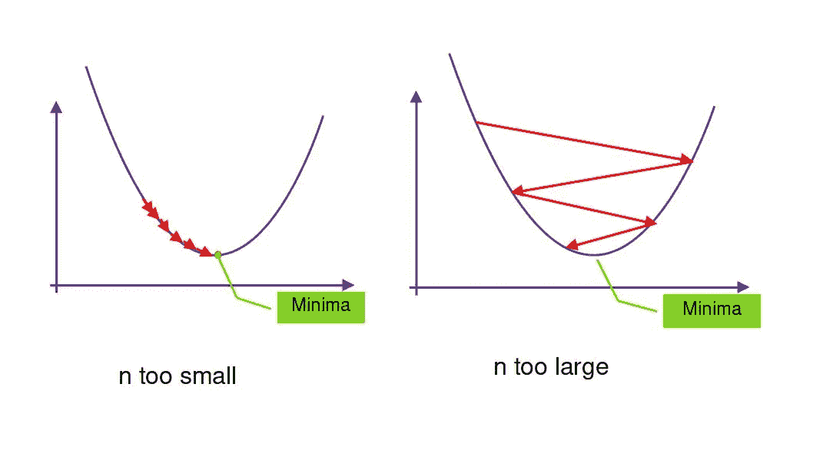

如果 n 太小，下降速度会变慢。如果 n 太大，克服最大值或最小值。

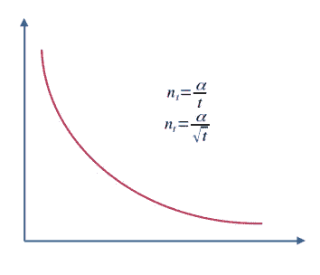

**n 的常用选择**

这是正确的选择。

## 收敛标准:

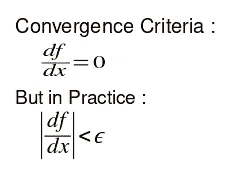

**收敛标准**

其中 E(ε)是要设置的阈值。

可视化梯度下降

## 机器学习中的梯度下降；

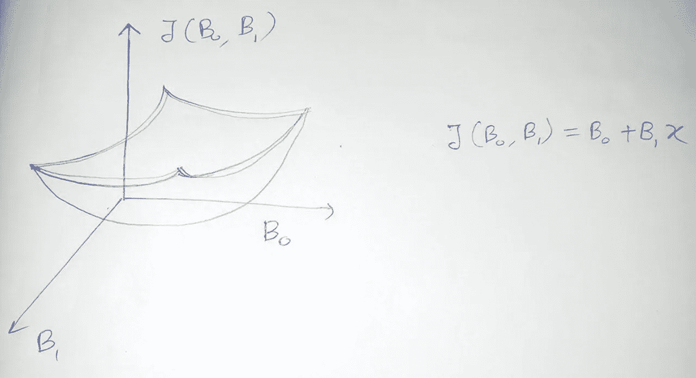

B0、B1 与 J 的关系

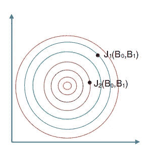

上图的俯视图

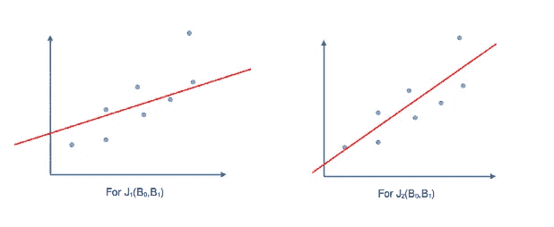

对于两个不同的点 J1 和 J2 画出不同的图。

## 梯度下降算法

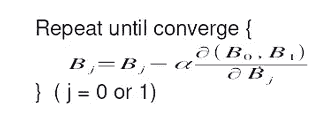

梯度下降算法

## 哪个是正确的？

## 方法 1:

**方法二:**

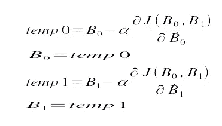

方法 2 不对。因为当我们找到 B1 时，B0 的值已经改变了，所以 J(B0，B1)已经改变了。所以方法 1 是正确的。

## RSS 的梯度

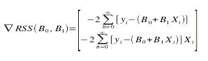

**方法 1 :**

RSS 的梯度= 0

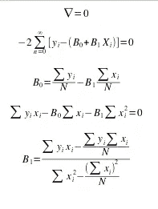

RSS 的梯度= 0

**方法二:**

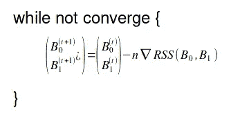

用这种方法我们计算梯度下降。

对于大多数机器学习问题，不可能计算出梯度=0。对于那些我们必须使用第二种方法。

## **重要的**

***特征比例:*** 确保特征比例相似。如果我们不缩放数据，水平曲线(等高线)会更窄更高，这意味着需要更长的时间来收敛

标准化与非标准化曲线上的梯度下降

***表示归一化:*** 为了归一化数据，我们必须用(xᵢ — uᵢ)代替 xᵢ，并将其除以特征范围(最大值—最小值)，其中 uᵢ是平均值。xᵢ在训练集中的价值。

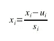

均值归一化

***确保梯度下降有效:*** J(B)在每次迭代后减少。

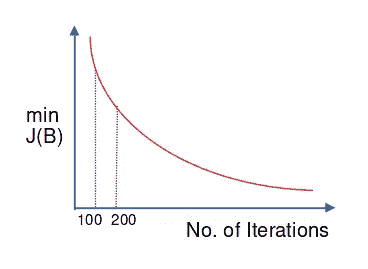

***确保梯度下降正在工作***

## 全文系列:

 [## 机器学习的概念文章系列| Ujjwal Kar

### 回归入门|使用梯度下降的简单线性回归优化…

ujjwalkar.netlify.app](https://ujjwalkar.netlify.app/post/concept-of-machine-learning-tutorial-series/)