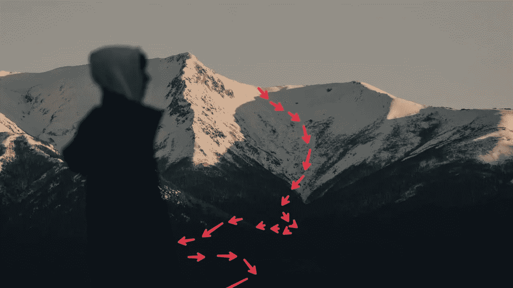
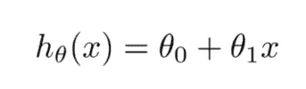
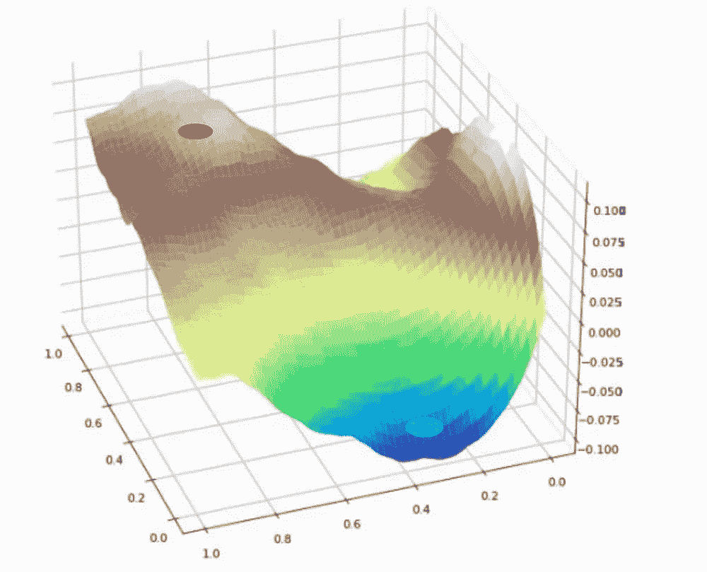
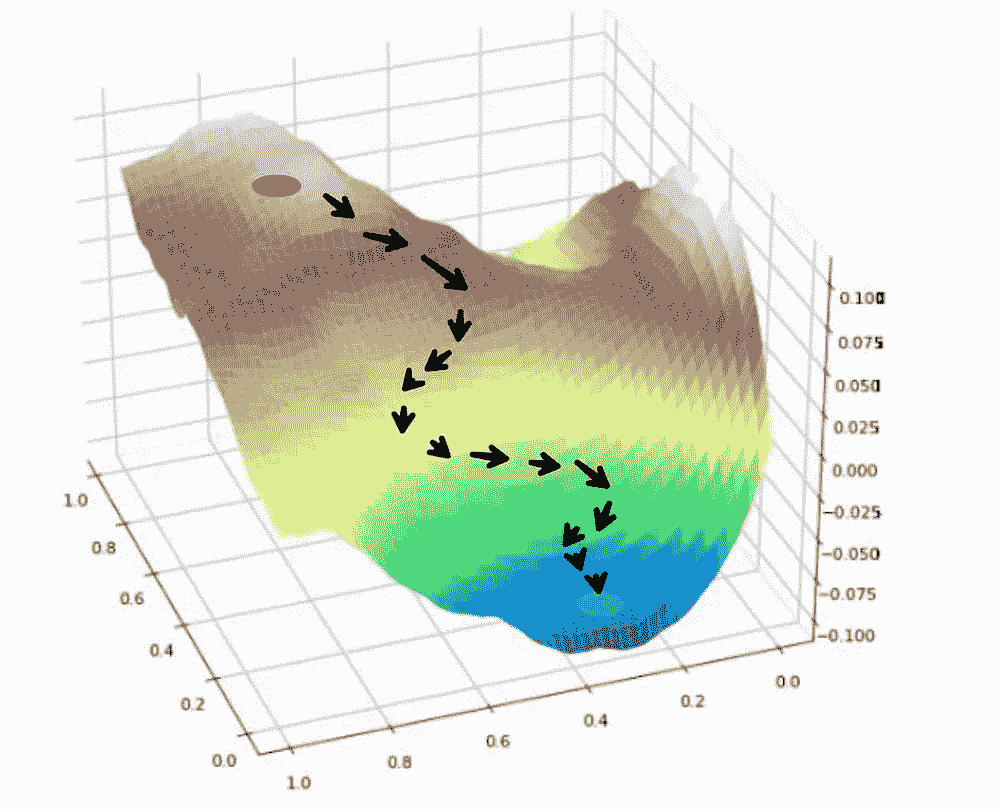
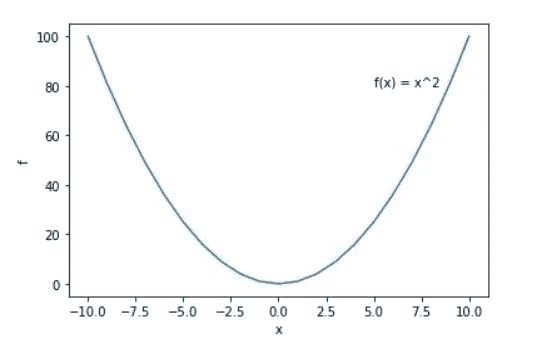
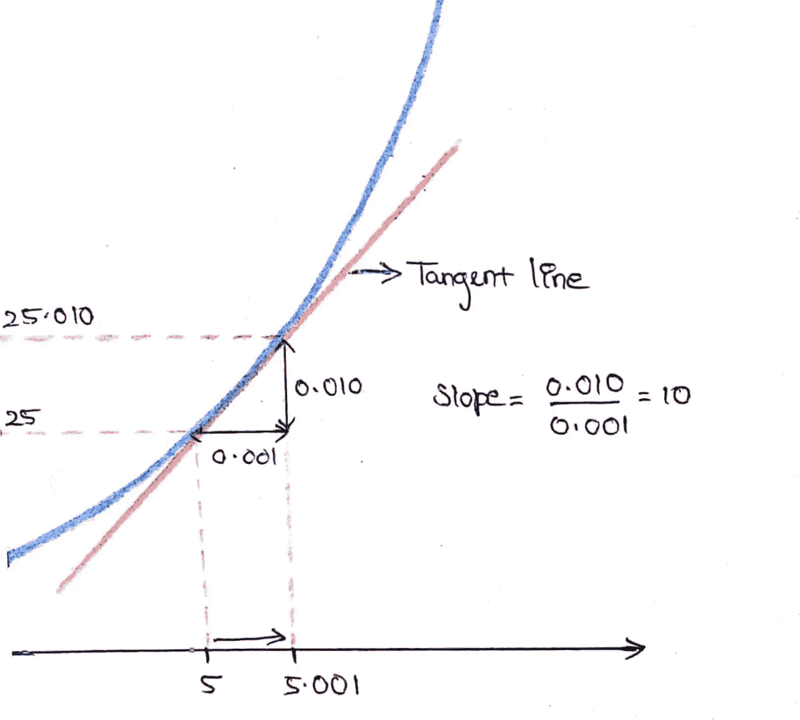
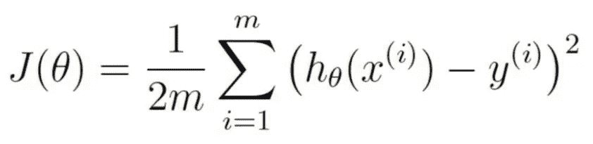
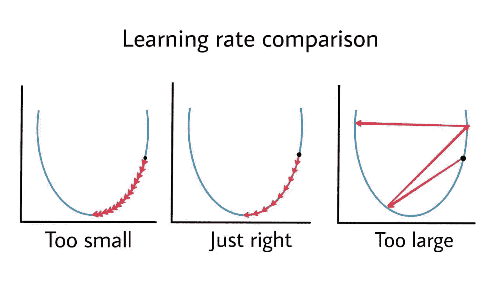
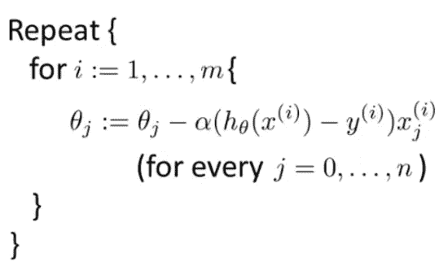

# 梯度下降——到达山脚的路线图

> 原文：<https://medium.com/nerd-for-tech/gradient-descent-a-roadmap-to-the-bottom-of-the-hill-b054de1175ce?source=collection_archive---------9----------------------->

gaspar manuel zaldo 在 [Unsplash](https://unsplash.com/s/photos/free-to-edit-mountain-images?utm_source=unsplash&utm_medium=referral&utm_content=creditCopyText) 上拍摄的照片

# 介绍

梯度下降是一种迭代优化算法，用于寻找微分函数的局部/全局最小值。由于该函数的主要目标是找到最小值，因此它被广泛用于机器学习中，以找到使成本值最小化的完美参数。

在这篇文章中，我们将看到这个算法是如何工作的，这个算法背后的数学，以及梯度下降的类型。

# 在机器学习中具体是怎么用的？

假设我们有一个任务。目标是创建一个算法，可以预测给定的动物图像是否是猫——对于每个输入图像，算法应该给出输出 0(如果不是猫)或 1(如果是猫)。首先，我们将使用一些猫和其他动物的图片来训练算法，以便算法可以创建自己的逻辑来预测新的图像。现在使用这个算法，我们将预测几个新的图像，然后最终计算平均成本，这表明我们的预测有多错误。

算法执行的很差怎么办？我们如何让它表现得更好？

该算法取决于两个因素:我们用来训练该算法的输入值，以及该算法的参数。所以，如果算法表现不好，是因为这两个因素。因此，我们可以改变输入或参数，直到我们得到一个低成本。

无论哪种情况，我们都需要最小化成本函数。这就是梯度下降派上用场的地方。**我们将使用梯度下降法找到成本最小的参数**。让我们看看如何。

***θ0*** 和 ***θ1*** *是参数，* ***x*** *是输入*

如果你想进一步了解代价函数，训练一个算法等等。查看我的另一篇文章，这篇文章简单介绍了机器学习。

 [## 机器学习-简单介绍

### 关于机器学习的一点想法

hrithickgokul.medium.com](https://hrithickgokul.medium.com/machine-learning-a-simple-introduction-5b79a3de802f) 

# 走下山坡

想象一下，你站在一个山谷的顶部，你需要到达底部，那里有一条河。由于通往底部的道路非常陡峭，你会在坡度较陡的地方走得快一些，在坡度不太陡的地方走得慢一些。所以你通过看你现在的位置来决定下一步有多大，对吗？梯度下降也是这样工作的。它将通过“走下山”达到最小值，并决定采取一大步或一小步，取决于**斜率**。

《走下山坡》

# 函数的斜率

> 斜率的计算方法是找出一条直线上(任何)两个不同点之间的“垂直变化”与“水平变化”之比。

我们知道，实变量函数的**导数**测量的是 A 值相对于 B 值的变化量。这里，如果 A 是“垂直变化”, B 是“水平变化”,那么导数将给出斜率。

如果你不知道，让我解释一下。其他人可以跳到[这部分](#94ce)。

考虑一个函数 ***f(x) = x .*** 该函数的图形如下所示。

让我们放大来看看切线是什么样的。

这只是一个粗略的图表，因为 d(f) = 0.010 的高度将比宽度 *d(x) =* 0.001 长十倍

这张图显示了导数如何给出切线的斜率。

当 ***x = 5 时，f(x) = 25。***

在图像中我们可以看到，如果我们将*从 5 移动到 5.001，那么 ***f(x)*** 从 25 移动到***f(***5.001***)***=(5.001)= 25.010—值 A ( ***f(x) 【T34 因此斜率为 10。****

*同理，我们取一个点 ***x = 2，*** 那么 ***f(x) = 4。****

*现在如果我们把*x 从 4 移动到 4.001，那么 ***f(x)*** 就变成了***f(2.001)***=(2.002)= 4.004—***【f(x)***移动了 4 倍大于*x，因此值 A 相对于因此斜率为 4。***

***在这两种情况下，斜率值都是两倍的 ***x*** 值(当 ***x*** = 5，斜率= 10；当 ***x*** = 2，斜率= 4)。因此我们可以假设函数 ***f(x) = x，*** 的导数为 ***d(f)/d(x) = 2(x)。******

**由于***【f(x)】***不是一条直线，切线的斜率在函数的每一点都会不同。**

# **梯度下降**

**我们已经看到梯度下降如何用于机器学习，它如何找到函数的最小值，以及什么是斜率。现在让我们把这些放在一起，看看梯度下降背后的数学——公式。**

****

**成本函数**

**对于每个参数 ***θ0，θ1*** 我们将找到它相对于代价函数 ***J(θ0，θ1)的导数***【d(θJ)***(斜率)。*****

*现在，对于每个参数 ***θj*** ，如果斜率 ***d(θj)*** 不接近 0，那么我们将通过用它的斜率 ***d(θj)减去它来更新参数 ***θj*** 。*** 这个意思是，如果你站的地方很陡，那么你还没有到达底部。所以，你要向底部前进一步，重复这个动作，直到斜率变成 0。*

**

*每 m 个训练实例更新 ***θj****

*****(hθ(x^(i))-y^(i))xj^(i)***是 ***d(θj)的导数。*****

**如果我们重复这个过程几次，关于参数的成本将最终达到最小值，斜率将变为 0，您将到达河流。**

****

**Anthony DELANOIX 在 [Unsplash](https://unsplash.com?utm_source=medium&utm_medium=referral) 上拍摄的照片**

# **学习率**

****α** 称为学习率。我们通常将学习率设置为一个小值，否则成本将会迈很大的一步，并最终向顶部发散。**

****

**作者图片**

**这种特殊算法的名字也叫做**批量梯度下降。**术语“批量”是指我们正在查看当时所有的培训示例。**

# **随机梯度下降**

**批量梯度下降的问题是，如果训练样本的数量很大，那么计算导数项 ***d(θj)*** 可能会非常昂贵。因为这需要对所有的 **m** 个例子求和。**

**假设我们有数百万个训练样本。因此，为了找到参数相对于成本函数的导数，我们将遍历所有百万个训练样本，累加这些总和，完成所有这些工作只是为了向最小值靠近一步。因此，可能需要很长时间才能让属性收敛。**

****随机梯度下降**很像批量梯度下降，但它不是等待对所有 **m 个**训练示例的参数求和，而是仅使用一个训练示例更新参数，并开始在改进参数和向全局最小值移动方面取得进展。**

****

**为每 m 个训练实例更新 ***θj*****

# ***结论***

***现在，您应该对以下内容有了更好的理解:***

1.  ***为什么机器学习要用梯度下降？***
2.  ***背后的数学。***
3.  ***分批下降和随机梯度下降的区别。***

***梯度下降在机器学习中非常重要。这将有助于找到使成本值最小化的最佳参数集，从而产生良好的结果。***

# ***谢谢大家！！***

***希望对你有帮助。感谢您花时间阅读到这里。有什么建议就留言评论吧。访问我的 LinkedIn 来了解更多关于我和我的工作。***