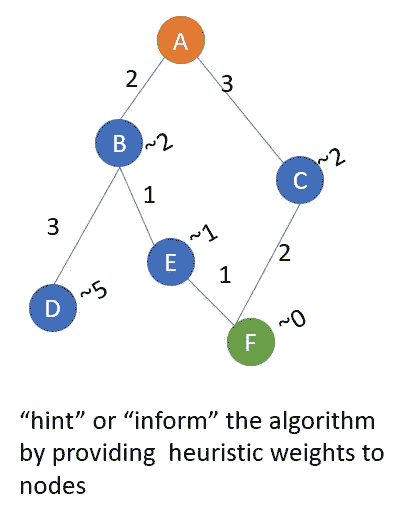
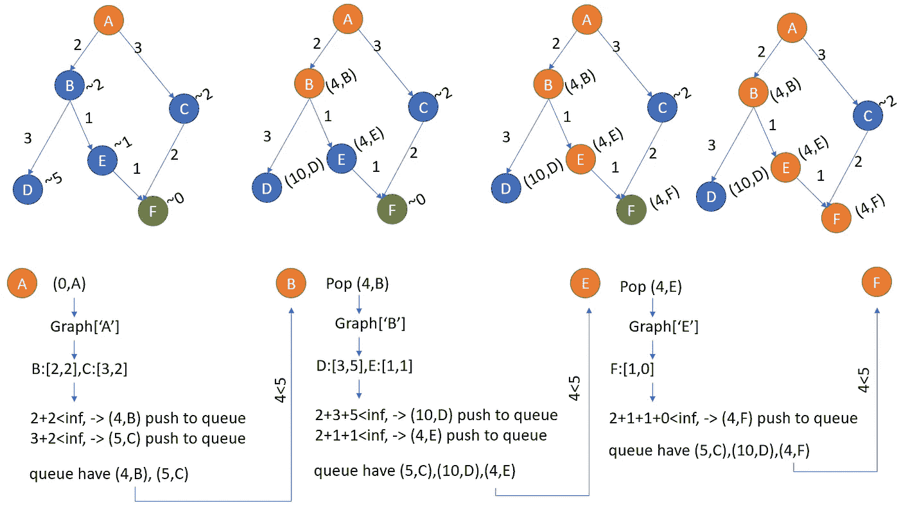
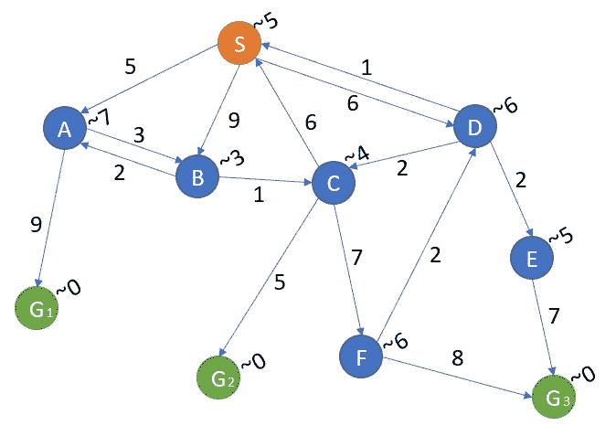

# Python 中的图遍历:A*算法

> 原文：<https://medium.com/nerd-for-tech/graph-traversal-in-python-a-algorithm-27c30d67e0d0?source=collection_archive---------0----------------------->

我们之前在 Python 中经历了[广度优先搜索(BFS)](/nerd-for-tech/graph-traversal-in-python-breadth-first-search-bfs-b6cff138d516) 、[深度优先搜索(DFS)](/nerd-for-tech/graph-traversal-in-python-depth-first-search-dfs-ce791f48af5b) 、 [Dijkstra 的搜索](/nerd-for-tech/graph-traversal-in-python-dijkstras-search-895c1d5aa1b1)。在本文中，我们将通过几个例子和说明来介绍 A*算法。然后我们将尝试并行比较这些算法。

简而言之，BFS 和 DFS 实际上是遍历整个图中的所有节点，没有特定的“目的地”或“目标”。Dijkstra 做了同样的事情，但是它的目的地是“无处不在”(所有节点)。

这不是我们想要的，因为直觉上，搜索算法应该从某处开始，到某处结束，点到点。现在我们有了 A*算法来完成这个任务。

我们不能责怪 BFS、DFS 和 Dijkstra 不去任何地方或只是去任何地方。因为我们从来没有告诉算法这样做。事情是这样的，我们需要通过给它一些点击来“告诉”算法有一个目标，这被称为启发式，可以如下图所示:2，~5 是那个节点到最终目标的估计距离。



由于这些新信息，我们需要创建新的容器来存储它，并根据新的特性进行“放松”。我们还有节点间的初始距离，人们称之为 g-score。我们有启发式值，也是一个权重或距离，称为 h-score。g-score 和 h-score 的总和就是所谓的 f-score 的新特征。

放松现在应用于 f 分数，并选择最小的分数以推入下一轮循环的临时队列。

上面的图形示例表示如下:节点每个节点都有一个以上的信息。我们创建了一个列表来存储边长以及启发式权重(即从该节点到最终目的地的距离)。

```
graph={
    # now we need a list as the value to store g-score and h-score
    # list first value is the g-score, second value is the h-score,i.e., heuristic
    'A':{'B':[2,2],'C':[3,2]},
    'B':{'D':[3,5],'E':[1,1]},
    'C':{'F':[2,0]},
    'D':{},
    'E':{'F':[1,0]},
    'F':{}
}
# the algorithm will retrieve the graph as follow:
graph['A']
# this return {'B':[2,2],'C':[3,2]}
graph['A']['B']
# this return [2,2]
graph['A']['B'][0]# return the edge length
graph['A']['B'][1]# return the distance of the node to destination
```

让我们把整个算法放在这里，以后再解释。(对缩进表示抱歉，如有必要，请调整缩进。)

```
def astar(graph,start_node,end_node):
    # astar: F=G+H, we name F as f_distance, G as g_distance, 
    # H as heuristic f_distance={node:float('inf') for node in graph}
    f_distance[start_node]=0

    g_distance={node:float('inf') for node in graph}
    g_distance[start_node]=0

    came_from={node:None for node in graph}
    came_from[start_node]=start_node

    queue=[(0,start_node)] while queue:
        current_f_distance,current_node=heapq.heappop(queue)

        if current_node == end_node:
            print('found the end_node')
            return f_distance, came_from
        for next_node,weights in graph[current_node].items(): temp_g_distance=g_distance[current_node]+weights[0] if temp_g_distance<g_distance[next_node]: g_distance[next_node]=temp_g_distance
                heuristic=weights[1] f_distance[next_node]=temp_g_distance+heuristic
                came_from[next_node]=current_node

                heapq.heappush(queue,(f_distance[next_node],next_node))return f_distance, came_fromastar(graph,'A','F')
# return {'A': 0, 'B': 4, 'C': 5, 'D': 10, 'E': 4, 'F': 4} and 
# {'A': 'A', 'B': 'A', 'C': 'A', 'D': 'B', 'E': 'B', 'F': 'E'}
```

的确，集装箱多了，辅助线也多了。然而，这感觉就像 Dijkstra 的算法，只有一行不同。正是这种新的特征构建方式产生了这种差异。这是:初始边长(g_distance)现在必须累加启发式。

```
f_distance[next_node]=temp_g_distance+heuristic
```

下面是一个例子:通过使用我们的“提示”，算法绕过一些节点，直接到达目的地。注意边上有箭头。



有一点需要注意，我们需要一个 g-score 容器来存储从起点到那个节点的距离，这解释了为什么节点 D 的权重被计算为 2+3+5，其中 2 是 A->B 之间的距离，3 是 B->D 之间的距离，5 是节点 D 本身的启发式。在代码中，我们如何累加 2+3？我们需要下面的容器并用 infinity 初始化它。

```
g_distance={node:float('inf') for node in graph}
```

就像 Dijkstra 算法一样。heappop()方法确保弹出最小 f 值。虽然我们得到了当前的 f 距离，但是我们没有利用它，因为我们只需要那个节点的 g 距离。

```
current_f_distance,current_node=heapq.heappop(queue)
```

与 Dijkstra 一样，我们使用 came _ from 容器来存储到目前为止形成最便宜路径的前任节点。但是我们不需要填满这个容器。有些人直到最后还是一无所有。

```
came_from={node:None for node in graph}
```

这是另一个稍微复杂一点的例子。该示例摘自参考 youtube 链接。那个视频里的讲师已经很好的解释了 A*的概念。强烈推荐详细过一遍他的视频。

```
complex_graph={
    'S':{'A':[5,7],'B':[9,3],'D':[6,6]},
    'A':{'B':[3,3],'G1':[9,0]},
    'B':{'A':[2,7],'C':[1,4]},
    'C':{'S':[6,4],'G2':[5,0],'F':[7,6]},
    'D':{'S':[1,5],'C':[2,4],'E':[2,5]},
    'E':{'G3':[7,0]},
    'F':{'G3':[8,0]},
    'G1':{},
    'G2':{},
    'G3':{}
} 
```

下图所示:请注意，在某些节点之间有向上或向后的箭头。请自己试一下代码。你会注意到算法绕过了一些节点，直接到达它的目标。此外，算法可能会四处漫游，以确保它不会错过潜在的选项(漫游是由。heappop()方法，它总是寻找更小的 f-score 并检查它们，尽管对人类来说我们可以看到目标只是前进了一步！).



**参考阅读:**

【https://www.youtube.com/watch?v=6TsL96NAZCo】T2&t = 7s