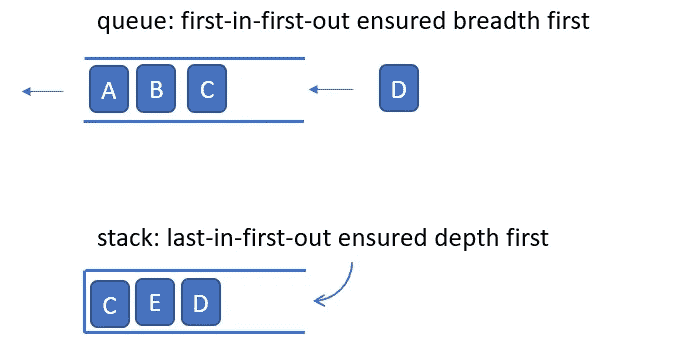
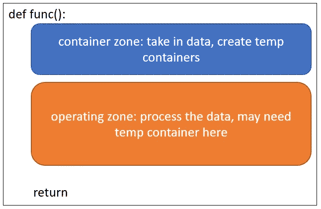

# Python 中的图遍历:BFS，DFS，Dijkstra，A-star 并行比较

> 原文：<https://medium.com/nerd-for-tech/graph-traversal-in-python-bfs-dfs-dijkstra-a-star-parallel-comparision-dd4132ec323a?source=collection_archive---------3----------------------->

我们已经讨论过关于[广度优先搜索(BFS)](/nerd-for-tech/graph-traversal-in-python-breadth-first-search-bfs-b6cff138d516) 、[深度优先搜索(DFS)](/nerd-for-tech/graph-traversal-in-python-depth-first-search-dfs-ce791f48af5b) 、[Dijkstra’Search](/nerd-for-tech/graph-traversal-in-python-dijkstras-search-895c1d5aa1b1)、 [A-star(或 A*)算法](/nerd-for-tech/graph-traversal-in-python-a-algorithm-27c30d67e0d0)。让我们快速回顾和比较过去 4 篇介绍图遍历算法的文章。这将是关于图遍历的最后一篇文章。

简而言之，BFS 和 DFS 只是根据自己的偏好遍历所有节点。一个走得更宽，另一个挖得更深。而 Diskstra 看起来更聪明，能够根据自己的喜好选择较小的步长。从用户那里得到答案而被欺骗。

单个情况下，哪个效率更高全凭运气。自从 A*得到了小抄，它通常比其他人更快。

**BFS 和 DFS:**

对于 BFS 和 DFS，节点扫描的顺序是固定的。在 BFS 中，节点被推到类似队列的 FIFO 存储中，并保持先来先服务的扫描顺序。那些较浅的节点在那些较深的节点之前加入队列，因此它们可以首先被扫描。而对于 DFS，浅节点进入堆栈式的 LIFO 存储，并“卡”在底部！那些更深的节点堆叠在入口处，首先出来，如下图所示。



上面的示例是通过以下代码实现的:

```
#BFS
queue.append(new_node)
queue.pop(0)#DFS
queue.append(ned_node)
queue.pop()#default pop out the -1, i.e., the last one
```

他们确实需要另一个容器来记录被访问的节点。但是它们的边缘没有重物。距离的累积是不必要的。

现在如果你看到他们的代码，他们几乎是一样的，除了节点弹出的方式为下一轮扫描。另一个区别是，对于 DFS，扫描顺序与推入顺序不同。这将导致“已访问”列表中的错误顺序。我们不返回'已访问'列表，相反，我们需要创建另一个容器来存储' s '或者直接打印' s '作为输出。为了使 BFS 和 DFS 相似，我们选择直接打印“s”。

```
#BFS
def bfs(graph,node):
    visited=[]
    queue=[]    
    visited.append(node)
    queue.append(node)

    while queue:
        s=queue.pop(0)

        for x in graph[s]:
            if x not in visited:
                visited.append(x)
                queue.append(x)
    return visited#DFS
def dfs(graph,node):
    visited=[]
    queue=[]

    queue.append(node)
    visited.append(node)

    while queue:
        s=queue.pop()
        print(s) for x in graph[s][::-1]:
            if x not in visited:
                visited.append(x)
                queue.append(x)
```

**迪杰斯特拉和一个***

现在我们有了边缘的重量。这仅仅意味着每条路都有它的长度。BFS 和 DFS 无法处理这种情况，因为它们没有“累加器”来计算距离。我们可以简单地添加**“累加器”**让它们更智能。其实我们可以做一个 BFS 和 DFS 版的 Dijkstra 或者 A*！

让我们先看看 Dijkstra 和 A*，然后回到“广度/深度-Dijkstra”和“广度/深度 A*”。请允许我把之前的代码都粘贴到这里，开始看看这些算法有什么特别的地方。

```
#Dijkstra
import heapqdef dijkstra(graph,node):    
    distances={node:float('inf') for node in graph}
    distances[node]=0
    came_from={node:None for node in graph}    
    queue=[(0,node)]

    while queue:
        current_distance,current_node=heapq.heappop(queue)
        # relaxation
        for next_node,weight in graph[current_node].items():
            distance_temp=current_distance+weight
            if distance_temp<distances[next_node]:
                distances[next_node]=distance_temp
                came_from[next_node]=current_node
                heapq.heappush(queue,(distance_temp,next_node))
    return distances,came_from#A*
def astar(graph,start_node,end_node):

    f_distance={node:float('inf') for node in graph}
    f_distance[start_node]=0

    g_distance={node:float('inf') for node in graph}
    g_distance[start_node]=0

    came_from={node:None for node in graph}
    came_from[start_node]=start_node

    queue=[(0,start_node)]    
    while queue:
        current_f_distance,current_node=heapq.heappop(queue)

        if current_node == end_node:
            return f_distance, came_from
        for next_node,weights in graph[current_node].items():               
            temp_g_distance=g_distance[current_node]+weights[0]            
            if temp_g_distance<g_distance[next_node]:                
                g_distance[next_node]=temp_g_distance
                heuristic=weights[1]                
                f_distance[next_node]=temp_g_distance+heuristic
                came_from[next_node]=current_node

                heapq.heappush(queue,(f_distance[next_node],next_node)) return f_distance, came_from
```

显然它们看起来更复杂，但事实上它们只有几个临时容器来存储信息。

从 BFS/DFS 到 Dijkstra，我们多了一个容器**来存储所有的距离**。我们用另一个容器**存储遍历路径**。(我们在 BFS/DFS 中需要这个路径记录器吗？我想我们可能需要它！)

从 Dijkstra 到 A*我们有另一个备忘单容器，叫做**“启发式”**。**普通距离**容器仍然在这里，但将其名称改为“g_distance”或“g_score”，启发式和 g_distance 的附加使得**“f _ distance”**或“f_score”。

最后，我们需要一个过滤器来选择最小的项目**。heapq.heappop()** 方法执行这样的功能。

如果我们概括所有这些图算法的模式，它们具有以下结构:图算法确实需要容器来**存储即将到来的信息**，并且**处理信息**，并且**返回**处理过的信息。仅此而已。



这个模式**可能不一定**代表了**这个世界上所有的算法！我们将在未来探索其他算法的更多模式来验证这一假设。感谢阅读！**

**BFS/DFS 版的 Dijkstra 和 A***

我们可以通过将 heapq.heappop()方法与 queue.pop(0)放在一起以获得 BFS-迪杰斯特拉/A*，或者将 queue.pop()放在一起以获得 DFS-迪杰斯特拉/A*来制作这些算法。没有选择最小值，队列现在简单地以 FIFO 和 LIFO 的方式弹出节点。现在你有了更慢的 Dijkstra/A*！

但同样，速度全凭运气，**除非你“作弊”**，这意味着 A*仍然比其他人快。