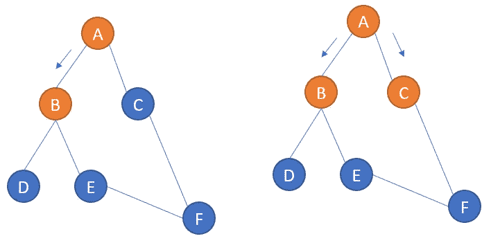
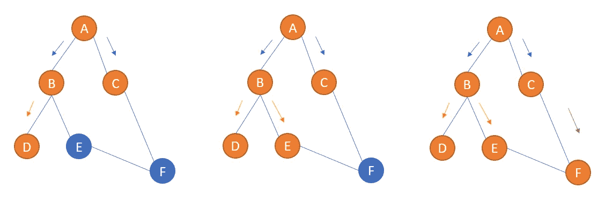
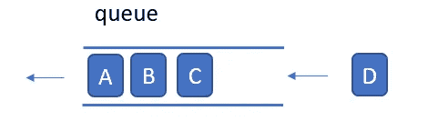
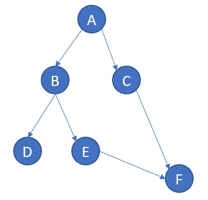
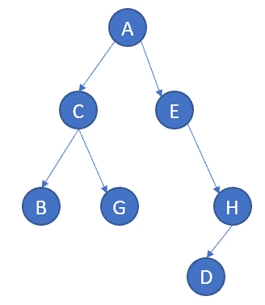

# Python 中的图遍历:广度优先搜索(BFS)

> 原文：<https://medium.com/nerd-for-tech/graph-traversal-in-python-breadth-first-search-bfs-b6cff138d516?source=collection_archive---------6----------------------->

广度优先搜索(BFS)，也称为广度优先遍历(BFT)，是最基本的图遍历算法之一。这些算法广泛应用于物流配送路径选择、地图路径选择、迷宫路径寻找等领域。

所谓的“广度”如下图所示:你首先扫描 B 和 C，而不是 B->D 或 B->E 或 B->F 或 C->F。在你完成图表的“浅层”之前，你不能进一步深入到其他顶点。(如果您先深入，这将是深度优先搜索)



具体来说，B 和 C 是 a 的直接子节点。BFS 扫描起始节点的所有直接子节点，并进一步到达子节点的子子节点。如下图所示:



理解了这一点，下一步就是用代码实现它。

现在的关键任务是确保扫描所有子节点，然后继续前进。这项任务是由一种称为“队列”的数据结构来完成的，它具有“先入先出”原则的特性，如下所示:



“队列”结构可以确保你扫描的所有节点都按照先来先服务的顺序排列出来。您可以安全地使用一个循环来扫描整个图，并将这些返回的节点推到队列中。

现在让我们看一个“dictionary”形式的图表示例，这样您就可以使用 graph['A']来检索包含' B '和' C '的列表。在此尝试一下:

```
graph={
 ‘A’:[‘B’,’C’],
 ‘B’:[‘D’,’E’],
 ‘C’:[‘F’],
 ‘D’:[],
 ‘E’:[‘F’],
 ‘F’:[]
}graph[‘A’]
# this should gives you ['B','C']
```

上面的 python 代码表示如下图所示:



下面是 Python 中的 BFS 实现。队列是一个普通的列表，但是我们将使用。append()和。pop(0)方法将其模拟为一个“队列”结构。更具体地说。append()将元素添加到列表的右侧，并将。pop(0)方法取出列表左边的第一个元素。

```
def bfs(graph,node): # node is the starting position
    # graph is the graph in dictionary format
    visited=[]
    queue=[] visited.append(node)
    queue.append(node)

    while queue:
        s=queue.pop(0)

        for x in graph[s]:
            if x not in visited:
                visited.append(x)
                queue.append(x)
    return visitedbfs(graph,'A')
# you should get ['A','B','C','D','E','F']
```

让我们浏览整个算法，看看它对图做了什么:它接受了一个图和一个节点作为输入。图是字典，节点是字符串。然后，它创建了两个容器:一个名为 visited 的容器存储扫描序列，另一个名为 queue 的容器临时存储先进先出的节点序列。

输入节点是它处理的第一个节点。比如我们把 A 放进去。现在队列不为空，while 循环开始。“A”立即弹出，并馈入图形[“A”]以检索“B”和“C”。这两个被附加到队列的末尾。由于队列是以“先入先出”的方式弹出的，所以在接下来的 while 循环中，“D”、“E”、“F”将无法跳到队列的前面。在下一轮 while 循环中，它确保' B '被弹出，而' D '，' E '被注入队列。在第三轮中，“C”被弹出，“F”被附加到队列中。第四轮“D”弹出，没有从图形返回任何内容。接下来，“E”弹出，“F”再次返回！现在我们在队列中有一个重复的' F ',所以我们需要添加一个检查来防止它加入。

尝试以下示例来查看代码的效果:

```
graph={
    'A':['C','E'],
    'B':[],
    'C':['B','G'],
    'D':[],
    'E':['H'],
    'H':['D'],
    'G':[]
}
bfs(graph,'A')
# you should get ['A','C','E','B','G','H','D']
```

上图表示:我们可以很容易地用肉眼验证它的正确性。



在接下来的文章中，我们将继续讨论深度优先搜索、Dijkstra 搜索和类似方法中的 A*搜索。最后，我们将并行比较这些算法，以便更好地理解它们。

**阅读参考链接:**

[](https://www.geeksforgeeks.org/breadth-first-search-or-bfs-for-a-graph/) [## 广度优先搜索或 BFS 图

### 图的广度优先遍历(或搜索)类似于树的广度优先遍历(参见本…

www.geeksforgeeks.org](https://www.geeksforgeeks.org/breadth-first-search-or-bfs-for-a-graph/) [](https://www.educative.io/edpresso/how-to-implement-a-breadth-first-search-in-python) [## 如何在 Python 中实现广度优先搜索

### 如何在 Python 中实现广度优先搜索

如何在 Pythonwww.educative.io 中实现广度优先搜索](https://www.educative.io/edpresso/how-to-implement-a-breadth-first-search-in-python)