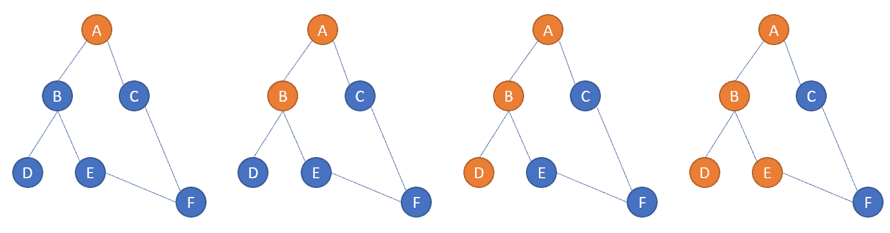
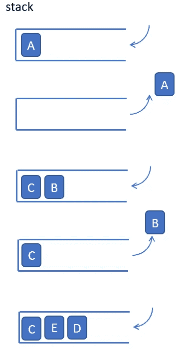

# Python 中的图遍历:深度优先搜索(DFS)

> 原文：<https://medium.com/nerd-for-tech/graph-traversal-in-python-depth-first-search-dfs-ce791f48af5b?source=collection_archive---------6----------------------->

深度优先搜索(DFS)或深度优先遍历(DFT)是另一种基本的图算法，类似于前面讨论的 [BFS 或](https://mb-miaobin.medium.com/graph-traversal-in-python-breadth-first-search-bfs-b6cff138d516)BFT。唯一的、微小的区别是深度优先算法尽可能地进入更深层次的节点。

例如，在与 BFS 从节点“A”开始的情况相同的情况下，DFS 转到“B”，然后是“D”和“E”、“F”。然后是 C。但是为什么它扫描“D”之后是“E”，arn”和“D”不是一个级别的？这是因为“D”没有更多的子节点连接。该算法返回到“B”并寻找“B”的子节点，也就是“E”。注意“E”有一个子节点“F”，它也是“C”的子节点。它可能会被扫描两次，我们需要稍后处理它。



要在代码中实现它，我们需要找到一种方法来确保“深度优先”的顺序。具有“后进先出”原则的堆栈可能有助于实现这一点。如下图所示:我们将第一个节点放入并弹出，用“B”和“C”交换“A ”,但为了保持从左到右的扫描，我们将其反转为“C”和“B ”,将它们推入堆栈。下一轮我们弹出“B”并交换“B”的子节点，依此类推。



python 中的图形以字典的形式表示，因此您可以使用键来检索值。在我们的示例中，我们插入“A”来检索“B”和“C”。

```
graph={
 ‘A’:[‘B’,’C’],
 ‘B’:[‘D’,’E’],
 ‘C’:[‘F’],
 ‘D’:[],
 ‘E’:[‘F’],
 ‘F’:[]
}
graph[‘A’]
# this should gives you ['B','C']
```

上面的图形式的代码是这样的如下(注意有方向):


为了与我们之前的 [BFS](https://mb-miaobin.medium.com/graph-traversal-in-python-breadth-first-search-bfs-b6cff138d516) 实现进行比较，我们以 BFS 风格对 DFS 进行编码。除了“队列”结构和“堆栈”结构略有不同之外，所有变量的名称和位置都是相同的。正如我们在[上一篇文章](https://mb-miaobin.medium.com/graph-traversal-in-python-breadth-first-search-bfs-b6cff138d516)中解释的，“队列”是为了确保“先进先出”原则，以便广度搜索在下一级节点搜索之前完全完成。另一方面,“堆栈”更喜欢使用新插入的元素，以便实现深度优先搜索。

```
def dfs(graph,node):

    # node is the starting position
    # graph is the graph in dictionary format
    visited=[]
    queue=[]

    queue.append(node)
    visited.append(node)

    while queue:
        s=queue.pop()
        print(s)
        for x in graph[s][::-1]:
            if x not in visited:
                visited.append(x)
                queue.append(x)
```

让我们测试一些例子:

```
graph={
    'A':['B','C'],
    'B':['D','E'],
    'C':['F'],
    'D':[],
    'E':['F'],
    'F':[]
}
dfs(graph,'A')
# this will return the sequence of A,B,D,E,F,C
```

另一个例子是:


```
graph={
    'A':['C','E'],
    'B':[],
    'C':['B','G'],
    'D':[],
    'E':['H'],
    'H':['D'],
    'G':[]
}
dfs(graph,'A')
# this will return the sequence of A,C,B,G,E,H,D
```

这个链接使用递归方法来搜索深度，这在编码上更简单，但是理解起来有点棘手，特别是当你不熟悉递归编程的时候。我们将在以后的文章中解释对递归方法的理解。

[](https://www.educative.io/edpresso/how-to-implement-depth-first-search-in-python) [## 如何在 Python 中实现深度优先搜索

### 如何在 Python 中实现深度优先搜索

如何在 Pythonwww.educative.io 中实现深度优先搜索](https://www.educative.io/edpresso/how-to-implement-depth-first-search-in-python)