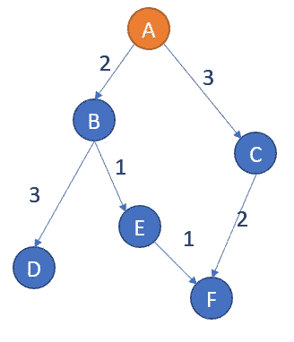
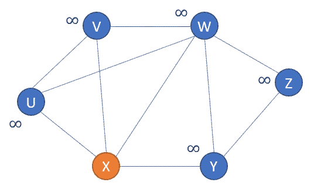
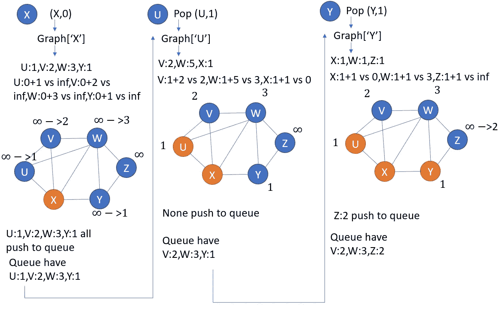
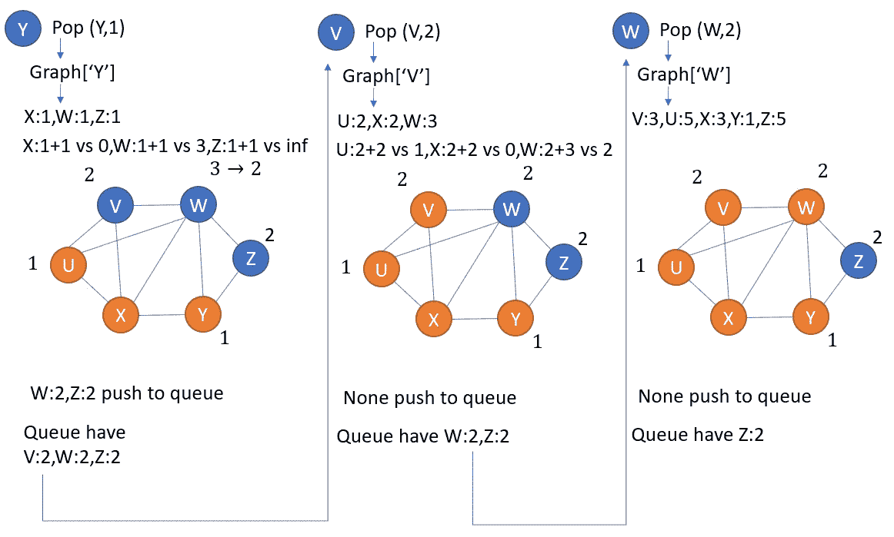
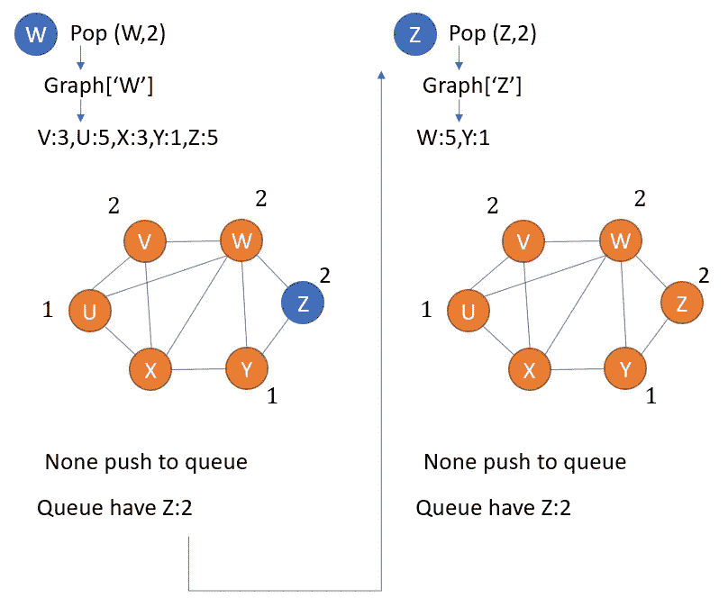
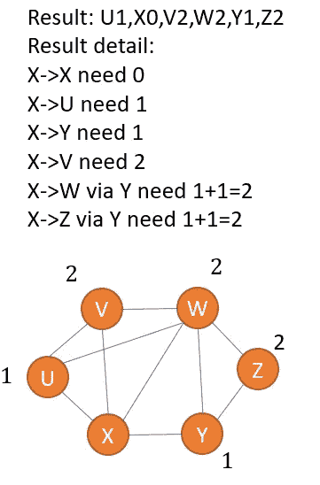

# Python 中的图遍历:Dijkstra 的搜索

> 原文：<https://medium.com/nerd-for-tech/graph-traversal-in-python-dijkstras-search-895c1d5aa1b1?source=collection_archive---------7----------------------->

之前我们已经学习了最基本的图搜索算法:宽度优先搜索(BFS)和深度优先搜索(T2)。这两种基本算法有一个共同点，即它们的边没有权重。什么是重量？简单地说，它们是“道路长度”或“两个城市之间的距离”。

图的权重准确地反映了真实世界的空间域，尽管如果需要，它们可以表示更抽象的情况。但是现在，一个“地图模型”足以让我们理解一个图和图的遍历。一个没有权重和有权重的图可以如下图所示:我们再次使用了之前的例子，以便于比较相似性和差异。线上的数字(或称为边)是任意指定的节点间的“距离”。


BFS 和 DFS 没有考虑权重，这在现实中是不可能的，因为每条路都有各自的长度。当我们决定选择哪条道路时，我们需要考虑它们的长度。Dijkstra 的搜索是在进行节点遍历时涉及边权重的算法之一。

形象地说，选择一个起点和终点让算法计算是一个很好的时机。理想情况下，我们可以获得总距离、路径节点或路径数量。但是没有！不会有目的地！Dijkstra 算法盲目地去任何地方，并返回到每个点的所有最短路径。

什么？！有什么意义？每一分？事实上，你得到了你想要的，在所有的道路中，有一条是你想要的。但是它不会直接指向你想要的点(为了节省一些计算成本)。

现在没关系，让我们先理解它，以后再去理解它。

这里使用了相同的图形示例。只是我们需要存储节点之间的距离:数据以“字典的字典”的形式存储，以便我们可以检索节点的节点和节点之间的权重。



```
graph={
    'A':{'B':2,'C':3},
    'B':{'D':3,'E':1},
    'C':{'F':2},
    'D':{},
    'E':{'F':1},
    'F':{}
}
graph['A']# return {'B':2,'C':3}, which are the subnode of A
graph['A']['B']# return 2, which is the distance of A and B
```

现在让我们编码算法。简而言之，如下，但是我们将一步一步地解释它是如何发展到这一步的。

```
import heapq
def dijkstra(graph,node): distances={node:float('inf') for node in graph}
    distances[node]=0
    came_from={node:None for node in graph} queue=[(0,node)]

    while queue:
        current_distance,current_node=heapq.heappop(queue)
        # relaxation
        for next_node,weight in graph[current_node].items():
            distance_temp=current_distance+weight
            if distance_temp<distances[next_node]:
                distances[next_node]=distance_temp
                came_from[next_node]=current_node
                heapq.heappush(queue,(distance_temp,next_node))
    return distances,came_fromdijkstra(graph,'A')
# return {'A': 0, 'B': 2, 'C': 3, 'D': 5, 'E': 3, 'F': 4},
# {'A': None, 'B': 'A', 'C': 'A', 'D': 'B', 'E': 'B', 'F': 'E'}# the result means for example, 'A' to 'A' is 0, 'A' to 'B' is 2
# the shortest path: for example, 'A' to 'F', we start from 'F'
# and trace back. 'F' comes from 'E', 'E' from 'B', 'B' from 'A'
```

尝试其他类似例子:



```
graph={
    'U':{'V':2,'W':5,'X':1},
    'V':{'U':2,'X':2,'W':3},
    'W':{'V':3,'U':5,'X':3,'Y':1,'Z':5},
    'X':{'U':1,'V':2,'W':3,'Y':1},
    'Y':{'X':1,'W':1,'Z':1},
    'Z':{'W':5,'Y':1}
}
dijkstra(graph,'X')#returns:
#{'U': 1, 'V': 2, 'W': 2, 'X': 0, 'Y': 1, 'Z': 2},
# {'U': 'X', 'V': 'X', 'W': 'Y', 'X': None, 'Y': 'X', 'Z': 'Y'}
```

**如果不用看算法讲解，可以把剩下的部分跳出来。**

让我们回忆一下前面的算法，看看是什么构成了算法的核心行:

```
# for BFS, the "queue" structure ensured the breadth first scanning
queue.append(node)
s=queue.pop(0)# for DFS, the "stack" plays the trick of depth first scanning
queue.append(node)
s=queue.pop()
```

对于 Dijkstra 的搜索，一个临时容器以类似的方式构建，但是没有弹出左邻右舍的元素。最小值被弹出。我们用 heapq 库实现了最小距离选择。下面几行构建了 Dijkstra 搜索的核心代码，用它搜索算法是假函数，但是我们仍然需要其他的辅助行来使它工作。

```
import heapq
queue.append(node)
distance,node=heapq.heappop(queue)
```

我们与 BFS 和 DFS 做同样的事情:

```
import heapq
def dijkstra(graph,node): queue=[(0,node)]

    while queue:
        current_distance,current_node=heapq.heappop(queue)

        for next_node,weight in graph[current_node].items():
            #do somthing here!
    return #something!
```

我们关心的是从起始节点到那个节点的距离/路径。所以我们需要两个容器来存储这些信息。我们在循环之前构建容器，并使用 while 循环来填充正确的信息。

```
import heapq
def dijkstra(graph,node): distances={node:float('inf') for node in graph}
    distances[node]=0
    came_from={node:None for node in graph} queue=[(0,node)]

    while queue:
        current_distance,current_node=heapq.heappop(queue)
        # relaxation
        for next_node,weight in graph[current_node].items():
            distance_temp=current_distance+weight
            if distance_temp<distances[next_node]:
                distances[next_node]=distance_temp
                came_from[next_node]=current_node
                heapq.heappush(queue,(distance_temp,next_node))
    return distances,came_fromdijkstra(graph,'A')
# return {'A': 0, 'B': 2, 'C': 3, 'D': 5, 'E': 3, 'F': 4},
# {'A': None, 'B': 'A', 'C': 'A', 'D': 'B', 'E': 'B', 'F': 'E'}# the result means for example, 'A' to 'A' is 0, 'A' to 'B' is 2
# the shortest path: for example, 'A' to 'F', we start from 'F'
# and trace back. 'F' comes from 'E', 'E' from 'B', 'B' from 'A'
```

等等，突然冒出一个术语“放松”，那是什么？它仅仅意味着:选择最小的，只记录最小的。但是我们如何存储第一个值呢？有比空白小的值吗？我们不能创造空白的容器，而是一个装满无限大数的容器。通过这样做，我们无论如何都可以存储第一个值并用更小的值(如果有的话)替换它。

其中一个例子的更多说明:如果你喜欢说明，浏览下图将有助于你的理解。

从任何节点开始，从该节点发展并扩展到它的所有子节点。如果累积距离变小，则更新累积距离(这称为松弛)。

这里的关键点是。heappop()方法相比较，弹出的距离最小。Dijkstra 与 BFS 相似，但唯一的区别是较小的值**插队**！

```
heapq.heappop(queue)
```

