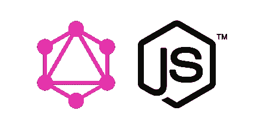
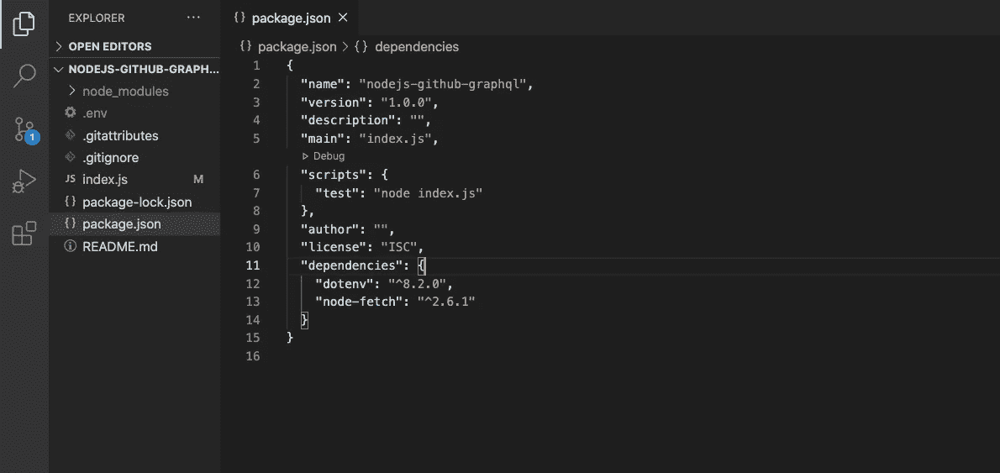

# 具有 NodeJS 的 graph QL(API 的未来)

> 原文：<https://medium.com/nerd-for-tech/graphql-future-of-apis-with-nodejs-a8a2eb2d1d2c?source=collection_archive---------22----------------------->

每一项创新都是从我们每天面临的挑战/问题开始的。现代 Web 开发围绕着用不同框架构建的应用程序，如 Angular、React 或 Vue，与用不同框架构建的 API(如 springboot、expressJs、Django 等)进行交互。用各种语言写成。

在过去的几年里，REST API 已经在互联网上推动了许多应用。当我们从 SOAP 转移到基于 REST 的 API 时，这实现了更好的开发体验，现在几乎每个应用前端都与 REST API 交互。你的 API 有用户，因此它有用户体验。在你做的每一个决定中，永远把用户放在心上。对你的用户有同理心，不管他们是新手还是有经验的开发者。

在这篇文章中，我们将使用 GITHUB API 来了解 REST API 和 GraphQL 之间的不同，以了解 GraphQL 为什么是未来的发展方向，因为它提供了更好的用户体验，限制了 API 调用的数量，因为它可以在一次 API 调用中从多个来源收集数据，并加快了 API 对所需字段的响应，而不是像我们在 REST API 中多次做的那样解析整个响应来获取所需字段。我将使用 NodeJS 程序来演示这个例子。

以下是完整的 GITHUB 项目网址:[https://GITHUB . com/SandeepKumarYaramchitti/nodejs-GITHUB-graph QL](https://github.com/SandeepKumarYaramchitti/nodejs-github-graphql)

`mkdir nodejs-github-graphql && cd nodejs-github-graphql`

在 visual studio 代码中打开项目，并启动一个终端实例

`npm init`

并选择默认选项来创建 npm 项目。安装以下依赖项，以执行 API 调用。有各种各样的 npm 包来调用 graphql apis。在这种情况下，我将使用 node-fetch 向您展示一个示例。

`npm install node-fetch dotenv --save -dev`

在这个阶段，创建 index.js，您的项目应该如下所示:

现在，让我们使用文档在 GITHUB 中创建个人令牌，这使我们能够使用 API。

*   通过以下文档创建个人访问令牌[此处](https://docs.github.com/en/github/authenticating-to-github/creating-a-personal-access-token)
*   安装 dotenv 包，将您的个人访问令牌存储在环境变量中，并确保添加。中的 env 文件。提交 GIT 时忽略 excle。

 [## 创建个人访问令牌

### 您应该通过命令行或 API 创建一个个人访问令牌来代替密码。个人…

docs.github.com](https://docs.github.com/en/github/authenticating-to-github/creating-a-personal-access-token) 

让我们详细看看调用 GraphQL 的代码:

*   从节点导入提取-提取
*   配置 dotenv 以读取保存在。环境文件。
*   ACCESS_TOKEN 将读取环境变量并包含您的个人访问令牌的值。

下面提到的 graphql 查询将为我们提供以下内容:

*   在 angular repository 上用 graphql 查询 Github 最近的 100 个问题，问题状态为 OPEN，以及对这些问题的反应和标签等。这就是 graphql 的强大之处:)。所有这些都可以用一个查询来完成，而不是用传统的方法调用多个 API

在这个例子中，为了更容易理解，我使用 node-fetch 来调用 graphql api。在现实世界中，很少有像 Apollo Client for graphql 这样带有 Angular、React 和 Vue 应用的流行客户端库。

上面的代码调用 GitHub graphql，使用访问令牌密钥获取所需的数据。目前，Github graphql 操作需要身份验证，例如个人访问令牌或 Oauth 登录，以便调用 github graphql。

我将在未来几周内发布更多与 graphql 相关的文章，以及与前端应用框架 react 和 vuejs 的集成。此外，将利用 AWS 服务 AppSync 来构建可以与任何前端框架集成的 graphql APIs。

如果这篇文章对你有用，请一定要喜欢，并继续在这个空间寻找更多的博客:)