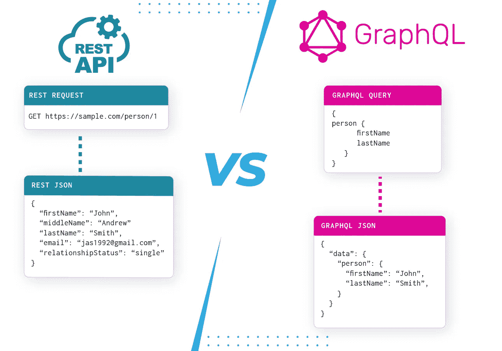
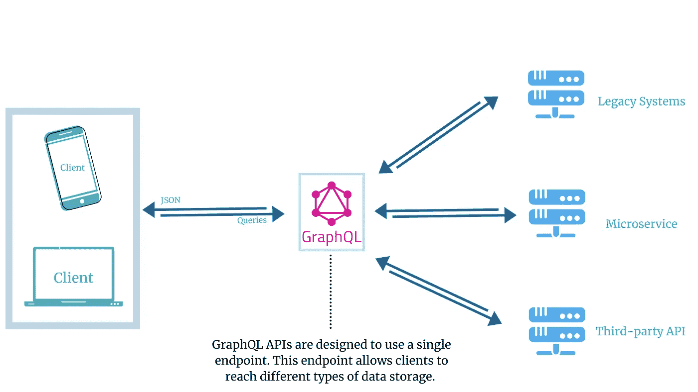

# GraphQL 与 RESTful

> 原文：<https://medium.com/nerd-for-tech/graphql-vs-restful-e1a99fd14285?source=collection_archive---------3----------------------->

当谈到 API 时，大多数人最初被介绍并继续使用 RESTful 约定，但是 GraphQL 在最近几年变得越来越流行。今天我们将讨论使用 GraphQL 的区别和一些好处。

使用 REST 和 GraphQL 的简单请求和响应的比较

## GraphQL 是什么？

直接摘自 [GraphQL 网站](https://graphql.org/):“graph QL 是一种 API 查询语言，也是一种用现有数据完成这些查询的运行时。GraphQL 为您的 API 中的数据提供了完整且易于理解的描述，使客户能够准确地要求他们需要的东西，使 API 更容易随着时间的推移而发展，并支持强大的开发工具。”

需要澄清一些事情:GraphQL 本身与数据库没有任何关系，它只是一种查询数据库的查询语言。它不是 SQL 的替代品，也不是全新的 ORM。它也**不是**REST 的替代品，而是一种选择，你可以在同一个项目中利用这两者！

## 回顾休息

直接取自 [RESTful 网站](https://restfulapi.net/):“REST 是**RE**presentational**S**state**T**transfer 的首字母缩写。它是分布式超媒体系统的架构风格，由 Roy Fielding 于 2000 年在他著名的论文中首次提出。像任何其他架构风格一样，REST 也有它自己的 [6 指导约束](https://restfulapi.net/rest-architectural-constraints/)，如果一个接口需要被称为 **RESTful** ，就必须满足这些约束。

另一个快速澄清:虽然很多人比较两者，但 REST 和 HTTP 并不相同。REST 是使 web 服务成为真正 RESTful API 的一组约束。阿皮亚·贾因是这样说的:

> “HTTP 是一个契约，一个通信协议，而 REST 是一个概念。它是一种架构风格，可以使用 HTTP、FTP 或其他通信协议，但广泛用于 HTTP。REST 隐含了一系列关于服务器和客户端应该如何交互的约束。HTTP 是一种通信协议，具有服务器-客户端数据传输的给定机制。它在 REST API 中最常用，只是因为 REST 是受 WWW(万维网)的启发，在 REST 被定义之前，WWW 大量使用 HTTP，所以用 HTTP 实现 REST API 风格更容易。”

## 架构比较

随着 2010 年初移动应用的蓬勃发展，脸书开发了 GraphQL 来适应现代需求，并简化查询以提高低功耗设备和松散网络的性能。

让我们花一点时间来欣赏这种简单性，让我们一起看看 REST 和 GraphQL 的架构:

REST 建筑风格

GraphQL 架构风格

如您所见，GraphQL 通过利用允许客户端访问不同类型的数据存储的单个端点，真正简化了这种架构。

# 为什么选择 GraphQL？

好的好的..所以这一切，当然..但是真的..为什么选择 GraphQL？

使用 GraphQL 的一个主要原因是，许多使用现代 web 和移动应用程序的数据库都具有图形形状。例如:一个照片帖子可能有喜欢和评论，这些评论可能有用户创建的反应、更多评论和标志。这一切构成了一张图表。

除了适应数据结构，GraphQL 还解决了 3 个主要问题:

1.  提取不足——有时我们可能会发现自己不得不从多个端点进行提取，以检索一个视图所需的所有数据。使用 REST，您必须发出多个请求，然后根据需要处理和使用检索到的数据。使用 GraphQL，我们可以通过一个请求多次访问服务器，在一个查询中检索我们需要的所有数据。
2.  过量提取——有时我们可能发现自己只需要请求返回的一小部分数据。提取一整块数据，只使用其中的一小部分，效率很低，会降低应用程序的速度，尤其会给有带宽问题的人带来麻烦。使用 GraphQL，我们可以只包含想要查询的参数，避免检索不需要的数据。
3.  缓慢的前端开发——考虑到某些问题，我们可能会在后端创建一个新的端点，以简化特定视图的获取请求，并避免获取不足或过量..但是这需要一些工作！使用 GraphQL，客户端能够获取所需的数据，仅此而已。没有什么会变慢，也不需要新的端点。向查询中添加新字段非常简单。

# 回顾和总结

*   REST 和 GraphQL 都可以通过带有 URL 的 HTTP 请求来获取，并将请求作为 JSON 数据返回。
*   它们都调用服务器上的函数。
*   它们都有入口点，并且它们都能够区分 API 是用于读取数据还是写入数据。
*   GraphQL 是一种查询语言和一组工具，利用 HTTP 在单个端点上工作，通过以图形组织的数据和由模式结构化的对象来帮助优化性能和灵活性。
*   使用 GraphQL，单个查询可以调用 fetch 多个数据点，并只使用特定的查询数据进行响应，而 REST 每个查询只调用一个路由处理函数，并返回所有嵌套的数据。
*   GraphQL 没有内置的缓存、监控或错误报告功能，也没有针对拒绝服务攻击的安全性，但是提供了一些很酷的功能，比如自我记录和 [GraphQL 操场](https://github.com/prisma/graphql-playground)，在这里您可以检查您的模式，甚至运行查询和突变来测试您的 API。

如果您打算开发一个移动应用程序，考虑使用 GraphQL，因为带宽更重要——而如果您要构建一个需要一个强大的 API、缓存和监控系统的应用程序，那么最好使用 RESTful 约定。 ***但话说回来..您可以在同一个项目中同时使用这两种方法！***

干杯，我很快会再见到你的！