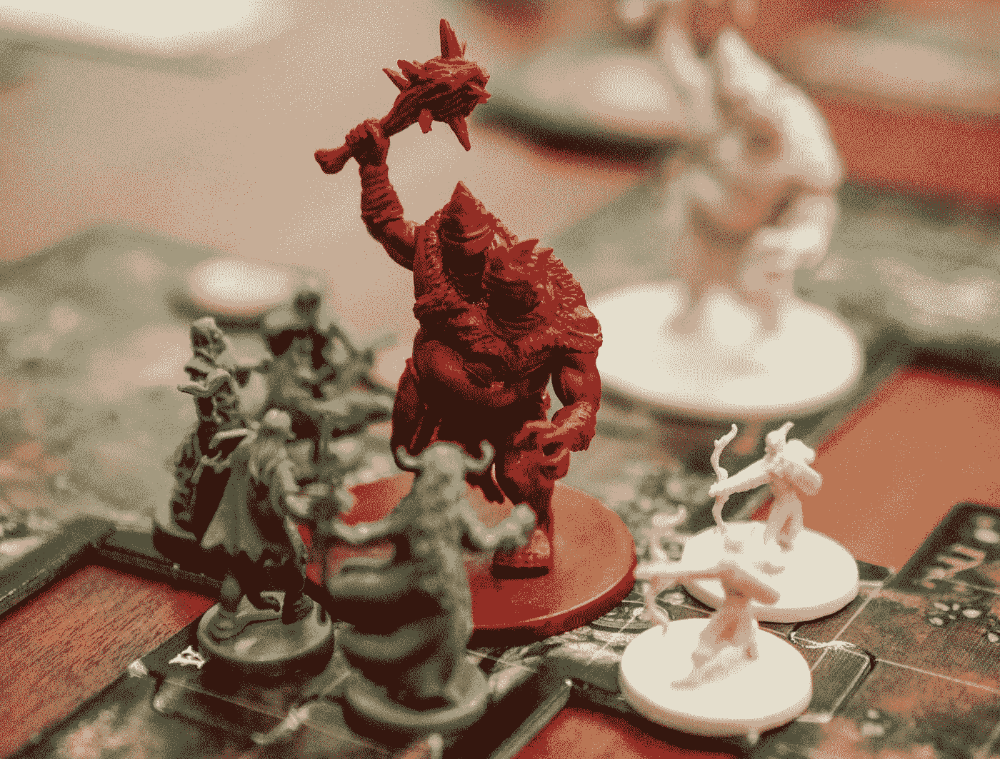
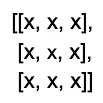
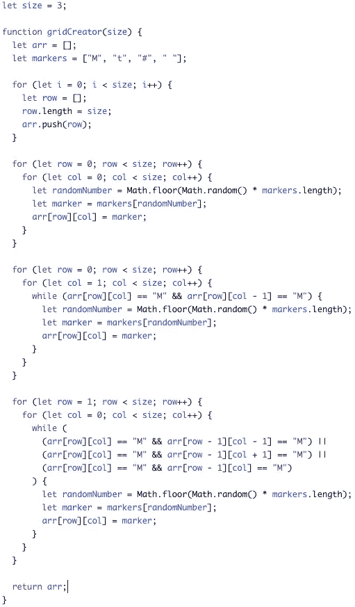
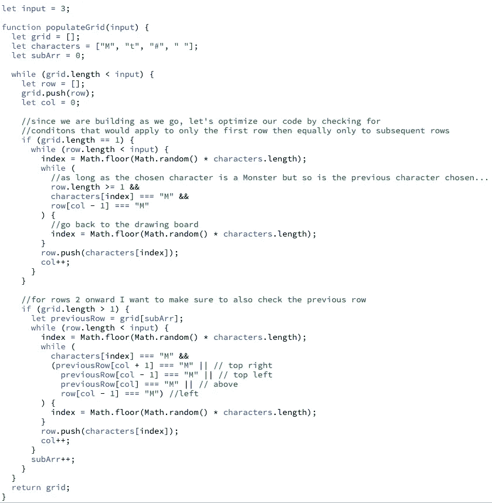
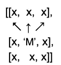

# 网格算法

> 原文：<https://medium.com/nerd-for-tech/grid-algorithms-742d4a0244bd?source=collection_archive---------25----------------------->



本周…龙与地下城！

好吧，不是真正的 D&D，但很接近。在我第一次用[intervaling . io](http://www.interviewing.io)进行模拟面试的时候(顺便说一下，这是一个很棒的平台——看看吧！)我被要求解决一个类似棋盘游戏的问题，有点像著名的龙与地下城角色扮演游戏。该练习按照给定的数字输入来阅读一些内容，创建一个测量输入值的长度和宽度的二维地图(例如，如果输入值为 5，我们需要一个总共有 25 个空格的 5×5 网格)。接下来，在板上随机填入 4 个字符中的 1 个(“M”、“t”、“#”、“”)。警告？怪物角色不能彼此相邻或成对角线。

我必须承认我很紧张。我希望清晰和自信会随着时间和练习而来，但是现在…

我被要求构建的网格实际上是一个 x 行 x 列的数组(x 是输入值)。例如，给定输入 3，生成的网格应该如下所示:



我计划:

1.  用 x 个嵌套数组实例化一个新数组。
2.  用 4 个给定字符中的任意一个随机填充这些数组的列(或行)。
3.  循环通过单独的行，以确保怪物字符不相邻，也不对角线彼此。



在我的采访中得到一些反馈后，我被要求想出一个更好的解决方案。与其在整个网格中循环不止一次，为什么不在构建网格时创建、填充和检查呢？此外，我们真的需要向左看吗，例如，当我们在最左边的列时？我们在最上面一排的时候怎么样？准备好接受挑战，这是我想到的:



1)定义外部阵列或网格。

2)创建一个 while 循环，该循环将*将* x 行推到所述网格上。

3)设置两个条件句:一个处理第一行，另一个处理第二行以后的内容。

4)第二个嵌套 while 循环负责填充每一行。而 row.length < input, generate a random number that will serve as the index when choosing a random character from the array of characters:

```
if (grid.length == 1) {
   while (row.length < input) {
      index = Math.floor(Math.random() * characters.length);
      ...
   }
}
```

5) A third nested while loop takes care of any adjacent Monsters. Starting at col 2 (index 1), if and as long as the randomly generated character is a Monster and so is the previous input [‘#’, ‘M’, ?], we want to go back to the drawing board to reassign character:

```
if (grid.length == 1) {
   ...
   while (
      row.length >= 1 &&
      characters[index] === "M" &&
      row[col - 1] === "M"
   ) {
      index = Math.floor(Math.random() * characters.length);
   }
   row.push(characters[index]);
   col++;
   ...
 }
}
```

6) If the chosen character is not a Monster, we simply *将它推入行中，记住在移动到下一个索引之前增加 row。*

7)对于第二行及以上，我们希望遵循与上面相同的步骤，但有一个微小但重要的变化。请记住，怪物不能彼此对角，我们现在有以前的行来说明。

```
if (grid.length > 1) {
  let previousRow = grid[subArr];
  while (row.length < input) {
    index = Math.floor(Math.random() * characters.length);
    while (
      characters[index] === "M" &&
      ( **previousRow[col + 1] === "M" ||
        previousRow[col - 1] === "M" ||
        previousRow[col] === "M"** **||**
        row[col - 1] === "M")
    ) {
      index = Math.floor(Math.random() * characters.length);
    }
    row.push(characters[index]);
    col++;
  }
  subArr++;
}
```

除了检查随机生成的字符是否是怪物，我们还需要确保当前行中的前一个字符以及顶部、左上和右上的字符都不是怪物。如果这些也是怪物，那么我们需要随机生成另一个角色。



8.具备了这些条件，我们现在应该一切就绪了！

虽然这次技术挑战我失败了，但是还是挺好玩挺有意思的！

你在技术面试中遇到过类似的挑战吗？你是如何解决这个问题的？我很想听听！

一如既往的感谢阅读！🐉