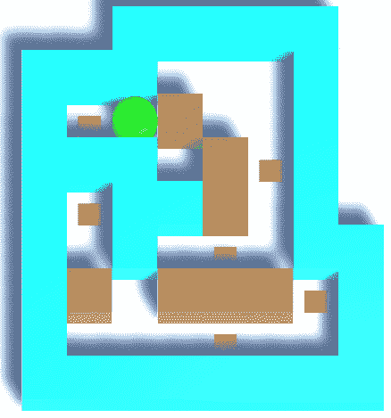
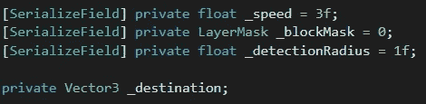
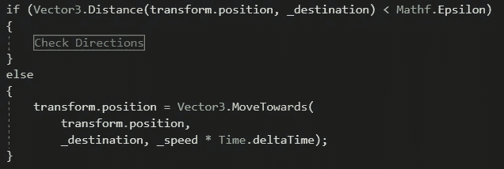
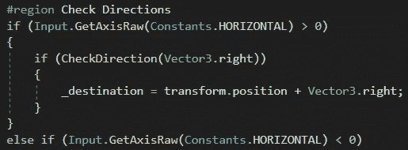
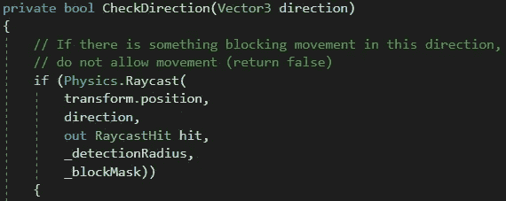
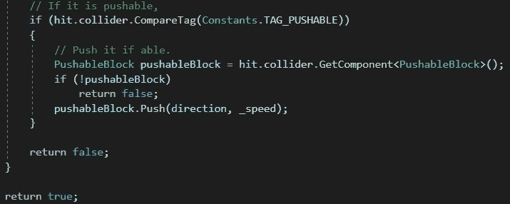

# Unity 中的网格锁定运动

> 原文：<https://medium.com/nerd-for-tech/grid-locked-movement-in-unity-e34146ee8992?source=collection_archive---------2----------------------->

**目标:**创建一个将玩家锁定在一个格子里的移动系统。

假设我们想创建一个类似于*推箱子*的推方块游戏。在这样的游戏中，玩家角色被限制为一次向上、向下、向左或向右移动一个棋子。

我们需要以下变量:

*_ 区块遮罩*将被设置为检测*区块*层上的任何东西；这将包括墙壁和我们必须推动的板条箱。

*_destination* 将被分配给玩家在 *Start* 方法中的初始位置。

在*更新*方法中，我们将检查玩家是否非常接近目的地。我们通过计算到*_ 目的地*的距离并检查它是否小于 *Mathf 来实现这一点。Epsilon* ，这是一个非常小的数字(它是一个浮点型可以具有的不为 0 的最小值)。

如果距离*不是*接近 0，我们将移动玩家到目的地，如下图 *else* 块所示。

如果玩家非常接近目的地，我们将执行上面隐藏的*检查方向*区域。

这是我们收集玩家意见的时候。四个方向中的每一个都执行相同的基本代码，将方向传递给 *CheckDirection* 方法(稍后会详细介绍)。如果该方法返回 *true* ，我们将付款人的目的地设置在那个方向。如果它返回 *false* ，那么一定有什么东西阻碍了玩家，我们将忽略他们对这一帧的输入。

在 *CheckDirection* 方法中，我们将传入要检查的方向。我们将从玩家向我们正在检查的方向投射一束光线，距离为*_ 探测半径*，忽略*块*层上*而非*的任何东西。

如果光线击中了*块*层上的对象，我们将在该对象上寻找*可按下的*标签。如果我们找不到它，我们就碰壁了，将返回 *false* ，不允许玩家朝那个方向移动。如果对象被标记为 *Pushable* ，我们将调用它的 *Push* 方法。我们不希望玩家能够移动到*可推*的空间，直到*可推*本身移动，所以我们将返回 *false* 。

如果光线在*块*层上没有发现任何东西，空间是空的，我们将返回*真*，允许玩家移动。

明天我们将学习如何推积木！