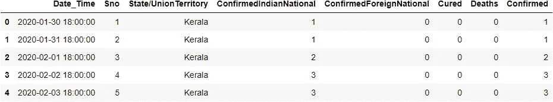
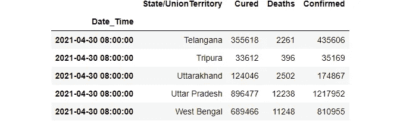
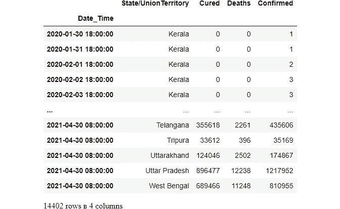
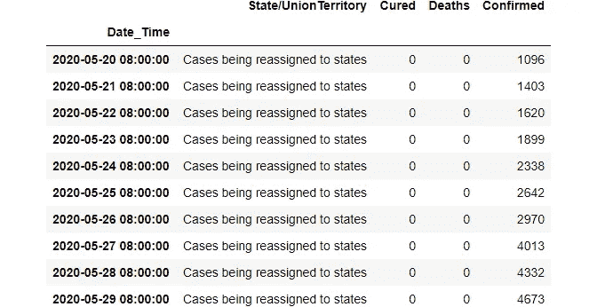
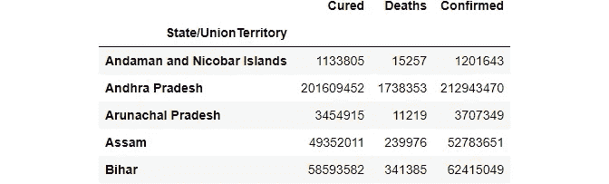
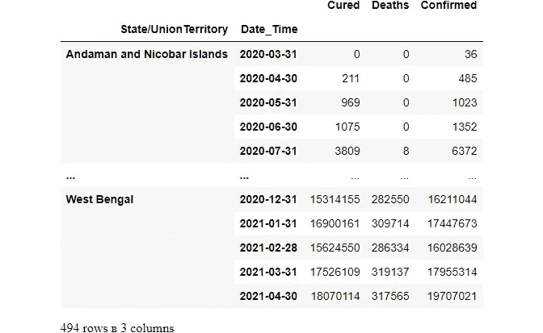
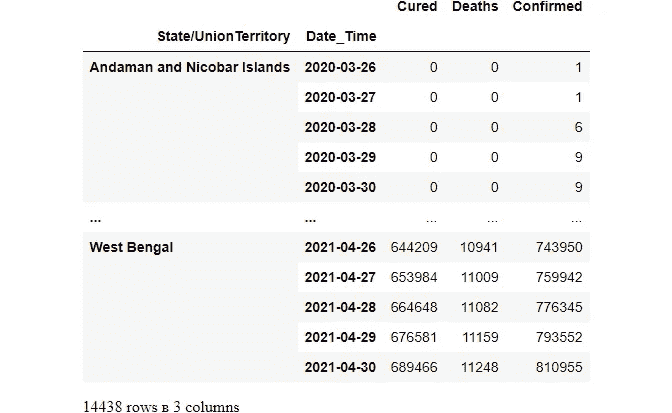
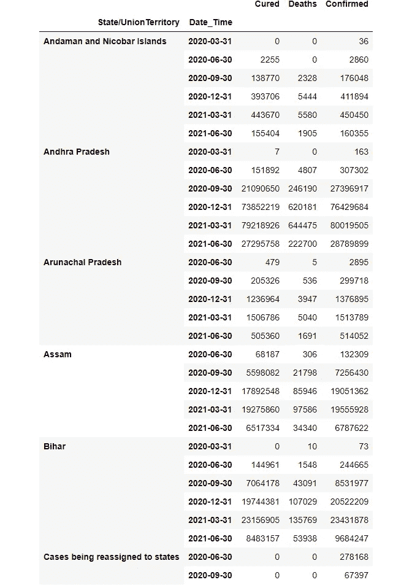
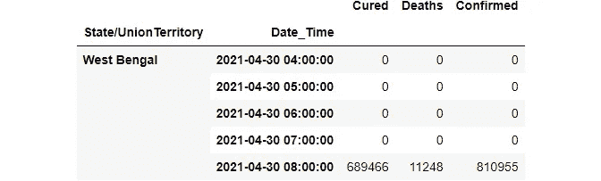

# 时间序列数据的分组和采样

> 原文：<https://medium.com/nerd-for-tech/grouping-and-sampling-time-series-data-2bafe98302ab?source=collection_archive---------1----------------------->

# 如何在 Python Pandas 中按时间间隔对数据进行分组


图像参考:[去飞溅](https://unsplash.com/photos/bnZ8_95Q8NE)

# 什么是时间序列数据:

**时间序列数据**也称**时间**-加盖**数据**，是**数据**的**序列**点按**时间**顺序索引。**时间**-盖章是在**时间**的不同点采集的**数据。这些**数据**点通常由同一来源在**时间**间隔内进行的连续测量组成，用于跟踪**时间**内的变化。**

# 我们需要对时间序列数据进行什么样的分析？

在处理时间序列数据分析时，我们需要将数据组合成特定的间隔，比如每天、一周或一个月。

# 我们如何做到这一点？

我们将只使用两个熊猫 API 来解决这些问题，即 resample()和 GroupBy()。

# 重新取样():

**重采样**()函数用于**重采样**时序数据。时间序列的频率转换和**重采样**的便捷方法。该对象必须具有类似日期时间的索引(DatetimeIndex、PeriodIndex 或 TimedeltaIndex)，或者将类似日期时间的值传递给 on 或 level 关键字。

# GroupBy():

[**GroupBy**](https://www.geeksforgeeks.org/pandas-groupby/) 是一个相当简单的概念。我们可以创建一组类别，并对这些类别应用一个函数。我们在处理大量数据和反复尝试时需要它，因此为了提高效率，我们使用 Groupby 概念。GroupBy 概念非常重要，因为它能够有效地对数据进行**汇总、** **聚合、**分组。****

# 让我们把手弄脏:

**导入和安装:**

```
#pip install openpyxl
#pip install pandas_profilingimport pandas as pd 
import pandas_profilingimport matplotlib.pyplot as plt
import seaborn as sns
```

# 关于数据集:

我使用的数据集是印度新冠肺炎案例数据集。你可以在这里找到它。

# [印度的新冠肺炎](https://www.kaggle.com/sudalairajkumar/covid19-in-india?select=covid_19_india.csv)

# [印度 2019 年新型冠状病毒疾病数据集](https://www.kaggle.com/sudalairajkumar/covid19-in-india?select=covid_19_india.csv)

[www.kaggle.com](https://www.kaggle.com/sudalairajkumar/covid19-in-india?select=covid_19_india.csv)

读取数据库并组合日期-时间

在读取 CSV 文件时，我们可以使用 parse_dates 直接组合数据和时间。

```
data = pd.read_csv('covid-19 INDIA.csv',parse_dates=[['Date','Time']]) 
data.head()
```



# 转换为日期时间格式

现在，处理任何时间序列数据的第一步是将日期列转换为日期时间格式:

```
data['Date_Time'] = pd.to_datetime(data['Date_Time'])
```

# 设置索引

```
data.set_index("Date_Time",inplace=True)
```

# 删除不必要的列

```
data.drop(axis=1, columns=["Sno","ConfirmedForeignNational","ConfirmedIndianNational"],inplace=True)data.tail()
```



```
data
```



# 生成数据集报告:快速查看完整数据集

```
report = pandas_profiling.ProfileReport(data)report
```

让我们自己按州和案例查看数据

# 我们可以使用 matplotlib 笔记本放大我们的数据

```
# %matplotlib notebookplt.figure(figsize=(10,5));
plt.scatter(x=data["State/UnionTerritory"],y=data.Confirmed);
plt.show()
```

# 找出我们拥有的独特的州/UTs 数据

```
data["State/UnionTerritory"].unique()Output:array(['Kerala', 'Telengana', 'Delhi', 'Rajasthan', 'Uttar Pradesh',
       'Haryana', 'Ladakh', 'Tamil Nadu', 'Karnataka', 'Maharashtra',
       'Punjab', 'Jammu and Kashmir', 'Andhra Pradesh', 'Uttarakhand',
       'Odisha', 'Puducherry', 'West Bengal', 'Chhattisgarh',
       'Chandigarh', 'Gujarat', 'Himachal Pradesh', 'Madhya Pradesh',
       'Bihar', 'Manipur', 'Mizoram', 'Andaman and Nicobar Islands',
       'Goa', 'Unassigned', 'Assam', 'Jharkhand', 'Arunachal Pradesh',
       'Tripura', 'Nagaland', 'Meghalaya',
       'Dadra and Nagar Haveli and Daman and Diu',
       'Cases being reassigned to states', 'Sikkim', 'Daman & Diu',
       'Lakshadweep', 'Telangana'], dtype=object)data["State/UnionTerritory"].nunique()Output: 40
```

我不认为这些“案件被重新分配到各州”行是必要的。让我们望风

```
data.loc[data["State/UnionTerritory"]=="Cases being reassigned to states"].head(10)
```



# 按州对案例数据进行分组

```
data.groupby('State/UnionTerritory').sum().head()
```



# 状态方面的实例总数

```
data.groupby('State/UnionTerritory').size().head(40)State/UnionTerritory
Andaman and Nicobar Islands                 401
Andhra Pradesh                              415
Arunachal Pradesh                           393
Assam                                       395
Bihar                                       405
Cases being reassigned to states             60
Chandigarh                                  408
Chhattisgarh                                408
Dadra and Nagar Haveli and Daman and Diu    360
Daman & Diu                                   1
Delhi                                       425
Goa                                         401
Gujarat                                     407
Haryana                                     423
Himachal Pradesh                            406
Jammu and Kashmir                           418
Jharkhand                                   395
Karnataka                                   418
Kerala                                      457
Ladakh                                      420
Lakshadweep                                 141
Madhya Pradesh                              406
Maharashtra                                 418
Manipur                                     403
Meghalaya                                   382
Mizoram                                     402
Nagaland                                    349
Odisha                                      411
Puducherry                                  409
Punjab                                      418
Rajasthan                                   424
Sikkim                                      342
Tamil Nadu                                  420
Telangana                                     1
Telengana                                   424
Tripura                                     389
Unassigned                                    3
Uttar Pradesh                               423
Uttarakhand                                 412
West Bengal                                 409
dtype: int64
```

重采样根据实际数据生成唯一的采样分布。它根据一些时间或日期信息对行进行分组

我们可以应用不同的频率对时间序列数据进行重采样。最常用的时间序列频率是

*   女:每周一次
*   m:月末频率
*   SM:半月结束频率(15 日和月末)
*   问:季度末频率
*   每小时一次
*   d:每天

# 抽样月度数据

让我们根据每月案例数据对数据进行分组

```
data.groupby('State/UnionTerritory').resample("M").sum()
```



# 按天取样

```
data.groupby('State/UnionTerritory').resample("D").sum()
```



# 四次抽样

```
data_q = data.groupby('State/UnionTerritory').resample("Q").sum().head(30)
data_q
```



```
data_q.columnsIndex(['Cured', 'Deaths', 'Confirmed'], dtype='object')
```

# 按小时分组

```
data.groupby('State/UnionTerritory').resample("H").sum().tail(5)
```



我们在 8:00 点钟有数据，因此所有其他行的值都是 0。

这是关于时间序列数据集的重采样和分组的基础知识。尝试用一些很酷的时间序列数据集来试验你自己的数据集，包括天气更新、人口普查数据等

我希望这篇教程能帮助你理解这个概念！别忘了自己尝试，不断学习。

….如果你喜欢这个博客，别忘了留下几个由衷的喜欢。

学习愉快！