# 格罗弗算法

> 原文：<https://medium.com/nerd-for-tech/grovers-algorithm-3ac4616ce23a?source=collection_archive---------2----------------------->

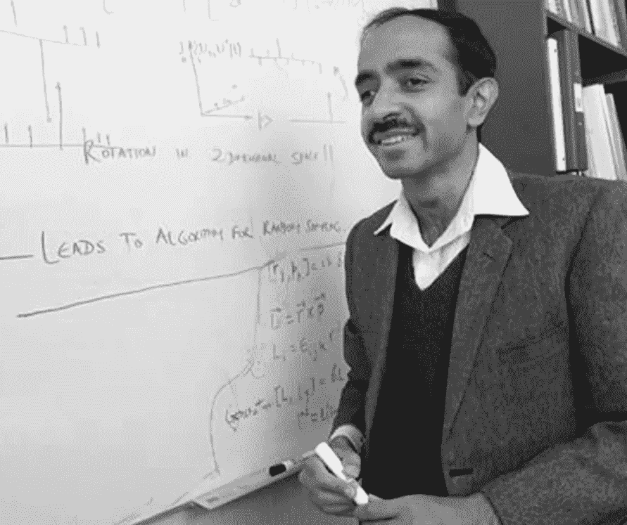

Lov Grover + Grover 算法

格罗弗算法(Grover's algorithm)是一种专为量子计算机使用而设计的搜索算法，由 Lov Grover 于 1996 年发明。这个算法展示了量子计算机在搜索数据库任务中无与伦比的速度。它还可以成倍地提高非结构化搜索的速度，但它的用途不止于此。你也可以用它作为“黑客”来二次提高许多其他算法的运行时间。这种“黑客技术”被称为*振幅放大技巧。*但首先，让我们调查一下*非结构化搜索*的问题。

# 非结构化搜索

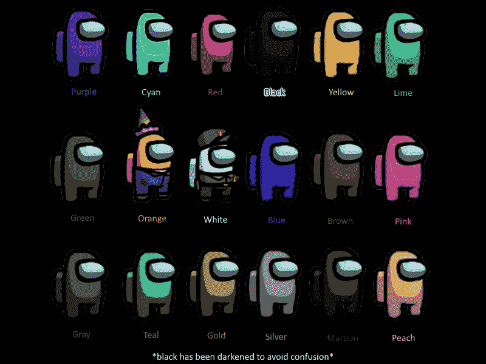

哪个是冒名顶替的？—非结构化搜索示例

假设给你一个 N 个项目的长列表(如*非常*长),其中一个项目有你希望找到的特定属性。例如，假设你有 1，000，000 名美国玩家，你希望在其他 999，999 名船员中找到唯一的冒名顶替者。

使用经典计算，需要大约 N/2(在这种情况下，1，000，000/2 = 500，000)次紧急会议(我们将坚持我们之间的类比)来揭露骗子，在最坏的情况下，所有 N = 1，000，000 次紧急会议。

但是在量子计算机上，我们可以在大约 *√N = √1，000，000 = 1，000* 次紧急会议中，借助前面提到的*振幅放大的招数，揭穿冒名顶替者。*随着列表变得越来越大(随着 N 的增加)，二次加速可以节省大量时间。好了，现在让我们来看看格罗弗的算法是如何工作的。

# 神谕

转换 N 个项目的列表的一种常见方式是根据函数 *f，*来映射它，该函数为冒名顶替者(I)输出 *f(I) = 1* ，为所有其他船员(C)输出 *f(C) = 0* 。这些输入以叠加的方式提供给量子计算机，在一个被称为*预言*的酉矩阵中。第一步是对所有船员进行二进制(0 或 1)编码 *C，I ∈ {0,1}^n，*这样 n(美国玩家中的 100 万)*= 2^n；因此，我们可以在量子计算机上用量子比特(量子比特)来表示这些信息。接下来，我们使甲骨文矩阵 *U_f* 作用于基态 *⎜C⟩* 使得 *U_f (⎜C⟩) = [(-1)^f(C)]×⎜C⟩.*注意，当输入是机组成员时，甲骨文对状态没有影响。另一方面，当神谕被应用于基态 *⎜I⟩，*它映射 *U_f (⎜I⟩) = −⎜I⟩，*从而暴露了冒名顶替者！*

# 振幅放大

很明显，在第一次见面之前，我们不知道这个冒名顶替者是谁。它可能是红色的，也可能是蓝色的，或者是 999，998 个玩家中的任何一个。这可以用一个*均匀叠加:*来表示

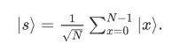

均匀叠加

就像量子比特和量子态一样，如果我们要测量状态 *{⎜I⟩}，*它会以概率 *1/N = 1/(2^n).坍缩成基态*那么我们淘汰冒名顶替者 I 的机会大约是在 *2^n.* 的 *1* 因此，我们需要召开 *N = 2^n* 紧急会议来找到冒名顶替者。请允许我介绍*振幅放大，*这就是量子计算机如何增加这种概率。基本上，它放大了冒名顶替者的振幅，缩小了所有船员的振幅。

这可以用几何学来解释，用我们正在考虑的两种状态， *⎜I⟩，*和*均匀 superposition⎜s⟩.*这些向量在向量空间 *C^n.* 中的 2D 平面上，它们并不完全垂直，因为 *⎜I⟩* 与振幅*√n*叠加。因此我们引入附加状态 *⎜s'⟩* ，它在两个向量的跨度内，并垂直于 *⎜I⟩，通过从 *⎜s⟩.移除 *⎜I⟩* 而获得**

## 步骤 0:

*幅度放大*过程从*均匀叠加*状态 *⎜I⟩.开始*在时间 *t = 0 时，*初始状态为 *⎜ψ_0⟩ =⎜s⟩.*

## 第一步:

然后我们将 oracle 反射 *U_f* 应用到状态 *U_f(⎜ψ⟩ = ⎜ψ_t'⟩.*这使得 *⎜I⟩* 状态前的振幅为负，进而降低了平均振幅。

## 第二步:

我们应用另一个关于状态 *⎜s⟩的反射*u _ s*；这个反射写为*美国= (2)(⎜s⟩)(⟨s⎜)−1.*它将状态映射到 *⎜ψ_t'⟩* 并完成转换 *⎜ψ_(t+1)⟩ = (U_s)(U_f)(⎜ψ_t⟩).**

两次反射相当于一次旋转；变换( *U_s)(U_f)* 旋转初始状态 *⎜s⟩* 更接近冒名顶替者 *⎜I⟩.由于第一次反射降低了平均振幅， *⎜I⟩* 的负振幅现在大约是其原始值的 3 倍，而船员 *⎜C⟩* 的振幅已经降低。现在我们重复这个过程几次。*

在 *t* 步骤之后，状态将变成[( *(U_s)(U_f))^t](⎜ψ_0⟩).*那么我们需要旋转多少次呢？答案大概是 *√N* 乘以*。*态 *⎜I⟩* 的幅度随应用次数线性增长，约为 *(t)(√N)。*向量空间的维数是平方根，因为我们处理的是振幅，而不是概率。因此，振幅*和*概率都在此过程中被放大。

# 格罗弗算法示例

## 电路 1: N=2，冒名顶替者= 00

量子电路是这样的:(用 IBM 量子经验创建)

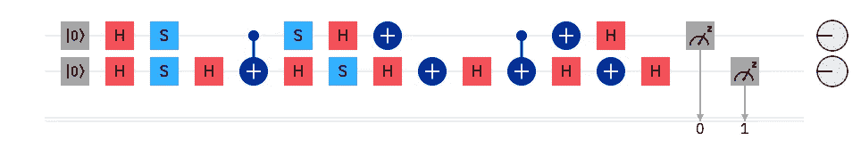

N=2，骗子= 00

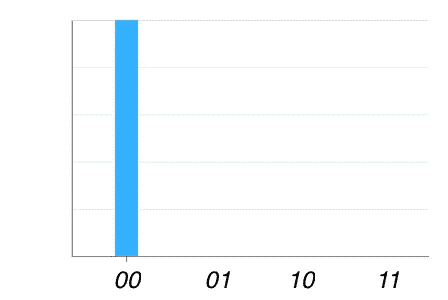

测量概率

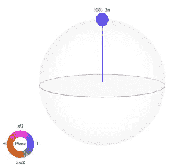

q 球表示

## 电路 2: N = 2，骗子= 01

量子电路是这样的:(用 IBM 量子经验创建)

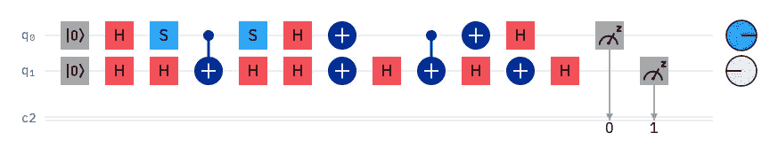

N=2，骗子= 01

测量概率

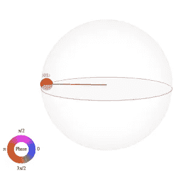

q 球表示

## 电路 3: N = 2，冒名顶替者= 10

量子电路是这样的:(用 IBM 量子经验创建)

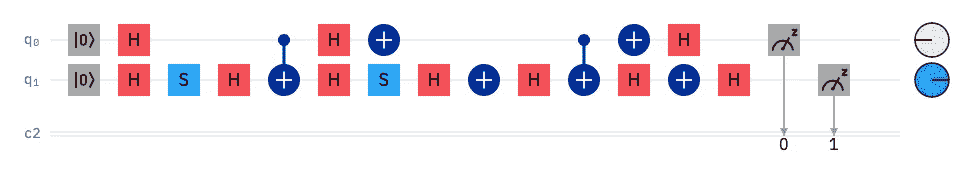

N = 2，骗子= 10

测量概率

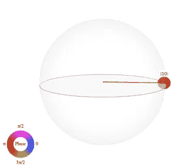

q 球表示

## 电路 4: N = 2，冒名顶替者= 11

量子电路是这样的:(用 IBM 量子经验创建)

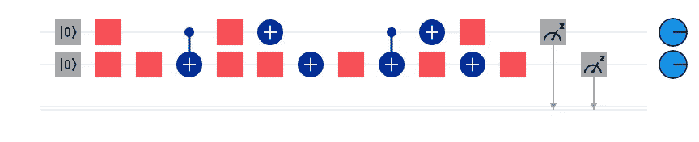

N = 2，骗子= 11

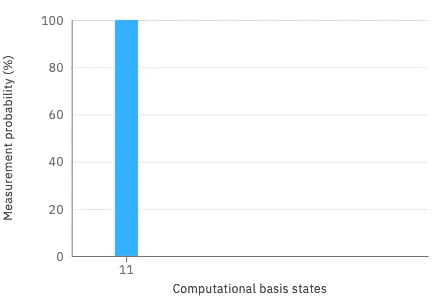

测量概率

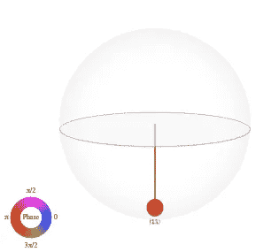

q 球表示

# 关键要点

*   格罗弗算法是量子计算机在搜索数据库时用来进行非结构化搜索的算法。
*   您可以使用它来二次改善其他算法的运行时间，使用一种称为*振幅放大的黑客技术。*
*   *振幅放大*增加在物品列表 *N.* 中找到唯一物品 *w* 的概率
*   它通过将 oracle 反射应用于均匀叠加状态(可以用几何方法表示)并重复此过程来“挑选”项目 *w.*
*   神谕是一个酉矩阵，它的输入是叠加的；输入是列表 *N、*中的项目，当提供给函数 *f、*时，函数输出 *f(w) = 1* 用于唯一项目，输出 *f(x) = 0* 用于所有其他项目。