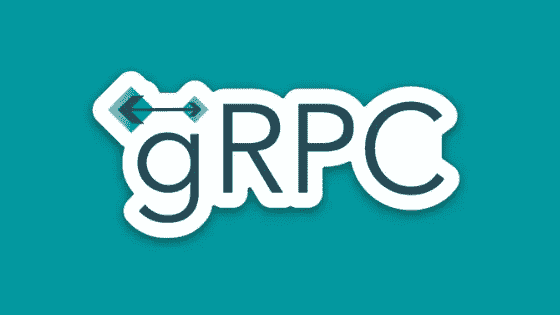

# GRPC 基础&逐步整合

> 原文：<https://medium.com/nerd-for-tech/grpc-basics-integration-step-by-step-a63a4aab5ba0?source=collection_archive---------3----------------------->

在本文中，您将了解 GRPC 的基础知识，并概述如何使用它来设置客户端/服务器微服务。



## 什么是 GRPC？

当使用微服务时，有许多事情需要担心，例如数据的类型和大小、端点结构、响应的延迟…这可能会使开发 API 变得更加困难，但在它的核心，我们想要做的是发送请求并获得响应。因此，我们有远程过程调用(RPC)。使用 RPC，您基本上是从服务器调用一个方法来获得结果，而不必处理端点、数据类型和大小等。服务器处理所有这些&给你你所需要的。

可以这样想:你正在给你的母亲发一封电子邮件，让她给你烤些饼干，然后寄回给你。这是 RPC 的核心。由于你母亲不会为除家人以外的任何人烤饼干，我们必须配置身份验证，以便能够向服务器发送请求。

gRPC 是 Google 远程过程调用的简称，是 Google 的一个开源 RPC 框架。

## 入门指南

谷歌有一套叫做**协议缓冲区**的工具。他们所做的基本上是获取数据，将其序列化为二进制，然后将其转换为任何需要的格式。如果你不熟悉协议缓冲区，我建议你先阅读[这篇两分钟的简化文章](/@gamzeyilan1/protocol-buffers-in-two-minutes-6b8f908efe5)。

为了使用 gRPC，我们需要用一个. proto 文件来定义使用上述协议缓冲区的消息和服务。剩下的代码将自动生成，从那时起我们要做的就是实现它。

使用 gRPC 的好处可以总结为:

*   与 Apache Kafka 和 Redis 等其他消息代理不同，gRPC 提供了类型安全。也就是说，如果你以 JavaScript 对象的形式请求响应，那么它会返回一个 JavaScript 对象给你，谢谢你的协议缓冲区，如果你向你妈妈要巧克力饼干，她会给你烤巧克力饼干，而不是香草饼干。
*   由于 gRPC 将数据转换为二进制并以这种方式传输，因此它提供了更快的传输速度。
*   客户端代码是自动生成的，可用于大多数语言。
*   使大量微服务之间的通信变得更加容易，并通过智能感知获得功能。

## 使用 gRPC

我们现在可以开始实际使用 gRPC 了，出于本教程的目的，我将向您展示如何在两个 NestJs 微服务上实现 gRPC。

对于将作为服务器工作的每个微服务，您可以重复以下步骤:

*   在我们开始之前，将@grpc/proto-loader 安装到您的项目中。对于 node 你可以使用[这个链接](https://www.npmjs.com/package/@grpc/proto-loader)来看看如何安装。
*   转到您的 main.ts 文件(或基于您的语言，以该文件为基础)并从**“路径”**导入**join**；

```
import { join } from 'path';
```

*   转到 createMicroservice 函数的等效函数，并将 transport 设置为 gRPC as

```
transport: Transport.*GRPC*,
```

*   此时，我们将利用前面提到的协议缓冲区。如果还没有，请创建。原型文件。原型文件基本上是一个简单的类型定义文件，你可以通过点击[这里](/nerd-for-tech/protocol-buffers-in-two-minutes-6b8f908efe5)学习如何在两分钟内创建一个。
*   添加您的。原始文件作为原始路径；

```
protoPath: join(__dirname, '../src/protoFileName.proto');
```

*   下一步是修改我们的控制器。基本上，转到主控制器(NestJs 中的 app.controller ),在构造函数中创建下面的方法，将 proto 文件映射到控制器:

```
@GrpcMethod();
```

*   从这一点开始，确保您的微服务中的所有对象模型都以正确的格式存储在 proto 文件中，并在每个控制器中使用，以便 gRPC 可以实际确认它进行转换和传输。

现在，为了创建将作为订阅者工作的微服务，我们必须做一些更改:

*   如果您已经有了一些基于消息的协议，现在您可以从您的项目中删除它们，因为您不再需要它们了。
*   执行我们为服务微服务执行的步骤，包括为订阅微服务安装原型加载器。proto 文件和 transport & protoPath 也应该与服务文件完全相同。
*   在项目文件夹下，创建一个 gRPC 接口文件(对于 NestJs，应该是 grpc.interface.ts)。在中，为包含方法的 gRPC 服务创建一个接口，为来自原型文件的对象创建接口，如下所示:

> 导出接口 IGrpcService{
> 
> function name(object name:object name):可观察的<any>；} //objectName 应该是该方法采用的任何对象</any>
> 
> 接口对象名称{
> 
> … };

*   转到您的主控制器，不像我们在服务微服务中那样实现 Grpc 方法，而是添加 ClientGrpc 和 IGrpcService，如下所示:

> 从“”导入{IGrpcService}。/grpc . interface '；
> 
> 从“@nestjs/microservices”导入{Client，ClientGrpc }；
> 
> @客户端(微服务选项)；
> 
> 私人客户 ClientGrpc。
> 
> private grpcService:IGrpcService；

*   在同一个控制器中，在构造函数(或 ngOninit、OnModuleInit，无论您喜欢什么)内部，将 grpc 服务初始化为:

> 构造函数(){
> 
> this . grpcservice = this . client . getservice<igrpcservice>(' service name ')；}</igrpcservice>

我们完事了。现在，您可以像这样使用 grpc 服务中的函数和数据对象:

> this . grpcservice . function name()；