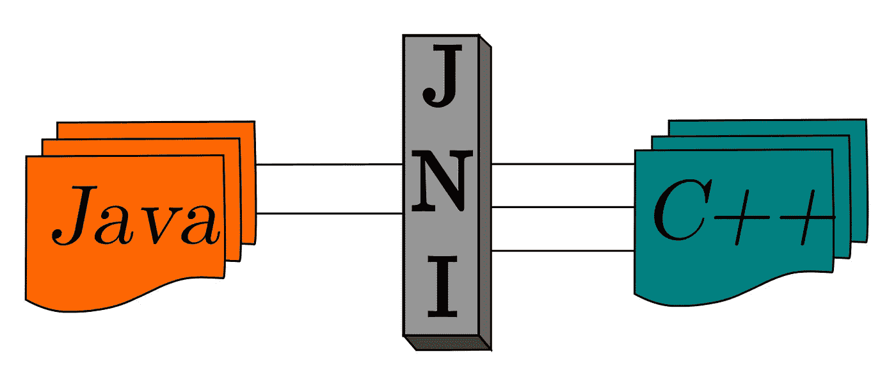
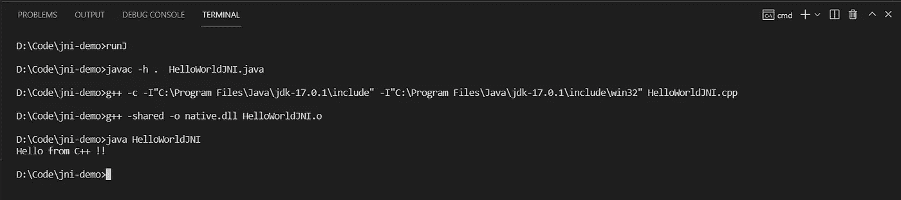

# JNI 指南(Java 本地接口)

> 原文：<https://medium.com/nerd-for-tech/guide-to-jni-java-native-interface-5b63fea01828?source=collection_archive---------2----------------------->

你有没有想过“我们可以从 Java 代码中调用 C/C++代码吗？”是的，我们可以使用 JNI，一个由 JVM 提供的接口，让你的 java 代码调用本地 C/C++代码。

最近，我发现我的朋友在 JNI 实习，并被它所提供的价值深深吸引。价值？我们究竟为什么需要在 Java 代码中调用 C/C++代码？

我们都知道 Java 是独立于平台的(编写一次，在任何地方运行),但是它是有代价的，与本地代码相比，它的性能降低了。假设你想写一个像本地代码一样高效运行的 fast⚡程序，或者你想使用一个 c 库提供的 Java 中没有的功能。当然，你可以用 Java 重新编写整个 C 库，但你不想再从头开始，JNI 会支持你的。

> 我写这篇文章的主要原因是，我和我的朋友**在试图从网上复制一个简单的 JNI 程序时失败了很多次**，我不希望你经历我们已经经历过的艰难历程。

我将在 windows 中演示这一点。但是一旦你理解了如何把这些点联系起来，它就很容易在任何操作系统中复制。

**先决条件**:

> Java 和 g++/gcc 应该安装在你的 pc 上。
> 
> [**JAVA_HOME**](https://confluence.atlassian.com/doc/setting-the-java_home-variable-in-windows-8895.html) 变量应该被设置。
> 
> [**JDK 的**宾](https://www.javatpoint.com/how-to-set-path-in-java) & [MinGW g++](https://stackoverflow.com/questions/48612744/how-to-add-g-from-mingw-to-path/48828104) 应该在你的道路上。

## 1.用**本机**关键字声明一个函数。

*   我们正在加载一个名为 ***native 的 dll 库(*** 它可以是任何名字)。之所以把它放在一个静态块中，是因为我们需要在我们的类被加载后立即加载库。

运行以下命令

> 贾瓦茨-HelloWorldJNI.java

*   -h . —创建一个头文件，其中包含我们在 java 文件中声明的所有本机函数声明。圆点表示应该在当前目录下创建文件。

它将生成一个名为“HelloWorldJNI.h”的头文件，该文件声明了一个与 sayHello()具有相同签名(JNI 风格)的函数。

下面是**自动生成的** **头文件** **文件**(去掉所有注释后)

## 2.创建一个 CPP 文件并从中生成一个目标文件。

现在我们要创建一个 C++文件，它有一个与“HelloWorldJNI.h”中的方法签名相同的函数。(从头文件复制粘贴签名，ctrl+C/ctrl+V 我们最喜欢的东西)

确保函数签名是相同的。

*   在这个 c++文件中，我们试图从我们的 JNI 风格的 c++函数中调用一个本地方法(*【say hello()*)。
*   确保包含“HelloWorldJNI.h”头文件。(否则，您将得到**不支持链接错误**
*   如果你使用的是任何代码编辑器， *#include < jni.h >* 可能会带有弯弯曲曲的红线下划线，这是因为你的 IDE 找不到 *jni.h* 文件，相信我，一旦我们在编译时包含路径，它就会消失。

运行下面的命令，

> **g++-c-I " % JAVA _ HOME % \ include "-I " % JAVA _ HOME % \ include \ win32 " hello world JNI . CPP**

*   -c —输出一个对象文件(。o)
*   -I-指定一个包含目录

> " % JAVA _ HOME % \ include "-路径包含 jni.h 文件

我们将得到一个目标文件(HelloWorldJNI.o)作为输出，我们将使用它来创建一个 dll(动态链接库)文件。

## 3.从目标文件创建一个 dll 文件

运行下面的命令，

> g++-共享-o native.dll hello world JNI . o

*   -shared-创建共享库文件(windows 中的 dll 文件)
*   -哦，native.dll-把它命名为 native.dll
*   确保 dll 文件的名称与从 java 程序加载的名称相同。

现在你会在当前目录中看到一个 native.dll。

## 4.执行 Java 文件

现在我们有了运行 Java 程序的一切。运行下面的命令，或者在任何 IDE 中将它作为 Java 程序运行。

> java HelloWorldJNI

是的，我们完成了，“你好，来自 C++！!"会被输出到你的终端。

# 额外收获:让我们让您的生活更加轻松

如果你不断地改变你的 c++代码，不断的链接和编译会变得非常乏味。所以让我们创建一个批处理文件，

将该文件另存为 **runJ.bat**

你只需要在你的控制台中键入 **runJ** 。所有的命令都会为你逐一执行，这就是批处理文件的妙处。

我希望你在本教程中学到了一些新的东西，不要再后悔为什么在早期学习 C/C++。为了更好地了解 JNI，我强烈推荐这篇文章。

> 奇怪的错误:如果你得到一个错误，试着在 cmd 而不是 powershell 中运行它(在 vs 代码中)

拍手声👏👏如果你喜欢这篇文章，并与你的朋友分享，如果他们也在实习中做 JNI 任务😂。