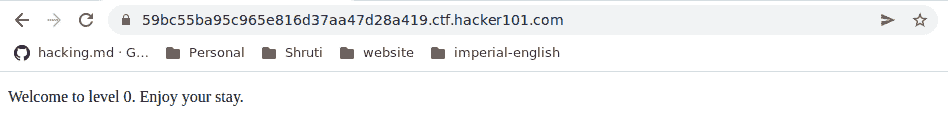
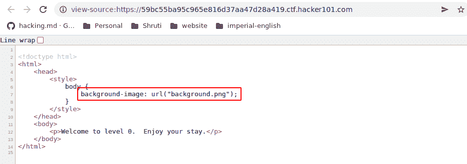
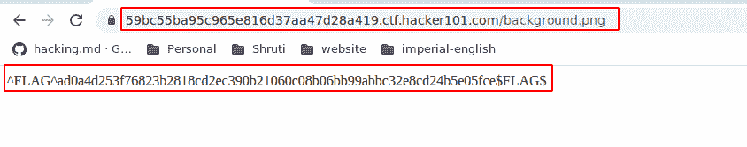

# 黑客 101:让你开始演练的一点小东西

> 原文：<https://medium.com/nerd-for-tech/hacker101-a-little-something-to-get-you-started-walkthrough-46397befe1b?source=collection_archive---------5----------------------->

大家好，欢迎来到 SecPy 社区。我们正在进行一个系列，在这个系列中，我们将分享来自 HackerOne 的 CTFs 的方法。CTF 是教黑客如何在一个安全、有益的环境中进行黑客攻击的游戏。现在，我们将带您浏览实验室的“入门指南”。说到这里，让我们深入研究一下我们的任务。这篇报道由 [anshul vyas](https://www.instagram.com/_ansh_vyas/) 为您带来。一定要在他的中等身材上给他一个大呼小叫。您可以通过此链接进入 https://ctf.hacker101.com/ctf/start/1 CTF:。

# 通过旗帜的步骤

**第一步:**当我们登录时，我们会看到这样的界面

**步骤 2:** 右键单击并转到查看页面源代码(检查元素)

**第三步:**添加网址— /background.png(调查)

# 结论

我们的实验到此结束，这就是我们的内容。如果你喜欢读这篇文章，请在我们的网站上查看更多的文章。如果您在任何解决方案方面遇到任何问题，请随时联系我们。如果你真的喜欢这篇文章，那么就在[脸书](https://www.facebook.com/secpycommunity01)、[推特](https://twitter.com/SecPyCommunity)上关注我们，并在 [LinkedIn](https://www.linkedin.com/company/secpy-community-pvt-ltd/mycompany/) 上与我们联系。我们的公司 SecPy Community 旨在通过在 Web 应用程序和 Android 应用程序领域提供安全服务，在好奇心的帮助下改变整个网络安全和道德黑客环境&构建突破性的解决方案。我们还有一个[网站](https://secpycommunity.in/)，你可以在那里了解更多。在那之前，我们这边再见，祝你黑客愉快。