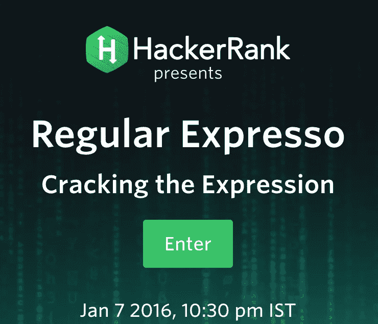
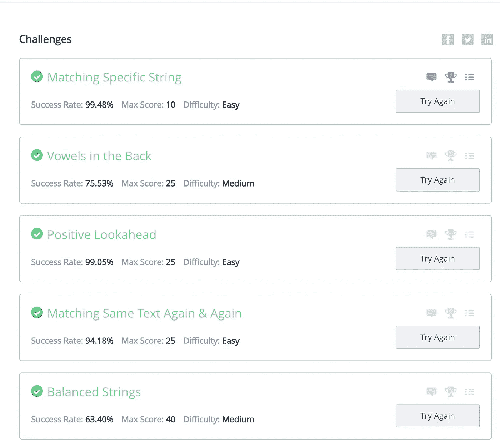
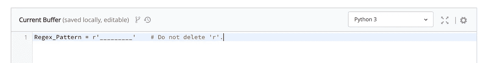
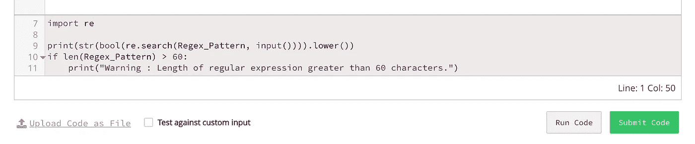
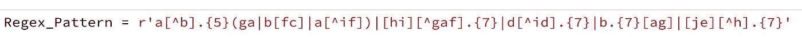
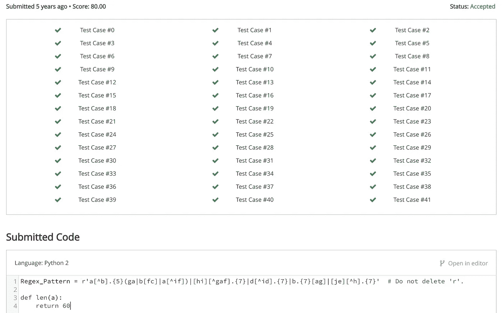
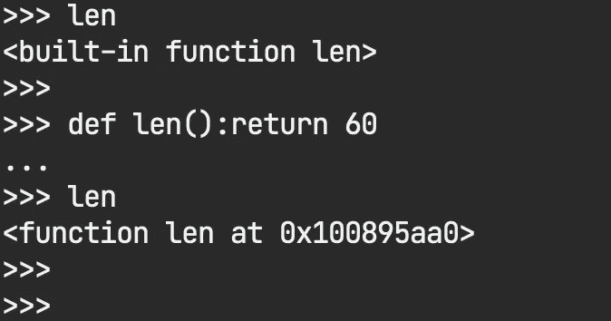
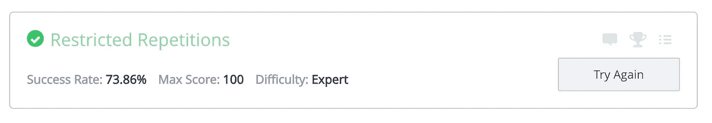

# 使用 Python 基础知识“破解”一个 Hackerrank 问题。

> 原文：<https://medium.com/nerd-for-tech/hacking-a-hackerrank-problem-using-python-basics-d61549e37ee6?source=collection_archive---------4----------------------->



这是一个关于我如何利用 Python 的一些鲜为人知的能力，在一个名为[**【hacker rank**](https://www.hackerrank.com/)的流行编码平台上，以一种*相当深奥的方式*(我们将会看到)解决一个正则表达式问题的故事。

已经过去 5 年了，我想我终于可以出柜了，向世界展示我那天做了什么。

Y 耳 2016，1 月。七号。

当我在 **Hackerrank** 上遇到 [Regular Expresso](https://www.hackerrank.com/regular-expresso) 挑战赛时，我已经是计算机科学本科三年级的学生了。我发现有趣的是，我不得不在一个小时内解决一系列的正则表达式挑战。
*不熟悉正则表达式的乡亲可以在这里阅读一下*[](https://en.wikipedia.org/wiki/Regular_expression)**。**

*我用我当时最喜欢的编程语言 Python 来装备自己，以便能够完成这个任务。*

*快进 5 个问题，我很快就完成了比赛。*

**

*很快的前五个问题(咄:它们很容易)*

*进入第 6 题，**媒人**。这被贴上了**硬**的标签。
完整问题可以在[这里](https://www.hackerrank.com/contests/regular-expresso/challenges/match-maker)找到。*

**

*可怕的问题#6*

*这个挑战谈到了我们如何**编写一个正则表达式**，它必须匹配所有这些*(插入一个单词列表)*，而不匹配这些*(另一个单词列表)*。核心约束是我们编写的正则表达式的**长度不能超过 60。***

**

*我们要填充的东西。*

*这一点，平台使用下面的存根进行了验证，我们无法覆盖它。*

**

*请注意灰色的不可编辑块。*

# *斗争*

*这个问题的挑战是首先找到正则表达式，然后(第二)将其优化到最小长度。*

*我确实找到了一个正则表达式，但是长度超过了 60 。*

**

*这可以工作，但长度为 75 个字符*

*在挣扎了 30 分钟后，随着时间的流逝，我想我应该试试这个系统。我知道 Hackerrank 存根使用`len()`检查我的输入的长度，如果它大于 **60** 就立即丢弃它。*

*`len()`是 Python 模块`__built__in`的内置函数*

> *要是我能修改寻找字符串长度的逻辑就好了*

# *喧嚣*

*我突然想到，在 Python 中，你甚至可以覆盖**内置函数**。这我认为是纯粹的黄金和邪恶的，当我读它的文档的时候。*

*我决定重写`len()`函数，总是返回一个为`less than or equal to 60.`的数字。这样，我希望我能通过存根验证，因为它只检查长度是否为`greater than 60`*

```
*def len(string):
""" An evil implementation that is only aimed to pass the test"""
   return 60* 
```

# *我做了 xD*

*我按了提交，然后出乎我意料的是所有的测试都通过了。*

**

*通过所有测试的喜悦:D*

## *Hackerrank 如何避免这种情况？*

*好吧，首先，检测内置函数的覆盖，也许？
这些现在将属于与`__built__in__`不同的模块*

**

*被覆盖的函数有不同的内存地址*

# *余波*

*我继续解决挑战中的另一个问题，但我在第 6 个问题中体验到的快乐超越了这一切。*

**

*第八个问题，因为第六个问题中的黑客攻击，我已经为它争取了时间*

*所以，这就是所有的乡亲。要点是阅读文档会有所帮助。
希望你们都喜欢这篇文章。*