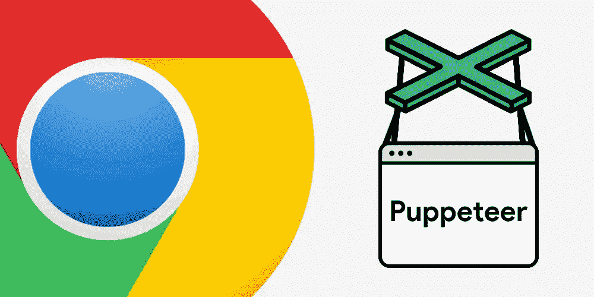

# 黑客 Rendertron 和木偶师——如果你在互联网上安装一个浏览器，会发生什么

> 原文：<https://medium.com/nerd-for-tech/hacking-puppeteer-what-to-expect-if-you-put-a-browser-on-the-internet-6c3dad0756db?source=collection_archive---------5----------------------->

tldr:如果你为测试之外的事情运行无头浏览器，你应该在设计设置时期望它们会被拥有。无头浏览器可以像普通浏览器一样被利用，它们的问题不会出现在 CVE 扫描器中，而且很可能你在没有沙盒的情况下运行它们。即使它们不可开发，你也一定要考虑 SSRF。

我不知道你是怎么想的，但是这些天来我正在做的任何项目都以这样或那样的形式使用了无头浏览器。通常一些*让我们只让它工作*刮，爬或渲染解决方案。无头浏览器功能强大，我完全能理解为什么。然而，这是为数不多的情况之一，我，你的自由安全家伙，是在事情的谨慎一方。

> 因为，我知道这令人震惊:无头浏览器就是浏览器。这意味着它们应该运行代码。

平庸的风险:如果你在后台运行一个无头浏览器，你应该预料到它们会被拥有。如果您在测试中运行它们，这可能不是问题，但是如果您在 prod 中运行它们，您肯定会:

**让自己难以拥有**

*   运行最新版本的浏览器，至少每周更新一次，而不仅仅是软件包版本附带的内容
*   运行浏览器*而不*禁用沙盒，不像[基本](https://cloud.google.com/architecture/serverless-web-performance-monitoring-using-cloud-functions#collecting_page_performance_metrics) [搜索结果](https://stackoverflow.com/a/62348133)会告诉你的那样，也不像普通 docker [图像](https://github.com/dockette/rendertron/blob/master/rendertron/Dockerfile)会设置的那样。**请注意，**[**Rendertron**](https://github.com/GoogleChrome/rendertron)**项目中的默认设置，基于木偶师的渲染解决方案，也是易受攻击的，**使用旧浏览器和无沙箱运行。在文章的最后有更多关于这个的内容。
*   确保人们可以将它们指向互联网上的任何站点。比如让你的渲染器对人们开放。[不像](https://www.shodan.io/search?query=rendertron) [这些](https://www.zoomeye.org/searchResult?q=rendertron) [的家伙们](https://censys.io/ipv4?q=Rendertron)。

实际上 [**的木偶师描述**](https://github.com/puppeteer/puppeteer/blob/main/docs/troubleshooting.md#setting-up-chrome-linux-sandbox) **对于硬化来说是相当不错的**，就像谷歌的这个[。](https://paul.kinlan.me/hosting-puppeteer-in-a-docker-container/)

**您已经处理了所有权限升级**

*   避免在共享的基础设施上运行它们，比如 Kubernetes，攻击者可以利用它们转向你的其他东西。
*   运行足够紧密的网络，使其无法访问任何本应只属于内部的内容。
*   除了可能是转储其收集的数据的接收器之外，没有对任何东西的访问/凭证。

**努力坚持**

*   在每次会话后丢弃运行浏览器的容器

如果你看完列表后对你的设置没有疑问，抱歉浪费了你的时间，你可以在这里停止阅读。

## **是的，这些可能是改进，但是常见问题解答**

1，我有一个 **CVE 扫描器**，它会告诉我容器中的漏洞。它肯定会让我知道 chrome 是否有漏洞！

不完全是。我检查过的 CVE [扫描仪中没有一个会真正检查捆绑版本。](https://github.com/gmatuz/itsallgood/runs/2415495270)

这是 docker 和 headless 浏览器，浏览器漏洞不会真的起作用，不是吗？

仅仅因为他们在 docker，就没有神奇的理由让他们不工作。唯一的问题是，大多数浏览器漏洞都是针对 Widnows 编写和测试的，但是 chrome/chromium/v8 漏洞可以跨不同的操作系统工作。bug 本身通常是跨平台的。

3、什么是 SSRF？在浏览器中运行任意的 Javascript，你能做什么？

嗯，像 [Cloudflare Workers](https://workers.cloudflare.com/) 这样的产品实际上只能做到这一点，你会惊讶于你能做到什么程度。所以你可以做很多事情。通常，您不能访问文件系统，并且在协议方面仅限于 HTTP 类型的请求。你可以试着在网络中继续旋转。例如，作为 2019 年的经典之举，前往 kublet。

## **五旬节派**

阅读 Vasilii Ermilov 的这篇文章，因为它有更好的描述和开发思路。你既得到了一步一步的学习，也获得了一些好的灵感。

如果你正在进行 pentesting，并且你已经做到了，我的建议是，如果你可以进入一个无头浏览器，首先点击 SSRF:使用一些好的旧的 [XSS](https://github.com/beefproject/beef) 或 [SSRF](https://github.com/swisskyrepo/SSRFmap) 开发框架，使侦查更容易。在 Vasilii 的博客中有很多好主意，关于你可以尝试升级的常见问题:实例元数据端点、chrome 调试接口等等..

如果你决定先做一些本地测试，试试 chrome 版本的[。即使你的 metasploit 用完了记住，大多数 chrome 漏洞都是在 V8 中，所以应该跨平台工作。github](https://www.chromium.org/getting-involved/download-chromium) 上有相当多的[POC，通过一些爱、调试和咖啡，你可以让它们为你的情况工作。不过你会需要这些，大多数 chrome 漏洞将在 win/osx 上测试，容器几乎都是 linux 的(通常基于 debian)。另一方面，版本通常非常过时，大多数人用`--no-sandbox`在 docker 中运行 chrome，所以在大多数情况下你不需要沙盒逃逸。在 ubuntu 上的 dockerised chromes 中工作的不需要任何修改的资源中心更多，例如](https://github.com/Goyotan/CVE-2020-6468-PoC/blob/master/cve-2020-6468-no-sandbox.html)[CVE-2020–16040](https://github.com/rapid7/metasploit-framework/pull/15007)和非常不一致的[CVE-2020–6507](https://github.com/rapid7/metasploit-framework/pull/14060)。

如果你是在一个 pentest 的最后一个午夜轮班，你仍然想得到一些异国情调的发现，注意到 rendertron 在一个响应标题和谷歌“exploit rendertron”让你在这里:你会有一个更困难的时间，但如果你在页面中找到一个开放的重定向或存储的 XSS，可以让 Rendertron 为你击中它，你仍然可以得到很高的发现！

## 放弃

与 Rendertron 最新版本相关的安全问题已于 2021 年 4 月 9 日与 Google 分享。我决定在通常的 90 天宽限期后发表这篇文章。我没有得到任何修复的时间表，在我看来，[发布的](https://github.com/GoogleChrome/rendertron/issues/697)[建议](https://github.com/GoogleChrome/rendertron/issues/698)符合这篇文章提出的观点。有鉴于此，我认为人们越早了解这些预防措施越好。此外，有一些修复/解决方法可以使用，而且没有明确的时间表，这些将被纳入一个版本。

如果您运行的是最新版本的 Rendertron (3.1.0 ),您应该:

*   确保攻击者无法控制 Rendertron 运行的 Javascript。不要**将它直接暴露在互联网上，限制它将呈现的域，在呈现包含用户控制内容的页面时要小心。**
*   使用尚未合并的 [PR](https://github.com/GoogleChrome/rendertron/pull/683/files) 中的版本运行 Chrome 的最新版本，或者手动将 Chrome 更新到最新版本，如木偶师[文档](https://github.com/puppeteer/puppeteer/blob/main/docs/troubleshooting.md#running-puppeteer-in-docker)中所述。确保你经常重建 Docker 镜像，Chrome 漏洞经常出现
*   不要用无沙箱选项运行 Chrome

请记住，如果您在应用程序引擎上的 Google Cloud 中部署 Rendertron，如存储库 **中描述的[，它将在没有沙箱](https://github.com/GoogleChrome/rendertron#deploying-to-google-cloud-platform)**的情况下运行。我找不到任何解决方案或变通办法。您可以决定运行它 [Flex 版本的 App Engine](https://cloud.google.com/appengine/docs/flexible/custom-runtimes) ，在那里您可以提供自己的 Docker 映像，为您提供一个进行上述强化的选项。然而，由于[较长的启动时间](https://cloud.google.com/appengine/docs/the-appengine-environments)，这可能不适合大多数用例。

如果您决定将它与标准应用程序引擎一起使用，您应该应用前面概述的措施(限制网络访问、IAM 权限等..)

# 谢谢！

本文基于与卡勒姆·麦克唐纳****[**索特·霍瓦特**](https://www.linkedin.com/in/zsolte) 共同完成的研究工作。谢谢先生们的帮助！****

****大部分繁重的工作是由 Rajvardhan Agarwal 编写并添加 metasploit 模块。****