# 手机黑客工具

> 原文：<https://medium.com/nerd-for-tech/hacking-tools-for-your-cell-phone-a259eeb29660?source=collection_archive---------1----------------------->

在这种情况下，我想分享一些工具，如果您致力于寻找漏洞，这些工具会非常有用。

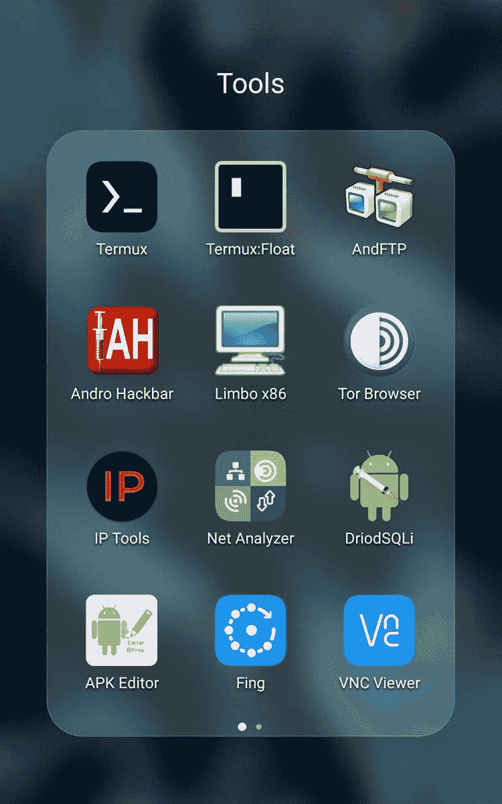

[https://twitter.com/_Y000_/status/1253415099580035072](https://twitter.com/_Y000_/status/1253415099580035072)

## 泰尔穆克

> T2:ermux 是一个 Android 终端模拟器和 Linux 环境的应用程序，不需要启动或设置就可以直接工作。自动安装一个最小的基本系统——使用 APT 软件包管理器可以获得附加的软件包。
> 
> [https://termux.com/](https://termux.com/)

Termux 是一个 linux 终端模拟器，它是利用 android linux 系统的一个很好的选择，因为它可以安装几乎任何本机 linux 工具，我强烈推荐它和 termux float 一起使用，它允许我们在一个小版本中使用我们的终端

您可以从以下链接下载它:

[https://play.google.com/store/apps/details?id=com.termux](https://play.google.com/store/apps/details?id=com.termux)

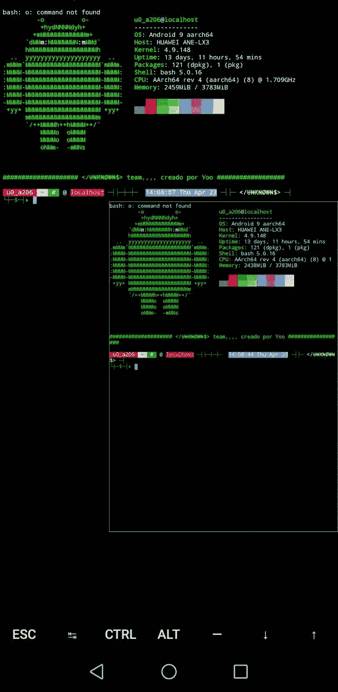

## 和 FTP

这个应用程序允许我们连接到 FTP，SFTP，FTPS 服务器…等等，我知道他们也可以从 termux 访问，但这个应用程序，我们使它更容易和更快，一个非常友好的界面，它工作得很好！

您可以从以下链接下载它:

[https://play.google.com/store/apps/details?id=lysesoft.andftp](https://play.google.com/store/apps/details?id=lysesoft.andftp)

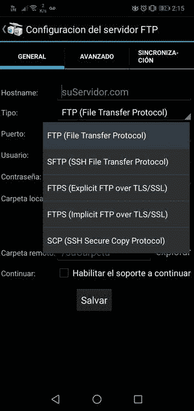

## Andro Hackbar

这是我在漏洞测试中最常用的应用程序之一，它将帮助我们测试和自动化注入，无论它们是 sql、xss、lfi …编码为多种格式，以及许多非常有用的扫描！

您可以从以下链接下载它:

 [## 安卓版安卓 Hackbar——APK 下载

### Andro Hackbar 是一款专为 android 打造的网络渗透工具，你可以在其中执行 SQL 注入、XSS 和 LFI 漏洞…

m.apkpure.com](https://m.apkpure.com/es/andro-hackbar/zyberph.hackbar.zk) 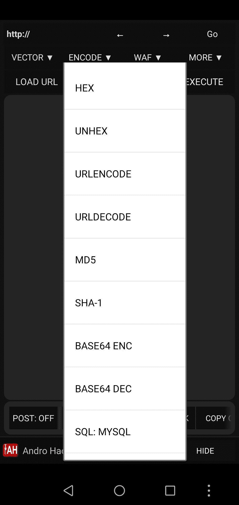

## IP 工具

这是我分析我的网络的最爱之一，因为它允许我们对我们的连接进行非常完整的扫描。它还允许我们扫描到其他地址。

您可以从以下链接下载它:

[https://play.google.com/store/apps/details?id=com.ddm.iptools](https://play.google.com/store/apps/details?id=com.ddm.iptools)

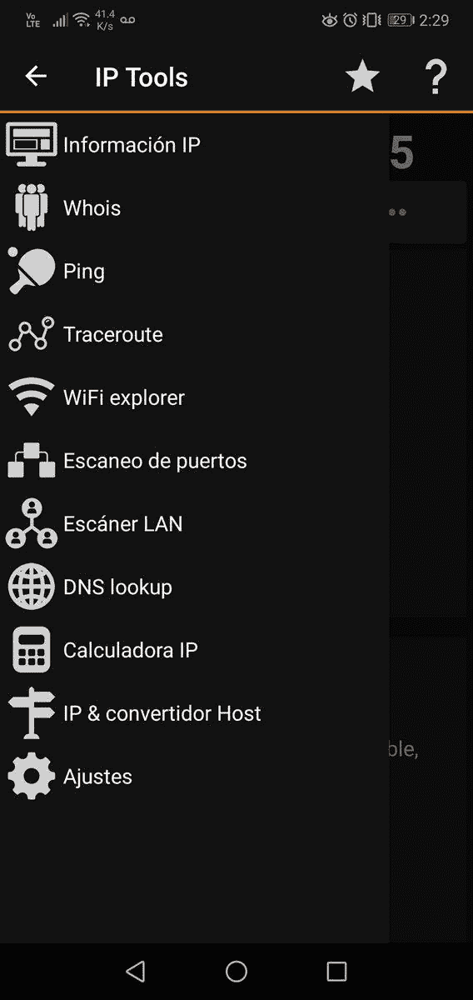

## 网络分析器 y Fing

这两个应用程序实现了相同的功能，它们允许我们分析我们的网络，但它们也帮助我们扫描其他网络，如果您不希望或没有在您的设备上安装 nmap，它会很有用

https://play.google.com/store/apps/details?id = net . techet . net analyzer lite . an

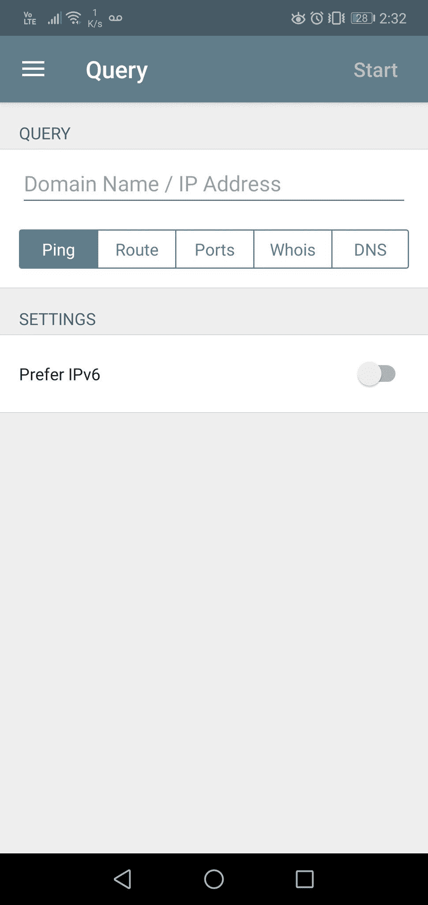

https://play.google.com/store/apps/details?[id = com . overview . Android . fing](https://play.google.com/store/apps/details?id=com.overlook.android.fing)

## DroidSQLi

这个应用程序允许我们通过自动化过程和自动转储内容来“测试”易受 sqli 攻击的页面(当然是在各自许可的情况下),它可以很好地应对基本的 sql 攻击…但是 sqlmap 更好

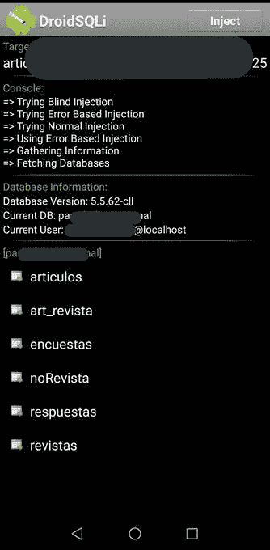

link para descargar:

 [## Droid SQLi 1.0 —免费提供的机器人 APK

### 2010 年 7 月(30 伏)——免费提供 descar gar Droid SQLi para Androidúltima 版本。Droid SQLi permite 实现程序

www.malavida.com](https://www.malavida.com/es/soft/droid-sqli/android/#gref) 

## 移动 SSH

这个应用程序允许我们连接到远程 SSH 服务器并从它们工作

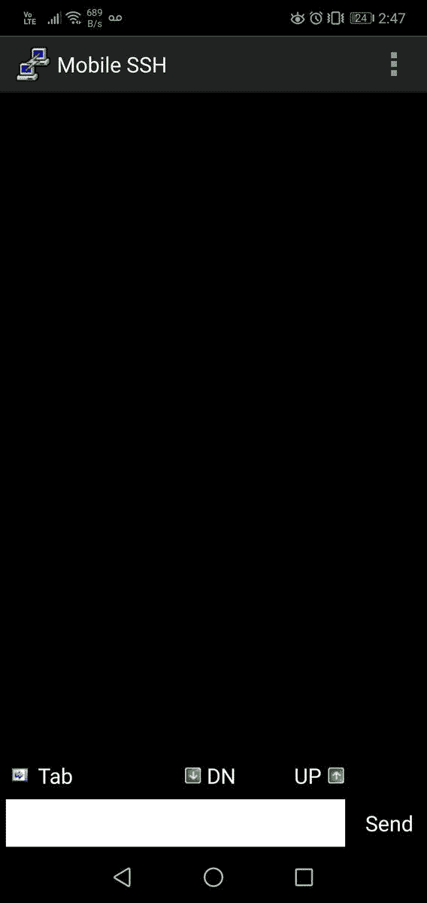

## Sqlmap

自动化 sql 注入攻击的工具，我们将把它安装在 termux 内部

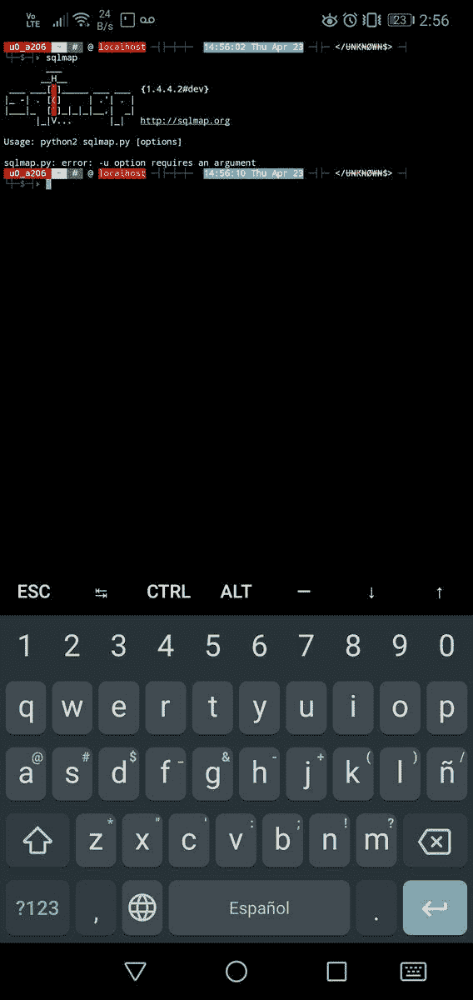

链接:

 [## sqlmapproject/sqlmap

### sqlmap 是一个开源渗透测试工具，可以自动检测和利用 SQL 注入…

github.com](https://github.com/sqlmapproject/sqlmap) 

## APK 编辑

非常好的应用程序来修改 apk 和重新编译我们的修改！！

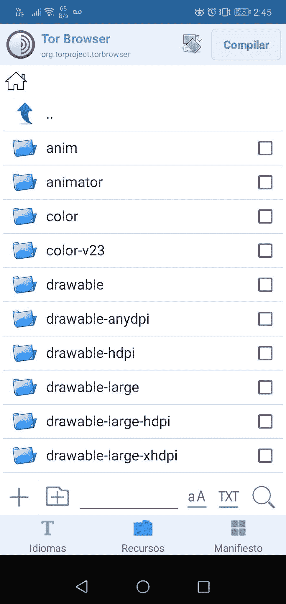

链接:【https://t.co/emFXgT9KyD?amp=1 

## AWD——网络开发集成环境。

对于网络开发者来说，这是一个非常好的文本编辑器，我用它做任何事情

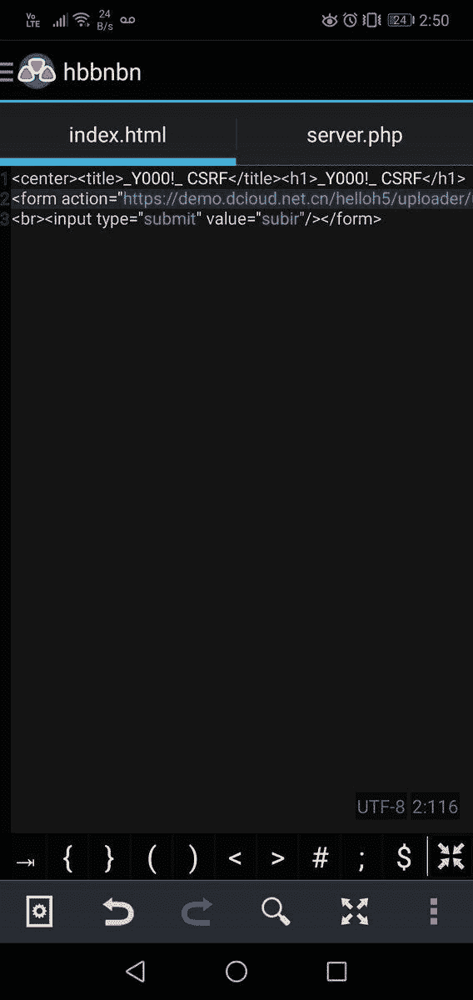

## Metasploit

嗯，我想我对这个框架没什么好说的，众所周知。termux 的 Metasploit。

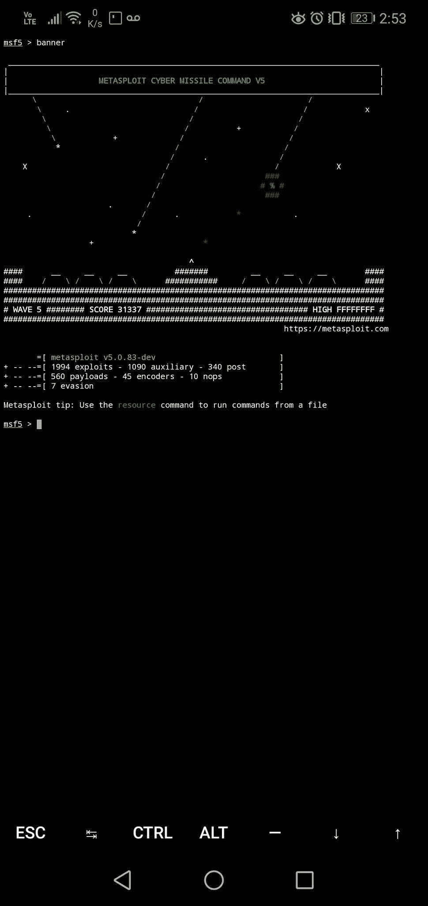

## Nmap

从 Android 进行基本到高级的扫描。从 termux 使用 Nmap

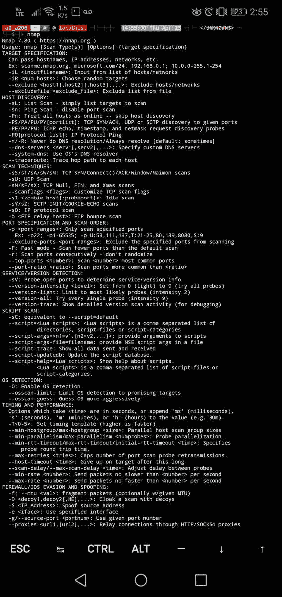