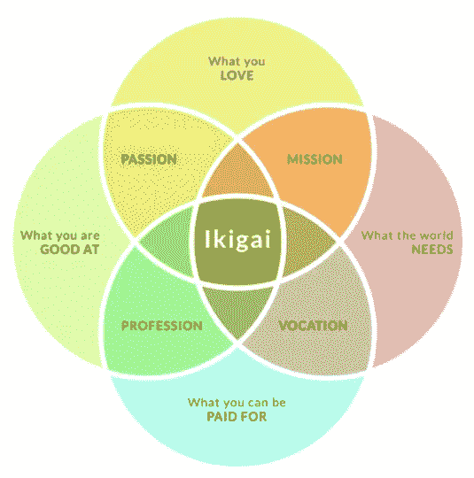
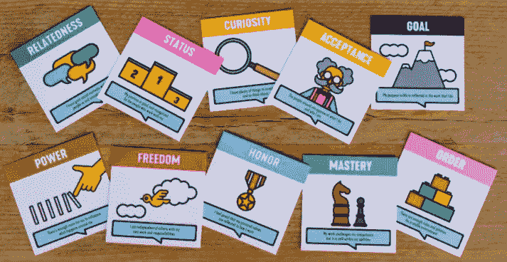
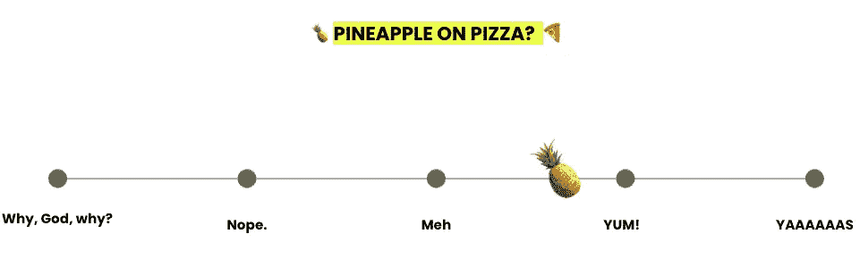
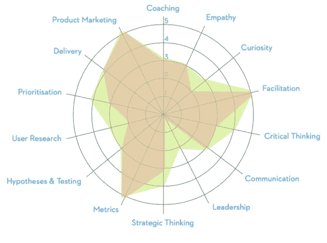
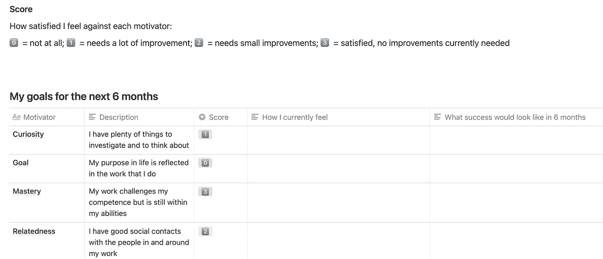
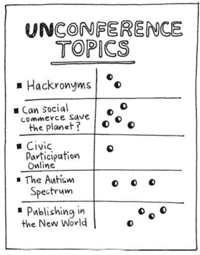
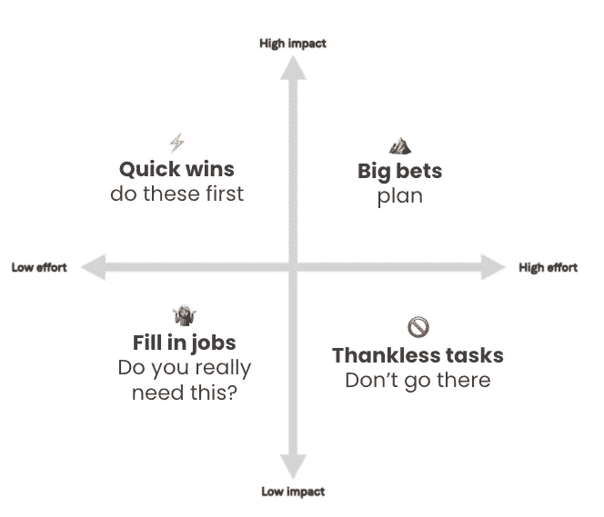
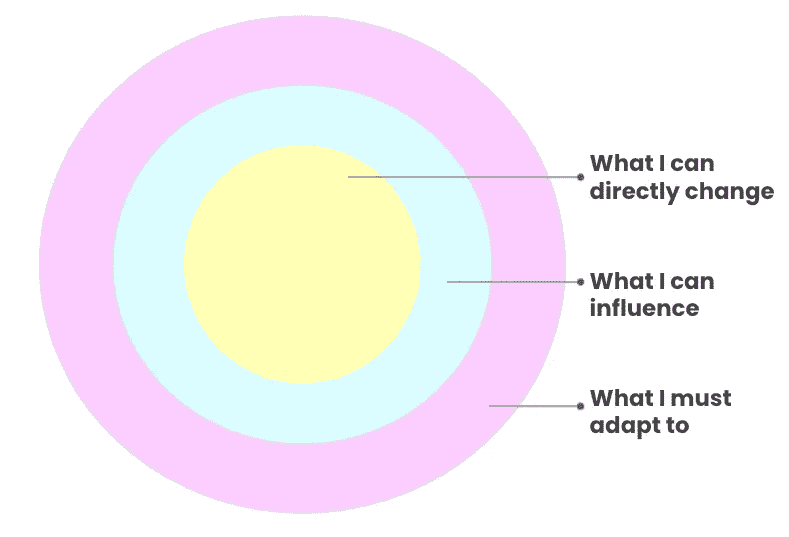
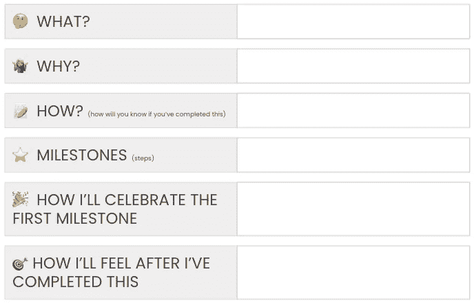

# 黑客攻击你的职业发展:实现你的目标的三个步骤

> 原文：<https://medium.com/nerd-for-tech/hacking-your-career-growth-three-steps-to-getting-where-you-want-to-be-dfb0c24db63?source=collection_archive---------9----------------------->

作为一个职业道路绝不是直线的人，职业发展和自我发展是我特别关注的事情。我对这个话题充满热情，因为它与我们所有人都相关，不管我们现在或未来的愿望如何。

这篇文章将关注框架、工具和技术，而不是谈判加薪或甚至研究特定角色框架(这些都非常重要)——我想专注于更实际的步骤，无论你的角色、职位或你想去哪里，这些步骤都可以有所帮助。

在我深入研究以上内容之前，我想做一个快速调查:

在担任产品经理之前，我来自一个非技术背景，我感受到了所有这些的混合。因此，一旦我进入科技行业，学习、成长和进步的愿望从一开始就一直存在。这个特别的主题引起了我的共鸣，因为在我的职业生涯中，很多时候我没有得到我认为应该得到的支持，所以这让我采取了 DIY(自己动手)的职业发展方法。

通过今天我将要经历的这些步骤，我已经能够改变职业生涯，战胜骗子综合症，在我的角色中取得进步，接受更多的挑战和责任，甚至在这个过程中谈判薪酬。我觉得如果我没有花时间去做这件事，我就不会有这么大的进步，甚至不会为我所取得的成就感到骄傲。

我想在这里传达的是，个人发展并不等同于绩效考核，你是否或如何在职业生涯中发展和进步取决于你自己。

# 我要报道的内容

我将这篇文章分为三个步骤:

*   我想去哪里？
*   我现在在哪里？
*   我如何到达那里？

我发现有时候考虑职业发展或进步会让人不知所措，尤其是当你已经有很多工作要做的时候。所以，作为一个经验法则，我喜欢让事情变得简单和可行。这也是我试图用自己的方法来实现职业发展的原因。

我将探索评估我们想要达到的目标，我们目前在哪里找到自己，以及我们如何达到我们想要的目标。这听起来可能是陈词滥调或者非常简单——这可能是真的——但是这些步骤是有效的；你可以从中得到你想要的，我希望在这个过程中有一些启发。

# 我想去哪里？

> **你长大后想做什么？**

我想从这个问题开始，因为很可能你的志向已经改变了(不幸的是，我并没有成为我梦想中的考古学家兼时装设计师)。但这没关系，因为事情会变。

因此，当考虑设定职业目标时，最好从你目前的愿望和需求开始——无论目标是在年底获得晋升，还是在 10 年内成为你最喜欢的公司的下一任首席执行官。

掌控你职业发展的第一步是问你自己:**我想成为什么样的人？**这里有两件事需要回答，一是“为什么？”…以及“为什么？”又来了。花时间阐明你目标背后的原因对帮助你集中注意力和保持动力是很重要的。我再怎么强调这一点也不为过，因为如果你像我一样，有时会感到气馁，那么即使在最困难的时候，心中有一个目标也会让你坚持下去。

那么，从哪里开始呢？你的头脑中可能已经有了一个明确的方向或目标。如果是这样，太好了！但如果没有，就去寻找一些灵感。

这就是框架的用武之地(作为产品经理，我不能**也不能**提出它们！).框架将帮助你阐明你的目标——可以是特定角色的，也可以是个人的。如果你想选择一个以职业发展为导向的目标，你可能想要一个基于能力或角色的框架来帮助你更上一层楼。或者，举例来说，如果你想提高你的领导技能，你可能想找到一个更深入的技能框架，分解领导能力的不同方面。

以下框架和工具将帮助您阐明您的目标:

# Ikigai

资料来源:Forbes.com

日本的 Ikigai 概念翻译成“存在的理由”，并假设在你的才能和激情与世界需要并愿意为之付费的事物的交叉点上实现平衡。如果你不确定从哪里开始，或者想回到基础，这是一个理想的框架。只要拿出这个框架，并尽可能多地填入答案，你将开始看到一些模式、组合或替代方案，这将引发一些有趣的想法或启示。

# 商务化人际关系网

是的，LinkedIn。这是给好奇的专业跟踪者的。你可能缺乏职业生涯中可能发生的事情的参考框架，或者你可能没有看到和你处于相同职位的人有潜力做什么。所以，这就是为什么我喜欢在 LinkedIn 上查看人们的个人资料；你可以看到他们从哪里开始，在什么条件下，他们到达了哪里，以及中间所有有趣的旅程。我还喜欢看他们如何交流他们所做的事情和他们创造的价值。在阐明你的目标时，这是一项非常有用的技能。

上 LinkedIn 看看。寻找角色相似，但旅程不同的人:他们是如何到达现在的位置的，他们是如何谈论自己的成就的？寻找处于他们游戏顶端的人，是什么让他们脱颖而出？是什么激励了你？

# 移动激励因素

来源:管理 3.0

移动激励因素是一个管理 3.0 工具。它被用来反映你的动机。我个人经常使用这种方法，因为它让我有机会在日常工作之外挖掘得更深一点。

共有 10 个支柱，每个都有一个定义，如下所列，这鼓励你反思你目前对每个支柱的感觉。

1.  好奇心:我有很多事情要调查和思考
2.  **荣誉:**我感到自豪的是，我的个人价值在我的工作中得到了体现
3.  **接受:**我周围的人认可我的所作所为和我的为人
4.  精通:我的工作挑战了我的能力，但它仍在我的能力范围之内
5.  权力:我有足够的空间去影响我周围发生的事情
6.  自由:我在工作和责任上独立于他人
7.  相关性:我与工作中的人有良好的社会关系
8.  **秩序:**稳定的环境有足够的规则和政策
9.  我的人生目标反映在我所做的工作中
10.  状况:我的职位很好，得到了同事们的认可

# 技能框架

有些框架关注技能和能力，而不是角色或责任。[介意产品的产品技能评估](https://www.mindtheproduct.com/wp-content/uploads/2021/02/Mind-the-Product-Skills-Assessment-PDF.pdf?utm_source=Mind+the+Product+Newsletter&utm_campaign=172df7fbbc-EMAIL_CAMPAIGN_2021_01_26_07_27&utm_medium=email&utm_term=0_babd9cfe61-172df7fbbc-110340231)就是一个例子；它列出了不管你的角色是什么，如果你从事产品工作，应该发展的一般技能，它被分解为“人类”和“技术”技能。

# 职业框架

与技能框架不同，职业框架更关注具体的角色和职责，更详细地描述了职业的不同层次。例如，如果您是产品经理，您可能会看到不同级别的不同期望，如助理 PM、中级 PM、高级 PM、团队 PM 和首席产品官。

许多公司都有自己的职业框架，这让你更容易指导自己，并真正了解你需要做什么才能达到下一个水平。但是有些公司没有这个，但是你还是可以从其他公司得到一些启发，用来思考自己的个人发展；看一下 [Progression.fyi](http://progression.fyi) ，这是一个全面的科技公司开源职业框架库，你可以看看。

这些是你可以用来思考你想去哪里的一些框架。给自己设定一个时间表也是有帮助的，这样你就有了奋斗的目标。这将取决于它是一个短期的，中期的，长期的，甚至是一生的目标！想想你想在接下来的 6 个月、1 年、5 年内完成什么……把它写在一张纸上，然后在你完成了这篇文章中的三个步骤后再回来；想想是否有什么事情改变了你或者让你吃惊了。

还有一个提示:你的目标很好，可以让你保持专注，朝着一个方向前进，但是不要担心事情会改变，只要根据你目前的情况重复这个过程。这是一个最初的目标，所以如果事情发生变化，不要贬低自己。因为我必须不断提醒自己…善待自己！

**简而言之，思考你想成为什么样的人是规划你职业发展的第一步，使用一个框架可以帮助你制定出有助于你实现目标的参考点。这将带我进入下一步…**

# 我现在在哪里？

下一步是问自己:“我现在在哪里？”。

一旦你有了框架，你就有了参照系。所以，下一步是找出你目前的状况和你想要的状况。还是那句话，这真的很简单，但关键是要对自己坦诚。你这样做是为了突出你接下来要集中注意力的地方，而不是贬低自己。

以下技巧将帮助你根据自己的目标来衡量自己:

# 计算尺

在滑动标度上，你决定了光谱的两边；可以是 0 到 5，也可以是“需要很多改进”到“牛逼”。你可以在这里发挥创造力。目标是设置截然相反的标记，然后将你自己置于那个连续体中。

# 蜘蛛图

一个**蜘蛛图**是另一个很好的方法来可视化你当前的情况，并提供一个更全面的你的能力的视图。决定你将使用什么样的技能/能力/标准(上面的例子使用了“关注产品”框架)，然后将它们标在每个轴上。所有线相交的中间是 0，每条线的顶部是 5/10/100。再一次，想想你相对于每一条线的位置。然后把这些点连接起来；它会形成一个形状(雷达图),你可以用它来更好地衡量你随着时间的推移而取得的进步——上面的例子演示了如何将你的第一次评估与第二次评估重叠，以查看你的进步。

# 职业杂志

最后，我想带一个我自己用的。我把它叫做**职业日志**，它使用移动激励框架。我已经创建了一个关于概念的[模板，你可以复制它。](https://www.notion.so/Career-journal-template-91055918da9942e88ed579801e5a3291)

我已经列出了每一个激励因素，所以我可以从 0 到 3 来评估自己，并描述我为什么给自己这个分数。接下来，我可以添加一个描述，描述这个激励因素在 6 个月后会是什么样的成功。这对我很有帮助，因为我必须正确地表达我得分的“为什么”,这也很有趣，因为稍后我会看到我已经走了多远。

这里的关键点是，不管你决定采用哪种技术，你都应该抽出时间与自己进行开诚布公的对话。这个练习的目的是确定你需要改进的地方，即使花 30 分钟做这件事也会给你一种动力和方向感。

# 我如何到达那里？

现在，是时候问你自己:“我如何到达那里？”。

看看你刚刚完成的基准测试。你注意到了什么？有什么明显需要改进的地方吗？或者你想在每一方面都做得更好的想法？把它们列在一张纸上。

接下来，对于每个需要改进的领域，花点时间想想**是什么阻碍了你**。这可能是一件事，也可能是一系列事情，但重要的是花些时间来评估那些会阻碍你的事情，这样你就可以在将来减轻它们。

现在是时候优先考虑这些了，所以我想带来一些我最喜欢的技巧:

# 点投票

[点投票](https://gamestorming.com/dot-voting/)真的会迫使你分清主次。给自己有限的点数(比如说 3 个)，并投票选出你认为最重要的。

# 影响与努力矩阵

这是艾森豪威尔矩阵的变体。在一张纸上写下每个阻碍因素、想法或任务，并沿着每个轴将它们放在矩阵上。首先，想想如果你解决了(或者完成了)这件事会对你的生活产生什么影响，然后再想想做这件事需要付出的努力。然后将每张纸放在矩阵的一个象限上。从速赢开始，然后是需要更多计划或分解的大赌注。不要把太多精力放在下面这些事情上，因为它们不会给你的生活带来太多价值。

# 圆圈和汤

[圈和汤](https://www.innovationgames.com/circles-and-soup/)活动帮助你专注于你能改变或影响的领域，忘记你不能改变或影响的领域。与上面的矩阵类似，您将在圆圈上标出每个阻碍因素、想法或任务。内圈致力于你可以直接改变的事情。中间的圆圈是你可以影响并采取有说服力的行动向前推进的东西。外面的圆圈，称为汤，是当前不能改变的环境元素，你必须适应它。源自内部和中间圈子的想法将帮助你找到应对或缓解困境的方法。

# 迷你简报

上面的活动将帮助你优先关注什么。一旦你选择了你想要解决的问题(不管是一件事，还是你的前三件事)，为你自己创建一个迷你简报。不一定要长；放入足够的信息，这样当你回来的时候就能记住目标是什么。花些时间想想你为什么要做这件事，什么步骤表明你在进步，一旦你完成了这件事，你会有什么想法和感受。你甚至可以添加当你达到一个里程碑时你将如何庆祝。

这里重要的一点是把这个任务分解得更细。这是许多计划失败的地方，因为它们太大，或者不够可行，所以确保你分解步骤。这可能类似于每月写一篇博客，而不是每月写 4 篇，或者安排与某人 1:1 的会面，而不是试图解决与整个部门的沟通障碍。

# 审查和登记

最后一步是回顾你的目标和行动，并决定什么时候对自己进行检查。向你的行动计划灌输责任感的一个好方法叫做**10–24–7**。当引入一个新的实践或行为时，定期回顾它是有益的，因此有一个教学理论建议，为了更好地记住一些东西，你应该在 10 分钟、24 小时和 7 天内回顾它。在课程结束时回顾你的目标和行动，问问你自己你将如何记住它们，以及你将如何确保你在跟进它们。然后，在第二天和下一周检查一下，一旦你有时间仔细考虑，看看是否有你想要对你的计划做的任何编辑或改变。如果你想更进一步，告诉别人你的计划，你会有一个负责任的伙伴！

**所以，这里要记住的重要事情是从某处开始，任何地方，从小处开始。这只是一个指南或方向，所以如果你实现了一个里程碑或你的目标，庆祝你的胜利，如果没有，反思什么没有按预期进行，从那时你发现自己的地方重新开始。**

# 概述

这些步骤看起来非常明显和简单，事实也的确如此！上面的步骤并不耗费时间，但是它们确实需要我们抽出一点时间来恰当地阐明我们想要达到的目标。但是一旦我们这样做了，我们就会剩下一些行动来帮助我们朝着目标前进。

所以，概括一下…

1.  首先，个人发展不仅仅是你在工作中为了绩效评估而做的事情。为了你自己。
2.  第一步是思考你想去哪里，甚至想成为什么样的人。思考这一点是规划你职业发展的第一步，使用一个框架可以帮助你制定参考点，帮助你实现目标。
3.  第二，问自己:“我现在在哪里？”。不管你怎么做，你都应该花时间反思一下，与你想达到的目标相比，你现在的状况如何。这一步的重点是确定你下一步需要改进的地方。
4.  最后，想想你将如何到达那里。将计划分成几个步骤，确保朝着目标迈出的第一步是可以实现的。如果你在早期就看到自己取得了进步，你就更有可能跟进这个计划。另外，它会给你一种温暖的成就感🎉