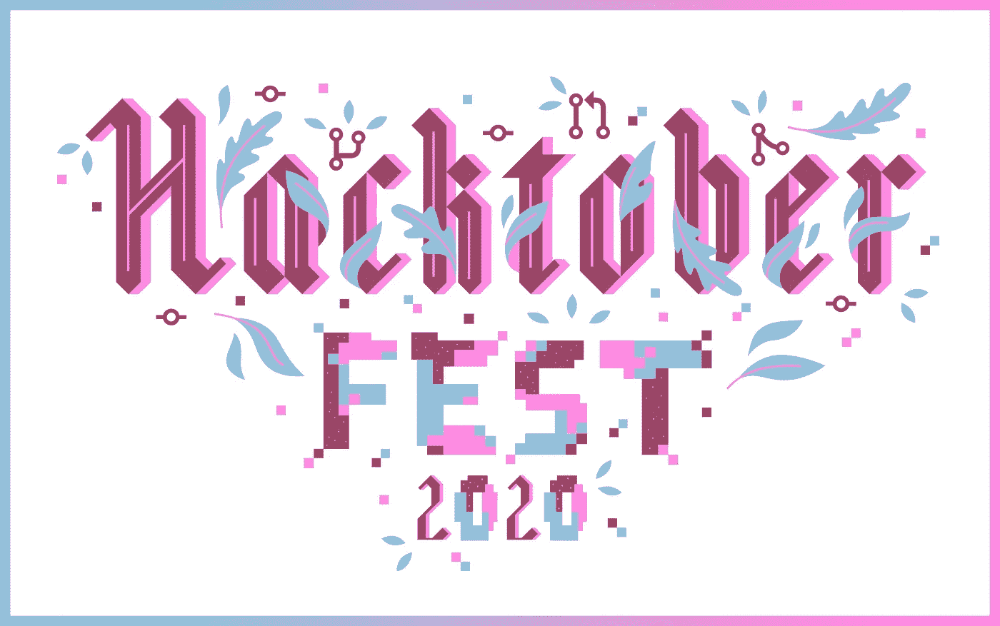
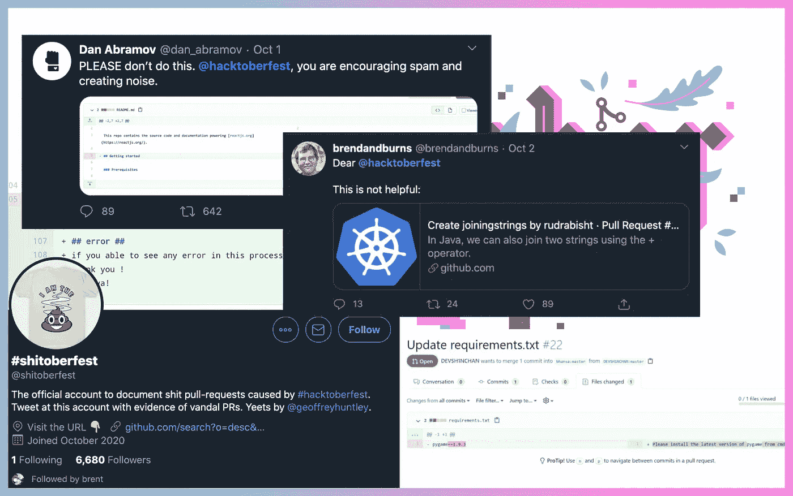

# Hacktoberfest 2020:我作为维护者的旅程

> 原文：<https://medium.com/nerd-for-tech/hacktoberfest-2020-day-6-my-journey-as-a-maintainer-c347367469a7?source=collection_archive---------1----------------------->

# 2020 年🥳啤酒节又回来了

2020 年 10 月 1 日，Hacktoberfest 正式拉开帷幕。和去年一样，今年我也很兴奋。除了很酷的 t 恤和贴纸，我还喜欢结识新朋友和一起合作，这是非常棒的经历，我认为这是目前最好的方式(唯一的方式😋)在这个新冠肺炎社交😷疫情局势。

# 但是🤦‍♀️…

今年……社区对 Hacktoberfest 活动本身有很多负面和反弹，主要是因为在开源项目上创建的垃圾邮件和完全无用的拉式请求只是为了索取免费的好东西。开源社区和网民对此愤怒不已。甚至创建了一个 twitter 账户 [@shitoberfest](https://twitter.com/shitoberfest) 记录 hacktoberfest 引起的垃圾邮件拉取请求。

图:对 2020 年黑客节的反弹

# 然后…📣Hacktoberfest 宣布了一些活动的变化

[https://hacktoberfest.digitalocean.com/hacktoberfest-update](https://hacktoberfest.digitalocean.com/hacktoberfest-update)

1.  维护者可以通过用`hacktoberfest`主题对他们的项目进行分类来选择参与。
2.  如果你的拉取请求在一个带有`hacktoberfest`主题的库中，并且一旦它们被合并、被维护者批准或者被标记为`hacktoberfest-accepted`，那么它们将被计入你的参与。
3.  任何带有`hacktoberfest-accepted`标签的 pull 请求，提交到任何公共的 GitHub 存储库，无论是否带有`hacktoberfest`主题，都将被视为对 Hacktoberfest 有效。

# 最后…这是我到目前为止的旅程。

> *⚙️维持 10 个开源项目
> ✅关闭 7 期
> 🎉14 PR 合并
> 👨‍💻15 名新贡献者
> 🙅‍♂️ 1 无效 PR*

# 去提交你的第一份简历吧…

这是我维护的开源项目列表，你可以很容易地贡献出来。我也创造了一些你可以解决的问题。**请** **禁止垃圾邮件拉取请求**。

> sqlite3 >按语言选择项目.链接组

**Python:**

*   [https://github.com/tuladhar/easydns-restapi-cli](https://github.com/tuladhar/easydns-restapi-cli)
*   [https://github.com/tuladhar/macOS-wifi-cli](https://github.com/tuladhar/macOS-wifi-cli)
*   [https://github.com/tuladhar/check_bandwidth](https://github.com/tuladhar/check_bandwidth)
*   [https://github . com/tuladhar/多线程 google-ban-checker](https://github.com/tuladhar/multi-threaded-google-ban-checker)
*   【https://github.com/tuladhar/gistup 

**Javascript:**

*   [https://github.com/tuladhar/gmail-labels-as-tabs](https://github.com/tuladhar/gmail-labels-as-tabs)

**开始:**

*   [https://github.com/tuladhar/gocat](https://github.com/tuladhar/gocat)

**痛击:**

*   [https://github.com/tuladhar/set-brightness](https://github.com/tuladhar/set-brightness)
*   [https://github.com/tuladhar/bash-parallel-scripts](https://github.com/tuladhar/bash-parallel-scripts)

**教程:**

*   [https://github.com/tuladhar/Python-for-SysAdmin](https://github.com/tuladhar/Python-for-SysAdmin)

> *🙏感谢 DigitalOcean、DEV Community 和 Intel 带来 Hacktoberfest 2020。*

# 在推特上关注我 [@ptuladhar3](https://twitter.com/ptuladhar3)