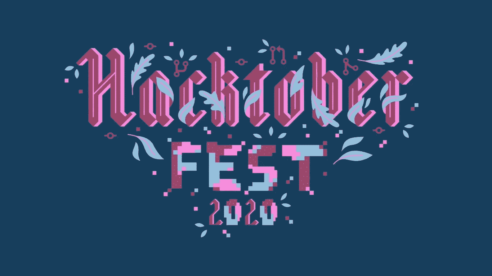
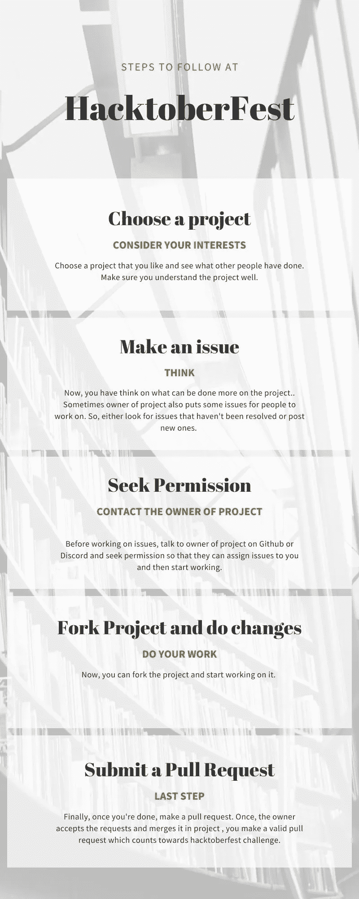
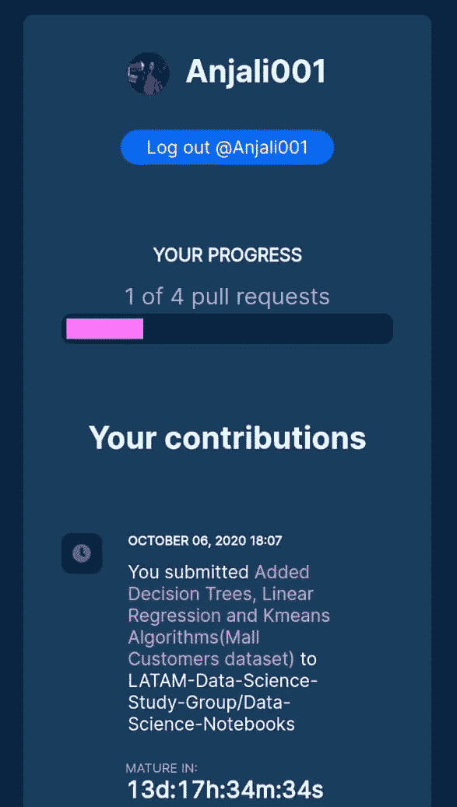
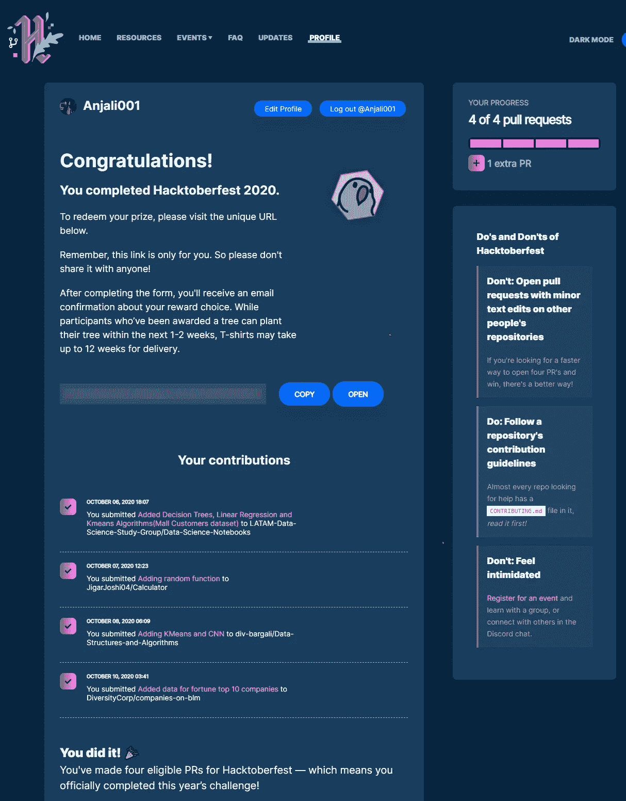
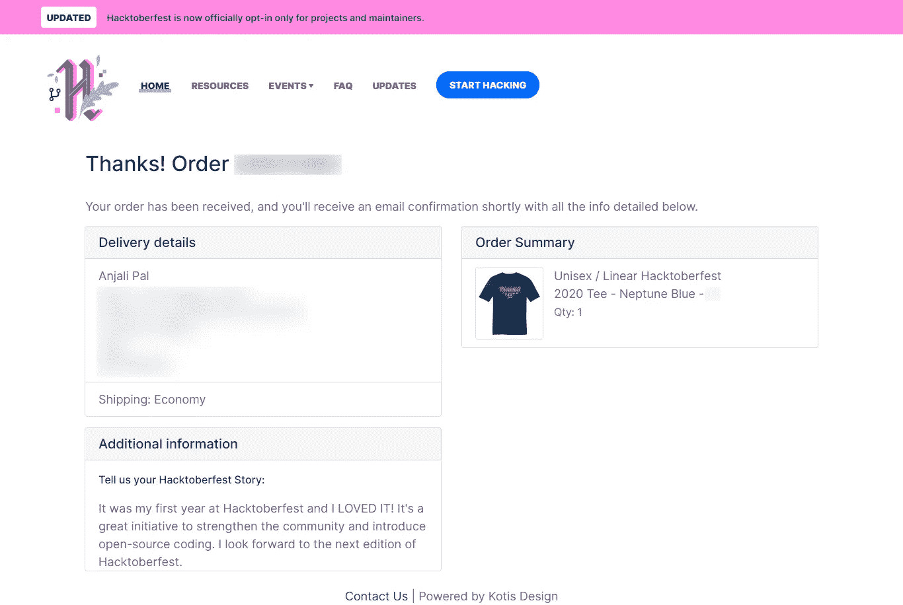
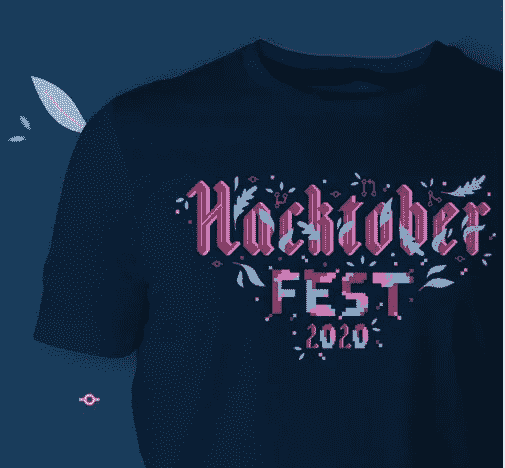
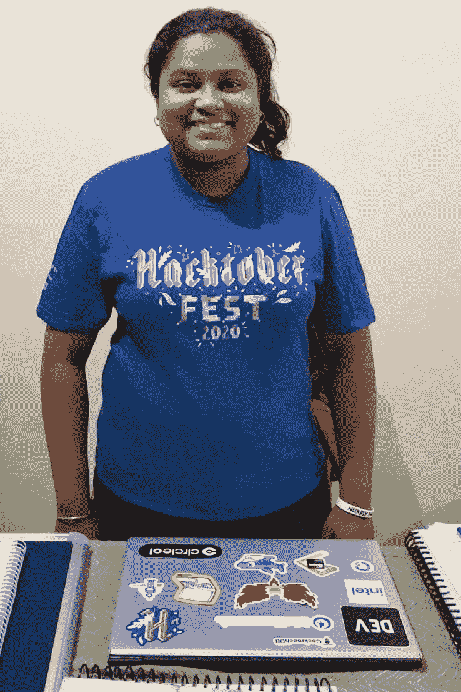

# Hacktoberfest:数据科学初学者的机会

> 原文：<https://medium.com/nerd-for-tech/hacktoberfest-an-opportunity-for-data-science-beginners-1c51c57e4e5a?source=collection_archive---------2----------------------->

你知道什么是开源编码吗？

开源是指任何人都可以编辑和修改的代码。公司或个人将代码开源，以便不同的开发人员可以分析它，并一起开发可以改进它的令人惊叹的软件或服务。

Github 包含数千个开源项目，是任何寻找开源代码的人的最佳去处。开源编码帮助开发人员阅读和理解他人的代码，这反过来为他们在现实生活中做准备，也帮助他们获得该领域的相关经验。

对于那些想知道什么是黑客节的人来说？这是一个开源编码活动，每年 10 月都会举行，许多程序员、黑客、开发人员和数据科学家通过 Github 合作开展项目。

第一届 Hacktober fest 举办于 2014 年。从那以后，每年十月都会举行这个节日。

那我们这一个月做什么？我们提出拉取请求。

您需要找到您感兴趣的项目，然后寻找可能改进项目的错误或新问题。

基本工作流程如下:

工作流程

Hacktoberfest 的主要目标/挑战是提出 4 个有效的拉请求。一旦你完成了，Hacktoberfest 团队会给项目的所有者 14 天的时间来检查你的工作，检查你的请求是否有效。

恭喜你！！你现在已经完成了 Hacktoberfest 挑战。准备好通过组织者快递给你一些很酷的礼品。

## 我在 2020 年 Hacktoberfest 的经历

我今年第一次参加，我很困惑如何搜索项目，联系业主，实际上，提出拉请求。但是我的经历很棒。当我提出我的第一个拉请求时，也就是 PR，我很激动。

我的第一次公关是在一个项目中，项目所有者对为说西班牙语的人群提供机器学习算法感兴趣。因此，我们应该通过提交英文算法及其解释来做出贡献，具有所需技能的人会将其转换成西班牙语。

这是你如何看到你的工作进展

提交 PR 后，将开始为期 14 天的审查期，此后 PR 将生效并计入挑战。

在这之后，我的第二次公关是基于一个涉及计算器的项目。作为一名统计专业的学生，我一直觉得随机函数对于一个计算器来说非常重要。当我检查这个计算器的代码时，我发现它缺少随机功能，所以我提出了一个问题。老板喜欢这个想法，并把这个问题交给了我。

接下来，我将 KMeans 和卷积神经网络算法贡献给了一个项目，该项目试图为几乎所有类型的机器学习算法创建一个知识库，供人们学习。

终于在#BlackLivesMatter 上找到了一个项目。所有者正在做一个名为 DiversityCorp 的开源项目，致力于让财富 100 强公司负起责任。该项目包括收集关于公司在"黑人生命至关重要"运动期间声明的数据，以及他们实际上做了哪些改变以确保这种歧视不再发生在他们的公司。我真的很喜欢这个项目，所以在为排名前 10 的公司贡献数据后，我制作了另一个我贡献更多的 PR。

在每个 PR 的 14 天审查期之后，我所有的 PR 都被接受了。

我赢得了一件非常酷的 Hacktoberfest 2020 (Tshirt ),由于国际发货延迟，它还没有送到我家。

前 70，000 名完成挑战的人将获得 Hacktoberfest 奖品

明年我一定会参加，为更多的开源项目做出贡献，同时也提高我的技能。

期待在那里见到你们。

我刚刚做了一个新网站来展示我的项目。请查看并关注我的下一篇文章，关于如何为数据科学爱好者制作一个伟大的投资组合。(P.S .网站是其中的一部分)

请访问我在 https://anjali001.github.io/的网站

更新:

我很高兴地告诉大家，我在 21 年 1 月 6 日收到了赠品。

感谢#hacktoberfest2020 的贴纸和 t 恤。

