# 使用时间轴| Unity 处理动画

> 原文：<https://medium.com/nerd-for-tech/handle-animations-with-timeline-unity-a49429fa7beb?source=collection_archive---------13----------------------->

## 统一指南

## 关于如何在 Unity 中使用时间轴处理动画的快速指南

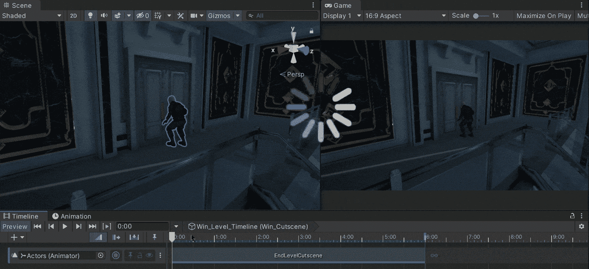

**目标**:使用 Unity 中的时间轴处理过场动画。

在上一篇文章中，我介绍了[如何在 Unity 中使用移动轨道来构建过场动画](/nerd-for-tech/using-a-dolly-track-unity-eb503cb4cd08)。现在，是时候了解如何使用 Unity 处理时间轴中的过场动画了。

# 新过场动画

我们有下一个 previs 元素作为参考来组成过场动画:

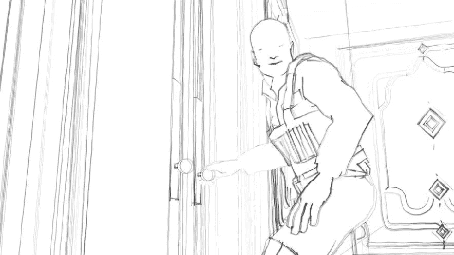

这个过场动画预计将在玩家完成关卡时显示，它基本上显示了一个小偷(玩家)抓住一个门把手来打开一个装有珠宝的建筑的主金库。让我们移动摄像机并放置相应的模型来定义过场动画的镜头:

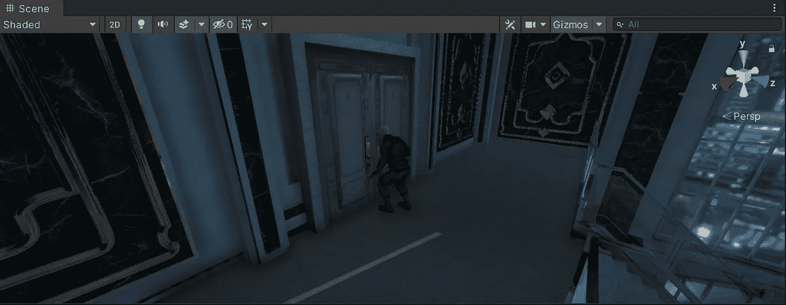

# 时间轴窗口

一旦我们将模型置于所需位置，让我们通过点击*窗口>排序>时间线*打开时间线窗口:

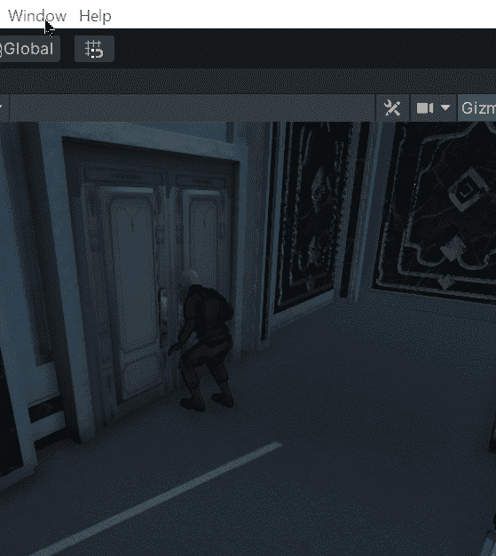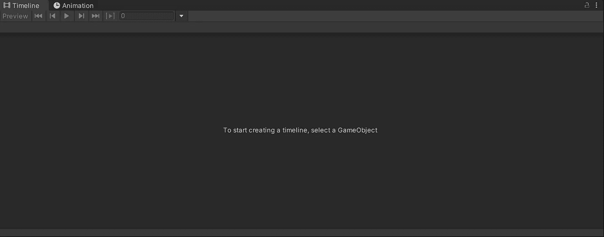

如果我们在层级中选择过场动画的模型，我们会看到已经附加了一个**动画组件**。这个 **Animator** 组件使用一个动画控制器来处理模型显示的动画剪辑。

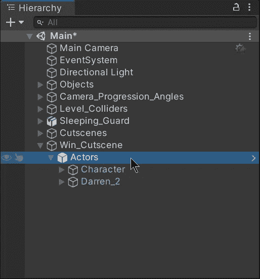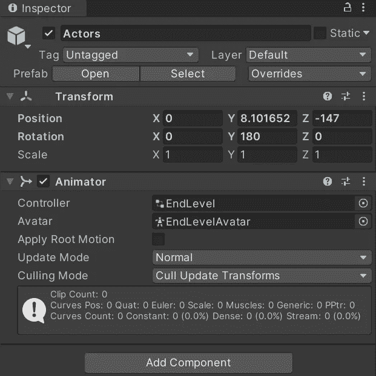

现在，为了能够使用过场动画的时间线，让我们选择作为模型父对象的空游戏对象。选中后，让我们单击时间轴窗口中的按钮，为过场动画创建一个新的时间轴可播放资产:

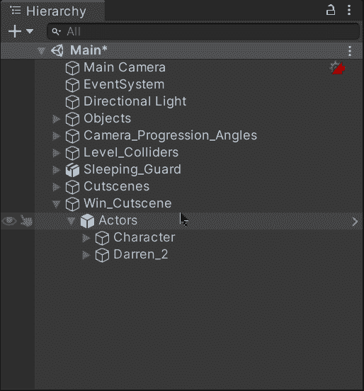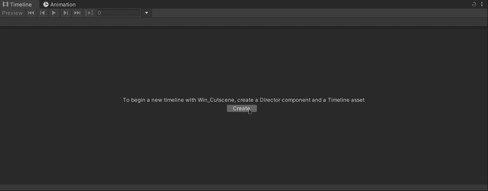

# 处理动画

时间线将允许我们控制模型的动画，并使它们与组成过场动画的不同方面同步，如音频和摄像机。为了处理我们模型的动画，让我们将包含 Animator 组件的 gameobject 拖动到时间轴中，并选择添加一个新的动画轨道。一旦我们添加了它，让我们在时间轴中右键单击并选择 ***从动画剪辑*** 添加来选择我们想要处理的动画剪辑:

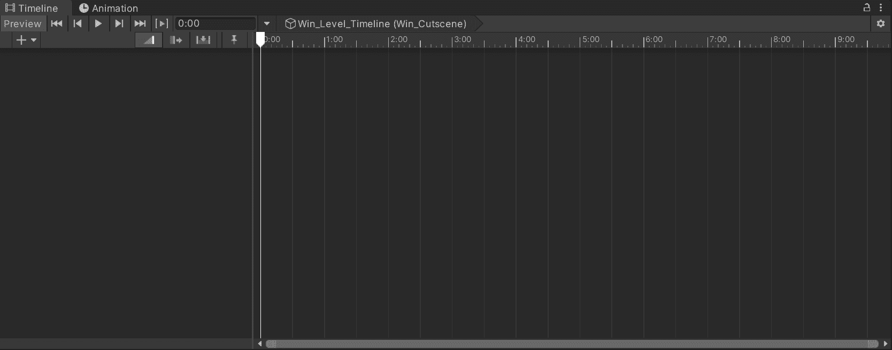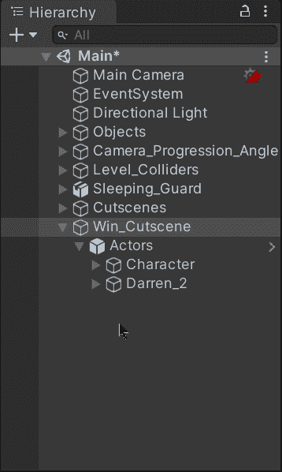

我将动画师控制器的动画剪辑添加到时间线中

现在，通过在我们的时间线中加入动画轨道，我们能够处理动画，并将其与过场动画的另一个基本元素(如音频和摄像机)同步。我们能够显示动画，而不必播放场景，我们只需拖动时间线中的白色箭头，即可查看每一帧或每一秒的状态:

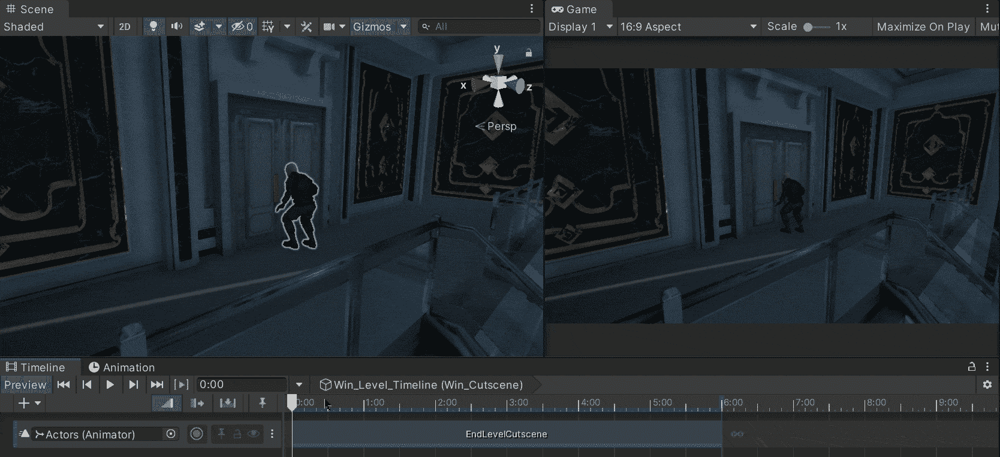

就这样，我们可以在 Unity 中处理过场动画了！:d .我将在下一篇文章中看到你，在那里我将展示如何同步音频和视觉以在 Unity 中构建过场动画。

> *如果你想更多地了解我，欢迎登陆*[***LinkedIn***](https://www.linkedin.com/in/fas444/)**或访问我的* [***网站***](http://fernandoalcasan.com/) *:D**