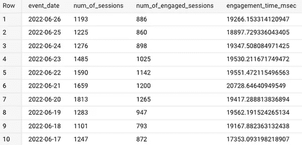

# 以正确的方式处理 Google Analytics 4 (GA4)数据中的会话和约定

> 原文：<https://medium.com/nerd-for-tech/handle-sessions-and-engagements-in-the-google-analytics-4-ga4-data-in-a-correct-way-d55cc988efee?source=collection_archive---------0----------------------->

## 在 BigQuery 中使用 GA4 原始数据。由萨努·马哈尔詹

由[卢卡·布拉沃](https://unsplash.com/@lucabravo)在 [Unsplash](https://unsplash.com/) 上拍摄

当你使用 GA4 来跟踪你的网站或应用程序时，查看会话和参与度可能会非常有见地。没有任何延迟，首先，让我们看看会话和参与在 GA4 中是如何定义的，然后我们如何将它们提取到 Bigquery 中。

# 会议

当满足以下条件之一时，将触发会话:

*   用户打开您的网站或应用程序
*   用户查看页面或屏幕(假设没有其他会话处于活动状态)

注意:一次会议通常持续 30 分钟。也就是说，当用户访问你的网站，31 分钟后又回来时，新的会话就开始了。

会话有助于了解有多少用户访问你的平台，但更有趣的是了解他们中有多少人有某种“参与”。然后我们来看看谷歌是如何定义敬业度的。

# 参与会议

在 GA4 中，如果满足以下条件，则会话被视为正在进行:

*   有 2 个或更多的页面浏览量或
*   有一个或多个转换事件，或者
*   用户持续超过 10 秒钟

注意:如果您认为 10 秒对于一个忙碌的会话来说太短，那么您可以在您的 GA 帐户中手动更改时间，最长可达 60 秒。

现在的问题是，如何提取会话和参与会话的数据？如果你看原始的 GA4 数据，没有直接的答案。因此，诀窍是通过执行以下查询来计算 ga_session_id 和 user_pseudo_id:

[https://gist . github . com/sigma error/BC 8d 4d 5728480 Fe 7195 b 690 ebf 8d 58 f 1](https://gist.github.com/sigmaError/bc8d4d5728480fe7195b690ebf8d58f1)

简单解释一下幕后发生的事情:首先，我创建了一个名为 prep 的子查询(与准备中一样)。在准备子查询中，我选择了已解析的事件日期和 user_pseudo_id。

接下来，我取消了 event_params 数组的嵌套，只选择那些 key = 'ga_session_id '的值。这些值以“int_value”存储，这意味着它们是 INT64 数据类型。这里，ga_session_id 是用户进入你的平台时的时间戳。我们不能简单地计算 ga_session_id，称它们为会话数，原因是，如果两个用户同时进入您的平台，他们将拥有相同的 ga_session_id。

然后对于 session_id，我首先 UNNEST event_params 并提取 key = 'ga_session_id '的整数值，然后连接 user_pseudo_id 和 ga_session_id。通过这样做，即使在多个用户同时进入平台的情况下，他们也会有不同的 session_id。

类似地，对于 engaged_session 和 engagement_time_msec，我已经取消了 event_params 列的嵌套，然后只选择那些键，它们分别是‘session _ engaged’和‘engagement _ time _ msec’。还要注意，session_engaged 的值是字符串，而 engagement_time_msec 的值是整数，并且以微秒为单位。

最后，我按 event_date 分组，然后计算会话数的不同 session_id，当有一个参与会话时，我再次计算 session_id，并以微秒为单位计算平均参与时间。

# 结论

通过这样的查询，可以获得关于触发了多少个会话、参与了多少个会话以及参与的平均时间的信息。在接下来的文章中，我将写下更多关于如何从原始 GA4 中提取数据的问题。

# 本月即将发布的 datadice 博客文章

*   [谷歌数据分析的最新更新(2022 年 11 月)](/geekculture/latest-updates-on-google-data-analytics-november-2022-48f32c9ce40a?source=your_stories_page-------------------------------------)
*   [RAWGraphs:一个免费的开源数据可视化工具](/nerd-for-tech/rawgraphs-a-free-and-open-source-tool-for-data-visualization-b79e337d750a?source=your_stories_page-------------------------------------)

# 更多链接

这篇文章是从 BQ 的 GA4 原始数据中获得洞察力的系列文章的一部分。

查看我们的 [LinkedIn](https://www.linkedin.com/company/datadice?original_referer=https%3A%2F%2Fwww.linkedin.com%2F) 账户，深入了解我们的日常工作生活，并获得关于 BigQuery、Data Studio 和营销分析的重要更新。

我们也从我们自己的 YouTube 频道开始。我们讨论了重要的 DWH、BigQuery、Data Studio 和许多其他主题。点击查看频道[。](https://www.youtube.com/channel/UCpyCm0Pb2fqu5XnaiflrWDg)

如果你想了解更多关于如何使用 Google Data Studio 并结合 BigQuery 更上一层楼，请查看我们的 Udemy 课程[这里](https://www.udemy.com/course/bigquery-data-studio-grundlagen/)。

如果您正在寻求帮助，以建立一个现代化的、经济高效的数据仓库或分析仪表板，请发送电子邮件至 hello@datadice.io，我们将安排一次通话。

*最初发布于*[*https://www . data dice . io*](https://www.datadice.io/sessions-and-engagement-in-ga4-data)*。*