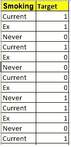
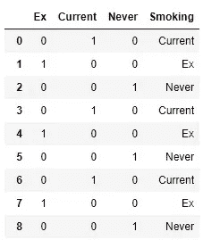
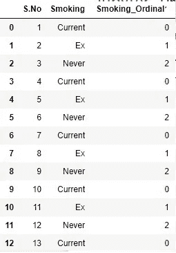
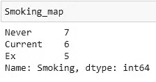
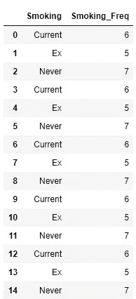
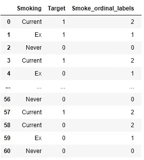
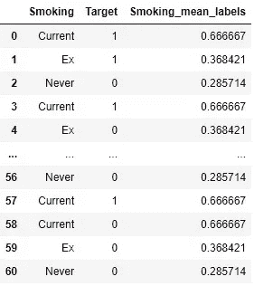

# 通过 Python 处理机器学习中的分类数据

> 原文：<https://medium.com/nerd-for-tech/handling-categorical-data-in-machine-learning-through-python-3bae764561dc?source=collection_archive---------3----------------------->

每个人都需要一个舒适的生活环境，并能适应这种环境。你不能生活在一个陌生的世界里并与之互动。

由于计算机有自己的语言，机器学习算法对数字数据进行处理。这个博客是关于当数据集中有分类数据时我们能做什么。如何处理它，并使其对机器学习算法有用，以获得有见地的信息。

我们举一个简单数据的例子，关于吸烟状况和目标吸烟状况和肺部问题。



有不同的方式从适合在机器学习算法中使用统计工具的分类特征中获取信息。

几种方式如下:

**1。** **一热编码**

对于处理分类特征，一键编码是一种非常方便和流行的技术。这是基于通过其独特的价值创造额外的特征。其中的每个唯一值都是一个添加的要素，根据其在行中的存在情况，值被分配为 1 或 0。

在 Python 中，它可以实现为:

```
list=data.Smoking.value_counts().sort_values(ascending=**False**).index list=list(list)
**import** **numpy** **as** **np**
**for** categories **in** list:
    data[categories]=np.where(data[‘Smoking']==categories,1,0)
```

**输出:**



一个热编码。作者图片

**假设:**

1.  有有限特征集。
2.  其中变量的类别之间不存在顺序关系。

**优点:**

1)使用方便。

2)在假设类别之间的任何排序时不会产生偏见。

**缺点:**

1)可能导致功能数量增加，从而导致性能问题。

**2。** **序数编码**

这是一种流行的技术，根据字母顺序给每个标签分配一个唯一的整数。

这是最简单的方法，并且在序数值的类别之间有自然关系的大多数数据中使用。

在 Python 中，可以这样做:

```
# Import label encoder 
from sklearn import preprocessing
# label_encoder object knows how to understand   word labels. 
label_encoder = preprocessing.LabelEncoder()
# Encode labels in column 'Smoking'. 
data[‘Smoking_Ordinal’]= label_encoder.fit_transform(data[‘Smoking’]) 
print(data.head())
```

或者

```
dictionary={'Current': 0, 'Ex': 1, 'Never': 2}
data['Smoking_ordinal']=data[‘Smoking’].map(dictionary)
```

**输出:**



序数编码，按作者排序的图像

**假设:**

整数值之间具有自然的有序关系。比如电流> Ex>Never。

**优势:**

1)易于使用

2)易于可逆。

3)不增加特征空间。

**缺点:**

1)如果数字的排序不以任何顺序相关，可能会导致意外的结果。

**3。** **计数或频率编码**

在这种类型的编码中，确定变量中每个类别的存在计数。然后每个类别被它的频率所取代。

在 Python 中，它可以实现为:

*寻找计数*

```
Smoking_map=data1['Smoking'].value_counts()
```

**输出:**



*计数存储在字典中并映射到类别。*

```
Smoking_map=data1['Smoking'].value_counts().to_dict()
data1['Smoking_Freq']=data1['Smoking'].map(Smoking_map)
```

**输出:**



频率编码，作者图片

**假设:**

没有一类变量具有相似的频率。

**优势**

*   好用。
*   容易逆转。
*   不会增加功能空间。

**劣势**

*   如果两个或更多类别的频率相同，将无法处理。

## 4.根据目标的顺序编码

在这种类型的编码中，特征的类别根据目标特征被替换，即根据类别的目标中最大真值的排序顺序。

根据目标对类别进行排序。

在 Python 中，它可以实现为:

```
mean=data1.groupby(['Smoking'])['Target'].mean()
Ord_Labels=mean.sort_values().index
ordinal_labels={k:i for i,k in enumerate(Ord_Labels,0)}

data1['Smoke_ordinal_labels']=data1['Smoking'].map(ordinal_labels)mean
```

吸烟

当前 0.666667

例如 0.368421

从不 0.285714

名称:目标，数据类型:float64

```
ordinal_labels
```

{ '从不':0，' Ex': 1，'当前':2}

如我们所见,“当前”是最大值，因此分配给它的值更多，后面是“Ex”和“Never”。

并据此更新标签。

**输出**



按目标顺序编码，按作者排序图像

**假设:**

高基数分类特征。

**优点:**

1)它与目标之间存在单调关系。

**缺点:**

1)可能导致过度拟合。

## 5.平均编码

在这种类型的编码中，根据目标值为类别分配平均值。

对于每个类别，根据目标计算平均值，并分配相同的值

在 Python 中，它可以实现为:

```
dict_mean=data1.groupby(['Smoking'])['Target'].mean().to_dict() 
data1['Smoking_mean_labels']=data1['Smoking'].map(dict_mean)dict_mean
```

吸烟

当前 0.666667

例如 0.368421

从不 0.285714

**输出:**



平均编码，作者图像

**假设:**

高基数分类特征。

**优点:**

1)它与目标之间存在单调关系。

2)不影响数据量，有助于更快地学习。

**缺点:**

1)模型可能过拟合

2)如果类别由于其密度而被分成非常少的类别，则信息可能会丢失。

3)难以验证结果。

4)劈叉少，学习快。

我希望通过使用这些简单的编码技术，可以处理大多数的分类类别。

在此之前，还有更多的编码技术可以讨论，愉快的数据处理。

感谢阅读！

*原载于 2020 年 10 月 22 日 https://www.numpyninja.com**的* [*。*](https://www.numpyninja.com/post/handling-categorical-data-in-machine-learning-through-python)