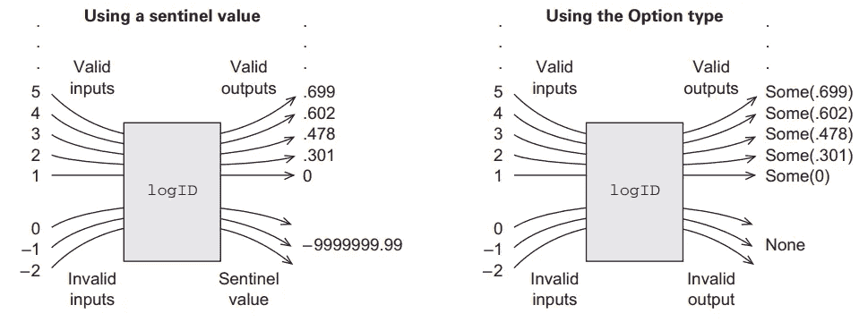

# 无例外地处理功能性错误

> 原文：<https://medium.com/nerd-for-tech/handling-errors-functionally-without-exceptions-ab4a567ba6b?source=collection_archive---------10----------------------->

在函数式编程中抛出错误是一个副作用，如果不能使用异常，用什么来代替呢？最好的办法是将异常和错误作为普通值返回。在这个例子中，我们将重新创建 Scala 的标准库**选项**和**选项**，以更具功能性的方式处理错误。

**例外的坏方面**

为什么抛出异常不是*引用透明的*，它们在哪里破坏了函数透明性，让我们看一个例子。

```
**def** **FailingFn**(i**:Int**)**:Int**={
  **val** y**:** **Int** = **throw** **new** **Exception**("fail!")
  **try** {
    **val** x **=** **42** + **5**
    x+y
  }
  **catch** { **case** e**:** **Exception** => **43** }
}**scala>** FailingFn(12)
java.lang.Exception: fail!
  at .FailingFn(<console>:12)
  ... 32 elided
```

我们定义了一个抛出异常的函数，用异常替换 *y* 的值。

```
**def** **FailingFun**(i**:Int**)**:Int**={
    **try**{
      **val** x**=3**
// A thrown exception can be given any type here we are giving it a type Int
      x+((**throw** **new** **Exception**("fail"))**:Int**)
    }
    **catch** {**case** e**:Exception**=>**43**}
  }**scala>** FailingFun(12)
res1: Int = 43
```

现在我们可以看到上面的例子不是*引用透明的*，在第二个例子中我们得到了不同的输出，因为异常是在 try 块中定义的。这意味着抛出异常取决于定义它的上下文。

**上下文 1** :声明 *y* 抛出异常*“fail”*，在这种情况下 y 是在 try 块之外声明的。因此 catch 块没有捕获异常并抛出输出 fail。

**上下文 2** :在第二个上下文中，我们在 try 块中抛出了一个异常，结果，**案例 e** 得到了一个匹配，并给出了一个不同的输出。

**抛出异常的可能替代方案**

我们已经看到抛出依赖于使用它的上下文，这显然违背了函数式编程，那么抛出异常的其他选择是什么呢？一种可能的解决方案是，如果程序中没有异常，则正常返回结果，如果有某种错误，则返回该异常。

Scala 库为此提供了两种数据类型，**选项**和**任一**。让我们定义选项，看看它的工作情况。

**使用选项**处理异常

```
**sealed** **trait** **Option**[**+A**]
**/***
* **Two** implementation of the option **type**
***** **it** **will** **return** **a** **None**
* or it will **return** a **Some***/**case** **class** **Some**[**+A**](get**:A**) **extends** **Option**[**A**]
**case** **object** **None** **extends** **Option**[**Nothing**]
```

在上面的代码中，我们实现了一个名为**选项的特征。**对于那些我们不知道的人来说，一个 trait 就像 java 中的一个接口，可以包含可选的方法实现。

> 关于 Scala 特征、协方差以及泛型类型在 Scala 中的重要性的更多信息，请参考我以前的文章。下面提供了链接。

[](/codex/functional-data-structures-and-pattern-matching-in-scala-7a379092e1e4) [## Scala 中的函数数据结构和模式匹配

### 函数式编程范式是一种没有任何可变状态的代码编写方式。所以这提出了一个…

medium.com](/codex/functional-data-structures-and-pattern-matching-in-scala-7a379092e1e4) 

现在我们可以看到两个类实现了我们的选项特征，

*   **Some** 它扩展了 Option 显示我们的函数返回值不是错误的条件，**代码中使用的 A** 表示泛型 **A** 可以是整数、双精度或某种函数。
*   类型表示一个异常，我们的函数返回一个不是有效输出的东西。

现在让我们实现一个使用**选项**数据类型来处理异常的函数。下面的函数将一个列表作为输入，并返回列表的平均值。如果列表为空，它将返回一个 **None** 表示我们无法找到空列表的含义。

```
/*
  * It can take any of the two values
  * either a None value in case of an exception
  * or a Some in cases with no exception*/ **def** mean(lis1**:Seq**[**Double**])**:Option**[**Double**]={
    **if** (lis1.isEmpty) **None**
    **else** **Some**(lis1.sum/lis1.length)
  }
```

返回的是**选项【Double】**可以是 None 类型或者 **Some** 。下图显示了两个函数 return，一个返回 double，另一个返回 Option。



使用选项和标记类型的输入和输出

**使用**处理异常

```
**sealed** **trait** **Either**[**+E**,**+A**]

**case** **class** **Exception**[**+E**](value**:E**) **extends** **Either**[**E**,**Nothing**]
**case** **class** **Success**[**+A**](value**:A**) **extends** **Either**[**Nothing**,**A**]
```

数据类型**或者**有两个通用参数， **E** 代表异常， **A** 代表有效值。

这个特征要么是由两个类实现的*异常和成功。*

*   **异常**表示一个错误，其有效值为 Nothing，并且有某种异常。
*   **成功**没有异常，有某种有效输出。

```
**def** mean(lis1**:List**[**Int**])**:Either**[**String**,**Double**]={
    **if** (lis1.isEmpty) **Exception**("Mean of an empty array")
    **else** **Success**(lis1.sum/lis1.length)
  }
```

*   在上面的例子中，如果 list 为 null，我们将返回一个类型异常，它将一个字符串作为参数。
*   如果列表不为空，将返回一个以 double 为参数的成功类型。

**外部链接**

下面是我以前关于函数式编程的博客的一些参考资料。

[](https://krishnaprasad-k.medium.com/a-practical-introduction-to-functional-programming-b99f74ac96fe) [## 函数式编程的实用介绍

### 函数式编程(FP)是一个具有深远意义的简单前提。我们构建我们的程序只使用…

krishnaprasad-k.medium.com](https://krishnaprasad-k.medium.com/a-practical-introduction-to-functional-programming-b99f74ac96fe) [](https://krishnaprasad-k.medium.com/purely-algebraic-structures-in-scala-monoids-8c4c2ac79970) [## scala 中的纯代数结构:幺半群

### 什么是幺半群

krishnaprasad-k.medium.com](https://krishnaprasad-k.medium.com/purely-algebraic-structures-in-scala-monoids-8c4c2ac79970)