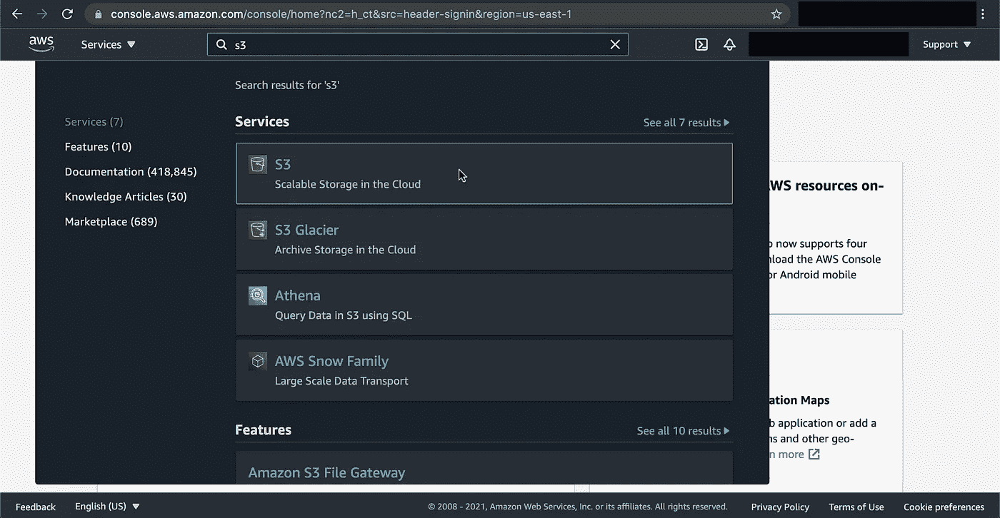
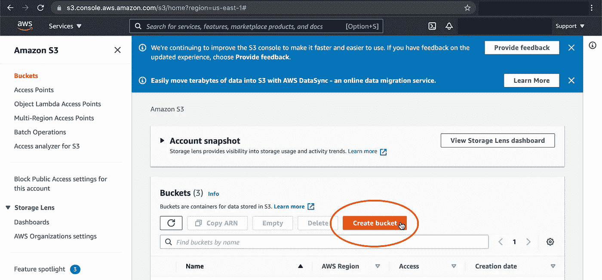
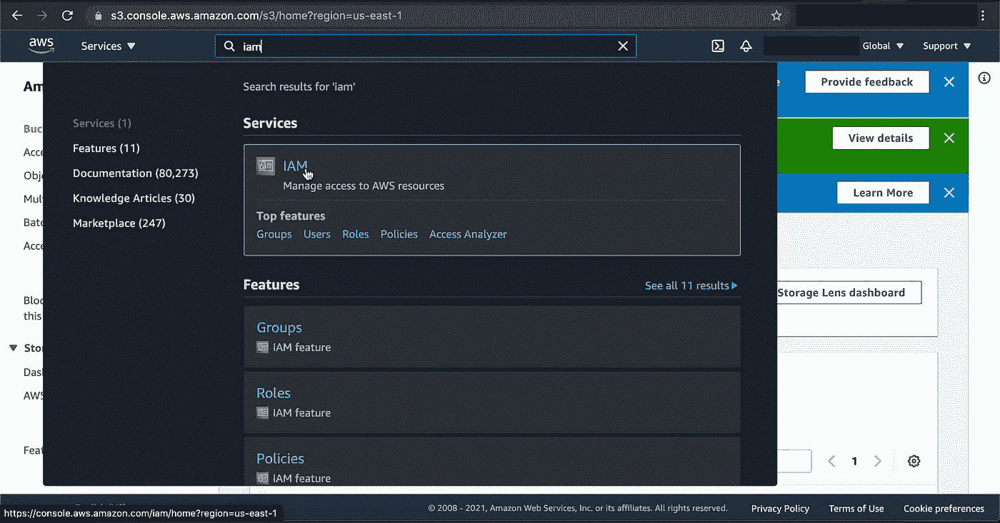
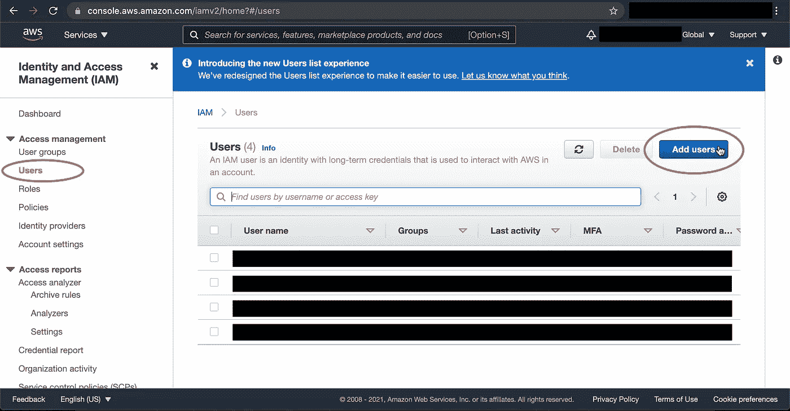
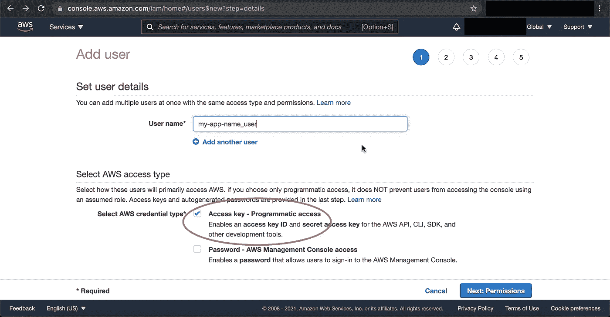
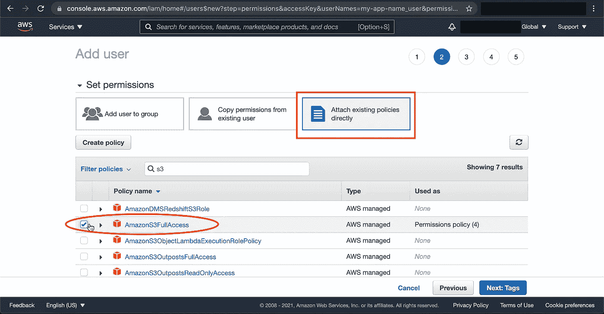
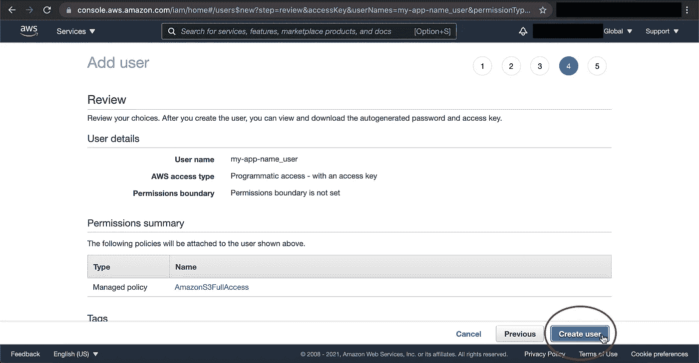
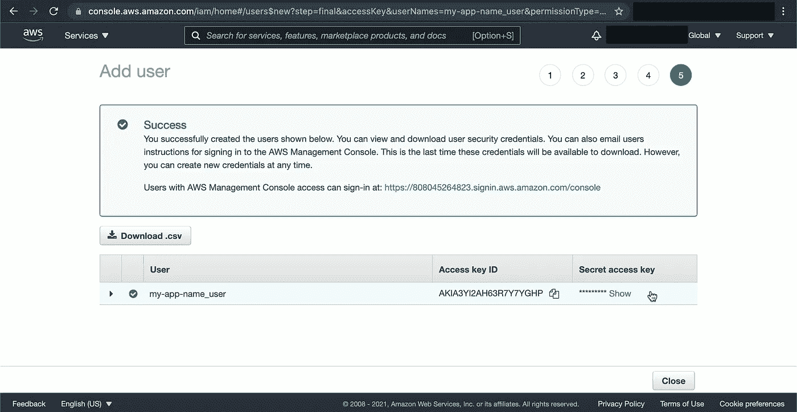

# 处理图像，第 1 部分:通过亚马逊 S3 存储桶使用 Rails 6 中的活动存储

> 原文：<https://medium.com/nerd-for-tech/handling-images-part-1-using-active-storage-in-rails-6-with-amazon-s3-buckets-92b739fa790?source=collection_archive---------0----------------------->


我目前正在做一个 Rails/React 项目，该项目允许用户通过上传收据副本来跟踪他们的 HSA(健康储蓄账户)支出。到目前为止，这是一个有趣的项目，但我需要掌握的一件棘手的事情是上传和删除收据图像并将这些图像存储在云中的某个地方。回想起来，配置一切其实并不太难，但是有很多步骤！

我想我应该写一个 3 部分的教程来设置从后端到前端的一切。在这篇文章(第 1 部分)中，我将介绍设置 Amazon S3 存储图像的 bucket 的每一个步骤，以及如何从一个只有 Rails API 的后端访问这个 Bucket。第 2 部分将介绍如何设置 Rails 模型、控制器和序列化器；第 3 部分将介绍在 React 前端构建上传和编辑表单！

# 步骤 1:创建一个亚马逊 S3 桶

Amazon 为那些开发项目提供了许多服务，但不幸的是，他们的文档并不是我所说的用户友好的！

首先，进入他们的[账户注册页面](https://portal.aws.amazon.com/billing/signup#/start)，为自己创建一个账户(假设你还没有这样做)。如果你已经有一个账户，去他们的[登录页面](https://signin.aws.amazon.com/signin?redirect_uri=https%3A%2F%2Fconsole.aws.amazon.com%2Fconsole%2Fhome%3Ffromtb%3Dtrue%26hashArgs%3D%2523%26isauthcode%3Dtrue%26state%3DhashArgsFromTB_us-east-1_cab8b29021a8ef65&client_id=arn%3Aaws%3Asignin%3A%3A%3Aconsole%2Fcanvas&forceMobileApp=0&code_challenge=mAyPcPZ-GYNFQ4AFZtN1DUoH64oJoyYdamw3MKYrXDk&code_challenge_method=SHA-256)，以根用户身份登录。

登录后，只需在页面顶部的搜索栏中键入“S3 ”,然后点击第一个结果(这比试图在他们的服务标签下找到“S3”要容易得多！):



然后，单击橙色的“创建存储桶”按钮:



对于 bucket 的名称，您可以随意命名，尽管您必须遵循 DNS 命名约定(例如，不要使用大写字母):


> 注意:如果你计划使用自定义域来部署你的应用，我建议使用域作为存储桶名称，并在它前面加上一个子域“媒体”或“照片”然后你可以在你的 DNS 设置中添加一个 CNAME，让子域指向 s3.amazon.com，这样你网站上所有的图片链接都将来自你的子域，而不是 s3.amazon.com！

请注意默认的“AWS 区域”，因为我们稍后会用到它。将其他选项设置为默认值，然后单击页面底部的“创建存储桶”按钮:


# 步骤 2:创建 IAM 帐户

既然您已经创建了一个 bucket，那么是时候创建一个 IAM(身份和访问管理)帐户了。这样做的目的是让你的应用程序登录到 Amazon 并访问你新创建的 bucket。与您之前为自己创建的 root 帐户相比，IAM 帐户具有有限的访问权限，并且您可以为不同的存储桶或不同的权限创建多个 IAM 帐户。

在页面顶部的搜索栏中输入“IAM ”,然后点击第一个结果:



然后，在左侧，点击“用户”在那里，点击蓝色的“添加用户”按钮:



首先给用户一个名字。我通常将我的格式设置为“<name-of-my-app>_ 用户”，这样我就可以知道哪些用户使用哪些桶。选中“访问密钥—编程访问”框，然后单击蓝色的“下一步:权限”按钮:</name-of-my-app>



在“权限”页面上，选择“直接附加现有策略”在下面出现的框中，搜索“s3”，并选中“AmazonS3FullAccess”框然后，单击蓝色的“下一步:标签”按钮:



您可以跳过添加标签，然后单击“下一步:查看”并最终单击“创建用户”继续:



创建用户后，当页面加载时，不要离开！在这个页面上，您有两个密钥:访问密钥 ID 和秘密访问密钥:



您将需要这两者来使用您的 IAM 帐户和 Rails API，所以请将它们写下来或复制/粘贴到一个文本文件中以备后用！

唷！那是许多步骤！接下来，我将概述如何将您的亚马逊 S3 桶与您的 Rails 后端集成！

# 步骤 3:安装活动存储

为了能够将图像上传到我们的 Rails API，我们需要安装活动存储。打开终端，导航到 Rails 应用程序的根目录。然后，键入以下内容:

```
rails active_storage:install
```

然后，在创建迁移文件后，运行:

```
rails db:migrate
```

如果您打开`db/schema.rb`，您会看到数据库中创建了三个新表，但对我们来说，只有两个表是重要的:`active_storage_blobs`，它存储图像及其元数据，以及`active_storage_attachments`，它是一个多态连接表，将上传的图像链接到与图像相关联的任何模型。(要了解更多信息，我强烈推荐阅读 Mike Clark 的博客文章[在 Rails 6 中使用活动存储](https://pragmaticstudio.com/tutorials/using-active-storage-in-rails))。

由于有了`active_storage_attachments`表，不需要在需要图像的模型上创建单独的数据库列(事实上，添加另一个存储图像的列会导致问题！).

# 步骤 4:将亚马逊 S3 桶连接到 Rails 后端

在我们继续前进之前，我们需要安装一个使用 Amazon Web 服务的 gem。在您的终端中键入以下内容:

```
bundle add aws-sdk-s3
```

这会将 aws-sdk-s3 gem 添加到您的 gem 文件中并进行安装。现在，要告诉 Rails 您希望使用 Amazon 进行存储，请打开您的`storage.yml`文件(位于`/config`目录下)并取消对以下行的注释:

```
amazon:
  service: S3
  access_key_id: <%=Rails.application.credentials.dig(:aws, :access_key_id)%>
  secret_access_key: <%=Rails.application.credentials.dig(:aws, :secret_access_key)%>
  region: us-east-1
  bucket: your_own_bucket
```

确保区域值与您之前记下的“AWS 区域”值相匹配。如果没有，现在就换成匹配。

注意存储访问密钥 ID 和秘密访问密钥的行。您可以在这里复制并粘贴之前的密钥，但是这样做并不安全！您有两个安全选项:

## 选项 1:将亚马逊密钥添加到`credentials.yml`

假设您使用 VS Code 作为代码编辑器，您可以通过在终端中键入以下命令来编辑加密的`credentials.yml`文件:

```
EDITOR="code - wait" bin/rails credentials:edit
```

它将以未加密的格式打开凭证文件，允许您添加密钥。我还建议您在这里添加您的存储桶名称:

```
aws:
  access_key_id: <your-access-key-without-quotes>
  secret_access_key: <your-secret-access-key-without-quotes>
  s3_bucket: <name-of-your-bucket-without-quotes>
```

完成后保存并关闭文件。然后，您必须更改您的`storage.yml`文件中的 bucket 值:

```
bucket: <%=Rails.application.credentials.dig(:aws, :s3_bucket)%>
```

这种方法的唯一缺点是，这个文件通常是在 git 中提交的，所以如果您现在提交对这个文件的更改并推送到 GitHub，任何克隆您的回购协议的人最终都会访问您的 bucket！(他们也可以像您一样轻松地解密文件并窃取您的密钥！)

## 选项 2:将 Amazon 密钥添加到。环境文件

就个人而言，我认为这是更好的选择，虽然它需要更多的工作！

首先，我们必须安装 dotenv 才能使用`.env`(环境)文件。在您的终端中，键入`bundle add dotenv-rails`；这将把 dotenv 添加到您的 Gemfile 并安装它。然后，在项目目录的根目录下创建一个`.env`文件。您可以在此添加您的 Amazon 密钥和存储桶名称:

```
export ACCESS_KEY=<your-access-key-without-quotes>
export SECRET_ACCESS_KEY=<your-secret-access-key-without-quotes>
export S3_BUCKET=<name-of-your-S3-bucket-without-quotes>
```

在变量前添加`export`允许您在 rails 控制台内访问变量。我喜欢出于测试目的这样做，只是为了确保我的`.env`变量被加载，但是您可以省略`export`关键字而不会有问题。

确保将`.env`添加到您的`.gitignore`文件中，因为您不希望这个文件出现在您的提交历史中！

然后，在您的`storage.yml`文件中，您可以像这样访问您的密钥:

```
amazon:
  service: S3
  access_key_id: <%=ENV['ACCESS_KEY']%>
  secret_access_key: <%=ENV['SECRET_ACCESS_KEY']%>
  region: us-east-1
  bucket: <%=ENV['S3_BUCKET']%>
```

还有最后一步要完成，这一步告诉 Rails 您想使用 Amazon 而不是本地存储。在`config/environments`下，打开`development.rb`，改变如下:

```
# Comment out this line:
config.active_storage.service = :local# Add this line:
config.active_storage.service = :amazon
```

现在，在开发中，你可以测试你的亚马逊 S3 桶！如果您计划进行部署，您还需要在您的`production.rb`文件中添加上面的那一行。

这就对了。你的 Rails API 现在会把你上传的图片保存到 Amazon！

在本教程的第 2 部分，我将介绍如何设置你的模型、控制器和串行化器来处理图像上传/删除。稍后，我将在第 3 部分完成这个系列，在那里我将介绍如何在 React 前端设置上传和编辑表单。(所以敬请期待！)

## 资源

*   [通过亚马逊 S3](/alturasoluciones/setting-up-rails-5-active-storage-with-amazon-s3-3d158cf021ff) 设置 Rails 5 主动存储
*   [在 Rails 中使用活动存储](https://pragmaticstudio.com/tutorials/using-active-storage-in-rails)
*   [活动存储文档](https://edgeguides.rubyonrails.org/active_storage_overview.html)