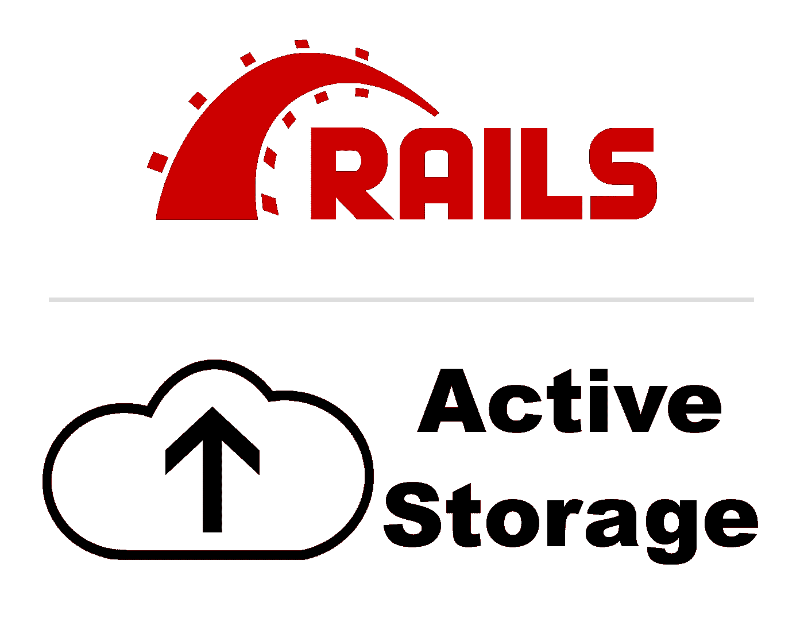

# 处理映像，第 2 部分:用活动存储配置 Rails 6 模型、序列化程序和控制器

> 原文：<https://medium.com/nerd-for-tech/handling-images-part-2-configuring-rails-6-models-serializers-and-controllers-with-active-51a86bf94cd4?source=collection_archive---------1----------------------->



在关于处理图片上传的系列文章的第 1 部分[中，我展示了创建一个亚马逊 S3 桶并将其连接到一个只有 Rails API 的后端的步骤。然而，尽管这些信息(希望)是有用的，是时候深入研究如何在 Rails 中实际实现处理图像上传和删除的方法了！](/nerd-for-tech/handling-images-part-1-using-active-storage-in-rails-6-with-amazon-s3-buckets-92b739fa790?source=user_profile---------0-------------------------------)

# 步骤 1:设置您的 Rails 模型

首先，让我们从 Rails 模型开始。我们需要向模型中添加一个活动存储宏，以建立一对多关系。

在我的例子中，我有一个模型 ReceiptRecord，它可以有许多图像:

```
has_many_attached :receipt_images, dependent: :destroy
```

如果你的模型只需要一个图像(例如，一个用户模型只需要一个头像图像)，你可以使用`has_one_attached`宏来代替。至于名字，`:receipt_images`，你可以给这个起任何你喜欢的名字(这是我在我的项目里用的)。最后，添加`dependent: :destroy`意味着如果删除一个带有图像的 ReceiptRecord 对象，那么对象和图像都会被一起删除。

# 步骤 2:为您的模型创建一个序列化程序

接下来，如果您还没有，您将需要为包含图像的模型创建一个序列化程序。在 Rails 项目的根目录下打开一个终端，并运行以下命令:

```
rails g serializer <name-of-your-model>
```

一旦创建了序列化程序，继续添加您需要的任何属性。然后，在序列化程序的第 2 行添加以下内容:

```
include Rails.application.routes.url_helpers
```

这引入了一些有用的方法来为你上传的图片创建图片 URL。

# 步骤 3:生成图像 URL

接下来，开始创建一个方法，以您对图像的命名命名(在我的例子中，它是 receipt_images)。

```
def receipt_images
  return unless object.receipt_images.attached?
end
```

除非 ReceiptRecord 对象附有收据图像，否则该方法将不返回任何内容。现在，将以下内容添加到该方法中以完成它:

```
object.receipt_images.map do |receipt_image|
  receipt_image.blob.attributes
    .slice('filename', 'byte_size', 'id')
    .merge(url: receipt_image_url(receipt_image)
end
```

因为 ReceiptRecord 对象可以有多个图像，所以我们必须映射每个图像。然后，我们从`active_storage_blob`表中访问收据图像的 blob 信息，并获取一些我们计划稍后在 JSON 中呈现的属性。然后，我们合并一个我们自己创建的新属性，这就是我们的 URL。然而，`#receipt_image_url`方法还没有定义，所以我们现在就开始吧！

```
def receipt_image_url(image)
  rails_blob_path(image, only_path: true)
end
```

这个方法接收一个单独的图像，并使用 Rails 内置的方法为我们生成一个 URL。

在你的模型只有一张图片的情况下，你不需要担心贴图的问题(因为只有一张图片)。您的代码可能看起来像这样:

```
def image
  return unless object.image.attached? object.image.blob.attributes
    .slice('filename', 'byte_size', 'id')
    .merge(url: image_url(object.image)
enddef image_url
  rails_blob_path(image, only_path: true)
end
```

在继续之前，我们还需要做最后一件事:在您的`development.rb`文件中(在`config/environments`下)，添加下面一行:

```
Rails.application.routes.default_url_options[:host] = 'localhost:3000'
```

这将允许我们实际上生成一个我们在亚马逊 S3 上存储的图像的 URL。如果您计划进行部署，您将需要在您的`production.rb`文件中有同样的一行；把`'localhost:3000'`换成你的活域名就行了。

# 步骤 4:设置控制器

我假设您将为包含图像的资源实现完整的 CRUD，所以我将逐步创建`#index`、`#create`、`#update`和`#destroy`方法。

## 指数法

下面是`#index`的样子(没什么花哨的！):

```
def index
  receipt_records = ReceiptRecord.all.with_attached_receipt_images
  render json: receipt_records, include: ['receipt_images'], status: :ok
end
```

注意`with_attached_<your-image-name>`方法；这是一种防止 [N+1 查询问题](https://www.sitepoint.com/silver-bullet-n1-problem/)的特殊方法。

我还添加了`include: ['receipt_images']`,这样每个作为 JSON 返回的 ReceiptRecord 对象也带有嵌套格式的相关图像。

## 创建方法

活动存储使创建带有附加图像的新对象变得容易，因为您可以像往常一样传入参数，活动存储将自动附加相关图像:

```
def create
  receipt_record = ReceiptRecord.create!(receipt_record_params)
  render json: {
    receipt_record: receipt_record,
    status: { code: 201, message: "Receipt successfully created!" }
  }, status: created
end
```

但是，您需要在 params 方法中定义 images 参数:

```
def receipt_record_params
  # Note: I omitted all of my params except for the images here to make my example clearer
  params.permit(receipt_images: [])
end
```

如果你像我一样有多个图像，你会希望你的参数指向一个空数组。如果你的模型只有一个图像，那么你需要像 normal 一样命名你的参数(`:<your-image-name>`)。

## 更新方法

这个比较棘手，因为我希望能够在不更新图像的情况下更新 ReceiptRecord 对象，反之亦然。这是我想到的，我将通过我的例子:

```
def update
  receipt_record = ReceiptRecords.find(params[:id])
  to_delete = params[:receipt_images_to_delete]
  receipt_record.update(receipt_record_params) if to_delete
    image_ids = to_delete.split(",").map(&:to_i)
    image_ids.map do |id|
      image = receipt_record.receipt_images.find(id)
      image.purge_later
    end
  end render json: {
    receipt_record: receipt_record,
    status: { code: 202, message: "Receipt successfully updated" }
  }, status: :accepted
end
```

在这里，我首先找到我希望更新的 ReceiptRecord 对象。我计划从我的前端传递我希望删除的内部参数的图像的 id，所以我将这些 id 保存到`to_delete`。然后，我在下面一行更新 ReceiptRecord 对象本身。

现在，如果`to_delete`为空(如果我没有传入任何 id)，那么`if`语句被跳过，ReceiptRecord 对象被呈现。如果`to_delete`不为空，我首先必须将字符串转换为数组(参数作为字符串传递)，映射到每个新创建的元素，并将每个元素转换为整数。我将结果保存到`image_ids`。

现在我在`image_ids`中有了一个整数数组，我映射每个整数，找到具有匹配 id 的图像，并通过调用图像上的`purge_later`删除它。`Purge_later`是另一种主动存储方法，它不仅从`active_storage_blobs`表中删除图像，还从`active_storage_attachments`表中删除相关的行。(如果只想删除 blob，可以调用`purge`方法代替)。

## 销毁方法

幸运的是，这里的最后一个方法并不难:

```
def destroy
  receipt_record = ReceiptRecords.find(params[:id])
  receipt_record.destroy render json: {
    status: { code: 202, message: "Receipt successfully deleted" }
  }, status: :accepted
end
```

我只是找到了我想删除的 ReceiptRecord 对象，并在下面一行中删除它！因为我们在模型中添加了`dependent: :destroy`选项，所以对象及其相关图像在这里都被删除了。

# 步骤 4:最后一个(可选)设置

我们已经基本上完成了 Rails 后端，但是我需要指出一件重要的事情。默认情况下，当您上传一个(或多个)图像时，Active Storage 会自动用新上传的图像替换该对象的任何现有图像。在某些情况下，这是可取的行为(比如当上传一个新的头像图片时；您希望它替换旧的)，但在我的情况下，我希望能够返回并添加更多的图像，而不是在这个过程中替换旧的图像。

如果您更喜欢后一种行为，您将需要在您的`config/environments`目录下的`development.rb`文件中添加一个设置(我将它放在第 1 部分中您的`config.active_storage.service = :amazon`行的正下方):

```
config.active.storage.replace_on_assign_to_many = false
```

如果您计划稍后部署，您还必须将这个设置添加到您的`production.rb`文件中。

这就结束了！我还必须介绍如何设置 React 前端来处理图像上传和删除，所以请关注第 3 部分！:)