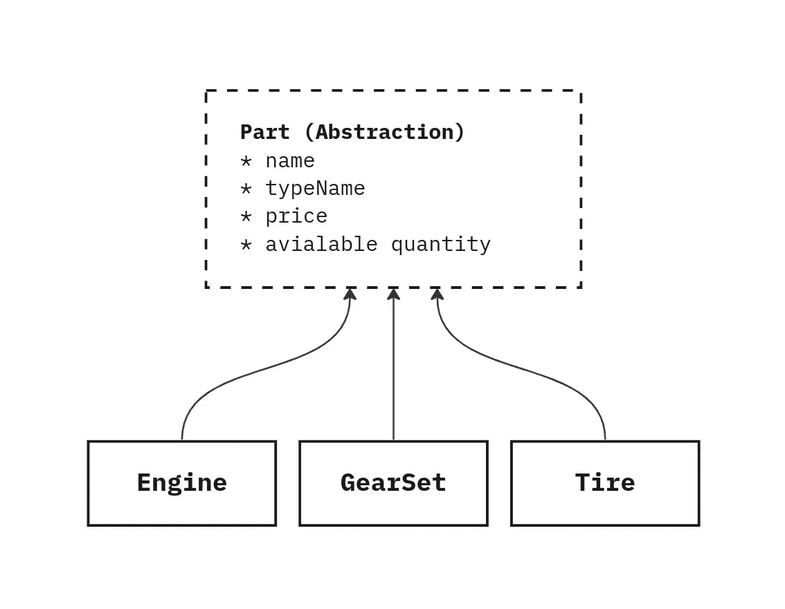
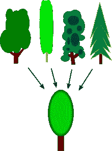

# 处理抽象的双刃剑

> 原文：<https://medium.com/nerd-for-tech/handling-the-double-edged-sword-of-abstraction-629f1c7656b9?source=collection_archive---------0----------------------->


由 [Mayur Deshpande](https://unsplash.com/@mayur_deshpande?utm_source=medium&utm_medium=referral) 在 [Unsplash](https://unsplash.com?utm_source=medium&utm_medium=referral) 拍摄的照片

# 什么是抽象

抽象——就其一般意义而言——是隐藏不相关的细节，专注于事物的基本部分。

例如，文章的封面图片，你一眼就能推断出它讲述了音乐的快乐，它忽略了许多不相关的细节，只留下了传达信息所需的部分。

对于我们——软件工程师——来说，抽象是一种核心才能，它是建模和塑造系统的一部分，如果做得正确，它可以节省你大量的时间。

类似于前面的例子，当设计一个软件程序时，你不代表真实的世界，但是你只需要代表你领域的重要部分，这将减少你需要做的工作量，最终导致你的软件更好的交付。

# 抽象方法

说到抽象，我们通常会发现自己处于两种情况之一。

1.  我们有一个心理模型，我们需要使用抽象来简化它的实现，让我们称之为**抽象-在**之前。
2.  我们已经有了一个实现，为了简化，我们需要对它进行抽象，我们称之为 **abstract-after** 。

在这两种情况下，抽象者试图提出一个更简单的接口，隐藏不相关的细节。

## 摘要-之前

在这种类型的抽象中，设计者从抽象的接口驱动实现，在系统建模过程中大量使用，在系统建模过程中，您需要处理一组元素的某个方面，就好像它们是同一件事情一样。



多个实现遵循抽象

例如，如果您正在为一个汽车修理店构建一个系统，并且您想要在库存中表示可用的汽车零件，您不能为每个变体的每个零件创建一个类型，但是您可能对名称、零件类型、价格和数量感兴趣。

在这种情况下，创建一个抽象是合乎逻辑的，姑且称之为`Part`

```
enum PartType {
  Engine
  Tire
  GearSet
}

Interface Part {
  name: string
  type: PartType
  price: number
  count: number
}
```

这更有助于作为单个表/集合包含在数据库中，更好地索引和优化，以及与其他实体的更好关系…

现在，如果你想实现一个下单功能，你需要做的就是循环遍历所有的项目，并对`part.price`或`part.getPrice()`方法的返回求和，如果你喜欢用 oop 风格的话。

当然，这是一个简单的例子，但是你可以在任何你想要的范围内应用同样的原理。

## 摘要-之后

在这种类型的抽象中，实现并不归抽象者所有，设计者的工作是通过将这些实现中的概念归纳到一个更简单的接口中，尽最大努力使客户的生活更容易。



创建一般化来表示一组现有的概念— [维基百科](https://en.wikipedia.org/wiki/Generalization)

这种类型的一个例子可以在 ORM 框架中找到，所有 ORM 都试图提供一个更简单的接口，隐藏如何检测实体中的变化并将这些变化映射到引擎特定的操作的细节，反之亦然。当您查询数据库并且您希望返回的 DB 结果映射到您的对象时，除了处理事务、锁定等，这样客户端可以与一个更简单的实现进行交互，在后台处理所有这些问题。

# 什么时候用 Before Vs After？

## 摘要-之前

*   除非你——设计者——对实现有控制权，或者它被另一个坚持你的设计的人所拥有，否则这是不可能的。
*   这种抽象方法与多态性密切相关，可以为同一抽象提供不同的实现。
*   如果合理使用，它会帮助你简化你的系统。
*   它可以用于在代码级别上实施架构决策。

## 摘要-之后

它们通常很厚并且有漏洞，它们几乎从来都不完美，并且必须做出妥协，这可能是为了让他们的客户能够访问那些有漏洞的部分中的底层实现。

阅读更多关于[漏抽象低](https://en.wikipedia.org/wiki/Leaky_abstraction)的内容。

*   如果实现由不遵守抽象的另一方拥有或控制，您可以使用这种方法。
*   它使用起来更灵活，尤其是如果你对自己的抽象不太确定，在某些情况下，实现可能会以意想不到的方式改变，所以你不能真正从抽象接口驱动实现。
*   它可以表现为 DDD 反腐败模式的一部分，也可以表现为 OOP 中的门面模式。
*   通常需要比**摘要更大的努力——在**之前。

# 每种方法的示例

## 抽象之前方法的示例:

*   核心领域建模，因为它们应该总是归您的团队所有。
*   子系统接口，在这里您希望简化不同团队的开发，同时保持它们之间的抽象以保证最终的正确集成。

## **抽象后方法**的例子:

*   与外部系统的集成有许多相似之处，比如支付系统。
*   多态性:使用不同的驱动程序完成相同的任务，例如:一些用户希望将他们的文件存储在磁盘上，但另一些用户希望将它们与 google drive 同步，还有一些用户出于某种原因希望将它们存储在 DB 中。
*   ORMs。

# 抽象启发法

在这两种方法中，您必须找到一个安全的分类角度，这意味着您对抽象概念进行分类的方式不应该导致该抽象频繁变化，在确定这是否是一个有用的抽象时，一些启发式方法是有用的:

*   分类对其他人的理解有多清晰，我需要解释它吗？设计的时候考虑别人！
*   它变化的频率有多高？
*   抽象部分的成本变化是什么？
*   这种抽象增加了多少间接性？
*   感觉有多自然？是的，直觉在设计中很重要。

# 抽象的缺点

抽象是一把双刃剑，如果做得正确，它可以节省你大量的时间和精力，并且对其他人的使用非常有用，但是如果做得不正确，它也可能是有害的。

**摘要-之前的缺点**

如果您的领域有相似的对象，并且您能够在您的领域中找到正确的分类和关系，那么它可能是简化您的系统的最佳工具，但是如果分类不可靠，它可能会导致您花费更多的精力，改变这种方法中的抽象意味着改变实现，这违背了降低代码维护成本的最初目标。

**摘要——后弊端**

它们通常很厚并且有漏洞，它们几乎从来都不完美，并且必须做出妥协，这可能是为了让他们的客户能够访问那些有漏洞的部分中的底层实现。

阅读更多关于[漏抽象低](https://en.wikipedia.org/wiki/Leaky_abstraction)的内容。

# 其他选择

抽象能够遵循 DRY 原则，并有助于代码重用，从而节省大量工作并简化您的系统，但是抽象可以解决一组问题，其中分类是可能的和清晰的，并且不是所有的问题都属于这一组。

抽象也增加了代码中的内向水平，导致更高的精神负荷。

一个例子是“分而治之”技术，将你的系统划分成更小的模块有时可以帮助你做得更好，当概念关系很远并且不容易抽象时，类似地在 DDD，我们按域而不是功能模块来划分系统。

抽象是双向的，所以要小心使用它，并且记住其他的选择是存在的，当抽象不存在的时候会更有用。

感谢您的阅读！