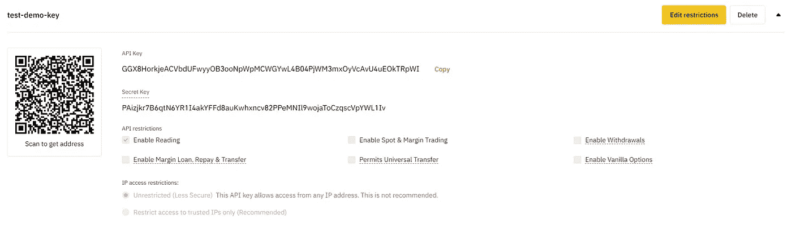
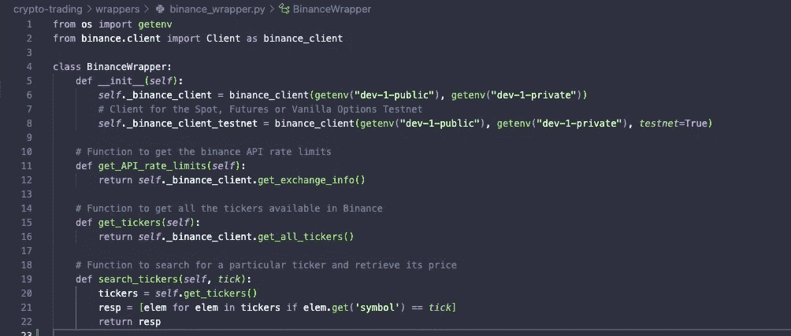
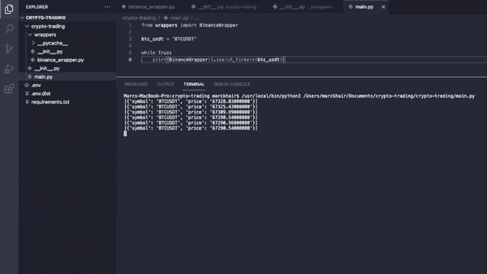

# [动手]算法交易—加密货币

> 原文：<https://medium.com/nerd-for-tech/hands-on-algorithmic-trading-cryptocurrencies-560b102d85b8?source=collection_archive---------4----------------------->


[行政长官](https://unsplash.com/@executium?utm_source=medium&utm_medium=referral)在[广场](https://unsplash.com?utm_source=medium&utm_medium=referral)拍照

> 根据 Investopedia 的定义，“算法交易是利用自动化和预编程的交易指令执行订单的过程，以考虑价格、时机和交易量等变量。一个[算法](https://www.investopedia.com/terms/a/algorithm.asp)是解决一个问题的一组方向。随着时间的推移，计算机算法会将全部订单的一小部分发送给市场。”

算法交易的一个流行应用是高频交易(HFT)。

虽然不同于算法交易，机器人顾问也是一个值得尊敬的人，因为他们依赖于自动化和算法。

**高频交易(HFT)**

高频交易使得大型投资银行、对冲基金和投资者能够从非常小的利润中获利。多亏了 HFT，如果交易量大，哪怕一分钱也是相对有利可图的。一种常见的策略是，一旦检测到确定的价格差异，就通过算法在多个交易所进行交易。HFT 用户具有竞争优势，他们以毫秒为单位进行竞争，并在几秒钟内执行数百万份订单。

**机器人顾问**

越来越受欢迎的机器人顾问利用低费用吸引用户使用他们的全自动投资组合管理解决方案。根据用户愿意承担的风险级别创建投资组合，并根据市场表现定期提供投资组合重新评估，以进行风险重新调整。如果你住在加拿大，你可能听说过提供机器人顾问服务的 Questrade 或 Wealthsimple。就连蒙特利尔银行和加拿大皇家银行也提供机器人顾问解决方案:Smartfolio 和 Investease。

**我的观点:加密货币**

我将带您快速入门使用流行的加密交换 API 进行算法加密货币交易。这不是财务建议。不要让我为你读完我的文章后所做的任何财务决定或交易策略负责。

我要演示的 API 是[币安的 API](https://binance-docs.github.io/apidocs/spot/en/#introduction) ，带有由 [*山姆·麦克哈迪*](https://github.com/sammchardy) 创建的 [python 包装器](https://github.com/sammchardy/python-binance)。

你可以在 GitLab 上下载我的[完整项目](https://gitlab.com/marckhair/crypto-trading)，并马上开始使用这个 API。

*   如果您还没有币安帐户，请创建一个。
*   通过这个[链接](https://www.binance.com/en/my/settings/api-management)生成一个币安 API 密匙。您的帐户应该是 KYC 验证。您最多可以创建 30 个 API 键。
*   注意:不要向任何人透露您的密钥对。密钥对可以完全控制你的账户。
*   通过点击“编辑限制”来管理给予 API 密钥的权限。根据您的使用情况授予适当的权限。



币安 API 主要示例

*   中设置 keypair 的值。我的项目的 env 文件。
*   使用 GitLab 项目中的我的需求文件安装依赖项。

```
pip install -r requirements.txt
```

让我们快速地为币安 API 创建一个包装器:



测试为“BTCUSDT”定义的 search_tickers 函数，该函数对应于币安的 BTC/USDT 市场:



您可以轻松地扩展我的项目，以创建买入/卖出市场/限价单，并实施您的交易策略。探索丰富的[客户端模块](https://python-binance.readthedocs.io/en/latest/binance.html#module-binance.client)。

币安为订单实现的一个重要参数是`recvWindow`,它以毫秒为单位指定请求的有效时间。

玩得开心！